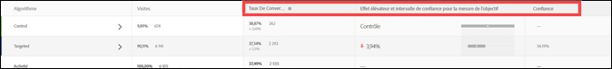
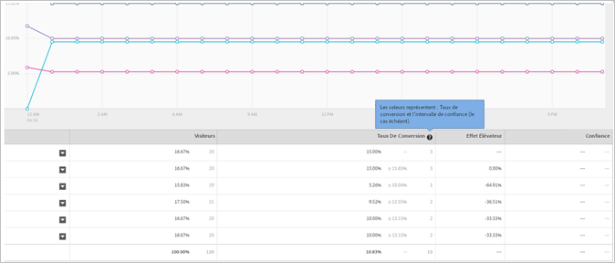
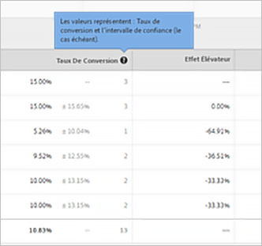
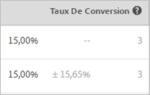

# Taux de conversion

Le taux de conversion, l’effet élévateur, le degré de confiance (signification statistique) et l’intervalle de confiance sont consignés pour chaque expérience.

L’illustration ci-dessous montre l’en-tête du diagramme pour un exemple d’activité avec les en-têtes [!UICONTROL Taux de conversion], [!UICONTROL Effet élévateur] et [!UICONTROL Degré de confiance] surlignés.

>[!NOTE]
>
>Dans toutes les données, les commandes en double sont ignorées si un `orderID` est transmis. Le rapport d’audit répertorie les commandes dupliquées ignorées.

## Taux de conversion {#section_07A36846C4E84D0881906809B9CE5A74}

Montre le taux de conversion, le degré de confiance et l’intervalle médians ainsi que le nombre de conversions.

Par exemple, examinez la colonne du rapport Taux de conversion suivante :

La première ligne concerne l’expérience de contrôle. Elle affiche un taux de conversion de 15 % avec trois conversions. La seconde ligne, Expérience B, affiche un taux de conversion de 15 %, avec un intervalle de confiance de plus ou moins 15,65 % et trois conversions.

>[!NOTE]
>
>L’intervalle de confiance n’est actuellement calculé que pour les mesures binaires.

## Effet élévateur {#section_0F409572C720433D9378092ABC999982}

Compare le taux de conversion de chaque expérience à l’expérience de contrôle.

Effet élévateur = (TC expérience - TC contrôle) / TC contrôle

Si le contrôle est égal à 0, il n’y a aucun effet élévateur sous forme de pourcentage.

## Degré de confiance (signification statistique) {#section_35DB6724813D40C7B0808DE18FE595C1}

Ce nombre correspond à la probabilité de duplication des résultats si le test est réexécuté. La confiance s’arrondit à 100,00 % lorsqu’elle est supérieure ou égale à 99,995 %.

Voir [Degré de confiance et intervalle de confiance](/help/c-reports/conversion-rate.md#concept_0D0002A1EBDF420E9C50E2A46F36629B).

## Données de vente au détail {#section_30A674731BA6440E9BB93C421BE990EE}

La valeur de commande moyenne (AOV), les recettes par visiteur (RPV) et les données de vente sont affichées pour chaque expérience si vous avez inséré une mbox [Passer commande](/help/c-implementing-target/c-implementing-target-for-client-side-web/t-mbox-download/orderconfirm-create.md) (`orderConfirmPage`) et que vous l’avez sélectionnée comme mbox de conversion.

## Degré de confiance et intervalle de confiance {#concept_0D0002A1EBDF420E9C50E2A46F36629B}

Le degré de confiance et l’intervalle de confiance s’affichent pour chaque expérience.

Les conversions et les variables continues pour les mesures basées sur Target, telles que les mesures de recettes et d’engagement, sont calculées comme suit :

* **Conversion :** oui ou non
* **Tous les autres cas :** valeurs d’une plage

Vous pouvez effectuer des calculs d’analyse hors ligne pour for Target (A4T), mais cela nécessite d’exporter les données vers [!DNL Analytics]Analytics. Pour plus d’informations, reportez-vous à la section « Réalisation de calculs hors ligne pour Analytics for Target (A4T) » ci-dessous.

### Degré de confiance {#section_26FE5E44BDD5478792A65FCFD83DCCDC}

Le *degré de confiance* est représenté par le pourcentage le plus foncé dans la colonne Taux de conversion pour chaque expérience.

  

Le degré de confiance (ou signification statistique) indique la probabilité selon laquelle le succès d’une expérience n’est pas dû à la chance. Un degré de confiance plus élevé indique que :

* les performances de l’expérience diffèrent considérablement de celles du contrôle ;
* les performances de l’expérience ne sont pas simplement dues aux interférences ;
* vous obtiendriez probablement les mêmes résultats si vous réexécutiez ce test.

Si le degré de confiance excède 90 ou 95 %, le résultat peut être considéré comme statistiquement significatif. Afin de garantir des résultats stables, tâchez, avant toute décision professionnelle, de patienter jusqu’à ce que la taille de l’échantillon soit suffisamment conséquente et que les quatre barres de fiabilité d’une ou de plusieurs expériences restent homogènes pendant une certaine durée.

>[!NOTE]
>
>La confiance s’arrondit à 100,00 % lorsqu’elle est supérieure ou égale à 99,995 %.

### Intervalle de confiance {#section_F582738DFE1648C78B93D81EBC6CACF7}

>[!NOTE]
>
>L’intervalle de confiance n’est actuellement calculé que pour les mesures binaires.

L’*intervalle de confiance* est une plage à l’intérieur de laquelle la vraie valeur peut être trouvée à un degré de confiance donné. L’intervalle de confiance est représenté par un pourcentage +/- gris clair dans la colonne Taux de conversion. Dans l’exemple ci-dessous, l’intervalle de confiance pour l’effet élévateur de l’expérience B est de plus ou moins 15,65 %.

**Exemple** : un RPV d’expérience est égal à 10 euros, son degré de confiance est de 95 % et son **intervalle de confiance** est compris entre 5 et 15 euros. Si vous exécutez ce test plusieurs fois, 95 % des fois, le RPV est compris entre 5 et 15 euros.

**Quels éléments influent sur l’intervalle de confiance ?** La formule de calcul des intervalles de confiance suit les méthodes statistiques habituelles.

* **Taille de l’échantillon :** lorsque les échantillons sont plus importants, l’intervalle se rétrécit ou s’affine. Cela est préférable car cela signifie que vos rapports se rapprochent davantage de la valeur réelle de la mesure de succès.
* **Écart type réduit** : davantage de résultats semblables (AOV, nombres ou visiteurs effectuant une conversion chaque jour) réduisent l’écart type.

## Calcul de la confiance et comment l’exécuter hors ligne  {#section_86F7C231943043A5B8B6BFE67B706E3B}

Le [rapport CSV téléchargé](/help/c-reports/downloading-data-in-csv-file.md#concept_3F276FF2BBB2499388F97451D6DE2E75) comprend uniquement des données brutes. Il ne tient pas compte des mesures calculées (recettes par visiteur, effet élévateur ou degré de confiance, par exemple) utilisées dans les tests A/B.

Pour calculer ces mesures calculées, téléchargez le fichier Excel [Calculateur de fiabilité complet](/help/assets/complete_confidence_calculator.xlsx) de la Cible pour saisir la valeur de l&#39;activité ou consultez les [calculs statistiques utilisés par Cible](/help/assets/statistical-calculations.pdf).

>[!NOTE]
>
>Ce calculateur sert uniquement pour les rapports basés sur Target, pas pour les rapports A4T.

## Exécution de calculs hors ligne pour Analytics pour Adobe Target (A4T) {#section_B34BD016C8274C97AC9564F426B9607E}

Vous pouvez effectuer des calculs hors ligne pour A4T, mais cela nécessite une étape relative aux exportations de données dans [!DNL Analytics].

Pour A4T, nous utilisons le calcul du test en t de Student pour les variables continues (plutôt que pour les mesures binaires). Dans Analytics, un visiteur est suivi en permanence et chaque action effectuée est comptabilisée. Ainsi, si le visiteur achète à plusieurs reprises ou visite une mesure de succès plusieurs fois, ces accès supplémentaires sont comptabilisés. La mesure devient ainsi une variable continue. Pour effectuer le calcul du test en t de l&#39;Étudiant, la &quot;somme des carrés&quot; est requise pour calculer la variance, qui est utilisée dans le dénominateur de la statistique en t. [Ce document explique les ](/help/assets/statistical-calculations.pdf) détails des formules mathématiques utilisées. La somme des carrés peut être récupérée à partir de [!DNL Analytics]. Pour obtenir la somme des données de carrés, vous devez effectuer une exportation de niveau visiteur pour la mesure vers laquelle s’effectue l’optimisation, pour une période donnée.

Par exemple, si l’optimisation porte sur les pages vues par visiteur, vous exportez un échantillon du nombre total de pages vues par visiteur pour une période spécifique, peut-être quelques jours (quelques milliers de points de données sont tout ce dont vous avez besoin). Vous calculez ensuite chaque valeur au carré et faites la sommes des totaux (l’ordre des opérations est critique ici). Cette valeur de « somme des carrés » est ensuite utilisée dans le calculateur de confiance complet. Utilisez la section « recettes » de cette feuille de calcul pour ces valeurs.

**Pour utiliser la fonction d’exportation de données d’[!DNL Analytics], procédez comme suit :**

1. Connectez-vous à [!DNL Adobe Analytics].
1. Cliquez sur **[!UICONTROL Outils]** > **[!UICONTROL Data Warehouse]**.
1. Dans l’onglet **[!UICONTROL Demande de Data Warehouse]**, remplissez les champs.

   Pour plus d’informations sur chaque champ, voir « Description des demandes de Data Warehouse » dans [Data Warehouse](https://experienceleague.adobe.com/docs/analytics/export/data-warehouse/data-warehouse.html).

   | Champ | Instructions |
   |--- |--- |
   | Nom de la demande | Indiquez un nom pour la demande. |
   | Date de création du rapport | Spécifiez une période et une granularité. Pour la première demande, il est recommandé de ne pas choisir plus d’une heure ou d’un jour de données. Plus la période demandée est longue, plus le traitement des fichiers de Data Warehouse est long. Il est donc préférable de commencer par demander les données de périodes courtes afin de s’assurer que le fichier renvoie le résultat attendu. Ensuite, accédez au gestionnaire de requêtes, dupliquez la demande et demandez plus de données la deuxième fois. De plus, si vous définissez une autre granularité que « Aucune », la taille du fichier augmente considérablement.  |
   | Segments disponibles | Appliquez un segment, le cas échéant. |
   | Ventilations | Sélectionnez les dimensions souhaitées : La dimension Standard est prête à l’emploi tandis que la dimension Personnalisée inclut les eVars et les props. Il est recommandé d’utiliser « l’identifiant visiteur » si des informations sur le niveau d’identification du visiteur sont nécessaires, plutôt que « l’identifiant visiteur Experience Cloud ».<ul><li>L’identifiant visiteur est l’identifiant final utilisé par Analytics. Il s’agit de l’AID (si le client est hérité) ou du MID (si le client est nouveau ou a effacé les cookies depuis le lancement du service d’identification des visiteurs Marketing Cloud).</li><li>L’identifiant visiteur Experience Cloud est défini uniquement pour les nouveaux clients ou ceux qui ont effacé les cookies depuis le lancement du service d’identification des visiteurs Marketing Cloud.</li></ul> |
   | Mesures | Sélectionnez les mesures souhaitées. La mesure Standard est prête à l’emploi, alors que la mesure Personnalisée inclut des événements personnalisés. |
   | Aperçu du rapport | Vérifiez les paramètres avant de planifier le rapport.  |
   | Planifier la livraison du rapport | Entrez une adresse électronique à laquelle envoyer le fichier, nommez le fichier, puis sélectionnez [!UICONTROL Envoyer immédiatement]. Remarque : Le fichier peut être envoyé par FTP à l’aide des [!UICONTROL Options de remise avancées] . |

1. Cliquez sur **[!UICONTROL Demander ce rapport]**.

   La livraison du fichier peut prendre jusqu’à 72 heures, selon le volume de données demandé. Vous pouvez vérifier la progression de la demande à tout moment en cliquant sur [!UICONTROL Outils] > [!UICONTROL Data Warehouse] > [!UICONTROL Gestionnaire de requêtes].

   Si vous souhaitez demander à nouveau des données que vous avez demandées par le passé, vous pouvez dupliquer une ancienne demande à partir du [!UICONTROL Gestionnaire de requêtes], le cas échéant.

Pour plus d’informations sur [!DNL Data Warehouse], voir les liens suivants dans la documentation d’aide d’[!DNL Analytics] :

* [Créer une demande Data Warehouse](https://experienceleague.adobe.com/docs/analytics/export/data-warehouse/t-dw-create-request.html)
* [Meilleures pratiques Data Warehouse](https://experienceleague.adobe.com/docs/analytics/export/data-warehouse/data-warehouse-bp.html)

## Méthodologie de calcul {#concept_EC19BC897D66411BABAF2FA27BCE89AA}

Vous avez la possibilité d’afficher les rapports selon différentes méthodologies de comptabilisation, afin de comprendre l’influence de vos activités sur les utilisateurs tout au long de leur vie ou durant une seule session.

La méthodologie de calcul est prise en charge pour les types d’activité suivants :

* Test A/B

   Une exception toutefois : les activités A/B à ciblage automatique sont seulement compatibles avec la méthodologie de calcul « Visite » par défaut.

* Ciblage d’expérience (XT)
* Test multivarié (MVT)

   En ce qui concerne le rapport de contribution des éléments de test multivarié, Target ne prend pas en charge les impressions d’activité pour les mesures de type Recettes.

* Recommandations

Seule la méthodologie de calcul par défaut (Visites) est actuellement prise en charge avec les activités d’Automated Personalization.

Vous pouvez afficher les rapports selon les méthodologies de comptabilisation suivantes :

* **Visiteur** : participant unique à l’activité, pour la durée de cette dernière.

   Un utilisateur est compté comme nouveau participant s’il consulte le site à l’aide d’un nouvel ordinateur ou d’un nouveau navigateur, s’il supprime les cookies ou s’il effectue une conversion puis revient à l’activité avec le même cookie. Un participant est identifié par le PCID dans le cookie de sa mbox. Si le PCID change, cette personne est considérée comme un nouveau visiteur.

* **Visite :** participant unique à une expérience durant une seule session de navigateur de 30 minutes.

   Si un utilisateur revient sur le site après une conversion ou après en avoir été absent pendant au moins 30 minutes, il est compté comme une nouvelle visite. Une visite est identifiée par `sessionID` dans le cookie de la mbox du visiteur. Lorsque `sessionID` change, la visite est considérée comme nouvelle.

* **Affichage impression/page :** comptée à chaque fois qu’un visiteur charge une page de l’activité.

   Par exemple, une seule visite peut inclure plusieurs impressions de votre page d’accueil.

>[!NOTE]
>
>En règle générale, les comptes sont déterminés en fonction des cookies et de l’activité des sessions. Si, toutefois, vous atteignez le point de conversion final d’une activité, puis entrez à nouveau dans cette activité, vous êtes considéré comme un nouveau participant et une nouvelle visite dans l’activité. C’est le cas même si les valeurs PCID et `sessionID` ne changent pas.

## Pourquoi [!DNL Target] recommande-t-il d&#39;utiliser les tests en t de Student ? {#t-test}

Les tests A/B sont des expériences visant à comparer la valeur moyenne de certaines mesures d’entreprise dans une variante de contrôle (également appelée expérience) à la valeur moyenne de cette même mesure dans une ou plusieurs expériences alternatives.

[!DNL Target] recommande l&#39;utilisation de deux tests [ t ](https://en.wikipedia.org/wiki/Student%27s_t-test#:~:text=The%20t%2Dtest%20is%20any,the%20test%20statistic%20were%20known.)Student, car ceux-ci nécessitent moins d&#39;hypothèses que d&#39;autres alternatives comme les tests z, et sont le test statistique approprié pour effectuer des comparaisons par paires de mesures commerciales (quantitatives) entre une expérience de contrôle et d&#39;autres expériences.

### Plus de détails

Lors de l’exécution de tests A/B en ligne, chaque utilisateur/visiteur est affecté de manière aléatoire à une seule variante. Par la suite, nous effectuons des mesures des mesures commerciales présentant un intérêt (p. ex. conversions, commandes, recettes, etc.). pour les visiteurs dans chaque variante. Le test statistique que nous utilisons teste ensuite l&#39;hypothèse que la mesure moyenne de l&#39;activité (par exemple taux de conversion, commandes par utilisateur, recettes par utilisateur, etc.) est égal pour le contrôle et une variante donnée.

Bien que la mesure commerciale elle-même puisse être distribuée selon une certaine distribution arbitraire, la distribution de la moyenne de cette mesure (dans chaque variante) doit converger vers une distribution normale via le théorème de limite centrale . Il est à noter que, même s&#39;il n&#39;existe aucune garantie quant à la rapidité avec laquelle cette répartition par échantillonnage de la moyenne convergera à la normale, cette condition est généralement atteinte étant donné l&#39;échelle des visiteurs dans les tests en ligne.

Compte tenu de cette normalité de la moyenne, la statistique de test à utiliser peut s&#39;avérer suivre une distribution en t, car il s&#39;agit du ratio d&#39;une valeur normalement distribuée (la différence dans les moyens de la mesure d&#39;entreprise) à un terme d&#39;échelle basé sur une estimation des données (l&#39;erreur type de la différence dans les moyens). Le test en t **Student** est alors le test d&#39;hypothèse approprié, étant donné que la statistique de test suit une distribution en t.

### Pourquoi d&#39;autres tests ne sont pas utilisés

Un test **z** n&#39;est pas approprié car dans le scénario de test A/B classique, le dénominateur de la statistique de test n&#39;est pas dérivé d&#39;une variance connue et doit être estimé à partir des données.

**Les** essais au carré en chi ne sont pas utilisés parce qu&#39;ils sont appropriés pour déterminer s&#39;il y a une relation qualitative entre deux variantes (c&#39;est-à-dire une hypothèse nulle où il n&#39;y a pas de différence entre les variantes). Les tests T sont plus appropriés pour le scénario de _comparaison quantitative_ des mesures.

Le **test U de Mann-Whitney** est un test non paramétrique, qui est approprié lorsque la distribution d&#39;échantillonnage de la mesure commerciale moyenne (pour chaque variante) n&#39;est pas distribuée normalement. Cependant, comme nous l&#39;avons vu plus haut, étant donné l&#39;ampleur du trafic impliqué dans les tests en ligne, le théorème limite central s&#39;applique généralement, et le test en t peut donc être appliqué en toute sécurité.

Des méthodes plus complexes telles que **ANOVA** (qui généralisent les tests t à plus de deux variantes) peuvent être appliquées lorsqu’un test comporte plus de deux expériences (&quot;tests A/Bn&quot;). Cependant, ANOVA répond à la question &quot;si toutes les variantes ont la même moyenne&quot;, tandis que dans le test A/Bn type, nous nous intéressons davantage à _quelle variante spécifique_ est la meilleure. Dans [!DNL Target], nous appliquons donc des tests t réguliers comparant chaque variante à un contrôle, avec une correction de Bonferroni pour tenir compte des comparaisons multiples.
