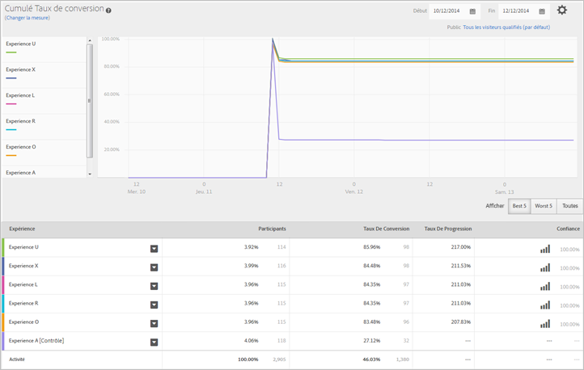

# Rapport Performance de l’expérience (MVT){#experience-performance-report-mvt}

Le rapport Performance de l’expérience montre les performances de chaque expérience de l’activité. Il comprend des informations sur le nombre de participants, le taux de conversion, l’effet élévateur et le degré de confiance.

Vous pouvez sélectionner une ou plusieurs expériences pour les comparer. Cliquez sur une expérience et sélectionnez **[!UICONTROL Aperçu]** pour ouvrir l’expérience dans l’onglet d’un navigateur.

La partie supérieure du rapport présente la mesure, les dates de début et de fin et l’audience utilisées dans le rapport. Vous pouvez modifier n’importe lequel de ces facteurs.

>[!NOTE]
>
>Les sélecteurs d’audience et de mesure ne sont disponibles que si Analytics est utilisé en tant que source de création de rapports.

Ensuite, un graphique linéaire fournit une comparaison visuelle de chaque expérience à des intervalles de temps spécifiques. Ce graphique vous permet de consulter les performances des expériences ainsi que la manière dont le moment de la journée affecte les performances.

Vous pouvez afficher les cinq meilleures expériences, les cinq pires ou leur ensemble. Les cinq meilleures et les cinq pires sont déterminées par l’effet élévateur et incluent une sixième expérience montrant le contrôle pour comparaison. Il est recommandé de consulter les cinq meilleures et les cinq pires afin de déterminer le succès de vos expériences. L’option Afficher tout rend difficile l’extraction des informations souhaitées. En outre, il est impossible d’afficher toutes les expériences dans le graphique. Utilisez l’option Afficher tout si vous souhaitez consulter une expérience spécifique qui ne figure pas dans les cinq meilleures ou les cinq pires.

>[!NOTE]
>
>Les rapports de test multivarié n’affichent pas les expériences exclues lorsque le filtre 5 meilleurs ou 5 pires est sélectionné.

Sous le graphique, un tableau indique le nombre de participants qui ont vu chaque expérience ainsi que d’autres informations relatives à votre mesure de succès.

## Vidéo de formation : Création d’un test multivarié  

Cette vidéo explique comment créer un test multivarié à l’aide du processus assisté Target à trois étapes. Le rapport Performance de l’expérience est décrit dans la vidéo à partir de 8:20.

>[!VIDEO](https://video.tv.adobe.com/v/17395)