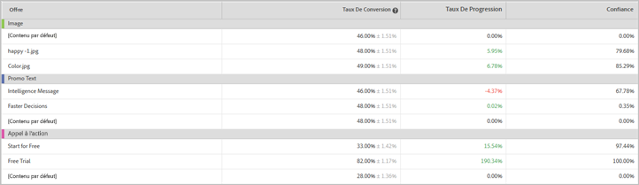

# Rapport Contribution des emplacements (MVT){#location-contribution-report-mvt}

Le rapport Contribution des emplacements présente les performances de chaque élément et de chaque offre.

La partie supérieure du rapport présente la mesure, les dates de début et de fin et l’audience utilisées dans le rapport. Vous pouvez modifier n’importe lequel de ces facteurs.

>[!NOTE]
>
>Les sélecteurs d’audience et de mesure ne sont disponibles que si Analytics est utilisé en tant que source de création de rapports.

Le rapport Contribution des emplacements inclut deux tableaux.

Le premier tableau présente l’influence relative de chaque élément. Il vous indique les éléments pour lesquels vous avez ajouté des offres qui obtiennent le plus de conversions.

Le deuxième tableau fournit un rapport au niveau de l’offre. Il présente le taux de conversion, l’effet élévateur et la confiance pour chaque offre dans chaque élément. Il vous permet de déterminer les offres qui sont les plus réussies. La deuxième colonne affiche des valeurs pour la mesure sélectionnée (taux de conversion, Recettes par visiteur (RPV), Valeur de commande moyenne (AOV), commandes ou engagement) de l’offre ainsi qu’une normalisation.

## Vidéo de formation : Création d’un test multivarié

Cette vidéo explique comment créer un test multivarié à l’aide du processus assisté Target à trois étapes. Le rapport Contribution des emplacements est décrit dans la vidéo à partir de 08:45.

>[!VIDEO](https://video.tv.adobe.com/v/17395?captions=fre_fr)