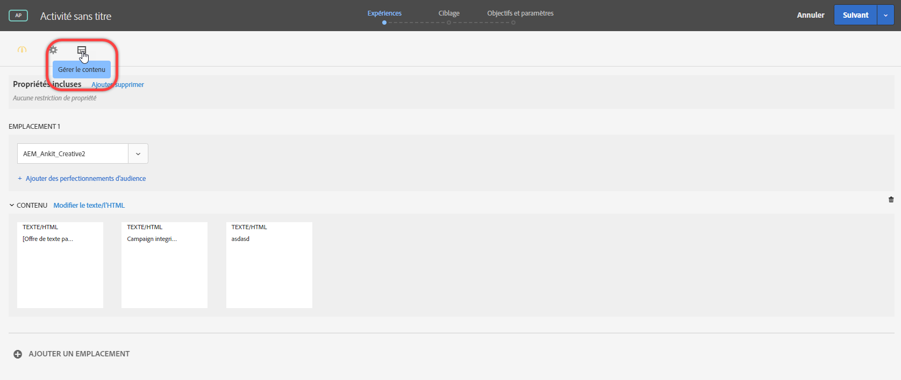
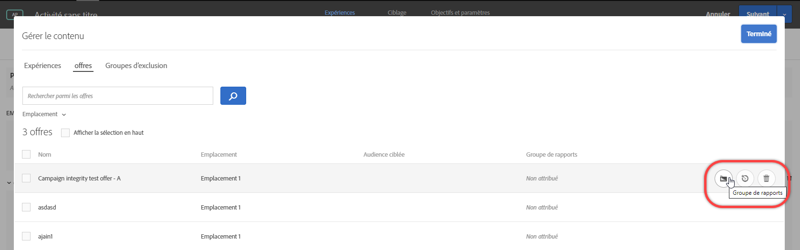
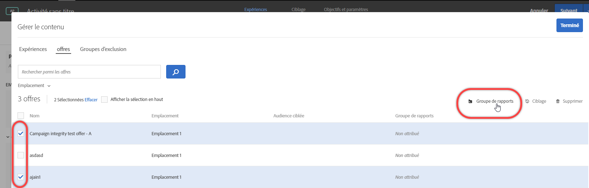
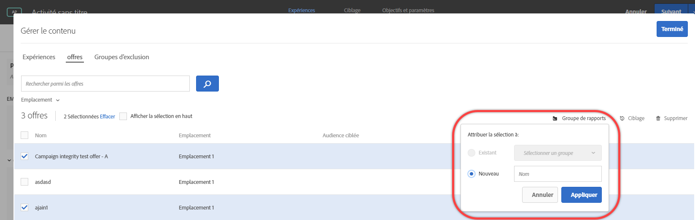

#  Groupes de rapports d’offres dans la personnalisation automatisée{#offer-reporting-groups-in-automated-personalization}

Informations sur l’utilisation des groupes de rapports dans les activités [Automated Personalization](/help/c-activities/t-automated-personalization/automated-personalization.md) (AP).

Les groupes de génération de rapports effectuent deux fonctions clés :

* Ils vous permettent de voir vos offres regroupées dans les rapports d’activité AP.
* Ils jouent un rôle clé dans le fonctionnement des modèles de personnalisation [!DNL Target].

Lorsque vous utilisez des groupes de rapports, [!DNL Target] crée un seul modèle de personnalisation pour chaque groupe de rapports au lieu de chaque offre de votre activité AP en utilisant les données de toutes les offres de ce groupe.

Si votre configuration d’activité ne dispose pas de suffisamment de données pour un modèle de personnalisation à créer par offre, les groupes de génération de rapports peuvent contribuer à réduire les exigences de données pour utiliser Automated Personalization. Les groupes de génération de rapports permettent également de résoudre le problème de « démarrage à froid » pour les nouvelles offres en regroupant les offres similaires, de sorte que chaque modèle obtienne davantage de données avec lesquelles se former. Les groupes de modélisation peuvent également être utilisés pour les activités où de nouvelles offres sont introduites régulièrement dans votre activité AP.

Cette approche fonctionne bien si les visiteurs répondent de la même manière à toutes les offres d’un groupe. La bonne pratique consiste à regrouper les offres auxquelles des groupes similaires de visiteurs répondent de la même manière. En d’autres termes, les offres de groupe présentant des taux de conversion similaires. Il convient de ne jamais placer toutes les offres dans un seul groupe de génération de rapports. Le regroupement de toutes les offres ou le regroupement d’offres avec des taux de conversion très différents réduit probablement l’efficacité des modèles de personnalisation [!DNL Target].

>[!NOTE]
>
>Si une offre est supprimée ou remplacée à partir d’un groupe de modélisation spécifique, le trafic historique qui a vu cette offre spécifique est également supprimé du groupe de modélisation. En d’autres termes, les offres supprimées ne contribuent pas aux données utilisées pour les modèles de personnalisation [!DNL Target] à apprendre.

**Pour configurer des groupes de génération de rapports** :

1. Sur la page [!UICONTROL Expériences] d&#39;une activité AP, cliquez sur l&#39;icône **[!UICONTROL Gérer le contenu]**.

   

1. Cliquez sur l’onglet **[!UICONTROL Offres]** dans la partie supérieure de la boîte de dialogue [!UICONTROL Gérer le contenu].
1. (Conditionnel) Ajoutez des expériences spécifiques à un groupe de génération de rapports en faisant glisser le curseur sur l’offre souhaitée, puis en cliquant sur l’icône de dossier **[!UICONTROL Groupe de génération de rapports]**.

   

1. (Conditionnel) Incluez par lots des expériences dans un groupe de génération de rapports en cochant la case correspondant aux expériences pertinentes, puis en cliquant sur l’icône de dossier **[!UICONTROL Groupe de génération de rapports]** dans le coin supérieur droit de la boîte de dialogue.

   

1. (Conditionnel) Pour affecter l’offre sélectionnée à un groupe de rapports existant, sélectionnez **[!UICONTROL Existant]**, sélectionnez le groupe de rapports de votre choix dans la liste déroulante, puis cliquez sur **[!UICONTROL Appliquer]**.

   OU

   Pour créer un groupe de génération de rapports auquel attribuer l’offre sélectionnée, sélectionnez **[!UICONTROL Nouveau]**, nommez le nouveau groupe de génération de rapports, puis cliquez sur **[!UICONTROL Appliquer]**.

   

