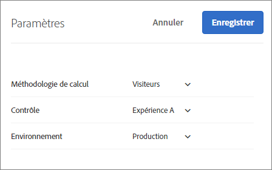

# FAQ sur la création de rapports{#reporting-faq}

Liste des questions fréquentes sur la création de rapports dans Target.

## Pourquoi le nombre de visites est-il plus bas dans Target que dans les autres solutions Experience Cloud ?{#section_7E626FDB417E41B8B58BBF30FB207409}

Les chiffres de mesure signalés par [!DNL Target], par exemple le nombre de visites, seront toujours inférieurs aux chiffres signalés dans les autres solutions [!DNL Experience Cloud] pour plusieurs raisons :

* [!DNL Target] comptabilise uniquement les visites des visiteurs qui remplissent les critères de l’activité. Les autres solutions comptabilisent les visites des visiteurs qui affichent la page, indépendamment de l’activité qui les a amenés à la page.
* Il peut y avoir des cas où plusieurs activités (mutuellement exclusives) sont en concurrence pour le même emplacement. Les visiteurs voient donc des contenus différents sur une même page web, ce qui affecte les chiffres de mesure signalés par [!DNL Target].

## Pourquoi n’existe-t-il pas de données disponibles pour le rapport de mon activité ?{#section_E4722F6445884130951DF79981C8289B}

Si le contenu d’une activité a été correctement diffusé aux utilisateurs mais que son rapport ne contient aucune donnée, assurez-vous que l’environnement correct (groupe d’hôtes) est sélectionné dans les paramètres du rapport.

Si un environnement de développement est sélectionné, le message suivant peut s’afficher : « Aucune donnée n’est disponible pour les paramètres des rapports sélectionnés. »

Pour modifier l’environnement pour le rapport d’une activité :

1. Cliquez sur **[!UICONTROL Activités]**, sélectionnez l’activité souhaitée dans la liste, puis cliquez sur l’onglet ]**Rapports[!UICONTROL **.
1. Cliquez sur l’engrenage pour configurer les paramètres des rapports.

   

   >[!NOTE]
   >
   >L’icône représentant un engrenage n’est pas disponible pour les rapports de personnalisation automatisée.

1. Dans la liste déroulante **[!UICONTROL Environnement]**, sélectionnez **[!UICONTROL Production]**.

   Les données de rapport peuvent ne pas être disponibles si vous avez sélectionné un environnement de développement.

1. Cliquez sur **[!UICONTROL Enregistrer les paramètres]**.

Pour plus d’informations sur les environnements, voir [Hôtes](../administrating-target/hosts.md#concept_516BB01EBFBD4449AB03940D31AEB66E).
