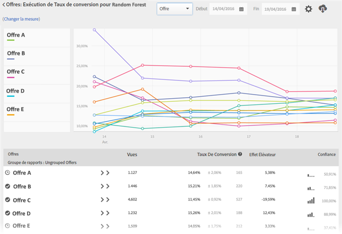

#  Rapports de synthèse de personnalisation automatisée{#automated-personalization-summary-reports}

Specialized reports are available to users of [!UICONTROL Automated Personalization] activities in [!DNL Adobe Target].

>[!NOTE]
>
>[!UICONTROL La personnalisation automatisée] fait partie de la solution [!DNL Target Premium]. Elle n’est pas incluse dans [!DNL Target Standard] sans une licence [Target Premium](/help/c-intro/intro.md#premium).

1. Cliquez sur **[!UICONTROL Activités]**, sélectionnez l’activité d’[!UICONTROL Automated Personalization] souhaitée dans la liste, puis cliquez sur l’onglet **** Rapports.

   S’il y a de nombreuses activités, vous pouvez filtrer la liste en sélectionnant [!UICONTROL Automated Personalization] dans la liste déroulante [!UICONTROL Type].

1. (Facultatif) Cliquez sur l’icône [!UICONTROL Télécharger] pour télécharger une vue de synthèse (comparaison du trafic de contrôle et du trafic cible, par exemple) telle que ventilée selon toutes les mesures de succès disponibles.

[!UICONTROL Automated Personalization] fournit les rapports suivants :

## Rapport au niveau de l’activité {#section_6F72FC5C790B4492B3DCECBFFA971337}

Le [!UICONTROL rapport au niveau de l’activité] compare les performances agrégées de l’utilisation d’un algorithme d’[!UICONTROL Automated Personalization] au contenu diffusé de manière aléatoire (contrôle).

Les règles standard de l’interprétation des résultats des tests A/B s’appliquent toujours, notamment l’effet élévateur, la confiance, les tendances, la durée, etc. Pour plus d’informations sur l’interprétation des résultats, voir [À propos du taux de conversion](/help/c-reports/conversion-rate.md#concept_2D9FEDE8F94A485DAC86D611BFBDC844).

## Rapport au niveau de l’offre {#section_CAA6409879E349C6906E2BE8156D87A1}

Le [!UICONTROL rapport au niveau de l’offre] de l’expérience Forêt aléatoire compare les performances de chaque offre à laquelle est appliqué l’algorithme à la même offre diffusée de manière aléatoire (contrôle). Par conséquent, les offres ne doivent pas être comparées les unes aux autres dans cette vue.

Click the experience algorithm (Random Forest or control) to view the [!UICONTROL Offer Level] report.

Les offres peuvent être affichées dans des groupes de rapports. Ceux-ci peuvent être développés ou réduits. Sélectionnez [!UICONTROL Groupe de rapports] dans la liste déroulante pour afficher les informations cumulées par groupes de rapports plutôt que par offres.

>[!NOTE]
>
>L’icône représentant une horloge indique que le modèle d’algorithme est toujours en cours de création. L’icône en forme de coche indique que l’algorithme de base a été établi.

## Segments automatisés

Cliquez sur l’icône Segments  automatisés. Ce rapport montre comment les différents visiteurs répondent différemment aux offres/expériences de votre activité AP/AT. Ce rapport montre comment différents segments automatisés définis par les modèles de personnalisation de Target ont répondu aux offres/expériences de l’activité.

Pour plus d’informations, voir rapport [Segments](/help/c-reports/c-personalization-insights-reports/automated-segments-report.md)automatisés.

## Attributs importants

Cliquez sur l’icône Attributs  importants. Ce rapport montre comment, dans différentes activités, différents attributs sont plus (ou moins) importants dans la manière dont le modèle décide de personnaliser. Ce rapport indique les attributs principaux qui ont influencé le modèle et leur importance relative.

Pour plus d’informations, voir Rapport [Attributs](/help/c-reports/c-personalization-insights-reports/important-attributes-report.md)importants.