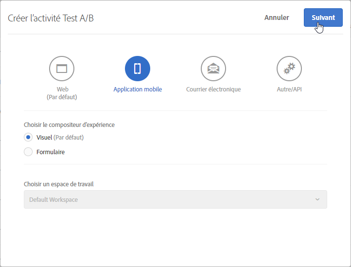
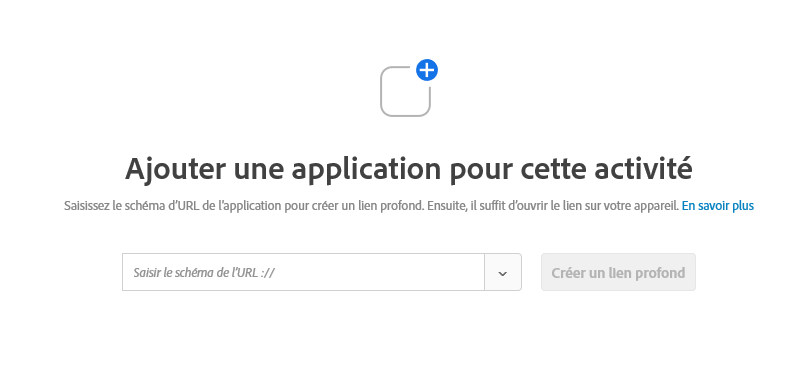
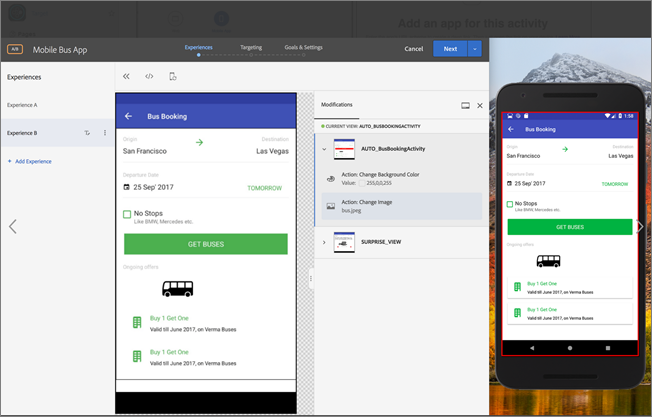

# Compositeur d’expérience visuelle pour application mobile{#mobile-app-visual-experience-composer}

L’application Visual Experience Composer (VEC) pour applications mobiles natives vous permet de créer des activités et de personnaliser du contenu sur les applications mobiles natives à votre propre manière sans dépendances de développement continu et de cycles de commercialisation d’application.

Avec le [compositeur d’expérience visuelle](../../c-experiences/experiences.md#section_34265986611B4AB8A0E4D6ACC25EF91D), vous pouvez vous-même créer des activités et personnaliser des expériences pouvant être diffusées dynamiquement vers vos propriétés Web via la mbox globale de Target sans l’intervention d’un développeur. Vous pouvez désormais tirer parti du VEC afin d’en faire de même avec les applications mobiles natives. Le VEC Mobile, disponible sur [le SDK AEP v5](https://aep-sdks.gitbook.io/docs/using-mobile-extensions/adobe-target-vec), permet de créer [des activités de test](/help/c-activities/t-test-ab/test-ab.md) A/B et [de ciblage d’expérience](/help/c-activities/t-experience-target/experience-target.md) pour les applications mobiles. D’autres types d’activités seront pris en charge à l’avenir.

Le VEC Mobile prend en charge les navigateurs répertoriés dans [Navigateurs pris en charge](../../c-implementing-target/c-considerations-before-you-implement-target/supported-browsers.md#reference_01B4BF99E7D545A7998773202A2F6100).

## Utilisation du compositeur d’expérience visuelle pour applications mobiles natives {#using-the-mobile-vec}

L’illustration suivante représente le processus d’utilisation du VEC Mobile :

| Processus | Détails |
|--- |--- |
| couplage | Autorisez en toute sécurité votre application mobile et votre appareil à travailler avec Target. Cette étape n’est requise qu’une seule fois pour un périphérique. |
| Création | Créer une [activité Target](/help/c-activities/activities.md), avec prévisualisation en temps réel des actions effectuées dans l’interface utilisateur de Target. |
| Livraison | Target diffuse automatiquement des activités dans votre application mobile native. |

**couplage :**

Le VEC Mobile se connecte en temps réel à l’application mobile du marketeur pour la création d’activités Target. Pour ce faire, la première étape consiste à coupler (autoriser) en toute sécurité l’appareil mobile et l’application avec Target.

1. Lors de la création d’une activité de test A/B, par exemple, sélectionnez **[!UICONTROL Application mobile]**, puis **[!UICONTROL Visuel (par défaut)]** et cliquez sur **[!UICONTROL Suivant]**.

   

1. Entrez l’URL de l’application, puis cliquez sur **[!UICONTROL Créer un lien profond]**.

   

Le processus de couplage comprend les étapes suivantes :

1. Entrez le modèle d’URL de l’application qui peut être utilisé pour générer un lien profond. Un lien profond type se présente comme suit :

   `mymobileapp://path?params`

1. Le lien profond est disponible sous forme de code QR ou d’URL. Les utilisateurs peuvent analyser le code QR depuis le smartphone ou par courrier électronique/envoyer l’URL à eux-mêmes. L’URL du lien profond dispose d’un jeton d’autorisation qui est utilisé pour coupler en toute sécurité l’application mobile et l’appareil avec Target.
1. Ouvrez l’URL du lien profond sur votre appareil mobile. Ceci lance l’application mobile. Le SDK identifie que l’application est lancée pour le couplage et la création dans le VEC.

   Le SDK émet une requête au serveur Target et s’enregistre lui-même. Le serveur Target autorise le jeton et établit une connexion en temps réel avec l’appareil (qui utilise actuellement des WebSockets).

   Une fois la connexion établie, une vue en temps réel de l’application apparaît dans l’interface de Target. L’application a une bordure rouge qui indique qu’elle est connectée à Target, comme le montre l’illustration ci-dessous.

   

   Les appareils déjà couplés peuvent être reconnectés en lançant l’application et en ouvrant l’interface de création.

**Création dans :**

Une fois que l’application est connectée et qu’une vue en temps réel de l’application apparaît dans le VEC, vous pouvez commencer à créer votre activité. Pour le moment, les actions suivantes sont prises en charge :

| Action | Détails |
|--- |--- |
| Changer d’image | Remplacez une image par une autre en sélectionnant une offre d’image différente ou en définissant directement l’URL du CDN d’une image. Les offres Image dans Target sont diffusées via [Adobe Scene7](/help/administrating-target/scene7-settings.md). |
| Modifier le texte | Modifiez le contenu du texte, la couleur ou la taille de police dans un élément de texte, un bouton ou une étiquette. |
| Modifier l’arrière-plan | Modifiez le contenu ou l’arrière-plan d’une zone de texte ou d’un bouton. |

Les actions effectuées dans le VEC sont visibles en temps réel dans l’application, ce qui permet une prévisualisation en temps réel pendant la création. Les actions sont associées aux écrans ou vues mobiles correspondants et sont associées correctement.

**Gérer plusieurs versions d’applications**

Lorsqu’une nouvelle version d’une application est détectée, vous êtes informé que la version de l’application a été ajoutée à la liste des versions ciblées.

Plusieurs versions d’applications mobiles peuvent être ajoutées et supprimées manuellement dans la boîte de dialogue [!UICONTROL Gestion des versions].

## Vues cibles et applications mobiles {#target-views}

Le VEC Mobile utilise un nouveau concept de vues : un groupe logique d’éléments visuels qui, ensemble, constituent une expérience de l’application mobile.

**Présentation des vues cibles**

Prenons l’exemple d’une application d’achat de fleurs. L’application permet aux utilisateurs d’effectuer les tâches suivantes :

* Liste des fleurs et bouquets disponibles
* Afficher les détails
* Commander des fleurs
* Paramètres de contrôle, tels que les options de paiement et les adresses

Dans cette application, chacune de ces tâches peut être réalisée sur un écran séparé de l’application mobile. Lorsque les utilisateurs parcourent l’application, un écran s’affiche et leur permet d’effectuer l’une des tâches suivantes. Si vous êtes un développeur Android, vous allez probablement créer quatre classes d’activité Android différentes avec chaque classe associée à l’une de ces tâches.

Dans ce cas, chacune de ces tâches peut être considérée comme des vues que vous faites défiler via votre application mobile. Nous nous référerons à ces vues cibles, chacune d’entre elles étant unique. Une vue cible, ou simplement vue, est un conteneur logique d’éléments visuels qui sont affichés sur l’écran du dispositif portable. Un écran ou une classe d’activité sur Android sont des exemples de vue.

Les applications mobiles sont rarement aussi simples. Rendons les choses un peu plus réalistes. Dans la première tâche, qui répertorie les fleurs et bouquets disponibles, ajoutons la possibilité de créer plusieurs dispositions et, par conséquent, différents écrans. Par exemple, ajoutons une fonction « Trier par » comportant trois options :

* Par popularité
* Prix - Bas à Élevé
* Prix - Élevé à Bas

Dans cet exemple, chaque fois qu’un utilisateur sélectionne une option « Tri par » différente, un nouvel écran s’affiche, même si la classe d’activité est la même. Chacun de ces écrans peut donc être considéré comme des vues cibles différentes.

En tant que spécialiste du marketing, vous souhaitez créer différentes expériences et exécuter des offres distinctes sur chacune de ces vues, sans demander à vos développeurs de configurer des mboxes locales ou mettre en œuvre un cycle de commercialisation d’application.

## Configuration du VEC Mobile de Target {#setting-up}

Les développeurs doivent procéder comme suit pour activer le compositeur d’expérience visuelle pour une application mobile :

* configurez l’extension VEC d’Adobe Target dans Launch
   * L’extension VEC dépend de [l’extension Adobe Target](/help/c-implementing-target/c-implementing-target-for-client-side-web/how-to-deployatjs/cmp-implementing-target-using-adobe-launch.md). Assurez-vous que l’extension Adobe Target est déjà configurée et activée.
* Ajoutez l’extension Target VEC à votre application.
   * [Android - Configuration de l’application mobile](/help/c-target-mobile-app/c-mobile-visual-experience-composer/mobile-visual-experience-composer-android.md)
   * [iOS - Configuration de l’application mobile](/help/c-target-mobile-app/c-mobile-visual-experience-composer/mobile-visual-experience-composer-ios.md)

## Méthodes d’implémentation pour le compositeur d’expérience visuelle Target

L’extension Target VEC récupère les expériences Target appropriées pour votre application par le biais d’une requête réseau. Les offres sont récupérées via cet appel réseau et appliquées automatiquement sur les écrans ciblés. Aucune requête réseau suivante n’est envoyée pour récupérer les expériences du compositeur d’expérience visuelle lorsque l’utilisateur navigue dans plusieurs écrans de l’application.

Le comportement par défaut de l’extension consiste à effectuer une requête réseau synchrone (appel de blocage) au moment du lancement de l’application. Vous pouvez utiliser Launch pour contrôler le comportement de cette requête réseau pour répondre au comportement de votre application.

### Récupération automatique des activités Target

Il s’agit du comportement par défaut où une requête réseau est initiée automatiquement par l’extension du compositeur d’expérience visuelle. Vous pouvez utiliser l’une des options suivantes pour faire de cette demande un appel de blocage ou une requête asynchrone.

* Récupérer un appel synchrone (l’arrière-plan est désactivé)

   Lorsqu’elle est sélectionnée, l’extension Target VEC émet une requête réseau comme appel de blocage au lancement de l’application. Les offres sont appliquées immédiatement et l’application n’a pas de scintillement. Il s’agit du comportement par défaut de l’extension.

* Récupérer un appel asynchrone (l’arrière-plan est activé)

   Lorsqu’elle est sélectionnée, l’extension Target VEC émet une requête réseau en arrière-plan au lancement de l’application mais ne bloque pas le chargement de l’application. Si vos expériences sont créées sur l’écran d’accueil de votre application, les offres peuvent ne pas s’appliquer à l’écran d’accueil si l’écran est généré avant la fin de l’appel. Le rendu d’écran de l’application est généralement identifié par les événements de cycle de vie `didFinishLaunchingWithOptions` et `onActivityResumed` sous iOS et Android, respectivement. Les offres s’appliquent automatiquement à tous les écrans suivants.

### Récupération des activités Target par programmation

Vous pouvez désactiver l’extension Target VEC pour effectuer automatiquement la demande réseau et décider d’appeler par programmation l’API de l’extension. Ainsi, vos développeurs contrôlent comment ils souhaitent intégrer les offres Target VEC dans l’application. L’extension Target VEC possède deux méthodes statiques `prefetchOffers` pouvant `prefetchOffersBackground` être utilisées pour récupérer par programmation les offres de Target VEC.

* La `prefetchOffers` méthode masque l’écran actuel jusqu’à ce que Target VEC récupère les offres. Les offres sont automatiquement appliquées à l’écran actuel, le cas échéant, et l’écran est à nouveau visible.
* La `prefetchOffersBackground` méthode ne masque pas l’écran actuel et un appel est effectué pour récupérer les offres Target appropriées. Les offres Target *ne sont* pas appliquées à l’écran actuel et il n’y a aucun scintillement. Lorsque l’utilisateur accède aux écrans suivants, les offres sont automatiquement appliquées, le cas échéant.

### Gérer les restrictions de l’espace de travail Target

Vous pouvez définir `at_property` la valeur de votre espace de travail à l’aide de l’interface de Launch. Cela garantit que seules les activités de cet espace de travail seront diffusées à votre application mobile.

## Directives générales pour les appels d’API de Target {#section_C7276795F02540DCA230AEEDF882A833}

Pour ajouter correctement les vues de la cible pour Android, voici un tableau simple qui décrit les emplacements appropriés pour placer les appels `targetView` :

| Emplacement TargetView acceptable | Sous les Ajouts corrects |
|--- |--- |
| À la fin d’`Activity::onStart`, `Activity::onResume` | C’est au développeur de décider s’il faut considérer `OnStart` et `OnResume` comme des `targetViews` identiques ou différentes. Si elles sont identiques, utilisez le même `viewName`. Si elles sont différentes, utilisez des `viewNames` différents. Ces événements sont automatiquement ajoutés par le SDK. |
| Immédiatement après un appel `Activity::SetContent` | Si l’interface utilisateur ne change pas, il est possible d’insérer un appel `targetView`. |
| Dans `View::willAppear` | Si la vue sélectionnée apparaît de façon univoque dans une hiérarchie des vues spécifique. |
| Immédiatement après un appel `Activity::SetContentView` | Si l’activité ne change/ne corrige rien de son contenu dans le code suivant. |

Pour Android, voici un tableau des emplacements inappropriés pour placer les appels `targetView` :

| Emplacement TargetView inacceptable | Motif |
|--- |--- |
| Dans `Activity::onCreate` | L’activité a été créée, mais il n’est pas garanti que la vue associée à l’activité soit complète et/ou attachée à la fenêtre. Il est possible que ce placement mène au non-échantillonnage ou à l’échantillonnage partiel de l’écran de création et/ou que les offres soient appliquées d’une manière non déterministe. |
| Dans `View::didAppear` | La vue est déjà présente et l’application de l’offre va créer une mauvaise expérience d’interface utilisateur avec le scintillement. |
| Dans `View::didLoad` | La vue n’est pas attachée à la hiérarchie des vues principale et peut être instanciée, mais il n’est pas garanti qu’elle soit affichée sur l’interface utilisateur de l’application. |

## Livraison {#delivery}

Les activités Target créées à l’aide du VEC Mobile sont automatiquement diffusées sur les applications mobiles. Ces activités sont prérécupérées au lancement de l’application (selon la configuration du lancement) et appliquées au fur et à mesure que l’utilisateur parcourt les différentes vues cibles, souvent mappées directement sur les écrans.

Lors de l’appel de la méthode `TargetVEC.prefetchOffersBackground()` API, les offres Target sont extraites de Target Edge et mises en cache localement. Cela optimise l’expérience utilisateur, car les offres Target sont immédiatement appliquées à partir du cache lorsque les vues Target sont déclenchées avec des appels `targetView()` au lieu d’être récupérées sur le réseau.

Pour une flexibilité supplémentaire, vous pouvez également appeler l’`TargetVEC.prefetchOffers()`API, qui précache la disposition actuelle jusqu’à ce que les offres Target soient prérécupérées et appliquées à la vue cible visible (provoquant éventuellement un scintillement).

`TargetVEC.prefetchOffersBackground()` peut également être appelé de manière répétée alors que l’utilisateur navigue dans une application cliente pour actualiser le cache d’offres Target local en fonction du contenu le plus approprié (suite aux dernières mises à jour du profil Target de l’utilisateur actuel).

Notez que chaque fois que les cibles Target sont prérécupérées, les offres de la dernière vue Target déclenchée avec `AdobeTargetMobile.targetView()` sont également appliquées, dans la mesure du possible.

## Résolution des problèmes {#ts}

**Le VEC Mobile indique que mon application a été déconnectée.**

Votre connexion Internet est peut-être coupée. Relancez l’application une fois qu’Internet est à nouveau disponible et qu’une nouvelle connexion sera établie. Nous vous recommandons de créer une activité VEC Mobile avec une connexion Wi-Fi.

**Le VEC Mobile n’est pas synchronisé à mon application mobile.**

Cliquez sur le bouton [!UICONTROL Actualiser] dans le VEC pour synchroniser l’affichage.

## Limites connues {#limitations}

* Le VEC Mobile peut actuellement être utilisé pour créer des activités de [test A/B](/help/c-activities/t-test-ab/test-ab.md) et de [ciblage d’expérience](/help/c-activities/t-experience-target/experience-target.md) pour les applications mobiles. D’autres types d’activités seront pris en charge à l’avenir.
* Lorsque vous essayez de reconnecter l’application au VEC Mobile, vous devez quitter complètement l’application et la relancer.

   Si l’application mobile est déjà ouverte pendant l’un des scénarios répertoriés ci-dessous, vous devez fermer l’application, puis la rouvrir. Cependant, vous *devez* fermer l’application en la fermant à partir de la section des applications récentes et *non* en appuyant sur le bouton Précédent. Des problèmes de connexion intermittente peuvent se produire si l’application est fermée en appuyant sur le bouton Précédent.

   Il existe plusieurs situations dans lesquelles vous devez relancer l’application pour vous connecter au VEC Mobile si l’application est déjà ouverte :

   * Lorsque vous créez une nouvelle activité, une fois l’application mobile sélectionnée, la boîte de dialogue de liste de périphériques s’affiche. Si l’application est déjà ouverte, vous devez la fermer puis la redémarrer afin que son périphérique apparaisse comme disponible pour la sélection.
   * La boîte de dialogue du périphérique s’affiche lorsque vous commencez à modifier une activité. Si l’application est déjà ouverte, vous devez la fermer puis la redémarrer afin que son périphérique apparaisse comme disponible pour la sélection.
   * La boîte de dialogue du périphérique s’affiche lorsque vous passez de l’étape « Objectifs &amp; Paramètres » à l’étape « Création » (étape 1). si l’application est déjà ouverte, vous devez la fermer puis la relancer pour vous reconnecter au VEC Mobile.
   Veillez à fermer l’application en la fermant à partir de la section des applications récentes et non pas en appuyant sur le bouton [!UICONTROL Précédent.]

## Vidéo de formation : Compositeur d’expérience visuelle d’Adobe Target Mobile (3:33) {#video}

>[!VIDEO](https://video.tv.adobe.com/v/27528?captions=fre_fr)