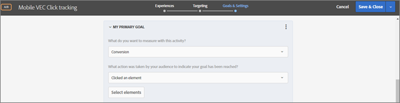

# Configuration du suivi des clics dans l’application Mobile VEC{#set-up-click-tracking-in-the-mobile-vec}

Le compositeur d’expérience visuelle Mobile (VEC) prend en charge le paramétrage des objectifs de suivi des clics pour les activités [!DNL Target].

1. Lorsque vous définissez vos objectifs sur la page Objectifs et paramètres pour votre activité, sélectionnez la mesure de succès [!UICONTROL Conversion].

   

1. Pour l’action, sélectionnez **[!UICONTROL A cliqué sur un élément]**, puis cliquez sur **[!UICONTROL Sélectionner un élément]**.

   L’application mobile s’ouvre dans le compositeur d’expérience visuelle (VEC) mobile.

   

1. Sélectionnez l’élément pour lequel vous souhaitez effectuer le suivi.

   Pour des conseils sur la sélection des éléments, voir [!UICONTROL Points à prendre en compte].

   

1. Cliquez sur la coche située dans la partie supérieure de l’écran pour enregistrer vos sélections.

Vous pouvez aussi modifier et changer vos sélections de clics, voire les supprimer si vous voulez repartir de zéro.

Lorsqu’un participant à une activité clique sur un élément sélectionné, le clic est comptabilisé comme une conversion.

## Considérations {#considerations}

Vous devez tenir compte de plusieurs points lors de la sélection des éléments :

* Lorsque plusieurs éléments sont sélectionnés et si un visiteur clique sur l’un de ces éléments, le clic est comptabilisé. Pour comptabiliser séparément chaque clic, configurez des mesures de succès distinctes pour chacun d’entre eux.
* Les événements de clic sont envoyés à Target aussitôt que l’utilisateur a cliqué sur un événement.
* Dans l’application Mobile VEC, seuls les éléments auxquels un gestionnaire de clics est attaché sont autorisés à être sélectionnés.
* Vous pouvez naviguer dans n’importe quelle section de l’application, mais assurez-vous que les [vues](/help/c-target-mobile-app/c-mobile-visual-experience-composer/mobile-visual-experience-composer.md#target-views) de la section dans laquelle vous sélectionnez des éléments sont définies pour le suivi des clics.
* Lorsque vous modifiez une activité, si l’appareil a déjà été sélectionné à l’étape 1, il n’est pas nécessaire de le sélectionner à nouveau. Cependant, si vous arrivez directement sur la page de suivi des clics, un écran de sélection de l’appareil apparaît, pour vous permettre de choisir un appareil autorisé.
* Un panneau Modifications s’affiche dans le VEC d’application mobile. Il indique les éléments que vous avez configurés pour le suivi des clics.

   