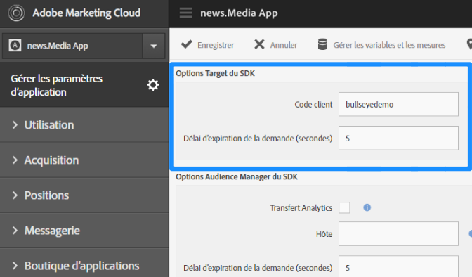
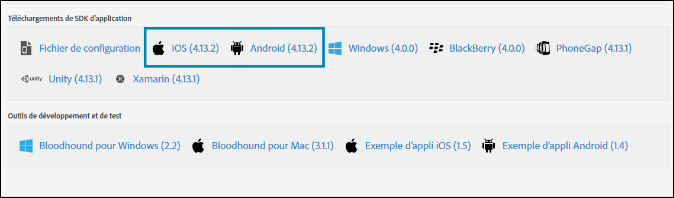

# Activation de Target dans le SDK{#enable-target-in-the-sdk}

Ajoutez le SDK Adobe Mobile Services à votre application.

1. Si vous n’avez pas encore installé le SDK Adobe Mobile Services dans votre application, utilisez vos informations d’identification Analytics ou Experience Cloud pour le télécharger depuis le site web [Adobe Mobile Services](https://mobilemarketing.adobe.com).

1. Ajoutez le SDK Adobe Mobile Services à votre application.

   Les instructions sont disponibles sous [Mise en œuvre principale et cycle de vie](https://docs.adobe.com/content/help/en/mobile-services/ios/getting-started-ios/dev-qs.html).

1. Ajoutez le code client, le délai et activez SSL.

   Dans Experience Cloud, ouvrez Mobile Services, puis allez dans **[!UICONTROL Gérer les paramètres d’application]** > **[!UICONTROL Options Target du SDK]**.

   Ajoutez votre code client Target et le délai. Le code client est spécifique à votre compte ou entreprise. Le délai correspond à la durée en secondes pendant laquelle Target devra patienter avant d’obtenir une réponse contenant le contenu par défaut. Assurez-vous que l’option **[!UICONTROL Utiliser HTTPS]** est sélectionnée sur la page de gestion des paramètres d’application d’Adobe Mobile Services. Si HTTPS n’est pas activé, tous les appels dans iOS9+ seront bloqués, sauf si vous placez sur la liste autorisée le serveur de Cible.

   

1. Une fois votre application créée/localisée, recherchez les paramètres de l’application et téléchargez le SDK souhaité.

   

>[!IMPORTANT]
>
> Si vous n’avez pas accès à l’interface marketing mobile, vous pouvez effectuer les changements directement dans le fichier de configuration du code de votre application. Toutefois, celui-ci ne sera pas synchronisé avec la page des paramètres de votre interface utilisateur.

