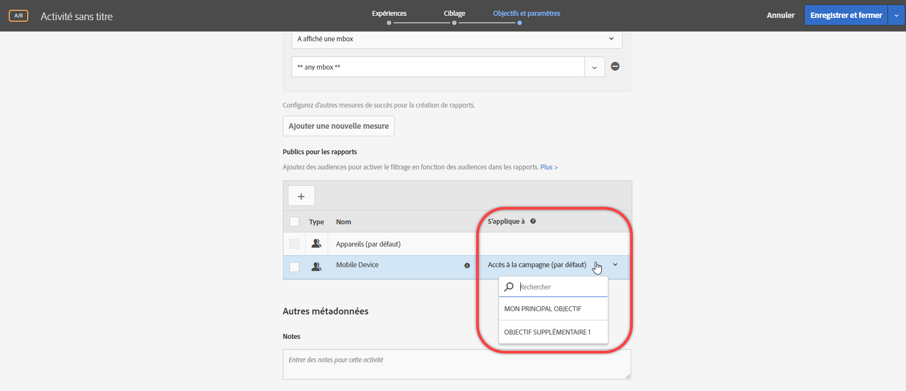
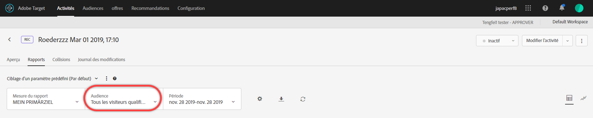

# Application d’une audience de rapport à une mesure de succès{#apply-a-reporting-audience-to-a-success-metric}

Choisissez une mesure de succès qui qualifie l’utilisateur pour l’audience de rapport.

Pour toutes les activités, la liste déroulante [!UICONTROL S’applique à] permet d’appliquer une audience à une mesure de succès pour visualiser les nombres présentés dans les rapports une fois la mesure atteinte et pour les actions ultérieures.

Imaginons, par exemple, que vous avez créé une activité pour tous les visiteurs qui entrent sur votre page d’accueil et qui accèdent ensuite à la page de conversion, mais que vous voulez également analyser plus en détails les visiteurs qui ont ajouté dans leur panier des produits pour un montant supérieur à 50 USD avant la conversion.

La liste déroulante S’applique à propose trois catégories : tous les visiteurs de l’activité, uniquement les visiteurs qui atteignent une certaine étape de l’activité ou uniquement les visiteurs qui vont jusqu’à la conversion. Autrement dit, vous pouvez spécifier qu’un visiteur doit avoir atteint une mbox sur la page d’entrée de l’activité, une mbox qui définit un point donné au cours de l’activité, ou encore la mbox de conversion à la fin de l’activité.

[Les mesures de succès](../c-activities/r-success-metrics/success-metrics.md#reference_D011575C85DA48E989A244593D9B9924) sont disponibles uniquement si vous les avez configurées pour votre activité. Si vous n’avez pas défini de mesures de succès, la liste déroulante ne propose alors que deux options : Accès à la campagne et Conversion.

Prenez en compte les points suivants lorsque vous appliquez une audience de rapport à une mesure de succès :

* Pour les actions antérieures à l’action à laquelle la mesure de succès est appliquée, Target n’applique pas d’audience segmentée.
* Pour les actions postérieures à l’action à laquelle la mesure de succès est appliquée, Target applique une audience segmentée.

Pour visualiser la segmentation dans le rapport, sélectionnez l’audience souhaitée dans la liste déroulante Audience du rapport de l’activité.

