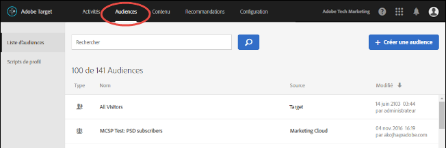
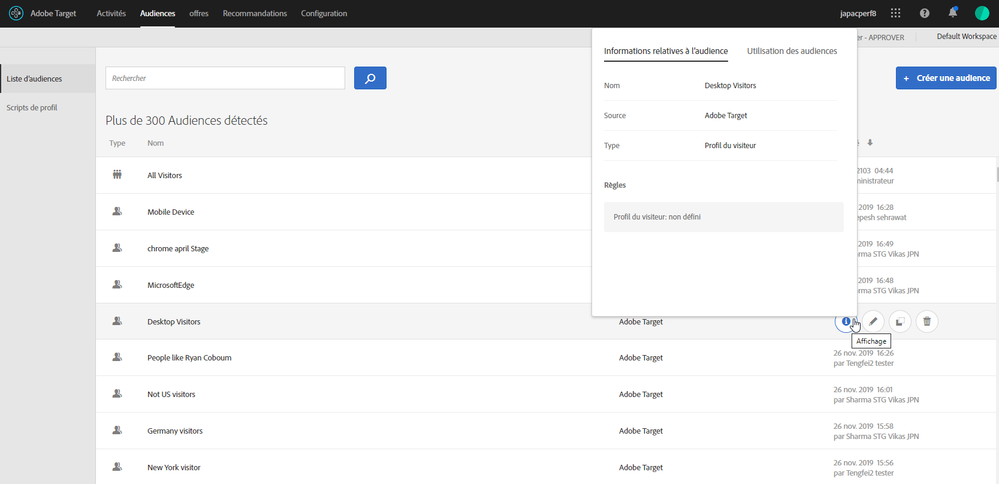
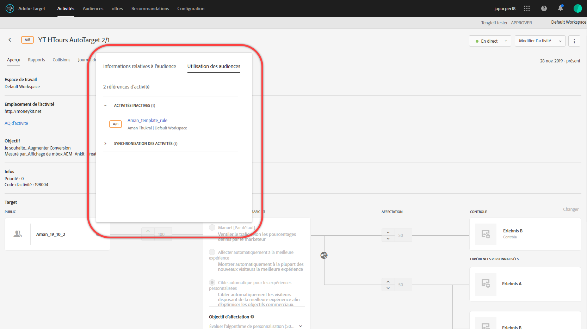
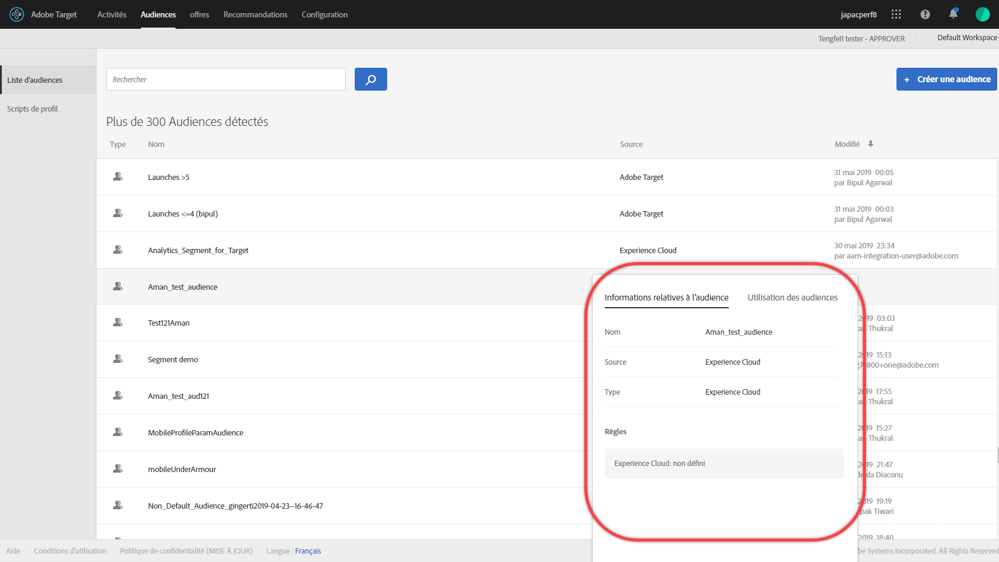

# Créer des audiences

Audiences dans [!DNL Adobe Target] déterminer qui voit le contenu et les expériences dans une activité ciblée ;

Les audiences sont utilisées partout où le ciblage est disponible. Lors du ciblage d’une activité, vous disposez des options suivantes :

* Sélectionnez une audience réutilisable à partir du [!UICONTROL Audiences] list
* [Création d’une audience spécifique à une activité](/help/c-target/creating-activity-only-audience.md) et le cibler
* [Combinaison de plusieurs audiences](/help/c-target/combining-multiple-audiences.md#concept_A7386F1EA4394BD2AB72399C225981E5) pour créer une audience ad hoc

Vous pouvez également utiliser les données d’audience collectées par [!DNL Adobe Analytics] pour le ciblage et la personnalisation en temps réel dans [!DNL Target] et autres [!DNL Adobe Experience Cloud] applications. Voir [Audiences Experience Cloud](https://experienceleague.adobe.com/docs/core-services/interface/audiences/audience-library.html?lang=fr) dans le *Composants de l’interface centrale Experience Cloud* guide.

Il existe deux types d’audiences dans [!DNL Target]:

* **Ciblage des audiences :** Utilisé pour diffuser du contenu différent à différents types de visiteurs.
* **Audiences avec création de rapports :** Permet de déterminer comment différents types de visiteurs répondent au même contenu afin que vous puissiez analyser les résultats de vos tests.

   Dans [!DNL Target], vous pouvez configurer les audiences avec création de rapports seulement si vous utilisez [!DNL Target] comme source des rapports. Si vous utilisez [ Adobe Analytics comme source des rapports](/help/c-integrating-target-with-mac/a4t/a4t.md) (A4T), vous devez configurer les audiences avec création de rapports dans [!DNL Analytics].

## Utilisez la variable [!UICONTROL Audiences] list {#use-list}

Pour accéder à la liste des [!UICONTROL audiences], cliquez sur **[!UICONTROL Audiences]** dans la barre de menu supérieure :

Le [!UICONTROL Audiences] contient les audiences que vous pouvez utiliser dans vos activités. Utilisez la variable [!UICONTROL Audiences] pour créer, modifier, dupliquer, copier ou combiner des audiences. La liste présente également la source dans laquelle l’audience a été créée:

* [!DNL Adobe Target]
* [!DNL Adobe Target Classic]
* [!DNL Experience Cloud]
* [!DNL Adobe Experience Platform]

   >[!NOTE]
   >
   >Le [!DNL Adobe Experience Platform] La source est disponible pour tous les [!DNL Target] clients utilisant la variable [SDK Web Adobe Experience Platform](/help/c-implementing-target/c-implementing-target-for-client-side-web/aep-web-sdk.md). Audiences disponibles à partir de [!DNL Adobe Experience Platform] peut être utilisé tel quel ou [combiné avec les audiences existantes](/help/c-target/combining-multiple-audiences.md).
   >
   >Les utilisateurs doivent disposer des [!UICONTROL Approbateur] ou au-dessus de l’état [!DNL Target] pour configurer [!DNL Target] [!UICONTROL Destinations] cartes dans AEP/RTCDP ([!DNL Real-time Customer Data Platform]).
   >
   >Pour plus d’informations, voir [Utilisation des audiences de Adobe Experience Platform](#aep).

Audiences prédéfinies, telles que &quot;[!UICONTROL Nouveaux visiteurs]&quot; et &quot;[!UICONTROL Visiteurs récurrents]&quot; ne peut pas être renommé.

Lorsque vous utilisez des audiences qui ont été créées à l’origine dans [!DNL Experience Cloud] ou [!DNL Adobe Experience Platform], [!DNL Target] vous alerte si vous référencez une audience dans [!DNL Target] activités qui ont été supprimées ultérieurement dans [!DNL Experience Cloud] ou [!DNL Adobe Experience Platform].

* Si une audience a été supprimée dans [!DNL Experience Cloud] ou [!DNL Adobe Experience Platform], une icône d’avertissement dans les [!UICONTROL Audience] et le sélecteur d’audience s’affiche. Une info-bulle dans la variable [!DNL Target] L’interface utilisateur indique également que l’audience a été supprimée dans [!DNL Experience Cloud] ou [!DNL Adobe Experience Platform].
* Si vous tentez de combiner plusieurs audiences, parmi lesquelles une audience supprimée, ou si vous venez d’enregistrer une activité faisant référence à une audience supprimée, un message d’avertissement apparaît.

Vous pouvez également cibler des paramètres de profil personnalisés et des paramètres `user.`. Lors de la création d’une audience, faites glisser les attributs à utiliser pour cibler votre activité dans la fenêtre du créateur d’audiences. Si l’attribut souhaité ne s’affiche pas, l’attribut n’a pas été déclenché par une mbox. D’autres paramètres mbox personnalisés sont disponibles dans la liste déroulante [!UICONTROL Paramètres personnalisés].

Utilisez la variable [!UICONTROL Filtres] pour filtrer les [!UICONTROL Audiences] liste par source : [!DNL Adobe Target], [!DNL Adobe Target Classic], [!DNL Experience Cloud], et [!DNL Adobe Experience Platform].

![Option Filtres dans la [!UICONTROL Audiences] list](assets/filters.png)

Utilisez la variable [!UICONTROL Recherche d’audiences] pour rechercher votre [!UICONTROL Audiences] liste. Vous pouvez effectuer une recherche sur une partie du nom de l’audience ou placer une chaîne spécifique entre guillemets.

Vous pouvez trier la liste d’[!UICONTROL audiences] par nom d’audience ou par date de dernière modification. Pour trier par nom ou date, cliquez sur l’en-tête de la colonne, puis choisissez d’afficher les audiences par ordre croissant ou décroissant.

## Affichage des définitions d’audience {#section_11B9C4A777E14D36BA1E925021945780}

Vous pouvez afficher les détails de la définition de l’audience sur une carte contextuelle à différents endroits dans la variable [!DNL Target] Interface utilisateur sans ouvrir l’audience. Cette fonctionnalité s’applique aux audiences créées dans [!DNL Target Standard/Premium] et audiences importées depuis [!DNL Target Classic] ou créé via l’API.

Par exemple, la carte de définition de l’audience suivante est accessible en cliquant sur le [!UICONTROL Afficher les détails] pour l’audience souhaitée :

Pour accéder à la carte de définition de l’audience suivante, cliquez sur le bouton [!UICONTROL Afficher les détails] sur l’icône d’une activité. [!UICONTROL Présentation] page :

La carte de définition de l’audience indique le type, la source et les attributs de l’audience. Cliquez sur **[!UICONTROL Afficher les détails complets]** pour afficher d’autres activités qui font référence à cette audience, le cas échéant. Si vous affichez une carte de définition d’audience à partir d’une activité [!UICONTROL Présentation] page, cliquez sur **[!UICONTROL Utilisation de l’audience]**.

Les informations d’utilisation de l’audience peuvent vous aider à éviter tout impact accidentel sur d’autres activités lors de la modification des audiences. Informations incluses [!UICONTROL Activités en direct], [!UICONTROL Activités inactives], [!UICONTROL Activités archivées], et [!UICONTROL Synchronisation des activités]. Cette fonctionnalité est disponible pour toutes les audiences (audiences de bibliothèque et [les audiences d’activité uniques](/help/c-target/creating-activity-only-audience.md#concept_A6BADCF530ED4AE1852E677FEBE68483)).

Si une audience est [combiné avec une autre audience](/help/c-target/combining-multiple-audiences.md) et l’audience combinée est utilisée pour créer une activité. les informations d’utilisation des deux audiences répertorient cette activité nouvellement créée.

<!--The following audience definition card is for an audience imported from the Adobe Experience Cloud. In this instance, the audience was imported from Adobe Audience Manager (AAM).

The following details are available for these imported audience types:

| Audience Type | Details |
|--- |--- |
|Mobile audience|Marketing Name, Vendor, and Model. The `matches | does not match` operator displays instead of `equals | does not equal` .|
|Visitor-behavior audience|**user.categoryAffinity:** `categoryAffinity` with `FAVORITE` parameter.  **Monitoring:** Monitoring service equals true. **No Monitoring Service:** Monitoring service equals false. |
|Audiences using the NOT operator|**Single Rule:** Target displays the audience in the format `[All Visitor AND [NOT [rule]`. Single NOT rule displays with AND with `AllVisitor` audience. |

Keep the following points in mind as you work with imported audiences:

* Expression target audiences are no longer supported in Target Standard/Premium. 
* Target Standard/Premium does not support some deprecated audiences or has improved operators for ease of use. Because of this, the definition of an imported audience, although working as per definition, does not mean that same is now available for creation in the Standard/Premium interface. For example, Social Audiences are visible with their rules but Target Standard/Premium does not allow social audiences to be created.-->

## Utilisation d’audiences provenant de [!DNL Adobe Experience Platform] {#aep}

Utilisation des audiences créées dans [!DNL Adobe Experience Platform] fournir des données client plus riches qui mènent à une personnalisation plus impactée. Le [Real-time Customer Data Platform](https://experienceleague.adobe.com/docs/experience-platform/rtcdp/overview.html){target=_blank} (RTCDP), basé sur [!DNL Adobe Experience Platform], aide les entreprises à rassembler des données connues et anonymes provenant de plusieurs sources d’entreprise. Ce processus vous permet de créer des profils client qui peuvent être utilisés pour offrir des expériences client personnalisées sur tous les canaux et appareils en temps réel.

En se connectant [!DNL Target] au [!DNL Real-time Customer Data Platform], les clients peuvent enrichir leur personnalisation web en déverrouillant de nouveaux segments qui étaient auparavant inaccessibles pour [!DNL Target] pour activer la personnalisation en temps réel en millisecondes sur la première page de la visite web d’un client. Utilisation des audiences créées dans [!DNL Adobe Experience Platform] vous permet d’étendre les points de données disponibles pour une personnalisation plus riche.

Cette intégration permet de déverrouiller les cas d’utilisation clés avec la plateforme RTCDP :

* Personnalisation Même page / Accès suivant
* Personnalisation des nouveaux utilisateurs / utilisateurs inconnus

Les principales fonctionnalités sont les suivantes :

* Intégration de Target direct avec RTCDP/[!DNL Adobe Experience Platform] sur l’Edge (suppression de la dépendance sur [!DNL Audience Core services] - AAM)
* [!UICONTROL Target Edge Destinations Card] avec application de la gouvernance
* Segmentation Edge et profil Edge avec profil unifié

Pour plus d’informations, voir les rubriques suivantes :

* [Notes de mise à jour des destinations](https://experienceleague.adobe.com/docs/experience-platform/release-notes/latest.html?lang=en#destinations){target=_blank}
* [Connexion à la personnalisation personnalisée](https://experienceleague.adobe.com/docs/experience-platform/destinations/catalog/personalization/custom-personalization.html){target=_blank} dans la variable *Présentation des destinations* guide
* [Connexion Adobe Target](https://experienceleague.adobe.com/docs/experience-platform/destinations/catalog/personalization/adobe-target-connection.html){target=_blank} dans la variable *Présentation des destinations* guide
* [Configuration des destinations de personnalisation pour les cas pratiques de personnalisation de la même page et de la page suivante](https://www.adobe.com/go/destinations-edge-personalization-en){target=_blank}

### Blog et vidéo Adobe Target :

[[!DNL Adobe] announces Same Page Enhanced Personalization with [!DNL Adobe Target] et [!DNL Real-time Customer Data Platform]](https://blog.adobe.com/en/publish/2021/10/05/adobe-announces-same-page-enhanced-personalization-with-adobe-target-real-time-customer-data-platform){target=_blank}

### Informations supplémentaires

Le tableau suivant indique le temps d’évaluation des segments pour les événements provenant de différents scénarios d’implémentation :

| Scénario | Segment Edge (évaluation en millisecondes) | Segment de diffusion en continu (évaluation par minute) | Évaluation de segments par lots |
| --- | --- | --- | --- |
| Événements/données des SDK Adobe Experience Platform | Oui | Oui | S.O. |
| Événements d’at.js | Non | Oui | S.O. |
| Événements des SDK mobiles Target | Non | Oui | S.O. |
| Événements de chargement par lots | Non | Non | Oui |
| Événements des données hors ligne (flux) | Non | Oui | Oui |

## Vidéo de formation : Utilisation des audiences 

Cette vidéo comprend des informations sur l’utilisation des audiences.

* Explication du terme « audience »
* Explication des deux façons d’utiliser les audiences pour l’optimisation
* Utilisation d’audiences à des fins de création passive de rapports dans une activité
* Ciblage d’une activité sur une audience
* Utilisation d’audiences à des fins de création passive de rapports dans une activité

>[!VIDEO](https://video.tv.adobe.com/v/17398)
