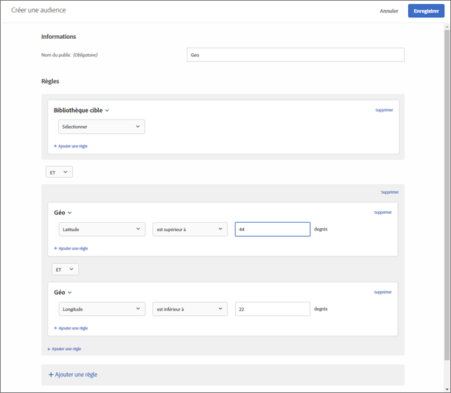

# Géo 

Utilisez les audiences de [!DNL Adobe Target] pour les utilisateurs de la cible en fonction de leur emplacement géographique, notamment leur pays, état/province, ville, code postal, zone desservie ou opérateur de téléphonie mobile.

Les paramètres de géolocalisation permettent de cibler des activités et des expériences en fonction de la géographie de vos visiteurs. Vous pouvez inclure ou exclure des visiteurs en fonction de leur pays, état/province/département, ville, code postal, latitude, longitude, zone desservie ou opérateur de téléphonie mobile. Ces données sont envoyées avec chaque requête [!DNL Target] et sont basées sur l&#39;adresse IP de l&#39;visiteur. Sélectionnez ces paramètres comme pour une autre valeur de ciblage.

## Créer une Audience avec le ciblage géographique {#section_49CBFFAAC8694C4AAD3DE4B2DB7B05DE}

1. Dans l’interface [!DNL Target], cliquez sur **[!UICONTROL Audiences]** > **[!UICONTROL Créer une audience]**.
1. Donnez un nom à l’audience.
1. Cliquez sur **[!UICONTROL Ajouter une règle]** > **[!UICONTROL Géo]**.

1. Cliquez sur **[!UICONTROL Sélectionner]**, puis sélectionnez l’une des options suivantes :

   * Pays
   * État
   * Ville
   * Code postal
   * Latitude
   * Longitude
   * Zone desservie (DMA)
   * Opérateur de téléphonie mobile

   Une fois par visite (session), l’adresse IP d’un visiteur est transmise avec une requête de mbox pour résoudre les paramètres de géociblage de celui-ci.

   Pour l’opérateur de téléphonie mobile, [!DNL Target] utilise les données d’enregistrement de l’adresse IP (indiquant le propriétaire du bloc d’adresses IP) pour déterminer l’opérateur de téléphonie mobile approprié à l’aide des [Codes MCC (Mobile Country Codes, Indicatifs de pays du mobile) et des codes MNC (Mobile Network Codes, Codes de réseau mobile)](https://www.mcc-mnc.com).

1. Spécifiez un opérateur et la valeur appropriée.
1. (Facultatif) Cliquez sur **[!UICONTROL Ajouter une règle]**, puis définissez des règles supplémentaires pour l’audience.
1. Cliquez sur **[!UICONTROL Enregistrer]**.

L’illustration suivante montre une audience qui cible les utilisateurs qui accèdent à l’activité à partir d’une latitude supérieure à 44° et d’une longitude inférieure à 22°.

## Précision {#section_D63D5FFCB49C42F9933AFD0BD7C79DF1}

La précision du géociblage dépend de plusieurs facteurs. Les connexions Wi-Fi sont plus précises que les réseaux cellulaires. Lorsque le visiteur utilise une connexion de données cellulaires, la précision de la recherche géographique peut être affectée par la localisation, la relation des données du fournisseur avec [DeviceAtlas](https://deviceatlas.com/device-data/user-agent-tester) et d’autres facteurs. Les connexions réseau basées sur des antennes-relais peuvent être moins précises que les connexions Wi-Fi ou câblées. En outre, une adresse IP du visiteur peut être mappée à l’emplacement du fournisseur de services Internet du visiteur, qui peut ne pas être identique à l’emplacement réel du visiteur. Certains problèmes de géolocalisation mobile peuvent être résolus à l’aide de l’[API de géolocalisation](https://developer.mozilla.org/en-US/docs/Web/API/Geolocation_API).

Le tableau ci-après indique la précision des informations géographiques basées sur les adresses IP de [DigitalEnvoy](https://www.digitalelement.com/solutions/) pour les connexions Internet sur un réseau WiFi ou câblé. DigitalEnvoy offre les données les plus précises du secteur. La précision globale est de plus de 99,9 % au niveau du pays et atteint 97 % au niveau de la ville. Les informations sur la précision ne s’appliquent pas aux réseaux basés sur des antennes-relais.

| Pays | État | Ville | Région |
|--- |--- |--- |--- |
| US | 99,99 % | 96 % | 94 % |
| Canada | 99,99 % | 96 % | 94 % |
| Europe | 99,99 % |  |  |
| Royaume-Uni | 99,99 % |  | 87 % |
| Allemagne | 99,99 % | 95 % | 93 % |
| Scandinavie | 99 % | Faible 90 s | Moyenne 80 s |
| Espagne | 99,99 % | Autour de 90 % | Moyen à élevé 90 s |
| Asie | 99 % | Moyen 90 s | Faible 90 s |
| Japon | 99,99 % | Moyen 90 s | Faible 90 s |
| Australie | 99,99 % | 94 % | 91 % |

## Utilisation du géociblage dans les scripts de profil {#section_92C93138542C4A94997E3F4BE3F5DA28}

Vous pouvez utiliser les informations géographiques pour les scripts de profil.

Par exemple, utilisez :

* `profile.geolocation.country`
* `profile.geolocation.state`
* `profile.geolocation.city`
* `profile.geolocation.zip`
* `profile.geolocation.dma`
* `profile.geolocation.domainName`
* `profile.geolocation.ispName`
* `profile.geolocation.connectionSpeed`
* `profile.geolocation.mobileCarrier`

Vous pouvez alors écrire une expression cible appelée « A partir des États-Unis » à l’aide du code suivant :

`return profile.geolocation.country == 'united states' || profile.geolocation.country == 'canada' || profile.geolocation.country == 'mexico';`

## Utilisation des valeurs de géociblage comme jetons {#section_E7F7FDF62C3B4934A6565D04B24655F6}

Désormais, vous pouvez utiliser les valeurs `profile.geolocation` comme jetons dans des offres, des modules externes, etc.

Par exemple, utilisez :

* `${profile.geolocation.country}`
* `${profile.geolocation.state}`
* `${profile.geolocation.city}`
* `${profile.geolocation.zip}`
* `${profile.geolocation.dma}`
* `${profile.geolocation.domainName}`
* `${profile.geolocation.ispName}`
* `${profile.geolocation.connectionSpeed}`
* `${profile.geolocation.mobileCarrier}`
* `${profile.geolocation.latitude}`
* `${profile.geolocation.longitude}`

## Questions fréquentes sur le géociblage {#section_DD308A53AF0F48FA8C81423580561FE7}

**Comment spécifier la latitude et la longitude ?**

* La valeur de la latitude/longitude doit être une valeur numérique exprimée en degrés.
* La valeur de la latitude/longitude doit avoir une précision maximale de cinq décimales.
* La valeur de la latitude doit se situer entre -90 et 90.
* La valeur de la longitude doit se situer entre -180 et 180.

**Comment le géociblage fonctionne-t-il pour les périphériques mobiles ?**

La plupart des utilisateurs de périphériques mobiles accèdent au contenu par Wi-Fi, ce qui signifie que le ciblage géographique basé sur l’adresse IP de [!DNL Target] est aussi précis que sur un ordinateur de bureau. Les connexions basées sur un relais de téléphonie mobile peuvent être moins précises car l’adresse IP du visiteur est basée sur le relais qui capture le signal. Certains problèmes de géolocalisation mobile peuvent être résolus à l’aide de l’[API de géolocalisation](https://developer.mozilla.org/en-US/docs/Web/API/Geolocation_API).

**Comment la fonction géographique gère-t-elle les visiteurs provenant d’AOL ?**

En raison de la manière dont AOL effectue le trafic par proxy, [!DNL Target] ne peut les cible qu’au niveau du pays. Par exemple, une campagne ciblée sur la France cible avec succès les utilisateurs d’AOL en France. Mais une campagne ciblée sur Paris ne réussit pas à cible les utilisateurs d&#39;AOL à Paris. Si vous envisagez de cibler des utilisateurs d’AOL, vous pouvez affecter au champ Région la valeur « aol ». En fait, vous pouvez cibler des utilisateurs d’AOL aux États-Unis en spécifiant deux conditions de ciblage : Pays correspond exactement à « états-unis » et Région correspond exactement à « aol ».

**Quelle granularité d’emplacement le géociblage offre-t-il ?**

* Pays : globale
* État/province/département : globale
* Ville : globale
* Code postal : États-Unis, Allemagne, Canada
* DMA/ITV (Royaume-Uni) : États-Unis, Royaume-Uni
* Opérateur de téléphonie mobile : globale

**Comment puis-je faire pour tester mes activités si je ne me trouve pas dans mon lieu habituel ?**

* **at.js 1.*x*** : Vous pouvez remplacer votre adresse IP par une adresse IP d’un autre emplacement et utiliser le  `mboxOverride.browserIp url` paramètre. Donc, si votre société est au Royaume-Uni, mais que vos visiteurs de cibles de campagne mondiale sont à Auckland, en Nouvelle-Zélande, utilisez ce style d’URL en supposant que `60.234.0.39` est une adresse IP à Auckland :

   `https://www.mycompany.com?mboxOverride.browserIp=60.234.0.39`

   Effacez vos cookies avant de tester l’activité.

   >[!NOTE]
   >
   >`mboxOverride.browserIp` est pris en charge dans at.js 1.*x* uniquement. Cette fonctionnalité n’est pas prise en charge dans at.js 2.*x*.

* **Équivalent at.js 2.*x*** : Pour remplacer votre adresse IP par at.js 2.*x*, installez une extension/un module externe de navigateur (par exemple X-Forwarded-For Header for Chrome ou Firefox). Cette extension vous permet de transmettre l’en-tête x-forwarded-for dans vos requêtes de page.

**Comment les territoires tels que Porto Rico et Hong Kong sont-ils mappés dans la structure de géociblage ?**

Porto Rico, Hong Kong, ainsi que les autres territoires sont traités comme des valeurs « Pays » indépendantes.

**La  [!DNL Target] capture (et le stockage) d’informations telles que les codes postaux lorsque l’activité est ciblée avec des fonctionnalités de ciblage de géolocalisation ?**

Non, [!DNL Target] utilise des données géographiques uniquement pendant la session, puis les données sont ignorées.

## Vidéo de formation : Création d’Audiences 

Cette vidéo fournit des informations sur l’utilisation des catégories d’audiences.

* Créer des audiences
* Définir des catégories d’audiences

>[!VIDEO](https://video.tv.adobe.com/v/17392)
