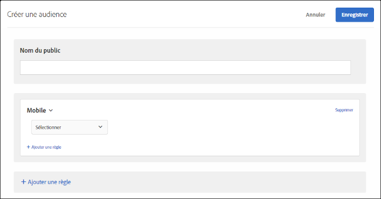

# Mobile{#mobile}

Créez des audiences pour cibler des périphériques mobiles en fonction des paramètres tels que les appareils mobiles, le type de périphérique, le fournisseur de périphérique, les dimensions d&#39;écran (en pixels), etc.

Par exemple, vous souhaitez peut-être afficher un contenu différent aux utilisateurs qui visitent votre page depuis un téléphone par rapport aux utilisateurs qui la visitent depuis un ordinateur. Dans ce cas, vous pouvez sélectionner l’audience Mobile, puis l’option **[!UICONTROL Téléphone mobile], et ajouter tous les détails spécifiques qui vous semblent importants tels que le type de téléphone, la taille de l’écran (en pixels), etc.**

Le ciblage mobile est fourni par [DeviceAtlas](https://deviceatlas.com/device-data/user-agent-tester), un service de DotMobi. DeviceAtlas est une base de données complète de périphériques mobiles créée à partir des données compilées provenant de nombreuses sources, dont les fabricants et les opérateurs réseau. Ces données sont alors vérifiées, référencées et validées pour mettre à disposition une importante base de données des périphériques mobiles.

Les périphériques sont détectés en analysant les chaînes d’agent-utilisateur. Certains fabricants de périphériques, notamment Apple, inhibent cette fonctionnalité en ne fournissant pas suffisamment d’informations dans l’agent-utilisateur.

Par exemple, aux États-Unis, les appareils Apple ne partagent pas de jetons spécifiques aux modèles. Il n’est alors pas possible de détecter les modèles d’iPhone (iPhone 5S, iPhone SE, iPhone 6, etc.) en appliquant une méthode simple fondée sur les mots-clés.

Pour résoudre ce problème, Target collecte des données supplémentaires afin de détecter précisément les iPhone et autres appareils Apple à l’aide des paramètres suivants :

| Paramètre | Type | Description |
|--- |--- |--- |
| devicePixelRatio | Chaîne | Rapport entre les pixels physiques et les pixels indépendants de l’appareil (dips) sur le navigateur. Par exemple « 1,5 » ou « 2 » |
| screenOrientation | Chaîne | L’appareil et le moteur JavaScript du navigateur prennent en charge l’orientation d’appareil. Peut être Paysage ou Portrait. |
| webGLRenderer | Chaîne | Rendu de navigateur du pilote graphique. |

>[!NOTE]
>
>Les clients utilisant le SDK mobile n’ont aucune mesure à prendre pour exploiter cette fonctionnalité. Les clients utilisant at.js doivent [procéder à une mise à niveau vers at.js version 1.5.0](../../../c-implementing-target/c-implementing-target-for-client-side-web/target-atjs-versions.md#reference_DBB5EDB79EC44E558F9E08D4774A0F7A) (ou version ultérieure).

Vous pouvez choisir plusieurs propriétés d’appareil mobile. Les sélections multiples sont jointes par l’opérateur OU.

Les clients qui utilisent une intégration personnalisée (n’utilisant pas at.js ou le SDK mobile) peuvent collecter ces paramètres eux-mêmes et les transmettre en tant que paramètres mbox.

1. Dans l’interface [!DNL Target], cliquez sur **[!UICONTROL Audiences]** &gt; **[!UICONTROL Créer une audience]**.
1. Donnez un nom à l’audience.
1. Cliquez sur **[!UICONTROL Ajouter une règle]** &gt; **[!UICONTROL Mobile]**.
1. Cliquez sur **[!UICONTROL Sélectionner]**, puis sélectionnez l’une des options suivantes :

   * Nom marketing du périphérique
   * Modèle de périphérique
   * Fournisseur de périphérique
   * Appareil mobile
   * Téléphone mobile
   * Tablette
   * Système d’exploitation
   * Hauteur de l’écran (px)
   * Largeur de l’écran (px)
   >[!NOTE]
   >
   >En raison des nouvelles modifications introduites dans ios 12.2, la création d&#39;une audience avec des règles définies par le nom marketing et le modèle de périphérique qui spécifient les modèles iphone est affectée. Nous ne pouvons plus cibler les utilisateurs qui disposent d&#39;ios 12.2 sur leur appareil. Toutefois, si ces utilisateurs ne disposent pas d&#39;ios 12.2, le ciblage du modèle iphone continue de fonctionner correctement.
   >
   >La mise à jour ios 12.2 n&#39;a aucune incidence sur l&#39;identification des modèles suivants, car ces modèles ne prennent pas en charge la mise à niveau vers ios 12.2 : iphone, iphone 3 G, iphone 3 GS, iphone 4, iphone 4 s, iphone 5, iphone 5 c, ipad 2 c, ipad, ipad 2, écran ipad/Retina, ipad Retina (4 e génération), ipod Touch 4 et ipod Touch 5.

   >[!NOTE]
   >
   >Vous pouvez effectuer un ciblage selon l’opérateur de téléphonie mobile à l’aide des [paramètres de géolocalisation](../../../c-target/c-audiences/c-target-rules/geo.md#concept_5B4D99DE685348FB877929EE0F942670).

1. (Facultatif) Cliquez sur **[!UICONTROL Ajouter une règle]**, puis définissez des règles supplémentaires pour l’audience.
1. Cliquez sur **[!UICONTROL Enregistrer]**.

L&#39;illustration suivante montre une audience ciblant les visiteurs qui utilisent des appareils fabriqués par Google qui sont des périphériques mobiles.

## Vidéo de formation : Création d’audiences

Cette vidéo fournit des informations sur l’utilisation des catégories d’audiences.

* Créer des audiences
* Définir des catégories d’audiences

>[!VIDEO](https://video.tv.adobe.com/v/17392?captions=fre_fr)
