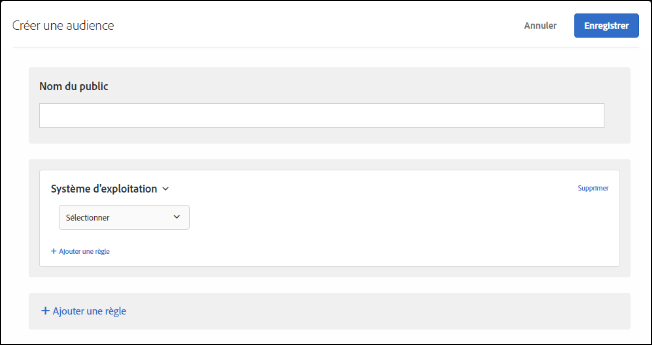

# Système d’exploitation

Vous pouvez cibler les visiteurs qui utilisent un système d’exploitation en particulier.

1. Dans l’interface [!DNL Target], cliquez sur **[!UICONTROL Audiences]** > **[!UICONTROL Créer une audience]**.
1. Donnez un nom à l’audience.
1. Cliquez sur **[!UICONTROL Ajouter une règle]** > **[!UICONTROL Système d’exploitation]**.
1. Cliquez sur **[!UICONTROL Sélectionner]**, puis sélectionnez l’une des options suivantes :

   * Linux
   * Macintosh
   * Windows

1. (Facultatif) Cliquez sur **[!UICONTROL Ajouter une règle]**, puis définissez des règles supplémentaires pour l’audience.
1. Cliquez sur **[!UICONTROL Enregistrer]**.

Les illustrations suivantes présentent une audience ciblant les visiteurs utilisant un système d’exploitation Macintosh.

## Vidéo de formation : Création d’audiences

Cette vidéo fournit des informations sur l’utilisation des catégories d’audiences.

* Créer des audiences
* Définir des catégories d’audiences

>[!VIDEO](https://video.tv.adobe.com/v/17392)
