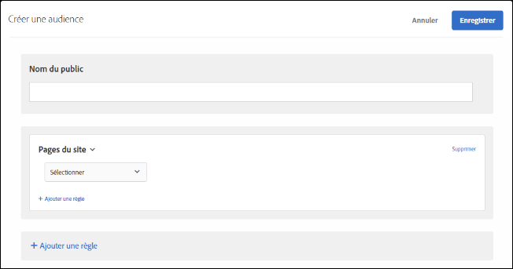
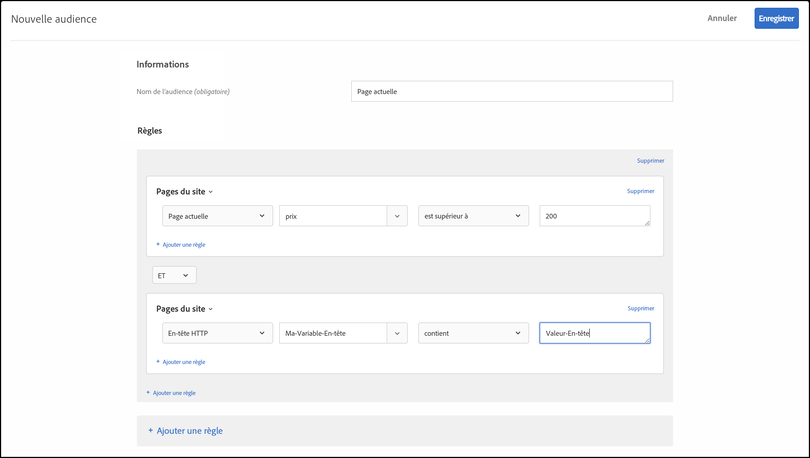

# Pages du site{#site-pages}

Vous pouvez cible les visiteurs qui se trouvent sur une page spécifique de votre site.

1. Dans l’interface [!DNL Target], cliquez sur **[!UICONTROL Audiences]** > **[!UICONTROL Créer une audience]**.
1. Donnez un nom à l’audience.
1. Cliquez sur **[!UICONTROL Ajouter une règle]** > **[!UICONTROL Pages du site]**.

   

1. Cliquez sur la liste déroulante **[!UICONTROL Sélectionner]**, sélectionnez l’une des options suivantes, puis configurez la règle selon vos besoins.

   Les options et évaluateurs disponibles dans les listes suivantes de la règle varient en fonction de l’option choisie. L’illustration suivante présente les options disponibles si vous choisissez [!UICONTROL Page active] :

   

   Les options suivantes sont disponibles dans la liste déroulante initiale lorsque vous sélectionnez [!UICONTROL Sélectionner].

   * **Page active :** page sur laquelle se trouve actuellement l’utilisateur.

      Les options suivantes sont disponibles dans la deuxième liste déroulante si vous choisissez cette option :

      * URL (Pour plus d’informations sur l’évaluation des URL par la Cible, voir [FAQ sur les Cibles et les audiences](/help/c-target/c-troubleshooting-targets-and-audiences/troubleshooting-targets-and-audiences.md).)
      * Domaine
      * Requête
      * Sous-domaine
      * Domaine de niveau supérieur
      * Chemin d’accès
      * Fragment de hachage (#)
   * **Page précédente :** page sur laquelle se trouvait l’utilisateur avant de cliquer sur la page en cours. (L’utilisateur doit cliquer de la page précédente vers la page active pour activer le suivi de la page. La page précédente n’est pas suivie si l’utilisateur saisit une nouvelle URL dans son navigateur.) Le contenu réel de cette page dépend de la conception de votre site. Ainsi, si la page active affiche des informations sur un produit spécifique, il est possible que la page précédente soit une page de catégorie dans laquelle le visiteur a sélectionné ce produit (telle qu’une page présentant plusieurs appareils photo d’un certain type) ou la page d’accueil renvoyant à la dernière page.

      Les options suivantes sont disponibles dans la deuxième liste déroulante si vous choisissez cette option :

      * URL (Pour plus d’informations sur l’évaluation des URL par la Cible, voir [FAQ sur les Cibles et les audiences](/help/c-target/c-troubleshooting-targets-and-audiences/troubleshooting-targets-and-audiences.md).)
      * Domaine
      * Requête
      * Sous-domaine
      * Domaine de niveau supérieur
      * Chemin d’accès
   * **Page d’entrée :** première page que voit l’utilisateur lorsqu’il accède à votre site. Par exemple, si le visiteur clique sur un lien Google menant à une page de catégorie, la page de catégorie devient la page d’entrée. Si le lien mène à la page d’accueil, cette dernière est la page d’entrée. La page d’entrée est mémorisée pour toute la session du visiteur. Vous pouvez encore affiner le ciblage au sein du site en fonction de la page d’entrée du visiteur dans cette session.

      Les options suivantes sont disponibles dans la deuxième liste déroulante si vous choisissez cette option :

      * URL (Pour plus d’informations sur l’évaluation des URL par la Cible, voir [FAQ sur les Cibles et les audiences](/help/c-target/c-troubleshooting-targets-and-audiences/troubleshooting-targets-and-audiences.md).)
      * Domaine
      * Requête
      * Sous-domaine
      * Domaine de niveau supérieur
      * Chemin d’accès
      * Fragment de hachage (#)

      >[!NOTE]
      >
      >L’objet `landing.url` est réinitialisé au changement d’un sous-domaine ou au remplacement d’URL directe.

   * **En-tête HTTP :** cette option évalue les informations contenues dans l’en-tête HTTP de la demande de Cible. Par exemple, si l’en-tête HTTP contient des informations de langue, vous pouvez créer une règle contenant la condition `Accept-Language: es` pour les visiteurs de cible qui accèdent à la page en espagnol.

      Les options suivantes sont disponibles dans la deuxième liste déroulante si vous choisissez cette option :

      * Accept
      * Accept-Charset
      * Accept-Encoding
      * Accept-Language
      * Autorisation
      * Cache-Control
      * Connexion
      * Content-Length
      * Content-MDS
      * Content-Type
      * Date
      * Attente
      * De
      * Hôte
      * Si-Correspondance
      * If-Modified-Since
      * Si-Aucun-Correspondance
      * Si-Range
      * Si-Non-Modifié-Depuis
      * Max-Forwards
      * Pragma
      * Autorisation du proxy
      * Période 
      * Referer
      * TE
      * Mise à niveau
      * User-Agent
      * Via
      * Avertissement

   Si vous avez choisi [!UICONTROL Page active], [!UICONTROL Page précédente] ou [!UICONTROL Landing page], les options [!UICONTROL Domaine] et [!UICONTROL Requête] sont disponibles. Tenez compte des points suivants lorsque vous choisissez ces options :

   * **Domaine :** domaine complet de la page. Lors de la spécification d’un domaine, la bonne pratique consiste à utiliser « contains ». Par exemple, « Domain equals facebook.com » n’acceptera ni `m.facebook.com` ni `www.facebook.com`. En revanche, « Domain contains facebook.com » acceptera toutes les variantes de facebook.com.
   * **Requête :** contenu de l’URL après le premier point d’interrogation (?).

      `foo.html?e0a72cb2a2c7`

1. (Facultatif) Cliquez sur **[!UICONTROL Ajouter une règle]**, puis définissez des règles supplémentaires pour l’audience.
1. Cliquez sur **[!UICONTROL Enregistrer]**.

Vous pouvez également créer des audiences des pages du site en utilisant votre propre « paramètre de requête défini par l’utilisateur » ou « en-tête défini par l’utilisateur ».

Utilisez un :

* paramètre de requête si la règle sélectionnée par l’utilisateur est Page actuelle, Page d’entrée ou Page précédente ;
* En-tête si la règle sélectionnée par l’utilisateur est un en-tête HTTP.

comme illustré ci-dessous :

## Résolution des problèmes {#ts}

* Pour que les audiences d’landing page fonctionnent correctement, le paramètre `mboxReferrer` doit être défini pour les requêtes (pour l’API de Diffusion, le paramètre `context.address.referringUrl`) que la bibliothèque JavaScript at.js extrait de la page à l’aide de l’attribut `document.referrer`. Cet attribut `HTMLDocument` renvoie l&#39;URI de la page à partir de laquelle l&#39;utilisateur a navigué. La valeur de cet attribut est une chaîne vide lorsque l’utilisateur accède directement à la page (pas par le biais d’un lien, mais, par exemple, via un signet).

   Si ce comportement ne correspond pas à vos exigences, effectuez l’une des actions suivantes :

   * Transmettez [les paramètres de mbox](/help/c-implementing-target/c-implementing-target-for-client-side-web/t-mbox-download/c-understanding-global-mbox/pass-parameters-to-global-mbox.md) à [!DNL Target] à utiliser à des fins de ciblage.
   * Utilisez une [activité de test A/B](/help/c-activities/t-test-ab/test-ab.md) au lieu d’une activité de landing page. Les activités de test A/B ne changent pas d’expériences pour le même visiteur.
   * Utilisez plutôt un [profil visiteur](/help/c-target/c-audiences/c-target-rules/visitor-profile.md).

* Lorsque vous utilisez des évaluateurs &quot;débuts/se termine par&quot; sur des chaînes contenant des virgules, n’oubliez pas que ces variables
sont évaluées en tant que tableau de valeurs, dans lequel chaque valeur séparée par des virgules est évaluée. Par exemple, si nous avons la valeur d’un en-tête : `Accept-Language: en,zh;q=0.9,en-IN;q=0.8,zh-CN;q=0.7` il sera adapté pour des conditions telles que :
   * débuts avec zh,
   * débuts avec en,
   * se termine par 0,7,
   * se termine par 0,8.

## Vidéo de formation : Création d’audiences

Cette vidéo fournit des informations sur l’utilisation des catégories d’audiences.

* Créer des audiences
* Définir des catégories d’audiences

>[!VIDEO](https://video.tv.adobe.com/v/17392)
