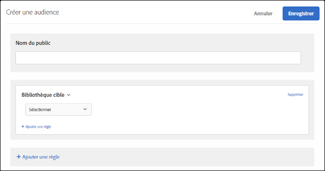

# Bibliothèque Target{#target-library}

Ciblez les utilisateurs d’après les règles de ciblage préconfigurées.

Les audiences préconfigurées de la catégorie Bibliothèque Target sont des audiences héritées, également présentes dans d’autres catégories. Pour en savoir plus et pour consulter les bonnes pratiques, voir [Questions fréquentes sur les cibles et les audiences](/help/c-target/c-troubleshooting-targets-and-audiences/troubleshooting-targets-and-audiences.md#concept_C4EE4B8F4840430CBD798D579A8F208D).

1. Dans l’interface [!DNL Target], cliquez sur **[!UICONTROL Audiences]** > **[!UICONTROL Créer une audience]**.
1. Donnez un nom à l’audience.
1. Cliquez sur **[!UICONTROL Ajouter une règle]** > **[!UICONTROL Bibliothèque Target]**.

   

1. Cliquez sur **[!UICONTROL Sélectionner]**, puis sélectionnez une règle de ciblage préconfigurée.

   Par exemple : système d’exploitation Windows, tablette, navigateur Safari, visiteurs récurrents, issus de Google, etc.

   L’audience prédéfinie « Tablette » est déjà admissible lorsque l’agent utilisateur contient l’une des chaînes suivantes. (Certaines d’entre elles correspondent à des numéros de modèle d’appareils). Vous ne devez pas créer de règles de ciblage personnalisées pour ces appareils.

   Kindle, Silk, iPad, Tablette Sony, TF101, GT-P1000, GT-P1000R, GT-P1000M, SGH-T849, SHW-M180S, GT-I9000T, BNTV250 et Tablet PC.

1. (Facultatif) Cliquez sur **[!UICONTROL Ajouter une règle]**, puis définissez des règles supplémentaires pour l’audience.
1. Cliquez sur **[!UICONTROL Enregistrer]**.

## Vidéo de formation : Création d’audiences

Cette vidéo fournit des informations sur l’utilisation des catégories d’audiences.

* Créer des audiences
* Définir des catégories d’audiences

>[!VIDEO](https://video.tv.adobe.com/v/17392)
