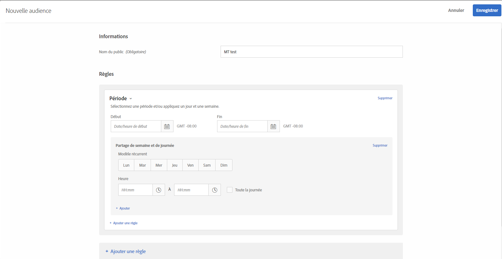

# Période{#time-frame}

Vous pouvez ajouter des dates et heures de début/fin pour cibler les utilisateurs qui visitent votre site pendant une période spécifique. Pour créer des schémas récurrents pour le ciblage des audiences, vous pouvez également définir les options Partage de semaine et de journée.

Par exemple, en utilisant la [fonctionnalité d’audiences ad hoc combinées](/help/c-target/combining-multiple-audiences.md#concept_A7386F1EA4394BD2AB72399C225981E5), vous pouvez cibler les petits consommateurs à l’aide de contenus spécifiques pendant la période précédant Noël et de contenus différents après Noël.

1. Dans l’interface [!DNL Target], cliquez sur **[!UICONTROL Audiences]** > **[!UICONTROL Créer une audience]**.
1. Donnez un nom à l’audience.
1. Cliquez sur **[!UICONTROL Ajouter une règle]** > **[!UICONTROL Période]**.

   

1. Spécifiez les dates et heures de début et de fin pour l’audience.

   Laissez la date de début vide pour lancer le ciblage conformément à la planification de l’activité. Laissez la date de fin vide pour poursuivre le ciblage jusqu’aux date et heure de fin de l’activité.

   Vous pouvez également laisser à la fois les dates de début et de fin vides. Vous pouvez ainsi utiliser la même audience dans plusieurs activités (sans faire de copie de l’audience), en contrôlant les dates de début et de fin au niveau de l’activité.

   >[!NOTE]
   >
   >Le fuseau horaire des dates de début et de fin s’affiche au format GMT +/- NN:NN, où NN:NN correspond à l’écart par rapport au fuseau horaire GMT et se rapporte au fuseau horaire au niveau du compte et non au niveau du visiteur. Par exemple, le fuseau horaire de la Californie s’affiche comme suit : GMT -08:00.

1. (Conditionnel) Cliquez sur **[!UICONTROL Partage de semaine et de journée]** pour définir les schémas récurrents, y compris les jours de la semaine et les heures.

   

   Par exemple, utilisez les options Partage de semaine et de journée pour afficher une option Assistance téléphonique aux visiteurs seulement durant les jours et les heures ouvrables de votre centre d’appel.

   Sélectionnez un ou plusieurs jours de la semaine, puis définissez les heures de début et de fin. Cliquez sur **[!UICONTROL Ajouter]** pour spécifier des schémas supplémentaires, si vous le souhaitez.

   >[!NOTE]
   >
   >Le fuseau horaire pour le [!UICONTROL Partage de semaine et de journée] s’affiche au format GMT +/- NN:NN, où NN:NN correspond à l’écart par rapport au fuseau horaire GMT et se rapporte au fuseau horaire au niveau du compte plutôt qu’à celui du visiteur. Par exemple, le fuseau horaire de la Californie s’affiche comme suit : GMT -08:00.

1. (Facultatif) Cliquez sur **[!UICONTROL Ajouter une règle]**, puis définissez des règles supplémentaires pour l’audience.

   Notez que vous pouvez répéter l’étape 5 pour chaque règle, le cas échéant.

1. Cliquez sur **[!UICONTROL Enregistrer]**.

## Vidéo de formation : Création du badge 

Cette vidéo fournit des informations sur l’utilisation des catégories d’audiences.

* Créer des audiences
* Définir des catégories d’audiences

>[!VIDEO](https://video.tv.adobe.com/v/17392)
