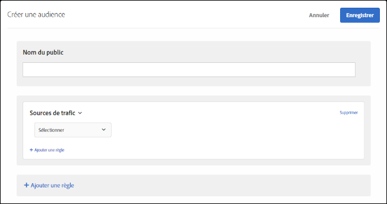

# Sources de trafic{#traffic-sources}

Création d’audiences pour cibler les visiteurs selon le moteur de recherche ou la page d’entrée qui les renvoie au site.

Par exemple, vous pouvez cibler en fonction du navigateur, du moteur de recherche ou de la page d’entrée référente du visiteur. La page d’entrée de référence est la page sur laquelle le visiteur a cliqué pour atteindre le site actif pendant cette session. (Par exemple, si le visiteur clique sur une publicité dans Google et que cela le mène à la page d’accueil de `adobe.com`, la page d’entrée de référence est `google.com`.)

Vous pouvez combiner plusieurs sources de trafic pour créer une règle de ciblage complexe.

1. Dans l’interface [!DNL Target], cliquez sur **[!UICONTROL Audiences]** > **[!UICONTROL Créer une audience]**.
1. Donnez un nom à l’audience.
1. Cliquez sur **[!UICONTROL Ajouter une règle]** > **[!UICONTROL Sources de trafic]**.

   

1. Cliquez sur **[!UICONTROL Sélectionner]**, puis sélectionnez l’une des options suivantes :

   * Depuis Baidu
   * Depuis Bing
   * Google
   * Yahoo
   * Page d’entrée de référence : URL
   * Page d’entrée de référence : Domaine
   * Page d’entrée de référence : Requête

   Selon votre sélection, vous devrez peut-être fournir des informations supplémentaires (évaluateur et/ou valeurs).

1. (Facultatif) Cliquez sur **[!UICONTROL Ajouter une règle]**, puis définissez des règles supplémentaires pour l’audience.
1. Cliquez sur **[!UICONTROL Enregistrer]**.

Vous pouvez cibler des utilisateurs qui sont référencés sur votre site par un moteur de recherche spécifique ou depuis une page d’entrée spécifique.

## Vidéo de formation : Création d’audiences  

Cette vidéo fournit des informations sur l’utilisation des catégories d’audiences.

* Créer des audiences
* Définir des catégories d’audiences

>[!VIDEO](https://video.tv.adobe.com/v/17392)
