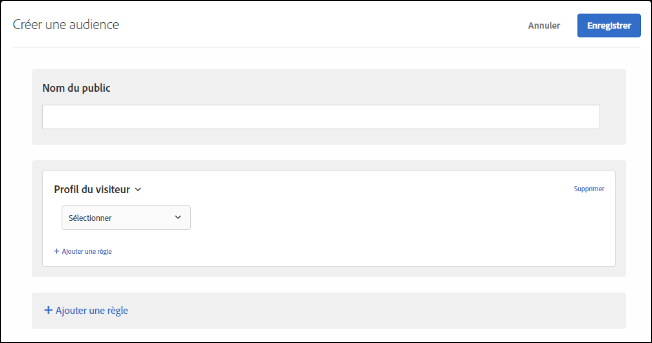

# Profil du visiteur

Création d’audiences pour cibler les visiteurs qui remplissent des paramètres de profil spécifiques.

1. Dans l’interface [!DNL Target], cliquez sur **[!UICONTROL Audiences]** > **[!UICONTROL Créer une audience]**.
1. Donnez un nom à l’audience.
1. Cliquez sur **[!UICONTROL Ajouter une règle]** > **[!UICONTROL Profil du visiteur]**.

   

1. Cliquez sur **[!UICONTROL Sélectionner]**, puis sélectionnez l’une des options suivantes :

   Les paramètres de profil du visiteur sont transmis via la mbox (profil). Vous pouvez cibler les visiteurs nouveaux ou récurrents, ou inclure tous les utilisateurs.

   * Nouveau visiteur
   * Visiteur récurrent
   * Dans d’autres tests
   * Pas dans d’autres tests
   * Première page de la session
   * Pas la première page de la session
   * Affinité catégorielle

   Un profil du visiteur est créé en local dans la mémoire périphérique pour chaque appel mbox comportant de nouvelles données `mboxPC`. Après 30 minutes d’inactivité, le profil est enregistré dans la base de données Target et accessible en périphérie.

   Lorsqu’un visiteur de site se connecte en milieu de session et obtient un `3rdpartyId`, tous les attributs de profil antérieurement chargés liés à l’`3rdPartyId` sont immédiatement disponibles.

   Vous pouvez cibler des paramètres de profil personnalisés et des paramètres `user.`. Sélectionnez le paramètre que vous souhaitez utiliser pour cibler votre activité. Si le paramètre souhaité ne s’affiche pas, il n’a pas été déclenché par une mbox.

1. (Facultatif) Cliquez sur **[!UICONTROL Ajouter une règle]**, puis définissez des règles supplémentaires pour l’audience.
1. Cliquez sur **[!UICONTROL Enregistrer]**.

## Vidéo de formation : Création d’Audiences 

Cette vidéo fournit des informations sur l’utilisation des catégories d’audiences.

* Créer des audiences
* Définir des catégories d’audiences

>[!VIDEO](https://video.tv.adobe.com/v/17392)
