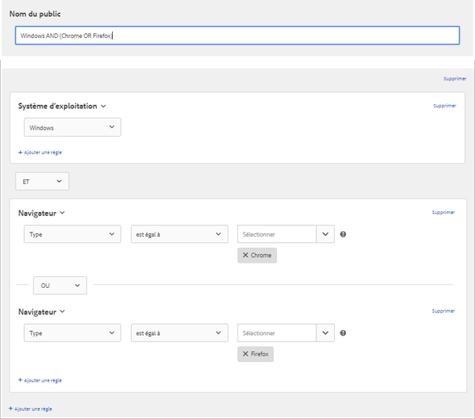

# Création d’audiences dans Target{#build-audiences-in-target}

Vous pouvez créer des audiences personnalisées et les enregistrer dans la bibliothèque Target afin de les utiliser dans les activités. Vous pouvez copier une audience existante, que vous pourrez ensuite modifier pour créer une audience similaire et combiner plusieurs audiences.

## Présentation de l’audience

Les audiences sont définies par des règles qui déterminent qui est inclus ou exclu d’une activité [!DNL Target]. Une définition d’audience peut contenir plusieurs règles. De plus, chaque règle peut inclure plusieurs paramètres. Les définitions d’audience complexes utilisent les opérateurs booléens ET et OU pour associer les règles et les paramètres afin que vous puissiez contrôler avec précision quels visiteurs sont comptabilisés comme participants à l’activité.

Lorsque vous associez des règles ou des paramètres à l’aide de l’opérateur ET, les membres éventuels de l’audience doivent respecter *toutes* les conditions définies pour être inclus comme participants. Par exemple, si vous définissez une règle de système d’exploitation ET une règle de navigateur, seuls les visiteurs qui utilisent le système d’exploitation défini *et* le navigateur défini sont inclus dans l’activité.

Lorsque vous associez des règles ou des paramètres à l’aide de l’opérateur OU, les membres potentiels de l’audience ne doivent respecter qu’une des conditions définies pour être inclus comme participants. Par exemple, si vous définissez plusieurs règles mobiles liées par OU, les visiteurs qui respectent *un* des critères définis sont inclus dans l’activité.

Vous pouvez mélanger les deux opérateurs booléens pour créer des règles complexes. Les opérateurs à un même niveau de règle doivent toutefois correspondre. L’interface utilisateur applique automatiquement l’opérateur correct.

Par exemple, la règle suivante cible les visiteurs qui utilisent Chrome *ou* Firefox sur un ordinateur Windows :

>[!NOTE]
>
>Veillez à ne pas créer de règles qui excluent tous les membres potentiels de l’audience. Par exemple, il n’est pas possible de visiter une page en utilisant simultanément Chrome *et* Firefox.

## Créer une nouvelle audience

1. Cliquez sur **[!UICONTROL Audiences]** dans la barre de menu supérieure.

   

1. Dans la liste [!UICONTROL Audiences], cliquez sur **[!UICONTROL + Créer une audience]**.

   OU

   Pour copier une audience existante, dans la liste [!UICONTROL Audiences], passez le curseur de la souris sur l’audience souhaitée, puis cliquez sur l’icône **[!UICONTROL Copier]**. Vous pouvez ensuite modifier l’audience pour créer une audience similaire.

1. Saisissez un nom d’audience descriptif et unique.
1. Cliquez sur **[!UICONTROL +Ajouter une règle]**.

   Les règles permettent de limiter votre audience à un sous-ensemble des visiteurs de votre site.
1. Sélectionnez un type de règle.

   Chaque type de règle possède ses propres paramètres. Voir [Catégories d’audiences](/help/c-target/c-audiences/c-target-rules/target-rules.md#concept_E3A77E42F1644503A829B5107B20880D) pour plus d’informations sur la configuration de chaque type de règle d’audience.
1. Définissez les paramètres des règles.
1. Cliquez sur **[!UICONTROL Enregistrer]**.

   Les audiences nouvellement créées s’affichent dans la liste après un délai de traitement de quelques secondes. Si l’audience ne s’affiche pas immédiatement dans la liste, recherchez-la ou actualisez la liste.

## Vidéo de formation : Création d’audiences  

Cette vidéo comprend des informations sur la création des audiences.

* Créer des audiences
* Définir des catégories d’audiences

>[!VIDEO](https://video.tv.adobe.com/v/17392)