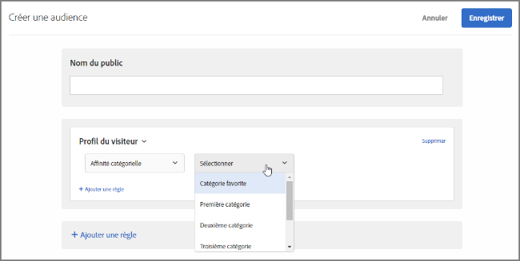

# Affinité catégorielle

La fonction d’affinités catégorielles capture automatiquement les catégories visitées par un utilisateur, puis calcule l’affinité de ce dernier avec les différentes catégories afin de cibler ses goûts et de les segmenter. De cette façon, le contenu cible davantage les visiteurs susceptibles d’être intéressés.

## Transfert d’informations sur les affinités catégorielles dans [!DNL Target] {#section_B0C8E46EEBAC4549AD90352A47787D04}

Chaque fois qu’un utilisateur se rend sur votre site, ses paramètres de profil sont enregistrés dans la base de données de [!DNL Target]. Ces données sont associées au cookie de l’utilisateur. Un paramètre particulièrement utile est `user.categoryId`, un paramètre de mbox affecté à une page de produit. Quand le visiteur continue sa navigation sur le site ou revient pour une nouvelle session, les catégories de produits qu’il consulte peuvent être enregistrées. Vous pouvez également enregistrer les informations de catégorie en les transférant en tant que paramètre mbox `user.categoryId` dans une mbox (y compris une mbox imbriquée), en tant que paramètre URL `user.categoryId` ou dans des paramètres de page Target avec une mbox globale. Pour plus d’informations, consultez votre gestionnaire de compte.

Séparez les catégories par une virgule pour inclure un élément dans plusieurs catégories. Par exemple :

* `user.categoryId=clothing,shoes,nike,running,nike clothing,nike shoes,nike running shoes`

D’après la fréquence et la récence des visites effectuées sur vos catégories de produits, les affinités catégorielles (le cas échéant) d’un utilisateur sont enregistrées. Les affinités catégorielles permettent de cibler des populations pour vos activités.

Vous pouvez utiliser `user.categoryAffinities[]` dans un script de profil afin de renvoyer une matrice des affinités renseignées par un visiteur.

>[!IMPORTANT]
>
>L’attribut `user.categoryId`utilisé pour l’algorithme d’affinité catégorielle d’Adobe Target est différent de l’attribut `entity.categoryId` utilisé pour les recommandations Adobe Target de produit et de contenu. `user.categoryId` est requis pour effectuer le suivi de la catégorie préférée d’un utilisateur. `entity.categoryId` est requis pour baser les recommandations sur la catégorie de l’élément actuel ou de la page en cours. Transmettez les deux valeurs à Adobe Target si vous souhaitez utiliser les deux fonctionnalités.

## Analyse de cas d’une affinité catégorielle {#section_D6FF913E88E6486B8FBCE117CA8B253B}

L’activité d’un visiteur dans une seule session, telle que la catégorie qu’il consulte le plus souvent, peut servir à cibler ses goûts pour ses futures visites. Chaque page de catégorie qu’un visiteur consulte durant une session est capturée et sa catégorie « favorite » est calculée en fonction d’un modèle de récence et de fréquence. Ensuite, chaque fois que le visiteur revient à la page d’accueil, la zone d’image à forte identification peut être ciblée afin que le contenu associé à sa catégorie préférée lui soit présenté.

## Exemple d’utilisation des affinités catégorielles {#section_A4AC0CA550924CB4875F4F4047554C18}

Supposons que vous vendez des instruments de musique en ligne et que vous souhaitez promouvoir les guitares basses auprès des visiteurs s’étant déjà intéressés aux guitares dans le passé. Grâce aux affinités catégorielles, vous pouvez créer des offres qui ne s’afficheront que pour les visiteurs ayant ces affinités.

## Algorithme d’affinité catégorielle {#section_8B86C7FF50294208866ABF16F07D5EB9}

L’algorithme d’affinité catégorielle fonctionne comme suit :

* 10 points pour la première catégorie affichée
* 5 points pour chaque catégorie cliquée après la première vue
* Lorsqu’un utilisateur clique sur une nouvelle catégorie, 1 est soustrait de toutes les catégories ayant précédemment fait l’objet d’un clic
* Si une catégorie a déjà fait l’objet d’un clic (consultée), cliquez de nouveau dessus pour soustraire 1 de toutes les autres catégories
* Si vous cliquez sur une sixième nouvelle catégorie, la catégorie notée la plus basse des cinq premières catégories est retirée du calcul.
* À la fin de la session, divisez toutes les valeurs par 2

### Exemple : algorithme d’affinité catégorielle

Par exemple, si vous affichez la catégorie `mens-clothing`, puis `accessories`, `jewelry` et à nouveau `accessories` dans une session, vous obtenez des affinités de :

* `accessories` : 9 (+5 – 1 + 5)

* `mens-clothing` : 8 (+10 – 1 – 1)

* `jewelry` : 5 (+5)

Lorsque la session se termine et que l’utilisateur revient ensuite sur le site, les scores sont réduits de moitié :

* `accessories` : 4.5 (9/2)

* `mens-clothing` : 4 (8/2)

* `jewelry` : 2,5 (5/2)

En supposant que l’utilisateur consulte, dans l’ordre `jewelry`, `accessories`, `beauty`, `shoes` et `womens-clothing` :

* `accessories` : 6.5 (4.5 + 5 – 1 – 1 - 1)

* `womens-clothing` : 5 (+5)

* `jewelry` : 4.5 (2.5 + 5 – 1 – 1 - 1)

* `shoes` : 4 (+5 – 1)

* `beauty` : 3 (+5 – 1 - 1)

* `mens-clothing` est déposé après le dernier clic sur `womens-clothing` la catégorie de notation le plus faible avec un score de 1 (4 - 1 - 1 - 1)

Lorsque la session se termine et que l’utilisateur revient ensuite sur le site, les scores sont réduits de moitié :

* `accessories` : 3,3 (6,5/2)

* `womens-clothing` : 2,5 (5/2)

* `jewelry` : 2,3 (4,5/2)

* `shoes` : 2 (4/2)

* `beauty` : 1.5 (3/2)

## Utiliser les affinités catégorielles pour le ciblage {#concept_5750C9E6C97A40F8B062A5C16F2B5FFC}

Informations destinées à vous aider à utiliser une audience basée sur les [!UICONTROL affinités catégorielles] pour le ciblage d’une activité.

Cette section traite des sujets suivants :

* [Création d’une audience pour l’utilisation des affinités catégorielles](/help/c-target/c-visitor-profile/category-affinity.md#section_A27C600BBA664FE7A74F8FE076B78F40)
* [Utilisation d’une audience basée sur les affinités catégorielles dans une activité](/help/c-target/c-visitor-profile/category-affinity.md#section_91526B942D1B4AEBB8FCDF4EBFF931CF)

## Créez une audience pour utiliser les affinités catégorielles {#section_A27C600BBA664FE7A74F8FE076B78F40}

1. Dans la liste **[!UICONTROL Audiences]**, cliquez sur **[!UICONTROL + Créer une audience]**.

   OU

   Pour copier une audience existante, dans la liste Audiences, passez le curseur de la souris sur l’audience souhaitée, puis cliquez sur l’icône Copier. Vous pouvez ensuite modifier l’audience pour créer une audience similaire.

1. Saisissez un nom d’audience descriptif.
1. Cliquez sur **[!UICONTROL Ajouter une règle]** > **[!UICONTROL Profil du visiteur]**.
1. Dans la liste déroulante **[!UICONTROL Profil du visiteur]**, sélectionnez **[!UICONTROL Affinité catégorielle]**.

   

1. Sélectionnez la catégorie souhaitée :

   

   Les catégories incluent :

   * Catégorie préférée
   * Première catégorie
   * Deuxième catégorie
   * Troisième catégorie
   * Quatrième catégorie
   * Cinquième catégorie

   Les options &quot;Catégorie préférée&quot; et &quot;Première Catégorie&quot; sont équivalentes.

1. Sélectionnez l’évaluateur :

   * Contient (non-respect de la casse)
   * Ne contient pas (non-respect de la casse)
   * Est égal

1. Spécifiez chaque nouvelle valeur dans une ligne distincte (par exemple, « chaussures »).
1. Cliquez sur **[!UICONTROL Enregistrer]**.

## Utilisez l’audience des affinités catégorielles dans une activité {#section_91526B942D1B4AEBB8FCDF4EBFF931CF}

Vous pouvez utiliser une audience basée sur les affinités catégorielles dans n’importe quelle activité. Dans le workflow guidé en trois étapes, à l’étape Cible, sélectionnez l’audience souhaitée.
