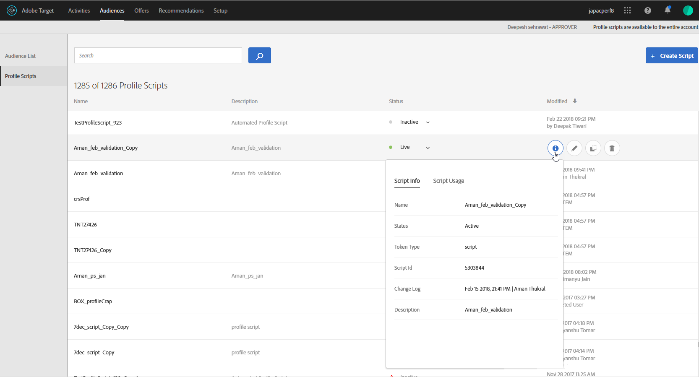
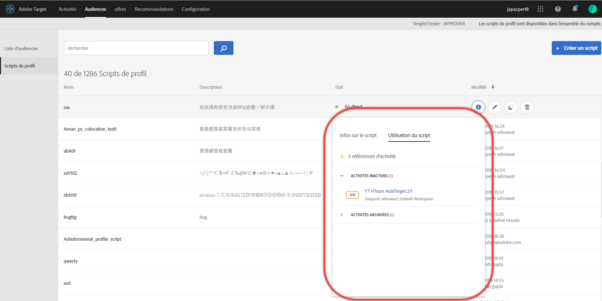
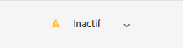
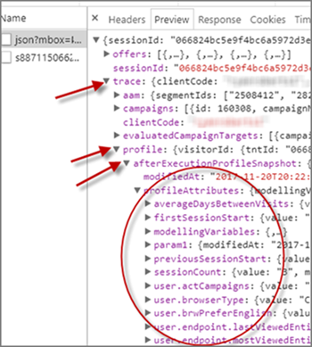

# Attributs de profil

Attributs de profil dans [!DNL Adobe Target] sont des paramètres spécifiques à un visiteur. Ces attributs sont stockés dans le profil du visiteur pour fournir des informations sur le visiteur, qui peuvent être utilisées dans vos activités.

Un profil utilisateur contient des informations démographiques et comportementales sur le visiteur d’une page web. Ces informations peuvent inclure l’âge, le sexe, les produits achetés, la dernière visite, etc., [!DNL Target] utilise pour personnaliser le contenu qu’il diffuse au visiteur.

Lorsqu’un visiteur navigue sur votre site web ou revient pour une autre session, les attributs de profil enregistrés dans le profil peuvent être utilisés pour cibler le contenu ou consigner des informations en vue du filtrage de segments.

Pour configurer les attributs de profil :

1. Cliquez sur **[!UICONTROL Audiences]** > **[!UICONTROL Scripts de profil.]**

   

1. Cliquez sur **[!UICONTROL Créer un script]**.

   

   Les types suivants d’attributs de profil sont disponibles :

   | Type de paramètre | Description |
   |--- |--- |
   | mbox | Transmis directement au moyen du code de page lors de la création de la mbox. [Transfert de paramètres à une mbox globale](/help/c-implementing-target/c-implementing-target-for-client-side-web/t-mbox-download/c-understanding-global-mbox/pass-parameters-to-global-mbox.md).<br>**** Remarque :  est limitée à 50 attributs de profil uniques par appel de mbox. [!DNL Target] Si vous devez transmettre plus de 50 attributs de profil à [!DNL Target], transmettez-les à l’aide de la méthode d’API Mise à jour du profil . Pour plus d’informations, voir [Mise à jour du profil dans [!DNL Adobe Target] Documentation des API](https://developers.adobetarget.com/api/#updating-profiles). |
   | Profil | Défini directement avec un extrait de code JavaScript. Ces fragments de code peuvent stocker des totaux en cours, tels que l’argent total dépensé par le consommateur, et être exécutés pour chaque requête de mbox. Voir Attributs de script de profil ci-dessous. |

## Attributs de script de profil {#concept_8C07AEAB0A144FECA8B4FEB091AED4D2}

Définissez un attribut de script de profil avec son extrait de code JavaScript associé.

Vous pouvez utiliser des scripts de profil pour capturer les attributs des visiteurs au cours de plusieurs visites. Les scripts de profil sont des fragments de code définis dans [!DNL Target] à l’aide d’un formulaire JavaScript côté serveur. Vous pouvez, par exemple, utiliser un script de profil pour capturer la fréquence à laquelle un visiteur visite votre site et la date de sa dernière visite.

Les scripts de profil sont différents des paramètres de profil. Les paramètres de profil capturent des informations sur les visiteurs grâce à l’implémentation du code mbox de [!DNL Target].

## Création de scripts de profil {#section_CB02F8B97CAF407DA84F7591A7504810}

Les scripts de profil sont disponibles sous l’onglet [!UICONTROL Audiences] de l’interface de [!DNL Target].

Pour ajouter un script de profil, cliquez sur le bouton **[!UICONTROL Scripts de profil]** onglet, **[!UICONTROL Créer un script]**, puis écrivez votre script.

Ou

Pour copier un script de profil existant, à partir de la fonction [!UICONTROL Scripts de profil] , cliquez sur l’icône représentant des points de suspension pour le script souhaité, puis cliquez sur **[!UICONTROL Dupliquer]**.

Vous pouvez ensuite modifier l’audience pour créer une audience similaire.

Les scripts de profil exécutent des « catchers » d’attribut de profil pour chaque requête d’emplacement. Lorsqu’une demande d’emplacement est reçue, [!DNL Target] détermine l’activité à exécuter et affiche le contenu approprié à cette activité et à cette expérience. [!DNL Target] effectue également le suivi de la réussite de l’activité et exécute tous les scripts de profil appropriés. Ce processus vous permet d’effectuer le suivi d’informations sur la visite, telles que l’emplacement du visiteur, l’heure de la journée, le nombre de fois où le visiteur a accédé au site, ses achats précédents, etc. Ces informations sont alors ajoutées au profil du visiteur afin que vous puissiez mieux suivre l’activité de ce visiteur sur votre site.

Les attributs de script de profil contiennent les balises `user.` insérées avant le nom de l’attribut. Par exemple :

```
if (mbox.name == 'Track_Interest') { 
    if (profile.get('model') == "A5" &&; profile.get('subcat') == "KS6") { 
        return (user.get('A5KS6') || 0) + 1; 
    } 
}
```

Gardez les informations suivantes à l’esprit :

* Reportez-vous aux attributs de script de profil (y compris lui-même) dans le code avec `user.get('parameterName')`.
* Enregistrez les variables accessibles lors de la prochaine exécution du script (dans la requête de mbox suivante) avec `user.setLocal('variable_name', 'value')`. Référencez la variable avec `user.getLocal('variable_name')`. Ce processus est utile dans les cas où vous souhaitez référencer la date et l’heure de la dernière requête.
* Les paramètres et valeurs sont sensibles à la casse. Respectez la casse des paramètres et valeurs que vous recevez lors de l’activité ou du test.
* Pour plus d’informations sur la syntaxe JavaScript, reportez-vous à la section « Référence JavaScript pour les paramètres de profil de script » ci-dessous.
* Le paramètre reste dans le profil après la désactivation du script. Les utilisateurs dont les profils contiennent déjà un paramètre utilisé dans l’audience d’une activité sont qualifiés dans cette activité.
* Les scripts de profil ne peuvent pas être supprimés lorsqu’ils sont utilisés dans une activité.
* Il n’est pas recommandé de créer des scripts de profil dépendants qui utilisent le résultat d’un script de profil dans un autre script de profil. L’ordre d’exécution du script de profil n’est pas garanti.

## Affichage des cartes d’informations de script de profil {#section_18EA3B919A8E49BBB09AA9215E1E3F17}

Vous pouvez afficher des cartes contextuelles d’informations de script de profil similaires aux cartes d’informations d’offre. Ces cartes d’informations de script de profil vous permettent d’afficher la liste des activités faisant référence au script de profil sélectionné, ainsi que d’autres métadonnées utiles.

Par exemple, la carte d’informations de script de profil suivante est accessible en cliquant sur le bouton [!UICONTROL Infos] pour le script de profil souhaité dans la liste ([!UICONTROL Audiences] > [!UICONTROL Scripts de profil]).

Le [!UICONTROL Infos script] contient les informations suivantes : Nom, Description et code de script.



Cliquez sur **[!UICONTROL Afficher les détails complets]** pour afficher les audiences et les activités qui référencent le script de profil sélectionné.



>[!NOTE]
>
>Le [!UICONTROL Utilisation du script] n’affiche pas les activités qui font référence au script de profil sélectionné dans les cas suivants :
>
> * L’activité se trouve dans la variable [!UICONTROL Version préliminaire] état.
> * Le contenu ou l’offre utilisé dans l’activité utilise des variables de script (une offre insérée au sein de l’activité ou une offre dans la bibliothèque d’offres).


## Désactivation par Target des scripts de profil dans certaines situations {#section_C0FCB702E60D4576AD1174D39FBBE1A7}

[!DNL Target] désactive automatiquement les scripts de profil dans certains cas, par exemple s’ils prennent trop de temps à s’exécuter ou s’ils contiennent trop d’instructions.

Dans ce cas, une icône d’alerte jaune s’affiche en regard du script de profil dans l’interface utilisateur de Target, comme illustré ci-dessous :



Passez la souris sur l’icône pour afficher les détails de l’erreur, comme illustré ci-dessous :


Voici quelques-unes des raisons qui poussent généralement le système à désactiver les scripts de profil :

* Une variable indéfinie est référencée.
* Une valeur incorrecte est référencée. Cette erreur est souvent provoquée par le référencement des valeurs d’URL et d’autres données saisies par l’utilisateur sans validation correcte.
* Trop d’instructions JavaScript sont utilisées. [!DNL Target] est limitée à 2 000 instructions JavaScript par script, mais cette limite ne peut pas être simplement calculée en lisant manuellement le code JavaScript. Par exemple, Rhino traite tous les appels de fonction et les « nouveaux » appels comme 100 instructions. Tout appel à une fonction utilise 100 instructions. Par ailleurs, le nombre d’instructions peut aussi dépendre de la taille des données saisies, telles les valeurs d’URL.
* Le non-respect des [bonnes pratiques](/help/c-target/c-visitor-profile/profile-parameters.md#section_64AFE5D2B0C8408A912FC2A832B3AAE0) répertoriées ci-dessous.

## Bonnes pratiques . {#best}

Les recommandations ci-dessous visent à vous aider à créer des scripts de profil simplifiés avec un minimum d’erreurs en rédigeant un code qui échoue normalement, de sorte qu’ils sont traités sans forcer un arrêt des scripts du système. Ces instructions sont la synthèse de bonnes pratiques dont l’efficacité a été prouvée. Elles doivent être appliquées conjointement avec les principes et recommandations stipulés par la communauté de développement Rhino.

* Définissez la valeur actuelle du script sur une variable locale dans le script utilisateur et définissez un basculement sur une chaîne vide.
* Validez la variable locale en vérifiant qu’il ne s’agit pas d’une chaîne vide.
* Utilisez des fonctions de manipulation basées sur des chaînes plutôt que des expressions régulières.
* Utilisez des boucles for limitées plutôt que des boucles for ou while ouvertes.
* Ne dépassez pas 1 300 caractères ou 50 itérations de boucle.
* Ne dépassez pas 2 000 instructions JavaScript. [!DNL Target] est limitée à 2 000 instructions JavaScript par script, mais cette limite ne peut pas être simplement calculée en lisant manuellement le code JavaScript. Par exemple, Rhino traite tous les appels de fonction et les « nouveaux » appels comme 100 instructions. Par ailleurs, le nombre d’instructions peut aussi dépendre de la taille des données saisies, telles les valeurs d’URL.
* Faites attention non seulement aux performances du script, mais aussi aux performances combinées de tous les scripts. En règle générale, [!DNL Adobe] recommande moins de 5 000 instructions au total. Compter le nombre d’instructions n’est pas évident, mais l’important est que les scripts supérieurs à 2 000 instructions sont automatiquement désactivés. Le nombre de scripts de profil principal ne doit pas dépasser 300. Chaque script est exécuté avec chaque appel de mbox. Exécutez uniquement le nombre de scripts nécessaire.
* Dans une expression regex, avec point-étoile au début (par exemple : `/.*match/`, `/a|.*b/`) n’est presque jamais nécessaire. La recherche regex commence à partir de toutes les positions dans une chaîne (sauf si elle est liée à `^`). Par conséquent, le point-étoile est déjà sous-entendu. L’exécution d’un script peut être interrompue si une expression regex de ce type est mise en correspondance avec des données d’entrée suffisamment longues (qui peuvent ne pas dépasser quelques centaines de caractères).
* En cas d’échec global, encadrez le script dans un try/catch.
* Les recommandations suivantes peuvent vous aider à limiter la complexité des scripts de profil. Les scripts de profil peuvent exécuter un nombre limité d’instructions.

   Bonne pratique :

   * Veillez à ce que les scripts de profil restent petits et aussi simples que possible.
   * Évitez les expressions régulières ou utilisez uniquement des expressions régulières simples. Même des expressions simples peuvent nécessiter de nombreuses instructions d’évaluation.
   * Évitez la récursion.
   * Les scripts de profil doivent être testés en termes de performances avant d’être ajoutés à [!DNL Target]. Tous les scripts de profil s’exécutent sur chaque requête de mbox. Si les scripts de profil ne s’exécutent pas correctement, l’exécution des requêtes de mbox prend plus de temps, ce qui peut avoir un impact sur le trafic et la conversion.
   * Si les scripts de profil deviennent trop complexes, pensez à utiliser [jetons de réponse](/help/administrating-target/response-tokens.md) au lieu de .

* Pour plus d’informations, consultez la documentation du moteur JS Rhino .

## Déboguer les scripts de profil {#section_E9F933DE47EC4B4E9AF2463B181CE2DA}

Les méthodes suivantes permettent de déboguer les scripts de profil :

>[!NOTE]
>
>Utilisation [!DNL console.log] dans un script de profil ne génère pas la valeur de profil, car les scripts de profil s’exécutent côté serveur.

* **Ajoutez des scripts de profil comme jetons de réponse pour déboguer les scripts de profil :**

   Dans [!DNL Target], cliquez sur **[!UICONTROL Administration]**, cliquez sur **[!UICONTROL Jetons de réponse]**, puis activez le script de profil à déboguer.

   Chaque fois que vous chargez une page pour votre site avec [!DNL Target] sur celui-ci, partie de la réponse de [!DNL Target] contient votre valeur pour le script de profil donné, comme illustré ci-dessous :

   

* **Utilisez l’outil de débogage mboxTrace pour déboguer les scripts de profil.**

   Cette méthode nécessite un jeton d’autorisation que vous pouvez générer en cliquant sur **[!UICONTROL Cible]** > **[!UICONTROL Administration]** > **[!UICONTROL Implémentation]** > **[!UICONTROL Générer un jeton d’autorisation]** dans le [!UICONTROL Outils de débogage] .

   Vous ajoutez ensuite ces deux paramètres à l’URL de votre page après le &quot;?&quot; : `mboxTrace=window&authorization=YOURTOKEN`.

   L’ajout de ces paramètres est un peu plus informatif que le jeton de réponse, car vous obtenez un instantané avant exécution et un instantané après exécution de votre profil. Il affiche également tous les profils disponibles.

   

## FAQ sur le script de profil {#section_1389497BB6D84FC38958AE43AAA6E712}

**Est-il possible d’utiliser des scripts de profil pour capturer les informations d’une page dans une couche de données ?**

Les scripts de profil ne parviennent pas à lire directement la page, car ils sont exécutés côté serveur. Les données doivent passer par une requête de mbox ou d’autres [méthodes de transfert de données dans Target](/help/c-implementing-target/c-considerations-before-you-implement-target/c-methods-to-get-data-into-target/methods-to-get-data-into-target.md#concept_0069C0EFB56C4700BB33F2F35C2B9B17). Une fois que les données sont dans [!DNL Target], les scripts de profil peuvent lire les données en tant que paramètre de mbox ou de profil.

## Référence JavaScript pour les paramètres de profil de script

Des connaissances JavaScript simples sont requises pour utiliser efficacement les paramètres de profil de script. Cette section sert de référence rapide pour que vous puissiez exploiter cette fonctionnalité en quelques minutes seulement.

Les paramètres de profil de script se trouvent sous l’onglet mbox/profiles. Vous pouvez écrire des programmes Javascript qui renvoient un type Javascript (chaîne, entier, tableau, etc.).

### Exemples de paramètres de profil de script {#examples}

**Name :** *user.recency*

```
var dayInMillis = 3600 * 24 * 1000;
if (mbox.name == 'orderThankyouPage') {
    user.setLocal('lastPurchaseTime', new Date().getTime());
}
var lastPurchaseTime = user.getLocal('lastPurchaseTime');
if (lastPurchaseTime) {
    return ((new Date()).getTime() - lastPurchaseTime) / dayInMillis;
}
```

Crée une variable pour la mesure du jour en millisecondes. Si le nom de la mbox est `orderThankyouPage`, définissez un attribut de profil utilisateur local (invisible) nommé `lastPurchaseTime` pour afficher la valeur de la date et de l’heure actuelles. La valeur de la dernière heure d’achat est lue et, si elle est définie, [!DNL Target] renvoie le temps qui s’est écoulé depuis le dernier achat, divisé par le nombre de millisecondes par jour (ce qui donne le nombre de jours depuis le dernier achat).

**Name :** *user.frequency*

```
var frequency = user.get('frequency') || 0;
if (mbox.name == 'orderThankyouPage') {
    return frequency + 1;
}
```

Crée une variable appelée `frequency`, l’initialisant à la valeur précédente ou à 0, en l’absence de valeur précédente. Si le nom de la mbox est `orderThankyouPage`, la valeur incrémentée est renvoyée.

**Name :** *user.monetaryValue*

```
var monetaryValue = user.get('monetaryValue') || 0;
if (mbox.name == 'orderThankyouPage') {
    return monetaryValue + parseInt(mbox.param('orderTotal'));
}
```

Crée une variable appelée `monetaryValue`, en recherchant la valeur actuelle d’un visiteur donné (ou la valeur 0 s’il n’y avait aucune valeur précédente). Si le nom de la mbox est `orderThankyouPage`, la nouvelle valeur monétaire est renvoyée en ajoutant la précédente et la valeur du `orderTotal` paramètre transmis à la mbox.

**Nom :** adobeQA

```
if (page.param("adobeQA"))
     return page.param("adobeQA");
else if (page.param("adobeqa"))
     return page.param("adobeqa");
else if (mbox.param("adobeQA"))
     return mbox.param("adobeQA");
```

Crée une variable appelée `adobeQA` pour effectuer le suivi d’un utilisateur pour [AQ d’activité](/help/c-activities/c-activity-qa/activity-qa.md).

### Objets et méthodes {#objects}

Les objets et méthodes suivants peuvent être référencés par des paramètres de profil de script :

| Objet ou méthode | Détails |
| --- | --- |
| `page.url` | URL actuelle |
| `page.protocol` | Protocole utilisé pour la page (http, https). |
| `page.domain` | Domaine d’URL actuel (avant la première barre oblique). Par exemple `www.acme.com`, dans `http://www.acme.com/categories/men_jeans?color=blu e&size=small`. |
| `page.query` | Chaîne de requête de la page active. Tout ce qui suit le « ? ». Par exemple `blue&size=small`, dans `http://www.acme.com/categories/mens_jeans?color=blue&size=small`. |
| `page.param(‘<par_name>’)` | Valeur du paramètre indiqué par `<par_name>`. Si l’URL actuelle correspond à la page de recherche de Google et que vous avez saisie `page.param('hl')`, vous obtenez « en » pour l’URL `http://www.google.com/search?hl=en& q=what+is+asdf&btnG=Google+Search`. |
| `page.referrer` | Le même ensemble d’opérations que ci-dessus s’applique au référent et à l’entrée (c.-à-d. referrer.url est l’adresse URL du référent). |
| `landing.url`, `landing.protocol`, `landing.query`, et `landing.param` | Semblable à celle de la page, mais pour la page d’entrée. |
| `mbox.name` | Nom de la mbox active. |
| `mbox.param(‘<par_name>’)` | Un paramètre de mbox par le nom donné dans la mbox active. |
| `profile.get(‘<par_name>’)` | Paramètre du profil utilisateur créé par le client par nom `<par_name>`. Par exemple, si l’utilisateur définit un paramètre de profil nommé « gender », la valeur peut être extraite à l’aide de « profile.gender ». Renvoie la valeur de « `profile.<par_name>` » défini pour le visiteur actuel ; renvoie la valeur null si aucune valeur n’a été définie. Notez que `profile.get(<par_name>)` est qualifié en tant qu’appel de fonction. |
| `user.get(‘<par_name>’)` | Renvoie la valeur de « `user.<par_name>` » défini pour le visiteur actuel ; renvoie la valeur null si aucune valeur n’a été définie. |
| `user.categoryAffinity` | Renvoie le nom de la meilleure catégorie. |
| `user.categoryAffinities` | Renvoie un tableau avec les catégories les plus appropriées. |
| `user.isFirstSession` | Renvoie vrai s’il s’agit de la première session du visiteur. |
| `user.browser` | Renvoie l’agent utilisateur dans l’en-tête HTTP. À titre d’exemple, vous pouvez créer une cible d’expression pour cibler les utilisateurs Safari uniquement : `if (user.browser != null && user.browser.indexOf('Safari') != -1) { return true; }` |

### Opérateurs courants


Tous les opérateurs JavaScript standard sont présents et utilisables. Les opérateurs JavaScript peuvent être utilisés sur des chaînes et des nombres (ainsi que sur d&#39;autres types de données). Aperçu rapide :

| Opérateur | Description |
| --- | --- |
| `==` | Indique l’égalité. Est définie sur vrai lorsque les opérandes des deux côtés sont égaux. |
| `!=` | Indique l’inégalité. Est définie sur vrai lorsque les opérandes de part et d’autre ne sont pas égaux. |
| `<` | Indique que la variable à gauche est inférieure à la variable à droite. Évalue sur false si les variables sont égales. |
| `>` | Indique que la variable à gauche est supérieure à la variable à droite. Évalue sur false si les variables sont égales. |
| `<=` | Identique à `<` sauf si les variables sont égales, elle est évaluée comme vraie. |
| `>=` | Identique à `>` sauf si les variables sont égales, elle est évaluée comme vraie. |
| `&&` | Applique « ET » de manière logique aux expressions à gauche et à droite de celle-ci - est uniquement vrai lorsque les deux côtés sont vrais (faux dans le cas contraire). |
| `||` | Applique « OU » de manière logique aux expressions à gauche et à droite de celui-ci - est uniquement vrai que si l’un des côtés est vrai (faux dans le cas contraire). |
| `//` | Vérifie si la source contient tous les éléments provenant de la cible booléenne (source Array, cible Array).<br>`//` extrait la sous-chaîne de la target (correspondant à regexp) et la décode `Array/*String*/ decode(String encoding, String regexp, String target)`.<br>Cette fonctionnalité prend également en charge l’utilisation de valeurs de chaîne constantes, de regroupement (`condition1 || condition2) && condition3`et d’expressions régulières)`/[^a-z]$/.test(landing.referring.url)`. |

## Vidéo de formation : Scripts de profil 

Cette vidéo fournit des informations sur l’utilisation et la création des scripts de profil.

* Explication du concept de script de profil
* Explication de la différence entre un script de profil et un paramètre de profil
* Création d’un script de profil simple
* Utilisation du menu Jeton disponible pour accéder aux options disponibles
* Activation et désactivation des scripts de profil

>[!VIDEO](https://video.tv.adobe.com/v/17394)
