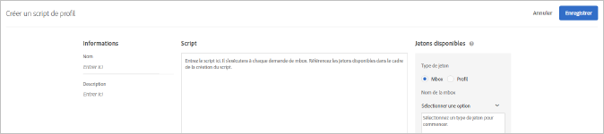

# Attributs de profil{#profile-attributes}

Les attributs de profil sont des paramètres spécifiques au visiteur. Ces attributs sont stockés dans le profil du visiteur pour fournir des informations sur le visiteur, qui peuvent être utilisées dans vos activités.

Lorsqu’un visiteur parcourt votre site oweb u revient pour une nouvelle session, les attributs de profil enregistrés peuvent servir à cibler le contenu ou à consigner des informations pour le filtrage de segments.

Pour configurer les attributs de profil, cliquez sur **[!UICONTROL Audiences]** > **[!UICONTROL Scripts de profil.]**


Les types suivants d’attributs de profil sont disponibles :

| Type de paramètre | Description |
|--- |--- |
| mbox | Transmis directement au moyen du code de page lors de la création de la mbox. [Transfert de paramètres à une mbox globale](/help/c-implementing-target/c-implementing-target-for-client-side-web/t-mbox-download/c-understanding-global-mbox/pass-parameters-to-global-mbox.md).<br>**Remarque **: Target est limitée à 50 attributs de profil uniques par appel de mbox. Si vous devez transmettre plus de 50 attributs de profil à Target, vous pouvez le faire en appliquant la méthode d’API Mise à jour du profil. Pour en savoir plus, voir[Mise à jour du profil dans la documentation des API Adobe Target](http://developers.adobetarget.com/api/#updating-profiles). |
| Script | Défini directement avec un extrait de code JavaScript. Ces paramètres peuvent stocker les totaux en cours, tel le total des dépenses d’un client ; ils sont exécutés pour chaque requête de mbox. Voir Attributs de script de profil ci-dessous. |

## Attributs de script de profil {#concept_8C07AEAB0A144FECA8B4FEB091AED4D2}

Définissez un attribut de script de profil avec son extrait de code JavaScript associé.

Vous pouvez utiliser des scripts de profil pour capturer les attributs des visiteurs au cours de plusieurs visites. Les scripts de profil sont des extraits de code définis dans Target à l’aide d’une forme de code JavaScript côté serveur. Par exemple, vous pouvez utiliser un script de profil pour capturer la fréquence à laquelle un visiteur visite votre site, et la date de sa dernière visite.

Les scripts de profil sont différents des paramètres de profil. Les paramètres de profil capturent des informations sur les visiteurs grâce à l’implémentation du code mbox de Target.

>[!NOTE]
>
>[!DNL Target] est limitée à 1 000 scripts de profil par compte.

## Création de scripts de profil {#section_CB02F8B97CAF407DA84F7591A7504810}

Les scripts de profil sont disponibles sous l’onglet [!UICONTROL Audiences] de l’interface de [!DNL Target].

Pour ajouter un nouveau script de profil, cliquez sur l’onglet **[!UICONTROL Scripts de profil]**, **[!UICONTROL Créer un script]**, puis écrivez votre script.

OU

Pour copier un script de profil existant depuis la liste [!UICONTROL Scripts de profil], passez le curseur de la souris sur le script souhaité, puis cliquez sur l’icône **[!UICONTROL Copier]** : (assets/icon_copy.png)

Vous pouvez ensuite modifier l’audience pour créer une audience similaire.



Les scripts de profil exécutent des « catchers » d’attribut de profil pour chaque requête d’emplacement. Lors de la réception d’une requête d’emplacement, Target détermine l’activité qui doit être exécutée et qui doit afficher un contenu approprié pour cette activité et cette expérience, effectue le suivi du succès de l’activité et exécute les scripts de profil pertinents. Cela permet de suivre les informations relatives à la visite, comme le lieu, l’heure et le nombre de fois où un visiteur a accédé à votre site, ses achats précédents, etc. Ces informations sont alors ajoutées au profil du visiteur afin que vous puissiez mieux suivre l’activité de ce visiteur sur votre site.

Les attributs de script de profil contiennent les balises `user.` insérées avant le nom de l’attribut. Par exemple :

```
if (mbox.name == 'Track_Interest') { 
    if (profile.get('model') == "A5" &&; profile.get('subcat') == "KS6") { 
        return (user.get('A5KS6') || 0) + 1; 
    } 
}
```

* Reportez-vous aux attributs de script de profil (y compris lui-même) dans le code avec `user.get('parameterName')`.
* Enregistrez les variables susceptibles d’être sélectionnées lors de la prochaine exécution du script (dans la requête de mbox suivante) avec `user.setLocal('variable_name', 'value')`. Référencez la variable avec `user.getLocal('variable_name')`. Ceci s’avère utile lorsque vous souhaitez référencer la date et l’heure de la dernière requête.
* Les paramètres et valeurs sont sensibles à la casse. Respectez la casse des paramètres et valeurs que vous recevez durant l’activité ou le test.
* Pour plus d’informations sur la syntaxe JavaScript, reportez-vous à la section « Référence JavaScript pour les paramètres de profil de script » ci-dessous.

## Affichage des cartes d’informations de script de profil {#section_18EA3B919A8E49BBB09AA9215E1E3F17}

Vous pouvez afficher des cartes contextuelles d’informations de script de profil similaires aux cartes d’informations d’offre. Ces cartes d’informations de script de profil vous permettent d’afficher la liste des activités faisant référence au script de profil sélectionné, ainsi que d’autres métadonnées utiles.

Par exemple, la carte d’informations de script de profil suivante est accessible en faisant glisser le curseur sur un script de profil dans la liste des scripts de profil (Audiences > Scripts de profil), puis en cliquant sur l’icône Infos.

L’onglet [!UICONTROL Infos de script] contient les informations suivantes : Nom, État, Type de jeton, ID de script, Journal des modifications et Description.


L’onglet [!UICONTROL Utilisation du script] répertorie les activités (et leurs espaces de travail) qui référencent le script de profil sélectionné.


>[!Note]
>
>L’onglet Utilisation du script n’affiche pas les activités qui font référence au script de profil sélectionné dans les situations suivantes :
> * L’activité est à l’état de version préliminaire.
> * Le contenu ou l’offre utilisé dans l’activité utilise des variables de script (une offre insérée au sein de l’activité ou une offre dans la bibliothèque d’offres).


## Désactivation par Target des scripts de profil dans certaines situations {#section_C0FCB702E60D4576AD1174D39FBBE1A7}

Il arrive que [!DNL Target] désactive automatiquement les scripts de profil ; par exemple si leur exécution est trop longue ou s’ils contiennent trop d’instructions.

Dans ce cas, une icône d’alerte jaune s’affiche en regard du script de profil dans l’interface utilisateur de Target, comme illustré ci-dessous :


Passez la souris sur l’icône pour afficher les détails de l’erreur, comme illustré ci-dessous :


Voici quelques-unes des raisons qui poussent généralement le système à désactiver les scripts de profil :

* Une variable indéfinie est référencée.
* Une valeur incorrecte est référencée. Cela survient généralement lors du référencement de valeurs d’URL et d’autres données saisies par l’utilisateur sans validation correcte.
* Trop d’instructions JavaScript sont utilisées. Target est limité à 2 000 instructions JavaScript par script ; toutefois, une simple lecture manuelle du script JavaScript ne permet pas de les calculer. Par exemple, Rhino traite tous les appels de fonction et les « nouveaux » appels comme 100 instructions. Cela signifie que tout appel à une fonction consomme 100 instructions. Par ailleurs, le nombre d’instructions peut aussi dépendre de la taille des données saisies, telles les valeurs d’URL.
* Le non-respect des [bonnes pratiques](../../c-target/c-visitor-profile/profile-parameters.md#section_64AFE5D2B0C8408A912FC2A832B3AAE0) répertoriées ci-dessous.

## Bonnes pratiques {#best}.

Les recommandations ci-dessous visent à vous aider à créer des scripts de profil simplifiés avec un minimum d’erreurs en rédigeant un code qui échoue normalement, de sorte qu’ils sont traités sans forcer un arrêt des scripts du système. Ces instructions sont la synthèse de bonnes pratiques dont l’efficacité a été prouvée. Elles doivent être appliquées conjointement avec les principes et recommandations stipulés par la communauté de développement Rhino.

* Dans le script utilisateur, définissez comme variable locale la valeur actuelle du script. Définissez un basculement sur une chaîne vide.
* Validez la variable locale en vérifiant qu’il ne s’agit pas d’une chaîne vide.
* Utilisez les fonctions de manipulation de type chaîne plutôt que des expressions régulières.
* Utilisez des boucles for limitées plutôt que des boucles for ou while ouvertes.
* Ne dépassez pas 1 300 caractères ou 50 itérations de boucle.
* Ne dépassez pas 2 000 instructions JavaScript. Target est limité à 2 000 instructions JavaScript par script ; toutefois, une simple lecture manuelle du script JavaScript ne permet pas de les calculer. Par exemple, Rhino traite tous les appels de fonction et les « nouveaux » appels comme 100 instructions. Par ailleurs, le nombre d’instructions peut aussi dépendre de la taille des données saisies, telles les valeurs d’URL.
* Faites attention non seulement aux performances du script, mais aussi aux performances combinées de tous les scripts. La bonne pratique consiste à utiliser moins de 5 000 instructions au total. Compter le nombre d’instructions n’est pas évident, mais ce qu’il faut retenir est que les scripts supérieurs à 2 Ko sont automatiquement désactivés. Il n’existe aucune limite définie pour le nombre de scripts que vous pouvez exécuter, mais chaque script est exécuté avec chaque appel mbox. Exécutez uniquement le nombre de scripts nécessaire.
* Dans une expression regex, un point-étoile n’est preque jamais nécessaire au début (par exemple : `/.*match/`, `/a|.*b/`). La recherche regex commence à partir de toutes les positions dans une chaîne (sauf si elle est liée à `^`). Par conséquent, le point-étoile est déjà sous-entendu. L’exécution d’un script peut être interrompue si une expression regex de ce type est mise en correspondance avec des données d’entrée suffisamment longues (qui peuvent ne pas dépasser quelques centaines de caractères).
* En cas d’échec global, encadrez le script dans un try/catch.
* See the JS Rhino engine documentation for more information: [https://www.mozilla.org/rhino/doc.html](https://www.mozilla.org/rhino/doc.html).

## Scripts de profil pour le test des activités s’excluant mutuellement {#section_FEFE50ACA6694DE7BF1893F2EFA96C01}

Les attributs de profil permettent de configurer des tests qui comparent au moins deux activités entre elles, mais ne laissent pas les mêmes visiteurs participer à chaque activité.

Grâce à ces tests, un visiteur d’une activité n’aura aucune influence sur les résultats des tests des autres activités. Lorsqu’un visiteur participe à plusieurs activités, il peut s’avérer difficile de déterminer si des effets positifs ou négatifs sont ressortis de l’expérience du visiteur sur une seule activité, ou si des interactions entre plusieurs activités ont affecté les résultats d’une ou de plusieurs activités.

Imaginons que vous souhaitiez tester deux branches de votre système d’e-commerce. Vous pouvez essayer de remplacer la couleur bleu du bouton Ajouter au panier par la couleur rouge et voir ce que cela donne. Vous pouvez aussi tester un nouveau processus de passage en caisse dans lequel le nombre des étapes passe de cinq à deux. Si deux activités ont le même événement de succès (un achat), il peut être difficile de savoir si le bouton rouge améliore les conversions ou si ces mêmes conversions ont également augmenté en raison de l’amélioration du processus de passage en caisse. En séparant les tests en activités s’excluant mutuellement, vous pouvez tester chaque modification une par une.

Tenez compte des informations suivantes lorsque vous utilisez les scripts de profil suivants :

* Le script de profil doit être exécuté avant le lancement de l’activité et le script doit rester inchangé pendant toute la durée de celle-ci.
* Cette technique permet de réduire la quantité de trafic contenue dans l’activité, ce qui peut nécessiter une exécution prolongée de celle-ci. Vous devez prendre ce facteur en compte lors de l’estimation de la durée de l’activité.

### Configuration de deux activités

Pour répartir les visiteurs dans des groupes qui voient chacun une activité différente, vous devez créer un attribut de profil. Un attribut de profil peut placer un visiteur dans un ou plusieurs groupes. Pour définir un attribut de profil appelé « twogroups », créez le script suivant :

```
if (!user.get('twogroups')) { 
    var ran_number = Math.floor(Math.random() * 99); 
    if (ran_number <= 49) { 
        return 'GroupA'; 
    } else { 
        return 'GroupB'; 
    } 
}
```

`if (!user.get('twogroups'))` détermine si l’attribut de profil *twogroups* est défini pour le visiteur actif. Si ce n’est pas le cas, aucune autre action n’est nécessaire.

`var ran_number=Math.floor(Math.random() *99)` déclare une nouvelle variable appelée ran_number, définit sa valeur sur une valeur décimale aléatoire comprise entre 0 et 1, puis la multiplie par 99 et l’arrondit à l’unité inférieure pour créer une plage comprise entre 0 et 99, ce qui s’avère utile pour spécifier un pourcentage de visiteurs qui visualisent l’activité.

`if (ran_number <= 49)` commence une routine qui détermine le groupe auquel le visiteur appartient. Si le nombre renvoyé est compris entre 0 et 49, le visiteur est affecté au GroupeA. Si le nombre renvoyé est compris entre 50 et 99, le visiteur est affecté au GroupeB. Le groupe détermine l’activité que voit le visiteur.

Après avoir créé l’attribut de profil, configurez la première activité pour cibler la population souhaitée, en imposant que le paramètre de profil utilisateur user.twogroups corresponde à la valeur spécifiée pour le GroupeA.

>[!NOTE]
>
>Sélectionnez une mbox plus haut sur la page. Ce code détermine si un visiteur expérimente la campagne. Tant que le navigateur rencontre d’abord une mbox, celle-ci peut être utilisée pour définir cette valeur.

Configurez la seconde campagne pour que le paramètre de profil utilisateur `user.twogroups` corresponde à la valeur spécifiée pour le GroupeB.

### Configuration de trois activités ou davantage

La configuration de trois activités ou plus s’excluant mutuellement est similaire à la configuration de deux campagnes, à condition de modifier l’attribut de profil JavaScript afin de créer un groupe distinct pour chaque activité et de déterminer qui voit chacune d’elles. La génération des nombres aléatoire est différente selon que vous créez un nombre de groupes pair ou impair.

Par exemple, pour créer quatre groupes, utilisez le code JavaScript suivant :

```
if (!user.get('fourgroups')) { 
    var ran_number = Math.floor​(Math.random() * 99); 
    if (ran_number <= 24) { 
        return 'GroupA'; 
    } else if (ran_number <= 49) { 
        return 'GroupB'; 
    } else if (ran_number <= 74) { 
        return 'GroupC'; 
    } else { 
        return 'GroupD'; 
    } 
}
```

Dans cet exemple, la formule mathématique utilisée pour générer le nombre aléatoire affectant un visiteur à un groupe est la même que celle utilisée avec deux groupes seulement. Une valeur décimale aléatoire est générée, puis arrondie pour créer un entier.

Si vous créez un nombre de groupes impair ou un nombre qui n’est pas divisible par 100, n’arrondissez pas le nombre décimal à un entier. Si vous décidez de ne pas arrondir les nombres décimaux, vous pouvez spécifier des plages de nombres qui ne sont pas des entiers. Pour cela, il vous suffit de modifier la ligne suivante :

`var ran_number=Math.floor(Math.random()*99);`

à :

`var ran_number=Math.random()*99;`

Par exemple, pour répartir les visiteurs dans trois groupes égaux, utilisez le code suivant :

```
if (!user.get('threegroups')) { 
    var ran_number = Math.random() * 99; 
    if (ran_number <= 32.33) { 
        return 'GroupA'; 
    } else if (ran_number <= 65.66) { 
        return 'GroupB'; 
    } else { 
        return 'GroupC'; 
    } 
}
```

## Déboguer les scripts de profil {#section_E9F933DE47EC4B4E9AF2463B181CE2DA}

Les méthodes suivantes permettent de déboguer les scripts de profil :

>[!NOTE]
>
>Utiliser [!DNL console.log] dans un script de profil ne permet pas de produire la valeur du profil, car les scripts de profil s’exécutent côté serveur.

* **Ajouter des scripts de profil comme jetons de réponse aux scripts de profil de débogage :**

   Dans Target, cliquez sur **[!UICONTROL Configuration]**, puis sur **[!UICONTROL Jetons de réponse]** et activez le script de profil à déboguer.

   Chaque fois que vous chargez une page comportant Target pour votre site, une partie de la réponse de Target contient votre valeur pour le script de profil donné, comme indiqué ci-dessous :

   

* **Utiliser l’outil de débogage mboxTrace pour déboguer les scripts de profil.**

   Cette méthode nécessite un jeton d’autorisation que vous pouvez générer en cliquant sur **[!UICONTROL Target]** > **[!UICONTROL Configuration]** > **[!UICONTROL Implémentation]** > **[!UICONTROL Générer un jeton d’autorisation]**.

   Vous ajoutez ensuite ces deux paramètres à l’URL de votre page après le « ? ».`mboxTrace=window&authorization=YOURTOKEN`

   Ces données fournissent un peu plus d’informations que le jeton de réponse car vous obtenez un instantané avant exécution et un instantané après exécution de votre profil. Elles affichent également tous vos profils disponibles.

   

## FAQ sur le script de profil {#section_1389497BB6D84FC38958AE43AAA6E712}

**Est-il possible d’utiliser des scripts de profil pour capturer les informations d’une page dans une couche de données ?**

Les scripts de profil ne parviennent pas à lire directement la page, car ils sont exécutés côté serveur. Les données doivent passer par une requête de mbox ou d’autres [méthodes de transfert de données dans Target](../../c-implementing-target/c-considerations-before-you-implement-target/c-methods-to-get-data-into-target/methods-to-get-data-into-target.md#concept_0069C0EFB56C4700BB33F2F35C2B9B17). Une fois que les données se trouvent dans Target, les scripts de profil peuvent les lire, sous la forme de paramètre de mbox ou de profil.

## Référence JavaScript pour les paramètres de profil de script

Des connaissances Javascript simples sont requises pour utiliser efficacement les paramètres de profil de script. Cette section sert de référence rapide pour que vous puissiez exploiter cette fonctionnalité en quelques minutes seulement.

Les paramètres de profil de script se trouvent sous l’onglet mbox/profiles. Vous pouvez écrire des programmes Javascript qui renvoient un type Javascript (chaîne, entier, tableau, etc.).

### Exemples de paramètres de profil de script {#examples}

**Name :** *user.recency*

```
var dayInMillis = 3600 * 24 * 1000;
if (mbox.name == 'orderThankyouPage') {
    user.setLocal('lastPurchaseTime', new Date().getTime());
}
var lastPurchaseTime = user.getLocal('lastPurchaseTime');
if (lastPurchaseTime) {
    return ((new Date()).getTime() - lastPurchaseTime) / dayInMillis;
}
```

Crée une variable pour la mesure du jour en millisecondes. Si le nom de la mbox est `orderThankyouPage`, définissez un attribut de profil utilisateur local (invisible) nommé `lastPurchaseTime` pour prendre la valeur de la date et de l’heure actuelles. La valeur de la dernière heure d’achat est lue et, si elle est définie, elle renvoie le temps écoulé depuis le dernier achat, divisé par le nombre de millisecondes par jour (ce qui donne le nombre de jours depuis le dernier achat).

**Name :** *user.frequency*

```
var frequency = user.get('frequency') || 0;
if (mbox.name == 'orderThankyouPage') {
    return frequency + 1;
}
```

Creates a variable called `frequency`, initializing it to either the previous value or 0, if there was no previous value. Si le nom de la mbox est `orderThankyouPage`, la valeur incrémentée est renvoyée.

**Name :** *user.monetaryValue*

```
var monetaryValue = user.get('monetaryValue') || 0;
if (mbox.name == 'orderThankyouPage') {
    return monetaryValue + parseInt(mbox.param('orderTotal'));
}
```

Crée une variable appelée `monetaryValue`, en recherchant la valeur actuelle d’un visiteur donné (ou la valeur 0 s’il n’y avait aucune valeur précédente). Si le nom de la mbox est `orderThankyouPage`, la nouvelle valeur monétaire est renvoyée en ajoutant la précédente et la valeur du `orderTotal` paramètre transmis à la mbox.

**** Nom : adobeQA

```
if (page.param("adobeQA"))
     return page.param("adobeQA");
else if (page.param("adobeqa"))
     return page.param("adobeqa");
else if (mbox.param("adobeQA"))
     return mbox.param("adobeQA");
```

Crée une variable appelée `adobeQA` pour effectuer le suivi d’un utilisateur pour le contrôle qualité [des](/help/c-activities/c-activity-qa/activity-qa.md)activités.


### Objets et méthodes

Les propriétés et méthodes suivantes peuvent être référencées par des paramètres de profil de script :

| Objet ou méthode | Détails |
| --- | --- |
| `page.url` | URL actuelle |
| `page.protocol` | Protocole utilisé pour la page (http, https). |
| page.domain | Domaine d’URL actuel (avant la première barre oblique). Par exemple `www.acme.com`, dans `http://www.acme.com/categories/men_jeans?color=blu e&size=small`. |
| `page.query` | Chaîne de requête de la page active. Tout ce qui suit le « ? ». Par exemple `blue&size=small`, dans `http://www.acme.com/categories/mens_jeans?color=blue&size=small`. |
| `page.param(‘<par_name>’)` | Valeur du paramètre indiqué par `<par_name>`. Si l’URL actuelle correspond à la page de recherche de Google et que vous avez saisie `page.param('hl')`, vous obtenez « en » pour l’URL `http://www.google.com/search?hl=en& q=what+is+asdf&btnG=Google+Search`. |
| `page.referrer` | Le même ensemble d’opérations que ci-dessus s’appliquent à l’URL référent et à l’URL de la page d’entrée (c.-à-d. referrer.url est l’adresse URL du référent). |
| `landing.url`, `landing.protocol`, `landing.query`, et `landing.param` | Semblable à celle de la page, mais pour la page d’entrée. |
| `mbox.name` | Nom de la mbox active. |
| `mbox.param(‘<par_name>’)` | Un paramètre de mbox par le nom donné dans la mbox active. |
| `profile.get(‘<par_name>’)` | Paramètre du profil utilisateur créé par le client par nom `<par_name>`. Par exemple, si l’utilisateur définit un paramètre de profil nommé « gender », la valeur peut être extraite à l’aide de « profile.gender ». Renvoie la valeur de « `profile.<par_name>` » défini pour le visiteur actuel ; renvoie la valeur null si aucune valeur n’a été définie. Notez que `profile.get(<par_name>)` est qualifié comme un appel de fonction. |
| `user.get(‘<par_name>’)` | Renvoie la valeur de « `user.<par_name>` » défini pour le visiteur actuel ; renvoie la valeur null si aucune valeur n’a été définie. |
| `user.categoryAffinity` | Renvoie le nom de la meilleure catégorie. |
| `user.categoryAffinities` | Renvoie un tableau avec les catégories les plus appropriées. |
| `user.isFirstSession` | Renvoie vrai s’il s’agit de la première session du visiteur. |
| `user.browser` | Renvoie l’agent utilisateur dans l’en-tête HTTP. À titre d’exemple, vous pouvez créer une cible d’expression pour cibler les utilisateurs Safari uniquement : `if (user.browser != null && user.browser.indexOf('Safari') != -1) { return true; }` |

### Opérateurs courants


Tous les opérateurs JavaScript standard sont présents et utilisables. Les opérateurs JavaScript peuvent être utilisés sur des chaînes et des nombres (ainsi que d’autres types de données). Aperçu rapide :

| Opérateur | Description |
| --- | --- |
| `==` | Indique l’égalité. Est définie sur vrai lorsque les opérandes des deux côtés sont égaux. |
| `!=` | Indique l’inégalité. Est définie sur vrai lorsque les opérandes de part et d’autre ne sont pas égaux. |
| `<` | Indique que la variable à gauche est inférieure à la variable à droite. Est évalué sur false si les variables sont égales. |
| `>` | Indique que la variable à gauche est supérieure à la variable à droite. Est évalué sur false si les variables sont égales. |
| `<=` | Même que `<` sauf si les variables sont égales, elles seront évaluées sur vraies. |
| `>=` | Même que `>` sauf si les variables sont égales, elles seront évaluées sur vraies. |
| `&&` | Applique « ET » de manière logique aux expressions à gauche et à droite de celle-ci - est uniquement vrai lorsque les deux côtés sont vrais (faux dans le cas contraire). |
| `||` | Applique « OU » de manière logique aux expressions à gauche et à droite de celui-ci - est uniquement vrai que si l’un des côtés est vrai (faux dans le cas contraire). |
| `//` | Vérifie si la source contient tous les éléments provenant de la cible booléenne (source Array, cible Array).<br>`//` extrait la sous-chaîne de la target (correspondant à regexp) et la décode `Array/*String*/ decode(String encoding, String regexp, String target)`.<br>Cette fonctionnalité prend également en charge l’utilisation de valeurs de chaîne constantes, de regroupement (`condition1 || condition2) && condition3`et d’expressions régulières)`/[^a-z]$/.test(landing.referring.url)`. |

## Vidéo de formation : Badge 

Cette vidéo fournit des informations sur l’utilisation et la création des scripts de profil.

* Explication du concept de script de profil
* Explication de la différence entre un script de profil et un paramètre de profil
* Création d’un script de profil simple
* Utilisation du menu Jeton disponible pour accéder aux options disponibles
* Activation et désactivation des scripts de profil

>[!VIDEO](https://video.tv.adobe.com/v/17394)