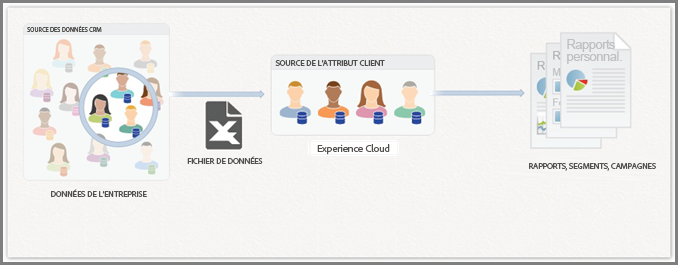
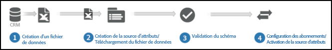
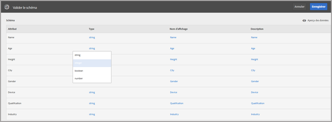
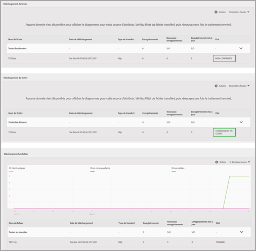
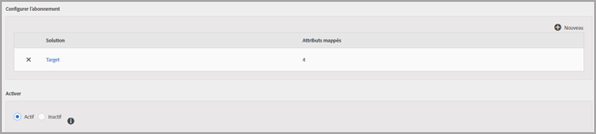

# Attributs du client {#customer-attributes}

Information about using enterprise customer data from a customer relationship management (CRM) databases for content targeting in [!DNL Adobe Target] by using customer attributes in the [!DNL Adobe Enterprise Cloud] core service.

Les données sur les clients d’Enterprise collectées à partir de plusieurs sources et stockées dans une base de données CRM (gestion de la relation client) peuvent être utilisées dans [!DNL Target] pour fournir stratégiquement le contenu le plus pertinent aux clients, en se concentrant spécifiquement sur les clients récurrents. Le service principal [!DNL Audiences] (anciennement Profils et Audiences) regroupe la collecte et l’analyse des données avec les tests et l’optimisation, ce qui rend les données et les observations exploitables.

## Customer attributes overview {#section_B4099971FA4B48598294C56EAE86B45A}

The Audiences core service is part of the [!DNL Adobe Experience Cloud] and provides enterprises a tool to push their customer data to the [!DNL Experience Cloud] platform. Les données intégrées à [!DNL Experience Cloud] sont accessibles par tous les workflows [!DNL Experience Cloud]. [!DNL Target] uses this data for targeting returning customer based on attributes. [!DNL Adobe Analytics] utilise ces attributs. Ils peuvent être utilisés pour l’analyse et la segmentation.



Tenez compte des informations suivantes lorsque vous utilisez des attributs du client et [!DNL Target]:

* There are some prerequisite requirements that you must meet before you can use the [!UICONTROL Customer attributes] feature in the [!DNL Audiences] core service. For more information, see "Prerequisites for uploading Customer Attributes" in [Customer attributes](https://docs.adobe.com/content/help/en/core-services/interface/customer-attributes/attributes.html) in the *Experience Cloud Product documentation*.

   >[!NOTE]
   >
   >[!DNL at.js] (any version) or [!DNL mbox.js] version 58 or later is required.

* Adobe does not guarantee that 100% of customer attribute (visitor profile) data from CRM databases will be onboarded to the [!DNL Experience Cloud] and, thus, be available for use for targeting in [!DNL Target]. Dans notre conception actuelle, il est possible qu’un petit pourcentage de données ne soit pas intégré.
* The lifetime of customer attributes data imported from the [!DNL Experience Cloud] to [!DNL Target] depends on the lifetime of the visitor profile, which is 14 days by default. Pour plus d’informations, voir [Durée de vie du profil du visiteur](../../c-target/c-visitor-profile/visitor-profile-lifetime.md#concept_D9F21B416F1F49159F03036BA2DD54FD).
* If the `vst.*` parameters are the only thing identifying the visitor, the existing "authenticated" profile will not be fetched as long as `authState` is UNAUTHENTICATED (0). Le profil est uniquement récupéré si `authState` passe à UNAUTHENTICATED (1).

   For example, if the `vst.myDataSource.id` parameter is used to identify the visitor (where `myDataSource` is the data source alias) and there is no MCID or third-party ID, using the parameter `vst.myDataSource.authState=0` won't fetch the profile that might have been created through a Customer Attributes import. Si le comportement souhaité consiste à récupérer le profil authentifié, le paramètre `vst.myDataSource.authState` doit avoir la valeur 1 (AUTHENTICATED).

* Vous ne pouvez pas envoyer les caractères suivants dans `mbox3rdPartyID` : signe plus (+) et barre oblique (/).

## Customer attribute workflow for Target {#section_00DAE94DA9BA41398B6FD170BC7D38A3}

Exécutez les étapes illustrées ci-dessous pour utiliser les données CRM dans [!DNL Target] :



Detailed instructions for completing each of the following tasks can be found in [Create a customer attribute source and upload the data file](https://docs.adobe.com/content/help/en/core-services/interface/customer-attributes/t-crs-usecase.html) in the *Experience Cloud Product Documentation*.

1. Création d’un fichier de données.

   Exportez les données client du format CRM au format CSV pour créer un fichier .csv. Vous pouvez également créer un fichier zip ou gzip pour le transfert. Assurez-vous que la première ligne du fichier CSV correspond à l’en-tête et que toutes les lignes (données client) comportent le même nombre d’entrées.

   

   

1. Créez une source d’attributs et transférez le fichier de données.

   Spécifiez un nom et une description de la source de données ainsi que l’ID d’alias. L’ID d’alias est un identifiant unique à utiliser dans le code d’attribut du client dans `VisitorAPI.js`.

   >[!IMPORTANT]
   >
   >Les noms de la source de données et des attributs ne peuvent pas contenir de point.

   Les fichiers de données jusqu’à 100 Mo peuvent être transférés à l’aide de la méthode HTTP. Les fichiers de plus de 100 Mo, jusqu’à 4 Go, peuvent être téléchargés via FTP.

   * **** HTTPS : Vous pouvez faire glisser le fichier de données .csv ou cliquer sur **[!UICONTROL Parcourir]** pour le télécharger à partir de votre système de fichiers.
   * **** FTP : Cliquez sur le lien FTP pour [télécharger le fichier via FTP](https://docs.adobe.com/content/help/en/core-services/interface/customer-attributes/t-upload-attributes-ftp.html). La première étape consiste à fournir un mot de passe pour le serveur FTP fourni par Adobe. Specify the password, then click **[!UICONTROL Done]**.

      Transférez maintenant le fichier CSV/ZIP/GZIP vers le serveur FTP. After this file transfer is successful, create a new file with same name and .fin extension. Transférez ce fichier vide vers le serveur. This indicates a End Of Transfer and the [!DNL Experience Cloud] starts to process the data file.

1. Validez le schéma.

   Le processus de validation permet de mapper les noms d’affichage et les descriptions aux attributs transférés (chaînes, nombres entiers, numéros, etc.). Mappez chaque attribut à son type de données, à son nom d’affichage et à sa description appropriés.

   Click **[!UICONTROL Save]** after the schema validation is complete. La durée de transfert du fichier varie en fonction de sa taille.

   

   

1. Configurez les abonnements et activez la source d’attributs.

   Cliquez sur **[!UICONTROL Ajouter un abonnement]**, puis sélectionnez la solution pour abonner ces attributs. [Configure subscriptions](https://docs.adobe.com/content/help/en/core-services/interface/customer-attributes/subscription.html) sets up the data flow between the [!DNL Experience Cloud] and solutions. Activez la source d’attributs pour que les données circulent vers les solutions abonnées. Les enregistrements de client que vous avez transférés sont mis en correspondance avec les signaux d’identifiants entrants issus de votre site web ou de votre application.

   

   

   Lors de l’exécution de cette étape, notez les limitations suivantes :

   * La taille maximale du fichier pour chaque transfert à l’aide de la méthode HTTP est de 100 Mo.
   * La taille maximale du fichier pour chaque transfert à l’aide de la méthode FTP est de 4 Go.
   * Nombre d’attributs autorisés à s’abonner : 5 pour [!DNL Target Standard] et 200 pour [!DNL Target Premium].

## Utilisation des attributs du client dans Target {#section_107E3A0F0EC7478E82E6DBD17B30B756}

Vous pouvez utiliser les attributs du client dans [!DNL Target] comme suit :

### Création des audiences ciblées

Dans [!DNL Target], vous pouvez sélectionner un attribut du client à partir de la section Profil du visiteur lors de la création d’une audience.  Tous les attributs client comportent le préfixe &lt; data_source_name &gt; dans la liste. Combinez ces attributs suivant les besoins avec d’autres attributs de données afin de créer des audiences.


### Création de scripts de profil à l’aide de jetons

Les attributs client peuvent être référencés dans les scripts de profil en utilisant le format `crs.get('<Datasource Name>.<Attribute name>')`.

Vous pouvez utiliser ce script de profil directement dans des offres pour fournir des attributs appartenant au visiteur actuel.

### Utilisation de mbox3rdPartyID sur votre site web pour une mise en œuvre et une utilisation réussies

Pass `mbox3rdPartyId` as a parameter to the global mbox inside the `targetPageParams()` method. The value of `mbox3rdPartyId` should be set to the customer ID that was present in the CSV data file.

```
<script type="text/javascript">
            function targetPageParams() {
               return 'mbox3rdPartyId=2000578';
            }
</script>
```

### Utilisation du service Experience Cloud ID

Si vous utilisez le service Experience Cloud ID, vous devez définir un ID de client et un état d’authentification pour utiliser les attributs du client dans le ciblage. For more information, see [Customer IDs and Authentication State](https://docs.adobe.com/content/help/en/id-service/using/reference/authenticated-state.html) in the *Experience Cloud Identity Service Help*.

Pour plus d’informations sur l’utilisation des attributs du client dans [!DNL Target], voir les ressources suivantes :

* [Create a customer attribute source and upload the data file](https://docs.adobe.com/content/help/en/core-services/interface/customer-attributes/t-crs-usecase.html) in the *Experience Cloud Product Documentation*
* [Attributs du client : plus vous en savez, mieux vous êtes connecté](https://blogs.adobe.com/digitalmarketing/analytics/customer-attributes-know-better-connect/) dans le blog du marketing numérique *Digital Marketing Blog*

## Issues frequently encountered by customers {#section_BE0F70E563F64294B17087DE2BC1E74C}

Vous risquez de rencontrer les problèmes suivants lorsque vous utilisez les attributs du client et [!DNL Target] :

| Problème | Détails |
|--- |--- |
| Attributs du client supprimés car le profil est trop volumineux | Il n’existe pas de limite de caractères pour un champ particulier du profil de l’utilisateur, mais si le profil dépasse 64 Ko, il est tronqué en supprimant les attributs les plus anciens jusqu’à ce que le profil soit à nouveau inférieur à 64 Ko. |
| Attributs ne figurant pas dans la bibliothèque d’audiences de [!DNL Target], même après plusieurs jours | Il s’agit généralement d’un problème de connexion de canal. Comme résolution, demandez à l’équipe chargée des attributs du client de republier le flux. |
| La diffusion ne fonctionne pas en fonction de l’attribut | Le profil n’a pas encore été mis à jour dans Edge. Comme résolution, demandez à l’équipe chargée des attributs du client de republier le flux. |
| Problèmes de mise en œuvre | Notez les problèmes de mise en œuvre suivants :<ul><li>L’identifiant visiteur n’a pas été transmis correctement. The ID was passed in `mboxMCGVID` instead of `setCustomerId`.</li><li>L’identifiant du visiteur a été transmis correctement, mais l’état AUTHENTIFICATION n’a pas été défini sur Authentifié.</li><li>`mbox3rdPartyId` n’a pas été correctement transmis.</li> |
| `mboxUpdate` n’a pas été exécuté correctement | `mboxUpdate` ne s’est pas exécuté correctement avec `mbox3rdPartyId`. |
| Les attributs du client ne sont pas importés dans Target | If you cannot find Customer Attributes data in Target, ensure that the import occurred within the last *x* days where *x* is the Target [Visitor Profile Lifetime](/help/c-target/c-visitor-profile/visitor-profile-lifetime.md) value (14 days by default). |

Les problèmes des lignes 1 et 2 ci-dessus causent environ 60 % des problèmes dans ce domaine. Les problèmes de la ligne 3 causent environ 30 % des problèmes. Le problème de la ligne 4 cause environ 5 % des problèmes. Les 5 % restants sont dus à des problèmes divers.

## Vidéo de formation : téléchargement de données hors ligne à l’aide des Attributs client {#section_9A4E0FA0D0934D06BD8D5BFA673E9BD8}

Cette vidéo indique comment importer des données de gestion de la relation client hors ligne, d’assistance, de point de vente et autres données marketing dans le service Experience Cloud People et associer ces données aux visiteurs à l’aide de leurs ID connus.

>[!VIDEO](https://video.tv.adobe.com/v/17802t1/?captions=fre_fr)
