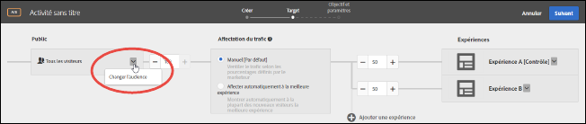
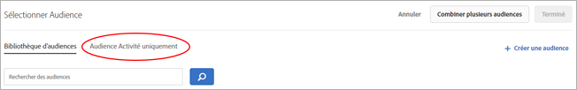

# Création d’une audience d’activité unique

Créer des audiences d’activité uniques depuis l’interface [!DNL Adobe Target] workflow assisté en trois étapes lors de la création d’une activité. Ces audiences ad hoc peuvent être utilisées à d’autres endroits dans la même activité, mais ne sont pas enregistrées dans la [!UICONTROL bibliothèque d’audiences] en vue d’être utilisées dans d’autres activités.

Les audiences d’activité uniques présentent les avantages suivants :

* Vous pouvez utiliser les audiences d’activité uniques pour créer une à usage unique que vous ne souhaitez pas enregistrer dans la [!UICONTROL bibliothèque d’audiences]. Les audiences d’activité uniques permettent d’empêcher la variable [!UICONTROL Bibliothèque d’audiences] d’être encombrée d’audiences que vous ne souhaitez plus jamais utiliser.
* Les audiences d’activité unique ne sont pas visibles dans la [!UICONTROL bibliothèque d’audiences]. Comme ces audiences ne sont pas visibles dans la bibliothèque, elles sont protégées des modifications indésirables par d’autres membres de votre organisation.

1. Lors de la création d’une [activité](/help/c-activities/activities.md#concept_D317A95A1AB54674BA7AB65C7985BA03), sur le **[!UICONTROL Ciblage]** , cliquez sur les trois points alignés verticalement, puis sur **[!UICONTROL Remplacer l’audience]**.

   

1. Cliquez sur **[!UICONTROL Créer une audience]**.

1. Cliquez sur **[!UICONTROL Cette activité uniquement]**.

   

1. Saisissez un nom d’audience descriptif.
1. Faites glisser les attributs de votre choix dans le créateur d’audiences.

   Les règles permettent de limiter votre audience à un sous-ensemble de visiteurs de votre site. Chaque type de règle possède ses propres paramètres. Voir [Catégories d’audiences](/help/c-target/c-audiences/c-target-rules/target-rules.md#concept_E3A77E42F1644503A829B5107B20880D) pour plus d’informations sur la configuration de chaque type de règle d’audience.

1. Cliquez sur **[!UICONTROL Terminé]**.

## Considérations

Gardez les informations suivantes à l’esprit lorsque vous travaillez avec des audiences d’activité uniques :

* Vous pouvez créer des audiences d’activité uniques dans le [!UICONTROL Compositeur d’expérience visuelle] (VEC) ou dans le [!UICONTROL Compositeur d’expérience d’après les formulaires]. Cette fonctionnalité remplace les règles de perfectionnement des précédentes versions de [!DNL Target].
* Vous pouvez créer une activité à enregistrer dans la [!UICONTROL bibliothèque d’audiences] en vue de la réutiliser dans d’autre activités ou créer une audience d’activité unique. Une fois l’audience enregistrée, vous ne pouvez plus modifier le type d’audience.
* Les perfectionnements pour les activités existantes sont transférés vers les audiences d’activité uniques.
* Les audiences d’activité unique ont le statut [!UICONTROL Utilisé] ou [!UICONTROL Non utilisé]. Les audiences d’activité uniques non utilisées s’affichent jusqu’à ce que l’activité soit enregistrée. Si elles sont toujours non utilisées lorsque vous enregistrez l’activité, un message d’avertissement vous informe que les audiences d’activité non utilisées seront supprimées.
* Vous pouvez afficher les détails de la définition de l’audience sur une carte contextuelle accessible depuis le sélecteur d’audiences, sans ouvrir l’audience.
* Vous pouvez [combiner plusieurs audiences](/help/c-target/combining-multiple-audiences.md#concept_A7386F1EA4394BD2AB72399C225981E5) pour créer des audiences d’activité uniques.
* Les audiences d’activité uniques ne prennent pas en charge les règles d’exclusion.

   Vous pouvez utiliser les alternatives suivantes pour utiliser les règles d’exclusion :

   * [Création et utilisation d’une audience de bibliothèque](/help/c-target/c-audiences/create-audience.md) plutôt qu’une audience d’activité unique.
   * [Combiner plusieurs](/help/c-target/combining-multiple-audiences.md#concept_A7386F1EA4394BD2AB72399C225981E5) (jusqu’à 20) audiences de bibliothèque dans une audience d’activité unique. Lors de la combinaison d’audiences, les règles d’inclusion et d’exclusion dans les audiences de bibliothèque individuelles peuvent être utilisées même lorsque l’audience combinée est enregistrée en tant qu’audience d’activité unique.
