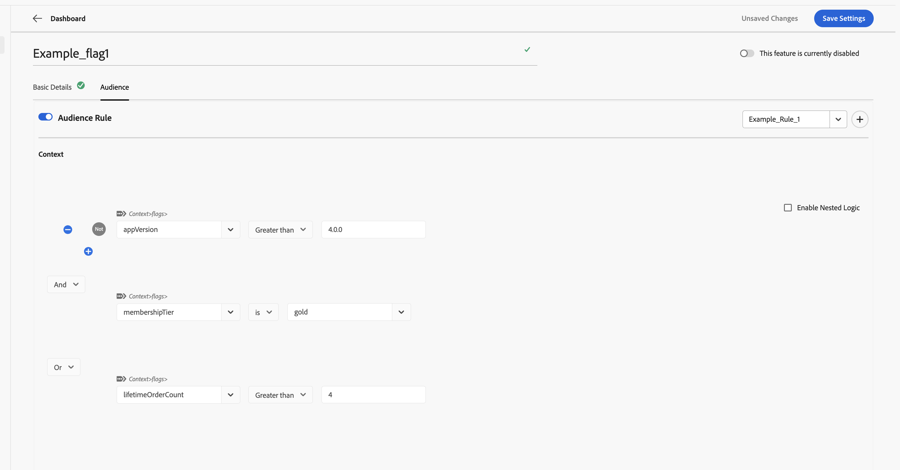

# Création et utilisation d’ensembles de règles {#creating-and-using-rule-sets}

Un jeu de règles est une collection réutilisable de critères contextuels d’audience. Créez un ensemble de règles lorsque plusieurs indicateurs de fonctionnalités ou groupes de fonctionnalités ont besoin de la même audience. Vous pouvez ensuite importer l’ensemble de règles au lieu de recréer les critères d’audience pour chaque fonctionnalité.

## Exigences relatives au jeu de règles {#requirements}

| Libellé de l’interface utilisateur | Utilisation | Requis |
| --- | --- | --- |
| **Saisir le jeu de règles** | Saisissez un nom pour le jeu de règles. | Oui |
| **Description du jeu de règles** | Décrivez l’objectif du jeu de règles. | Non |
| **Contexte** | Définissez au moins un critère d’audience. Les attributs de contexte sont des champs nommés tels que le niveau d’abonnement, la version de l’application ou la région. | Oui |

## Création d’un jeu de règles {#create-rule-set}

### Étape 1 : démarrer un nouveau jeu de règles {#step-1-start}

Dans Indicateurs, sélectionnez **Jeu de règles** dans le volet de navigation de gauche, puis sélectionnez **Nouveau jeu de règles**.

L’onglet **Mon jeu de règles** affiche les jeux de règles que vous avez créés. L’onglet **Ensemble de règles d’équipe** affiche les ensembles de règles disponibles pour votre équipe.

### Étape 2 : ajouter les détails et les critères du jeu de règles {#step-2-details}

1. Saisissez un nom pour le jeu de règles.
1. Vous pouvez éventuellement saisir une description.
1. Sous **Contexte**, définissez les critères d’audience à réutiliser.
1. Utilisez **Et** ou **Ou** pour combiner plusieurs critères.
1. Pour créer une expression plus complexe, sélectionnez **Activer la logique imbriquée**.

### Étape 3 : enregistrer le jeu de règles {#step-3-save}

Sélectionnez **Enregistrer les paramètres**. L’ensemble de règles enregistré apparaît sous **Mon ensemble de règles**.

## Utiliser un ensemble de règles dans un indicateur de fonctionnalité ou un groupe de fonctionnalités {#use-rule-set}

### Étape 1 : ouvrir et activer les paramètres de l’audience {#step-1-open}

Ouvrez l’indicateur de fonctionnalité ou le groupe de fonctionnalités dans lequel vous souhaitez utiliser l’ensemble de règles, sélectionnez l’onglet **Audience**, puis activez **Règle d’audience** pour activer les critères d’audience.

### Étape 2 : sélection du jeu de règles {#step-2-select}

Ouvrez la liste déroulante **Sélectionner un jeu de règles**. Choisissez le jeu de règles parmi **Mon jeu de règles** ou **Mon jeu de règles d’équipe**.

### Étape 3 : vérifier les critères importés {#step-3-review}

Les critères de contexte de l’ensemble de règles sélectionné sont importés dans l’audience. Vérifiez les critères, puis enregistrez l&#39;indicateur de fonction ou le groupe de fonctions.

Vous pouvez utiliser le même jeu de règles dans plusieurs indicateurs de fonctionnalités et groupes de fonctionnalités qui nécessitent la même audience.

### Étape 4 : enregistrer l&#39;indicateur de fonctionnalité ou le groupe de fonctionnalités {#step-4-save}

Après avoir examiné les critères d’audience importés, sélectionnez **Enregistrer les paramètres**.

>[!NOTE]
>
>L&#39;importation d&#39;un jeu de règles copie ses critères d&#39;audience dans l&#39;indicateur de fonctionnalité ou le groupe de fonctionnalités. Si les critères d’audience doivent être mis à jour ultérieurement, mettez-les à jour séparément dans chaque indicateur de fonctionnalité et groupe de fonctionnalités où le jeu de règles a été importé. La mise à jour du jeu de règles d’origine ne met pas automatiquement à jour les audiences importées précédemment.

## Créer un ensemble de règles à partir d&#39;un indicateur de fonctionnalité ou d&#39;un groupe de fonctionnalités {#create-from-feature}

Vous pouvez également créer un jeu de règles directement à partir de l’écran Audience d’un indicateur de fonctionnalité ou d’un groupe de fonctionnalités :

1. Ouvrez l&#39;indicateur de fonctionnalité ou le groupe de fonctionnalités, puis sélectionnez l&#39;onglet **Audience**.
1. Activez **Règle d’audience**.
1. Définissez les critères de contexte à réutiliser.
1. Sélectionnez le bouton **+** dans le coin supérieur droit, en regard de la liste déroulante **Sélectionner un jeu de règles**.
1. Dans la boîte de dialogue **Enregistrer le jeu de règles**, saisissez un nom de jeu de règles.
1. Sélectionnez **Enregistrer le jeu de règles**.

## Voir également {#see-also}

* [Création des attributs de contexte](creating-your-context-attributes.md)
* [Utilisation du contexte dans les règles d’audience](using-context-in-audience-rules.md)
* [Audience dans les indicateurs de fonctionnalité et les groupes de fonctionnalités](audience-in-feature-flags-and-feature-groups.md)

<!-- -->
