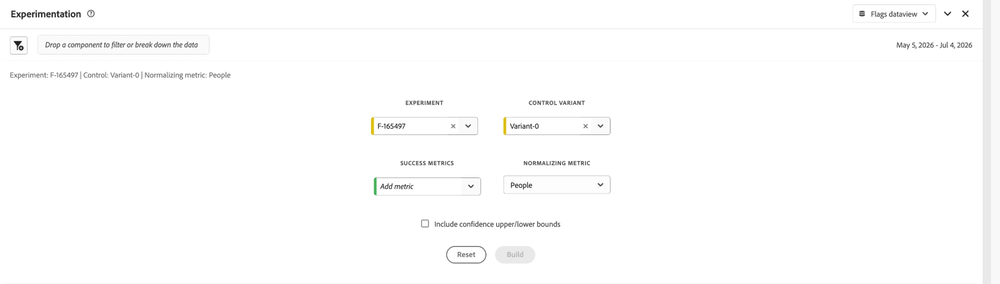

# Création de rapports {#reporting}

Flags diffuse les rapports via **Customer Journey Analytics (CJA)**. Un onglet **Rapport** est disponible sur chaque indicateur de fonctionnalité et sur la page des détails des groupes de fonctionnalités. Il vous permet d’afficher un rapport CJA dont la portée est limitée à cet indicateur ou à ce groupe spécifique, incorporé directement dans la page.

>[!NOTE]
>
>Par défaut **les rapports s’ouvrent avec une fenêtre de rapport de** 30 jours. Vous pouvez ajuster la plage à partir de l’en-tête du panneau.

## Conditions préalables {#prerequisites}

Avant d’afficher des rapports, vérifiez les points suivants :

1. La création de rapports est configurée pour votre application. Voir [Configuration de CJA pour la création de rapports relative aux indicateurs de fonctionnalité](set-up-cja-reporting.md).
1. Votre indicateur de fonction ou votre groupe de fonctions est actif et a accumulé des données.

## Affichage d’un rapport {#view-report}

### Ouvrez l’onglet Rapport et sélectionnez une vue de données {#open-report-tab}

1. Ouvrez un indicateur de fonctionnalité ou un groupe de fonctionnalités et sélectionnez l&#39;onglet **Rapport**.
1. Une boîte de dialogue **Sélectionner la vue de données** s’ouvre, répertoriant les vues de données CJA disponibles. Le premier est sélectionné par défaut.
1. Choisissez la vue de données souhaitée et sélectionnez **Afficher le rapport**. Sélectionnez **Annuler** pour fermer la boîte de dialogue sans charger de rapport.
1. Le rapport se charge dans l’onglet , défini sur l’indicateur ou l’ID d’entité de ce groupe.

>[!NOTE]
>
>La boîte de dialogue répertorie uniquement les vues de données auxquelles vous avez accès dans le sandbox actuel. Si aucun n’est disponible, la boîte de dialogue affiche un message et **Afficher le rapport** reste désactivé. Vérifiez les autorisations relatives aux vues de données ou changez de sandbox.

### Affichage du rapport de performances {#view-performance-report}

Le tableau de bord intégré **Présentation des indicateurs** affiche les éléments suivants :

* **Nombre total de personnes**, **Participation des personnes par jour** et **Participation des personnes par variante** (population témoin par rapport aux ID de variante)
* Un tableau **Aperçu** répertoriant chaque variante avec son nombre de personnes et son pourcentage de participation

Ajustez la période de l’en-tête du panneau pour tracer à nouveau pour une autre fenêtre (30 jours par défaut).

### Explorer les résultats de l’expérimentation {#explore-experimentation-results}

1. Dans le panneau **Expérimentation**, les **Expérience** (indicateur ou ID d’entité de groupe) et **Variante de contrôle** sont présélectionnées.
1. Ajoutez une **mesure de succès** à l’aide de l’**Ajouter une mesure**, puis choisissez une **mesure de normalisation** (par défaut **Personnes**) en fonction du graphique que vous souhaitez tracer.
1. Facultativement, activez **Inclure les limites supérieure/inférieure de confiance**.
1. Sélectionnez **Créer** pour calculer **Effet élévateur**, **Degré de confiance** et **Taux de conversion** par variante pour la mesure sélectionnée.

Consultez la [documentation du panneau Expérimentation](https://experienceleague.adobe.com/fr/docs/analytics-platform/using/cja-workspace/panels/experimentation) pour plus d’informations sur le calcul de ces mesures.

## Voir également {#see-also}

* [Configuration de CJA pour le reporting des indicateurs de fonctionnalité](set-up-cja-reporting.md)
* [Créer votre premier indicateur de fonctionnalité](create-your-first-feature-flag.md)
* [Test A/B avec indicateurs de fonctionnalité](a-b-testing.md)
* [Créer un groupe de fonctionnalités](create-a-feature-group.md)

<!-- -->
