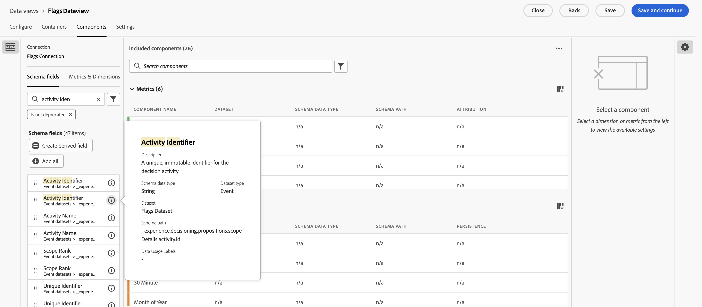
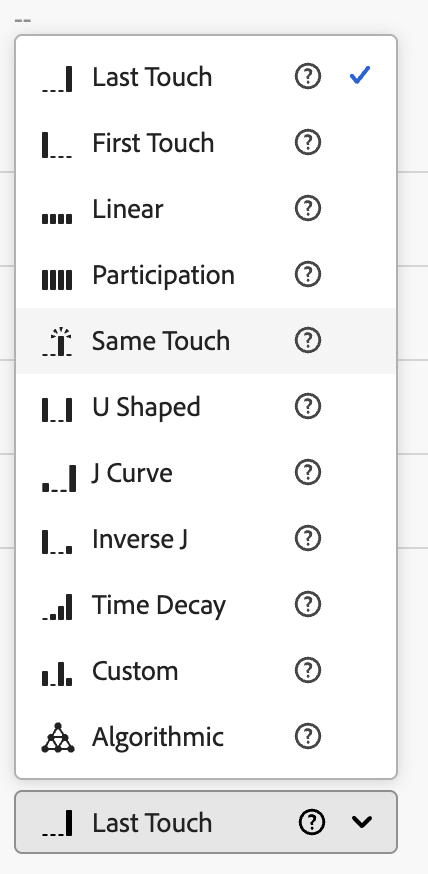

# Configuration de CJA pour le reporting des indicateurs de fonctionnalité {#set-up-cja-reporting}

L’intégration entre Flags et Adobe Customer Journey Analytics (CJA) fournit un moyen unifié de mesurer l’impact commercial des variantes d’indicateur de fonctionnalité. Appliquez les mesures de succès CJA aux rapports Flags à tout moment et tirez parti des fonctionnalités de Customer Journey Analytics, telles que le panneau [&#x200B; Expérimentation &#x200B;](https://experienceleague.adobe.com/fr/docs/analytics-platform/using/cja-workspace/panels/experimentation), pour évaluer les performances de l’expérience et comprendre comment les variantes de fonctionnalités influencent le comportement des clients.

## Considérations {#considerations}

Tenez compte des informations suivantes avant d’utiliser l’intégration Customer Journey Analytics et Flags :

* Vous et votre organisation devez avoir accès à Adobe Customer Journey Analytics (CJA).
* Le jeu de données **AJO ExD Decision Event Dataset** doit être configuré dans le sandbox pour les événements d&#39;exposition des indicateurs.
* Un jeu de données contenant les événements de conversion de succès que vous souhaitez utiliser comme mesures de succès doit être disponible.

## Configurer un flux de données {#set-up-datastream}

>[!NOTE]
>
>Ce guide utilise un jeu de données d’événement d’expérience Commerce et `commerce.purchases.value` uniquement à titre d’exemples. Sélectionnez le schéma et le champ de mesure de succès mappé appropriés à votre cas d’utilisation.

1. Dans Collecte de données, accédez à **Flux de données** et créez ou ouvrez le flux de données d’exposition des indicateurs.
1. Définissez son schéma de mappage sur **Schéma d’événement de décision AJO ExD**.
1. Ouvrez le flux de données et sélectionnez **Ajouter un service**.
1. Sélectionnez le **jeu de données d’événement de décision AJO ExD existant** en tant que jeu de données d’événement et enregistrez-le.

>[!NOTE]
>
>L’identifiant de flux de données que vous venez de créer est utilisé pour configurer l’extension Flags dans les balises de collecte de données.

## Configurer une connexion Customer Journey Analytics {#set-up-connection}

Si vous avez déjà configuré une connexion, vous pouvez utiliser votre connexion existante et passer à l’étape 3 ci-dessous. La connexion permet à Customer Journey Analytics de commencer à extraire les données du jeu de données pour la création de rapports.

1. Dans Customer Journey Analytics, sur la page **Connexions**, sélectionnez **Créer une connexion**.
1. Configurez vos [paramètres de connexion et de données](https://experienceleague.adobe.com/fr/docs/analytics-platform/using/cja-connections/overview) avec les informations appropriées.
1. Ajoutez le jeu de données d’événement ExD utilisé lors de la configuration du flux de données.
1. Ajoutez le jeu de données à utiliser comme événements de conversion, puis sélectionnez **Suivant**.
1. Configurez les [paramètres de chacun des jeux de données sélectionnés](https://experienceleague.adobe.com/fr/docs/analytics-platform/using/cja-connections/create-connection#dataset-settings) un par un, dans la boîte de dialogue **Ajouter des jeux de données**.

## Configurer la vue de données {#set-up-data-view}

Configurez une vue de données dans Customer Journey Analytics. Une vue de données garantit que les données de votre connexion peuvent être utilisées correctement.

1. Configurez votre vue de données et assurez-vous qu’elle pointe vers la connexion que vous avez créée ci-dessus. Pour plus d’informations, voir [Création ou modification d’une vue de données](https://experienceleague.adobe.com/fr/docs/analytics-platform/using/cja-dataviews/create-dataview) dans le *Guide d’Adobe Customer Journey Analytics*.
1. Accédez à **Gestion des données** > **Vues de données**.
1. Sélectionnez **Créer une vue de données** et choisissez la connexion CJA Flags.
1. Saisissez un nom de vue de données et un ID externe stable.
1. Confirmez les paramètres de fuseau horaire et de calendrier, puis passez à **Composants**.

### Configurer les dimensions d’expérience et de variante {#configure-experiment-variant-dimensions}

1. Ajoutez `_experience.decisioning.propositions.scopeDetails.activity.id` (mappé à **Identifiant d’entité Flags**) aux dimensions et renommez-le en « Identifiant d’entité Flags » ou en un autre nom convivial pour les analystes.
1. Définissez son libellé de contexte sur « Expérience d’expérimentation ».
1. Ajoutez des `_experience.decisioning.propositions.scopeDetails.experience.id` (mappés à une variante des indicateurs de fonctionnalité ou du groupe de fonctionnalités) aux dimensions.
1. Définissez son libellé de contexte sur « Variante d’expérience ».

>[!WARNING]
>
>Sans les deux libellés de contexte d’expérimentation, le panneau Expérimentation CJA ne peut pas identifier les indicateurs, les expériences et les variantes.

### Configurer la persistance et l’attribution {#configure-persistence-attribution}

Configurez les dimensions et les mesures afin qu’une exposition puisse recevoir du crédit pour une conversion ultérieure. Sans persistance ou attribution appropriée, CJA peut n’associer que les résultats survenant sur le même événement que l’exposition.

1. Ajoutez le champ de conversion requis, tel que `commerce.purchases.value`, sous Mesures.
1. Donnez un nom clair à la mesure, par exemple **Valeur des achats**.
1. Activez l’attribution et sélectionnez le modèle requis par l’analyse : Dernière touche, Première touche, Participation ou Même touche. Voir [Composants d’attribution](https://experienceleague.adobe.com/fr/docs/analytics-platform/using/cja-workspace/attribution/models) pour plus d’informations sur les modèles d’attribution, les conteneurs et les intervalles de recherche en amont.
1. Sélectionnez un conteneur et un intervalle de recherche en amont correspondant à la stratégie de l’expérience. Un conteneur Personne avec recherche en amont basée sur une visite ou une session est un point de départ courant, mais validez-le pour votre cas d’utilisation.
1. Enregistrez la vue de données.

## Voir également {#see-also}

* [Création de rapports](reporting.md)

<!-- -->
