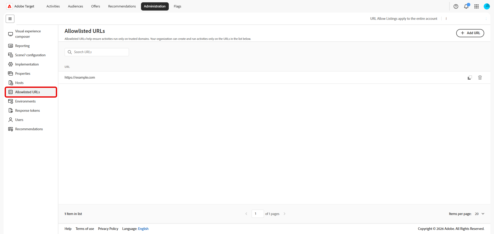
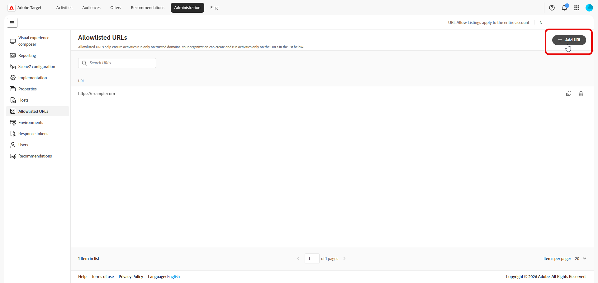
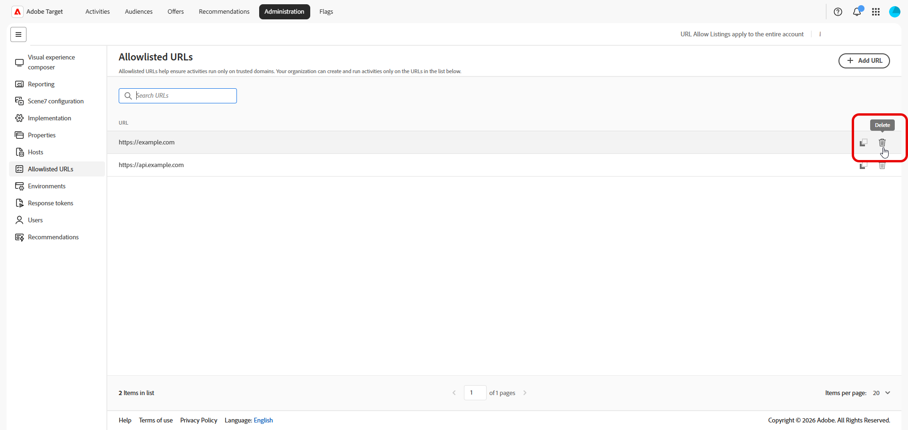

# URL PLACÉES SUR LA LISTE AUTORISÉE

Les URL Placées sur la liste autorisée définissent des modèles d’URL de confiance où votre entreprise peut créer et exécuter des expériences [!DNL Adobe Target], y compris lorsque vous utilisez des offres distantes ou de redirection. La liste fonctionne avec [gestion des hôtes](/help/main/administrating-target/hosts.md) et [environnements](/help/main/administrating-target/environments.md), mais s’applique spécifiquement aux modèles d’URL d’offre distante autorisés et aux validations associées.

Pour gérer les URL placées sur la liste autorisée, cliquez sur **[!UICONTROL Administration]** > **[!UICONTROL URL]**.

Page 

## Gérer les URLs placées sur la liste autorisée {#add-url}

Le tableau principal répertorie chaque modèle placé sur la liste autorisée dans une seule colonne. Les entrées prises en charge peuvent inclure des URL exactes, des chemins d’accès par des caractères génériques ou des formats de modèle acceptés par votre entreprise pour les expériences distantes.

1. Cliquez sur **[!UICONTROL Ajouter une URL]**.

   

1. Dans la boîte de dialogue, saisissez l’URL ou le modèle que votre organisation doit autoriser.

   

1. Enregistrez vos modifications.

   Une fois le modèle placé sur la liste autorisée, les utilisateurs et utilisatrices peuvent créer ou exécuter des activités et des offres qui reposent sur cette URL, sous réserve de vos autres règles de [!DNL Target].

1. Utilisez le champ **[!UICONTROL URL de recherche]** pour filtrer le tableau.

1. Pour supprimer une URL, recherchez la ligne du modèle dont vous n’avez plus besoin et cliquez sur l’icône .

   

