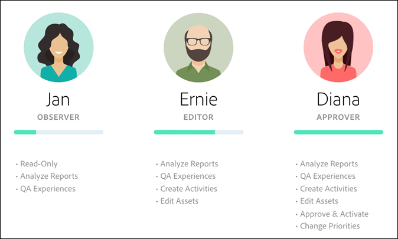

# Autorisations des utilisateurs d’Enterprise

Les autorisations d’utilisateur d’entreprise sont un moyen d’administrer officiellement l’accès utilisateur à l’échelle de l’entreprise à [!DNL Adobe Target]. Ajoutez des utilisateurs à [!DNL Target], attribuez des autorisations en fonction de leurs rôles et créez des espaces de travail pour les équipes en fonction de différents services, emplacements globaux, canaux et autres regroupements logiques. Vous pouvez affecter aux utilisateurs les rôles de [!UICONTROL Observer], [!UICONTROL Editor], [!UICONTROL Approver] ou [!UICONTROL Publisher].

## Déterminer si vous avez accès aux autorisations utilisateur de l’entreprise

>[!NOTE]
>
>La fonctionnalité [!UICONTROL Properties and Permissions] est disponible dans le cadre de la solution [!DNL Target] Premium. Elle n’est pas disponible dans [!DNL Target] Standard sans une licence [!DNL Target] Premium.
>
>Votre mise en oeuvre [!DNL Target] peut utiliser n’importe quelle version d’at.js ou de [!DNL Adobe Experience Platform Web SDK].

Vous pouvez déterminer si votre organisation dispose d’une licence Standard ou Premium en cliquant sur le lien [!UICONTROL Administration] dans la partie supérieure de l’interface utilisateur de [!DNL Target].

* **[!DNL Target Standard]Clients** : si l’onglet [!UICONTROL Users] ([!UICONTROL Administration > Users]) s’affiche (et non l’onglet [!UICONTROL Properties]), votre organisation dispose d’une licence [!DNL Target Standard]. Les clients [!DNL Target Standard] doivent suivre les instructions de [Users](/help/main/administrating-target/c-user-management/c-user-management/user-management.md) pour ajouter des utilisateurs et attribuer des autorisations dans [!DNL Adobe Admin Console].

* **[!DNL Target Premium]Clients** : si l’onglet [!UICONTROL Properties] ([!UICONTROL Administration > Properties]) et l’onglet [!UICONTROL Users] s’affichent, votre organisation dispose d’une licence [!DNL Target Premium]. Les clients [!DNL Target Premium] doivent suivre les instructions de cet article et de [Configurer les autorisations d’entreprise](/help/main/administrating-target/c-user-management/property-channel/properties-overview.md).

## Avant de commencer à utiliser les autorisations d’Enterprise

>[!IMPORTANT]
>
>Assurez-vous de lire la section [Avertissements](/help/main/administrating-target/c-user-management/property-channel/property-channel.md#section_9714311B1CD9497A86F4910F8AE635E2) ci-dessous avant de continuer avec les autorisations d’entreprise.

## Termes et définitions utilisés dans cette section {#section_F8D229544FEA41C3BC2EFD1F95AA0116}

Les termes suivants sont utilisés dans cette section et peuvent être nouveaux pour les utilisateurs qui souhaitent utiliser la fonctionnalité Propriétés et autorisations de [!DNL Target] Premium.

### Propriété

Les propriétés sont de même nature que les propriétés dans [!DNL Adobe Experience Platform], dans la mesure où elles utilisent un fragment de code unique pour les différencier.

Une propriété web est une bibliothèque de règles et un code incorporé. Il peut s’agir de n’importe quel regroupement d’un ou de plusieurs domaines et de sous-domaines.

Les propriétés sont activées en ajoutant une paire nom/valeur spécifique comme paramètre avec n’importe quel appel (appel Target, appel api, etc.) à [!DNL Target].

Les propriétés appartiennent à des canaux spécifiques (web, mobile, courrier électronique ou API/autre).

### Espace de travail (Profil produit) {#workspace}

Avec un espace de travail, une organisation peut allouer un groupe d’utilisateurs spécifique à un groupe de propriétés spécifique. Un espace de travail peut être comparé à une suite de rapports dans [!DNL Adobe Analytics].

Remarque : les espaces de travail sont appelés [!UICONTROL Product Profiles] dans le [!DNL Adobe Admin Console for Enterprise].

Si vous êtes membre d’une organisation internationale, vous pouvez avoir un espace de travail dédié à vos pages web, propriétés ou sites européens et un autre espace de travail dédié à vos pages web, propriétés ou sites américains. Si vous faites partie d’une organisation multimarque, vous disposez peut-être d’un espace de travail distinct pour chacune de vos marques.

Les utilisateurs peuvent appartenir à plusieurs espaces de travail et différents rôles peuvent même leur être attribués dans chaque espace de travail.

Les utilisateurs peuvent avoir différentes vues de [!DNL Adobe Target] en se déplaçant entre les espaces de travail, comme la façon dont les utilisateurs de [!DNL Analytics] ont différentes vues de [!DNL Analytics] en se déplaçant entre les suites de rapports.

Les espaces de travail peuvent inclure des audiences, des offres de code et des activités complètement différentes.

Toutes les audiences et activités créées avant la nouvelle migration du modèle d’autorisations d’Enterprise sont regroupées dans le &quot;Workspace par défaut&quot;, décrit ci-dessous.

Toutes les activités créées via [!DNL Adobe Experience Manager] (AEM), [!DNL Adobe Mobile Services] et [!DNL Adobe Target Classic] font partie de la &quot;Workspace par défaut&quot;.

### Espace de travail par défaut

Tous les espaces de travail existants (profils de produit) dans [!DNL Admin Console] sont fusionnés dans un espace de travail unique appelé &quot;Workspace par défaut&quot; lors de la migration de votre entreprise vers le nouveau modèle d’autorisations d’Enterprise.

>[!IMPORTANT]
>
>Ne supprimez pas l’espace de travail par défaut.

Tous les rôles utilisateur et l’accès à toutes les fonctionnalités [!DNL Target] restent identiques à ce qu’ils étaient avant la migration vers le nouveau modèle d’autorisations d’Enterprise.

### Groupes d’utilisateurs

Vous pouvez créer des groupes d’utilisateurs, tels que les développeurs, les analystes, les marketeurs et les cadres. Vous pouvez ensuite attribuer des privilèges à plusieurs produits et espaces de travail Adobe. Il peut être aussi facile d’affecter à un nouveau membre d’équipe tous les droits d’accès appropriés à différents produits Adobe que de les affecter à un groupe d’utilisateurs spécifique.

### Rôles et autorisations {#roles-permissions}

Les rôles et autorisations déterminent les niveaux d’accès que les utilisateurs doivent créer et gérer les activités dans votre implémentation [!DNL Target]. Dans [!DNL Target], les rôles incluent les éléments suivants :

| Rôle | Description |
|--- |--- |
| [!UICONTROL Approver] | Peut créer, modifier et activer ou arrêter les activités. |
| [!UICONTROL Editor] | Peut créer et modifier des activités avant qu’elles ne soient activées, mais ne peut pas approuver le lancement d’une activité. |
| [!UICONTROL Observer] | Peut visualiser des activités mais ne peut pas les créer ni les modifier. |
| [!UICONTROL Publisher] | Similaire au rôle [!UICONTROL Observer] (peut afficher les activités, mais ne peut pas les créer ni les modifier). Cependant, le rôle [!UICONTROL Publisher] dispose de l’autorisation supplémentaire d’activer les activités. |

### Canal

Le canal fait référence au type de contenu de l’emplacement où vos activités [!DNL Target] sont diffusées : pages web, applications mobiles, messages électroniques, etc.

Lorsque vous créez une activité, elle est créée dans l’espace de travail actuellement sélectionné. Les options de sélection de canal s’affichent dans la première boîte de dialogue qui vous permet de choisir le canal souhaité pour l’activité : web, application mobile, courrier électronique ou autre/API.

## Présentation des autorisations {#section_DC2172520DA84605B218A5E9FB6D187A}

Les informations suivantes expliquent comment les autorisations étaient appliquées précédemment dans [!DNL Target] et comment elles l’étaient à l’aide de la fonctionnalité [!UICONTROL Properties] et [!UICONTROL Permissions].

La nouvelle fonctionnalité [!UICONTROL Permissions] permet de créer différents projets (appelés &quot;Profils de produit&quot; dans [!DNL Adobe Admin Console for Enterprise]). Les projets vous permettent d’affecter à un utilisateur donné différentes autorisations définissant ses droits d’accès pour chaque projet. Ces projets distincts sont comparables au fonctionnement des suites de rapports dans [!DNL Adobe Analytics]. À chacun d’eux peuvent appartenir des utilisateurs désignés avec des rôles spécifiques s’appliquant à une série de propriétés. Les clients peuvent ainsi restreindre l’accès à l’affichage, à la modification et à l’approbation de leurs utilisateurs en fonction de leur région, de leur environnement (développement/évaluation/production), de leur canal ou d’autres critères personnalisés, comme illustré ci-dessous :

Par exemple, un utilisateur donné peut avoir un accès « approbation » aux sites web américains, mais un accès « affichage » seulement à l’application mobile européenne. Ce même utilisateur peut aussi ne pas être autorisé à afficher les activités proposées sur les propriétés web et mobiles dans la région APAC.

Le modèle [!DNL Target] [!UICONTROL Permissions] dispose des rôles d’autorisation suivants (observateur, éditeur, approbateur et observateur). Le rôle d’observateur n’est pas illustré dans les illustrations de cet article.

À chaque rôle correspondent différents niveaux d’autorisations :

| Rôle | Description |
|--- |--- |
| Approbateur | Peut créer, modifier et activer ou arrêter les activités. |
| Éditeur | Peut créer et modifier des activités avant qu’elles ne soient activées, mais ne peut pas approuver le lancement d’une activité. |
| Observateur | Peut visualiser des activités mais ne peut pas les créer ni les modifier. |
| Éditeur | Similaire au rôle d’observateur (peut afficher les activités, mais ne peut pas les créer ni les modifier). Cependant, le rôle d’éditeur dispose de l’autorisation supplémentaire d’activer les activités. |

Important : Chaque rôle d’utilisateur s’applique à chaque page, propriété ou site de votre compte qui comprend des balises [!DNL Target], comme indiqué ci-après :

Le nouveau modèle [!DNL Target] [!UICONTROL Permissions] possède les mêmes trois rôles d’autorisation (observateur, éditeur et approbateur). Vous pouvez toutefois affecter à un utilisateur des rôles d’autorisations distincts pour des pages, propriétés ou sites individuels, comme illustré ci-dessous :

Dans cet exemple, Jeanne a les autorisations associées à son rôle d’approbatrice pour la page d’accueil et le site américains et les autorisations associées à son rôle d’observatrice pour le site français.

En outre, Jeanne ne peut pas voir les pages, propriétés ou sites dans [!DNL Target] qu’elle n’est pas autorisée à voir, comme illustré ci-dessous :

Dans cet exemple, Jeanne ne peut pas afficher les pages produit, le site de Russie ni le site Carrières.

## Scénarios de cas d’utilisation {#section_F3CE8576959E4F4CB13BEEED38311DD8}

Les cas d’utilisation suivants peuvent s’avérer utiles pour comprendre de quelle façon les propriétés, les projets, les rôles et les autorisations peuvent vous aider à atteindre vos objectifs marketing avec [!DNL Target] :

### Organisation multinationale

Si vous êtes membre d’une organisation internationale, vous pouvez avoir un espace de travail dédié à vos pages web, propriétés ou sites européens et un autre espace de travail dédié à vos pages web, propriétés ou sites américains. Après une réorganisation, en utilisant les personnages des illustrations ci-dessus, vous pouvez configurer des espaces de travail et des autorisations semblables à ce qui suit :

* **Jeanne** : Jeanne est responsable de l’optimisation du Centre d’excellence pour les pages Web, les propriétés et les sites de son organisation aux États-Unis. Elle détient probablement les droits d’administrateur système dans Adobe Experience Cloud.

  Elle a les autorisations associées à son rôle d’approbatrice pour la page d’accueil et le site des États-Unis. Avec l’autorisation d’approbateur, elle peut créer, modifier et activer ou arrêter des activités.

  Jeanne collabore également avec l’équipe d’optimisation en France et a par conséquent les autorisations associées à son rôle d’observatrice pour le site français, ce qui lui permet d’accéder aux activités en lecture seule. Elle peut visualiser les activités mais ne peut pas les créer ni les modifier.

  Puisqu’aucun de ses rôles ne justifie qu’elle consulte les pages produit, le site russe ou le site Carrières, Jeanne n’a pas accès aux activités de ces sites.

* **Ernie** : Ernie est le directeur du marketing pour les États-Unis dans l’organisation.

  Ernest étant relativement nouveau dans l’organisation et inexpérimenté avec Target, il dispose des autorisations associées à son rôle d’éditeur pour la page d’accueil des États-Unis, le site des États-Unis et les pages produit. Grâce aux autorisations de l’éditeur, Ernest peut créer et modifier des activités avant qu’elles ne soient activées. Il ne peut pas approuver le lancement d’une activité : une personne disposant d’une autorisation d’approbation, telle que Jeanne, doit approuver l’activité avant de pouvoir la mettre en production.

  Puisqu’aucun de ses rôles ne justifie qu’il consulte les sites Russie, France ou Carrières, Ernest n’a pas accès aux activités de ces sites.

* **Diana** : Diana est analyste pour l’organisation. Elle détient les autorisations associées à son rôle d’observatrice pour la page d’accueil et le site des États-Unis, les pages produit et les sites français et russe, ce qui lui permet d’accéder aux activités en lecture seule. Elle peut visualiser des activités, mais elle ne peut pas les créer ni les modifier.

  Puisqu’aucun de ses rôles ne justifie qu’elle consulte le site Carrières, Diana n’a pas accès aux activités de ce site.

### Organisation multimarque

Si vous faites partie d’une organisation multimarque, il est possible qu’il existe un espace de travail distinct pour les pages web, propriétés ou sites de chaque marque.

Après une réorganisation, en utilisant les personnages des illustrations ci-dessus, vous pouvez configurer des projets et des autorisations semblables à ce qui suit :

* **Jeanne** : Jeanne est responsable de l’optimisation du Centre d’excellence pour une organisation de soins de santé, impliquée dans les espaces des produits hospitaliers et de consommation. Elle détient probablement les droits d’administrateur système dans Adobe Experience Cloud.

  Elle a les autorisations associées à son rôle d’approbatrice pour le site de l’hôpital. Avec l’autorisation d’approbateur, elle peut créer, modifier et activer ou arrêter des activités.

  Jeanne collabore également avec l’équipe d’optimisation de l’espace des produits de consommation et a par conséquent les autorisations associées à son rôle d’observatrice pour ce site, ce lui permet d’accéder aux activités en lecture seule. Elle peut visualiser les activités mais ne peut pas les créer ni les modifier.

* **Ernest :** Ernest est directeur marketing en charge du marketing de l’espace des produits de consommation.

  Ernest étant relativement nouveau dans l’entreprise et inexpérimenté avec Target, il dispose de l’autorisation de l’éditeur pour le site dédié aux consommateurs. Grâce aux autorisations de l’éditeur, Ernest peut créer et modifier des activités avant qu’elles ne soient activées. Il ne peut pas approuver le lancement d’une activité : une personne disposant des autorisations de validation pour le site dédié aux consommateurs, mais pas Jeanne dans ce scénario, doit approuver l’activité avant de pouvoir la mettre en production.

  Ernest n’ayant aucun rôle justifiant qu’il consulte le site de l’hôpital, il n’a pas accès aux activités de ce site.

* **Diana :** Diana est analyste pour l’organisation. Elle détient des autorisations associées à son rôle d’observatrice pour le site de l’hôpital et celui dédié aux consommateurs, ce qui lui permet d’accéder aux activités en lecture seule. Elle peut visualiser des activités, mais elle ne peut pas les créer ni les modifier.

## Points de contact des propriétés et autorisations de l’interface utilisateur de Target {#section_3414371393BB42999A268628B5456EC9}

La nouvelle fonctionnalité Autorisations est accessible depuis différents emplacements dans l’interface utilisateur de [!DNL Target].

* **Liste déroulante Workspace (Profil produit) :** La liste déroulante Workspace s’affiche en haut des pages [!UICONTROL Activities], [!UICONTROL Audiences] et [!UICONTROL Offers]. Sélectionnez l’espace de travail désiré pour filtrer la liste afin de n’afficher que les éléments situés dans l’espace de travail sélectionné.

  

* **Création de l’activité :** Lorsque vous créez une activité, elle est créée dans l’espace de travail actuellement sélectionné. Les options de sélection de canal s’affichent dans la première boîte de dialogue qui vous permet de choisir le canal souhaité pour l’activité : web, application mobile, courrier électronique ou autre/API.

  

* **Création d’audience :** Lorsque vous créez une audience, elle est créée dans l’espace de travail actuellement sélectionné.
* **Liste d’audiences :** Vous pouvez déplacer des audiences entre les espaces de travail à l’aide de l’option [!UICONTROL More Actions] > [!DNL Move] de la page [!UICONTROL Audiences].
* **Création d’offre :** Lorsque vous créez une offre, elle est créée dans l’espace de travail actuellement sélectionné.
* **Page Propriétés (Administration > Propriétés) :** Vous pouvez utiliser la zone [!UICONTROL Search] pour effectuer des recherches dans la liste [!UICONTROL Property].

  

## Avertissements {#section_9714311B1CD9497A86F4910F8AE635E2}

Tenez compte des points suivants lors de l’utilisation ou de la configuration des propriétés et des autorisations dans [!DNL Target] Premium :

* **Important** : ne supprimez pas les espaces de travail comportant des activités. Si vous supprimez un espace de travail comportant des activités, contactez le service à la clientèle pour récupérer ces activités.
* Lors de l’utilisation de la vue Tous mes espaces de travail :

   * Vous pouvez voir les activités, les audiences et les offres pour tous les espaces de travail auxquels vous pouvez accéder, disposant des rôles et des autorisations appropriés.
   * Lorsque vous sélectionnez la vue [!UICONTROL All My Workspaces], une nouvelle colonne est ajoutée à la page Activités, Audiences et Offres . Cette colonne répertorie l’espace de travail de l’élément et votre autorisation utilisateur associée à cet élément (observateur, éditeur ou approbateur),
   * Lorsque vous créez une activité, une audience ou une offre dans la vue Tous mes espaces de travail, vous devez sélectionner l’espace de travail dans lequel l’élément doit être créé. Seuls les espaces de travail pour lesquels vous disposez de l’autorisation éditeur ou approbateur peuvent être sélectionnés.
   * Lors de la copie d’une activité, d’une audience ou d’une offre dans la vue Tous mes espaces de travail, vous devez sélectionner l’espace de travail où l’élément doit être copié. Seuls les espaces de travail pour lesquels vous disposez de l’autorisation éditeur ou approbateur peuvent être sélectionnés.

* Tout paramètre sur les pages [!UICONTROL Administration] suivantes peut être contrôlé par n’importe quel [!UICONTROL Approver] dans n’importe quel espace de travail :

   * Compositeur d’expérience visuelle
   * Création de rapports
   * Configuration Scene7
   * Mise en œuvre
   * Propriétés
   * Hôtes
   * Environnements
   * Jetons de réponse
   * Utilisateurs et utilisatrices

* Les utilisateurs ne peuvent pas déplacer des ressources d’un espace de travail (profil produit) vers un autre. La copie, cependant, est prise en charge.
* Lorsque vous affichez les de la page [!DNL Audiences]Audiences, la page se charge plus lentement que prévu. Les audiences s’affichent plus rapidement si vous utilisez la barre de recherche. Ce problème est connu et sera corrigé dans une prochaine mise à jour. Ce problème n’a toutefois aucune incidence sur la sélection des audiences durant la création de l’activité.
* Les ressources suivantes font partie du nouveau modèle d’autorisations d’Enterprise :

   * Les activités, audiences et offres de code créées dans [!DNL Target Standard/Premium] peuvent être utilisées une fois que le client a été activé pour les autorisations. (Remarque : les clients doivent avoir droit à [!DNL Target Premium].)
   * Les propriétés peuvent être ajoutées aux activités existantes dans le Workspace par défaut. Toutefois, cette approche peut faire l’objet de modifications.
   * Seules les nouvelles ressources (telles que les activités, les offres de code et les audiences) créées dans Target Premium (une fois les autorisations d’Enterprise activées) peuvent être restreintes par les autorisations.
   * Les ressources externes sont disponibles uniquement pour les utilisateurs de l’espace de travail par défaut. Le rôle d’un utilisateur de l’espace de travail par défaut s’applique globalement (à toutes les demandes et ressources Target).

* Les ressources suivantes ne font *pas* partie du nouveau modèle d’autorisations d’Enterprise :

   * Offres d’image
   * Toutes les ressources de recommandations, y compris la bibliothèque de critères, la bibliothèque de conception, le catalogue et la configuration des recommandations.
   * Les ressources existantes (telles que les activités, les offres de code et les audiences) créées dans Target Premium avant d’activer les autorisations d’Enterprise peuvent être copiées mais ne peuvent pas être déplacées vers d’autres espaces de travail.
   * Les activités, audiences, offres de code, offres d’images ou toute autre ressource créée à l’aide des solutions ou méthodes suivantes ne peuvent pas être contrôlées par le modèle d’autorisations d’Enterprise, mais font partie de la Workspace par défaut : Target Classic, Adobe Experience Manager (AEM), Adobe Mobile Services et les ressources créées via l’API. Ressources créées via une API (y compris les activités, les audiences, les offres de code et les offres d’images).
   * Les offres d’images (ressources stockées sous `https://[tenantName].marketing.adobe.com/content/mac/[tenantName]/target/offers.html#image-library` ne peuvent actuellement pas être contrôlées par le modèle d’autorisations d’Enterprise.
   * Le suivi des clics et les redirections fonctionnent lorsque le lien ou la page de destination fait partie d’une propriété incluse dans l’activité. En outre, le suivi des clics peut ne pas fonctionner lors de l’utilisation de la fonction `targetPageParams()`. `targetPageParamsAll()` est la fonction recommandée.

  [!DNL Target] nécessite actuellement la présence d’un jeton `at_property` sur n’importe quelle page sur laquelle le suivi a lieu. Si le jeton (1) n’est pas présent, (2) n’est pas détecté au moment de la configuration de l’activité (dans le compositeur d’expérience visuelle) ou (3) n’est pas transmis à l’appel de la cible de suivi des clics via la fonction `targetPageParamsAll()` , la mesure n’est pas incrémentée et apparaît comme &quot;0&quot;.

  La même règle s’applique pour les activités utilisant les redirections. La page de destination doit comporter un jeton `at_property` et être reconnue au moment de la configuration dans le compositeur d’expérience visuelle.

  Dans une version ultérieure, Target fonctionnera sur les pages où aucun jeton `at_property` n’est présent ou sur les pages où un autre jeton `at_property` est présent.

* La fonctionnalité Autorisations des utilisateurs d’Enterprise n’est pas prise en charge dans les appels d’API Adobe Developer.

## Questions fréquentes {#faqs}

Les questions fréquentes concernant les autorisations d’entreprise sont les suivantes :

### Que se passe-t-il si un utilisateur ou une utilisatrice dispose de plusieurs rôles et autorisations ? {#multiple-roles}

Si un utilisateur dispose de plusieurs rôles et autorisations, le rôle avec les autorisations du navigateur est appliqué. Par exemple, si un utilisateur possède des rôles [!UICONTROL Observer] et [!UICONTROL Approver], le rôle [!UICONTROL Approver] est appliqué.

### Puis-je déplacer une activité d’un espace de travail à un autre ?

Malheureusement, vous ne pouvez pas déplacer une activité d’un espace de travail à un autre. Cependant, vous pouvez copier une activité dans n’importe quel espace de travail en sachant que les données de rapport ne sont pas transférées. Pour plus d’informations, voir la rubrique [Copie ou édition d’une activité lors de l’utilisation des espaces de travail](/help/main/c-activities/edit-activity.md#section_45A92E1DD3934523B07E71EF90C4F8B6).

Les activités créées avant la migration continuent de fonctionner de la même façon dans l’espace de travail par défaut, sauf en cas de modification ou d’allocation de propriétés. Les activités sous un espace de travail spécifique respectent la propriété affectée à cet espace de travail et, par conséquent, le comportement peut ne pas rester identique à celui d’avant la migration.

### Puis-je déplacer une audience d’un espace de travail à un autre ? {#move-audience}

Oui, vous pouvez déplacer des audiences entre les espaces de travail à l’aide de l’option [!UICONTROL More Actions] sur la page [!UICONTROL Audiences].

1. Cliquez sur le bouton **[!UICONTROL More Actions]** (les trois ellipses), puis sur **[!UICONTROL Move]**.

   

1. Sélectionnez l’espace de travail de votre choix dans la liste déroulante **[!UICONTROL Workspace]**, puis cliquez sur **[!UICONTROL Move]**.

   

>[!NOTE]
>
>Vous devez disposer des droits appropriés pour modifier une audience. En outre, l’audience ne doit pas être utilisée dans d’autres activités. Si l’audience est utilisée dans d’autres activités et que vous souhaitez toujours déplacer l’audience vers un autre lieu de travail, supprimez l’audience des autres activités dans lesquelles elle est utilisée.

### Pourquoi un message d’erreur indique qu’aucune propriété n’est associée à cette activité, même si une propriété est assignée ?

Si vous avez implémenté [!DNL Target] avec des balises dans [!DNL Adobe Experience Platform] et que vous recevez un message d’erreur indiquant qu’aucune propriété n’est associée à l’activité, transmettez le paramètre `at_property` avec la fonction `targetPageParams`.

### Les conversions de suivi des clics sont-elles enregistrées si une page redirigée et l’URL d’activité appartiennent à des propriétés différentes ?

Le suivi des clics n’est pas enregistré sur les pages où l’URL de page et d’activité appartient à des propriétés différentes.

Prenons l’exemple suivant :

* La page 1 appartient à la Propriété 1.
* La page 2 appartient à la Propriété 2.
* Dans l’activité, la page 1 redirige vers la page 2, qui contient des traqueurs de clics.

Lorsqu’un visiteur ouvre la page 1 dans un navigateur, il est redirigé vers la page 2. Comme la page 2 ne remplit pas les critères de diffusion de l’activité, son appel Target ne contient pas de traqueurs de clics dans sa réponse.

Si la page de redirection et l’URL d’activité appartiennent à la même propriété, les traqueurs de clics fonctionnent comme prévu. Pour plus d’informations, voir [Suivi des clics](/help/main/c-activities/r-success-metrics/click-tracking.md).

## Vidéos de formation

Les vidéos suivantes contiennent davantage d’informations sur les concepts abordés dans cet article.

### Vidéo de formation : Vidéo de formation sur les autorisations d’entreprise 

Objectifs de la formation :

* Les trois niveaux de rôle que les utilisateurs d’Adobe Target peuvent détenir
* Les concepts de propriétés et d’espaces de travail, et comment ces limites et regroupements fonctionnent pour permettre le contrôle des niveaux d’accès des utilisateurs
* Différents exemples de propriétés dont votre organisation doit tenir compte

>[!VIDEO](https://video.tv.adobe.com/v/19042/)

### Heures d’ouverture : [!DNL Target] espaces de travail Premium

Cette vidéo est un enregistrement de « Office Hours », une initiative lancée par l’équipe d’assistance clientèle d’Adobe.

* Création d’un espace de travail (profil produit)
* Création de propriétés
* Ajout d’utilisateurs
* Mise à jour de l’implémentation

>[!NOTE]
>
>L’interface utilisateur du menu [!DNL Target] [!UICONTROL Administration] (anciennement [!UICONTROL Setup]) a été repensée afin de fournir de meilleures performances, de réduire le temps de maintenance requis lors de la publication de nouvelles fonctionnalités et d’améliorer l’expérience utilisateur sur l’ensemble du produit. Les informations de la vidéo suivante sont correctes ; toutefois, les options peuvent se trouver à des emplacements légèrement différents.

>[!VIDEO](https://video.tv.adobe.com/v/23643/)
