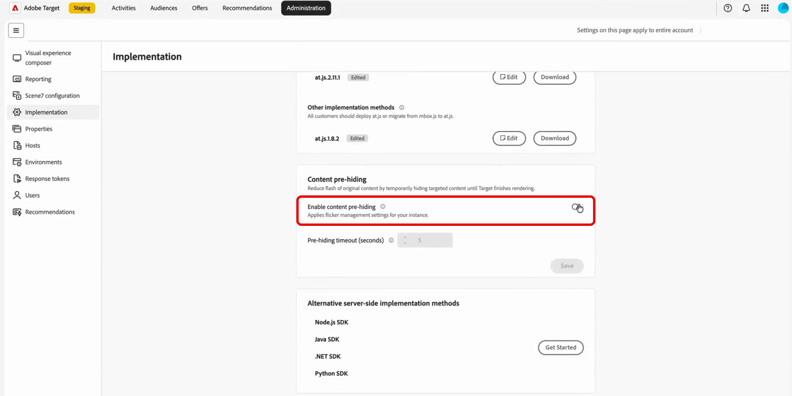

# Prémasquage du contenu pour les expériences personnalisées

>[!AVAILABILITY]
>
>Le prémasquage du contenu pour le contenu personnalisé est disponible en version **bêta**.

Lorsqu’un visiteur charge une page, le contenu par défaut peut apparaître brièvement, puis être remplacé par du contenu personnalisé provenant de [!DNL Adobe Target]. Ce commutateur visible est souvent appelé **scintillement** et il s’agit d’un problème d’expérience courant pour les programmes de personnalisation.

Grâce au pré-masquage du contenu, vous pouvez gérer le scintillement en masquant uniquement les parties de la page que vos activités personnalisent pendant le chargement de la page, de sorte que vos clients voient moins de scintillement et moins de temps vide à l’écran.

Voici comment fonctionne le pré-masquage du contenu, depuis le compte par défaut jusqu’à vos choix d’implémentation de page et de per-activité.

1. Activez le pré-masquage du contenu pour votre compte afin de définir la valeur par défaut globale. Cette option est désactivée par défaut. [En savoir plus](#content-pre-hiding-enable-account)

1. Ajoutez la bibliothèque de pré-masquage de contenu à la `<head>` de toutes les pages sur lesquelles vous exécutez des activités de personnalisation.

1. [!DNL Target] crée un ensemble de règles à partir des activités en direct [!UICONTROL compositeur d’expérience visuelle] et [!UICONTROL compositeur d’expérience amélioré]. L’ensemble de règles répertorie les sélecteurs et les régions que la diffusion peut modifier.

   Notez que les activités [!UICONTROL &#x200B; Compositeur basé sur les formulaires &#x200B;] ne sont pas prises en charge.

1. La bibliothèque récupère cet ensemble de règles à partir du réseau CDN Adobe et prémasque les éléments correspondants uniquement pendant que le contenu personnalisé est toujours en cours de chargement.

1. Dans **[!UICONTROL Objectifs et paramètres]**, vous pouvez désactiver le **[!UICONTROL masquage préalable du contenu]** pour des activités individuelles, mais uniquement s’il est activé au niveau du compte. [En savoir plus](#content-pre-hiding-activity)

## Activation du pré-masquage du contenu pour votre instance {#content-pre-hiding-enable-account}

>[!IMPORTANT]
>
>Pour activer le masquage préalable du contenu pour l’instance, vous devez être un **administrateur**.

Le pré-masquage du contenu est désactivé pour votre instance jusqu’à ce que vous l’activiez. Utilisez **[!UICONTROL Administration]** > **[!UICONTROL Implémentation]** pour activer la fonctionnalité, définir les valeurs par défaut et accéder au téléchargement pour votre équipe d’implémentation.

1. Dans [!DNL Target], cliquez sur **[!UICONTROL Administration]** > **[!UICONTROL Implémentation]**.

1. Dans le menu **[!UICONTROL Prémasquage du contenu]**, activez l’option Prémasquage du contenu .

   

1. Si nécessaire, mettez à jour le **[!UICONTROL délai d’expiration du masquage préalable]** en secondes.

1. Cliquez sur **[!UICONTROL Enregistrer]**. Les paramètres de gestion du scintillement seront alors appliqués à votre instance.

1. Une fois activé, cliquez sur **[!UICONTROL Télécharger]**, puis ajoutez le fichier au `<head>` de la page afin qu’il se charge avant le [!DNL at.js] ou la [!DNL Web SDK]. Pour obtenir des instructions d’implémentation complètes, voir SDK de masquage préalable du contenu[&#128279;](https://experienceleague.adobe.com/fr/docs/target-dev/developer/client-side/prehide-sdk).

   

Votre instance utilise désormais les paramètres de masquage préalable du contenu enregistré et de délai d’expiration par défaut pour les activités qui souscrivent.

## Activation du pré-masquage du contenu pour votre activité {#content-pre-hiding-activity}

Lorsque le masquage préalable est activé pour votre instance, choisissez si chaque activité l’utilise dans **[!UICONTROL Objectifs et paramètres]**. Les activités pour lesquelles vous activez le pré-masquage sont incluses dans le comportement ciblé lorsqu’elles sont actives.

[!DNL Target] crée ensuite un ensemble léger de règles à partir d’activités en direct créées dans le [!UICONTROL compositeur d’expérience visuelle] (VEC) et le [!UICONTROL compositeur basé sur les formulaires], décrivant les sélecteurs et les zones que la diffusion peut modifier.

Lorsque vous créez ou modifiez une activité :

1. Accédez à l’activité pour laquelle vous souhaitez activer l’option de pré-masquage.

1. Accédez à la liste déroulante **[!UICONTROL Modifier l’activité]** et sélectionnez **[!UICONTROL Modifier les objectifs et les paramètres]**.

   

1. Dans le menu **[!UICONTROL Prémasquage du contenu]**, activez l’option **[!UICONTROL Activer le prémasquage du contenu]** pour activer ou désactiver le prémasquage de cette activité.

   

1. Une fois que vous avez terminé, cliquez sur **[!UICONTROL Enregistrer et fermer]**.

Une fois que vous avez enregistré et que les activités sont mises en ligne ou désactivées, l’ensemble de règles est mis à jour afin que le pré-masquage reste aligné sur ce qui est réellement diffusé, sans modifications de votre code de page pour chaque lancement.

Du côté des visiteurs, la bibliothèque récupère cet ensemble de règles du réseau CDN Adobe à chaque chargement de page et prémasque les éléments correspondants uniquement lorsque cela est nécessaire jusqu’à ce que le contenu personnalisé soit prêt.
