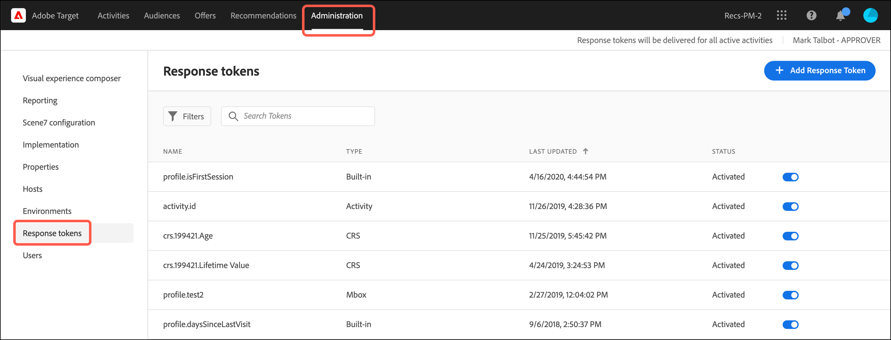

# Jetons de réponse

Les jetons de réponse vous permettent de générer automatiquement des informations spécifiques à [!DNL Adobe Target] sur la page web de votre marque. Ces informations peuvent inclure des détails sur l’activité, l’offre, l’expérience, le profil utilisateur, des informations géographiques, etc. Ces détails fournissent des données de réponse supplémentaires à partager avec des outils internes ou tiers ou à utiliser pour le débogage.

Les jetons de réponse vous permettent de choisir les variables (dans les paires clé-valeur) à utiliser, puis de les activer pour qu’elles soient envoyées dans le cadre d’une [!DNL Target] réponse. Vous activez une variable à l’aide du commutateur et la variable est envoyée avec [!DNL Target] réponses, qui peuvent être validées dans les appels réseau. Les jetons de réponse fonctionnent également dans [!UICONTROL Aperçu] mode .

La principale différence entre les plug-ins et les jetons de réponse réside dans le fait que les plug-ins diffusent du code JavaScript sur la page qui s’exécute lors de la diffusion. Toutefois, les jetons de réponse diffusent un objet qui peut ensuite être lu et traité à l’aide d’écouteurs d’événement. L’approche du jeton de réponse est plus sûre et permet un développement et une maintenance plus simples des intégrations tierces.

>[!NOTE]
>
>Les jetons de réponse sont disponibles avec at.js version 1.1 ou ultérieure.

| SDK Target | Actions proposées |
|--- |--- |
| [SDK web Adobe Experience Platform](https://developer.adobe.com/target/implement/client-side/aep-web-sdk/) | Assurez-vous que vous utilisez la version 2.6.0 ou ultérieure du SDK Web Platform. Pour plus d’informations sur le téléchargement de la dernière version du SDK Web de Platform, voir [Installation du SDK](https://experienceleague.adobe.com/docs/experience-platform/edge/fundamentals/installing-the-sdk.html) dans le *Présentation du SDK Web Platform* guide. Pour plus d’informations sur les nouvelles fonctionnalités de chaque version du SDK Web de Platform, voir [Notes de mise à jour](https://experienceleague.adobe.com/docs/experience-platform/edge/release-notes.html) dans le *Présentation du SDK Web Platform* guide. |
| [at.js](https://developer.adobe.com/target/implement/client-side/atjs/how-atjs-works/how-atjs-works/) | Assurez-vous que vous utilisez at.js version 1.1 ou ultérieure. Pour plus d’informations sur le téléchargement de la dernière version d’at.js, voir [Télécharger at.js](https://developer.adobe.com/target/implement/client-side/atjs/how-to-deployatjs/implement-target-without-a-tag-manager/). Pour en savoir plus sur la nouvelle fonctionnalité de chaque version d’at.js, voir [Informations détaillées sur les versions d’at.js](https://developer.adobe.com/target/implement/client-side/atjs/target-atjs-versions/).<br>Les clients utilisant at.js sont encouragés à utiliser les jetons de réponse et à ne plus utiliser les modules externes. Certains modules externes qui reposent sur des méthodes internes qui existaient dans mbox.js (désormais obsolètes), mais pas dans at.js, sont fournis mais échouent. |

## Utilisation des jetons de réponse {#section_A9E141DDCBA84308926E68D05FD2AC62}

1. Assurez-vous que vous utilisez la version 2.6.0 (ou ultérieure) du SDK Web Platform ou la version 1.1 (ou ultérieure) d’ at.js .

   Pour plus d’informations:

   * **SDK Web Platform**: Voir [Installation du SDK](https://experienceleague.adobe.com/docs/experience-platform/edge/fundamentals/installing-the-sdk.html) dans le *Présentation du SDK Web Platform* guide.
   * **at.js**: Voir [Téléchargement d’at.js](https://developer.adobe.com/target/implement/client-side/atjs/how-to-deployatjs/implement-target-without-a-tag-manager/).

1. Dans [!DNL Target], cliquez sur **[!UICONTROL Administration]** > **[!UICONTROL Jetons de réponse]**.

   

1. Activez les jetons de réponse souhaités, tels que `activity.id` et `offer.id`.

   Les paramètres suivants sont disponibles par défaut :

   | Type | Paramètre | Remarques |
   |--- |--- |--- |
   | Profils intégrés | `profile.activeActivities` | Renvoie une multitude de `activityIds` pour lesquels le visiteur est qualifié. Elle s’incrémente lorsque les utilisateurs sont qualifiés. Par exemple, sur une page avec deux [!DNL Target] demande la diffusion de deux activités différentes, la seconde demande inclut les deux activités. |
   |  | `profile.isFirstSession` | Renvoie « true » ou « false ». |
   |  | `profile.isNewSession` | Renvoie « true » ou « false ». |
   |  | `profile.daysSinceLastVisit` | Renvoie le nombre de jours depuis la dernière visite du visiteur. |
   |  | `profile.tntId` | Renvoie le tntID du visiteur. |
   |  | `profile.marketingCloudVisitorId` | Renvoie l’identifiant visiteur Experience Cloud du visiteur. |
   |  | `profile.thirdPartyId` | Renvoie l’identifiant tiers du visiteur. |
   |  | `profile.categoryAffinity` | Renvoie la catégorie préférée du visiteur. |
   |  | `profile.categoryAffinities` | Renvoie un tableau des 5 catégories favorites du visiteur sous la forme de chaînes. |
   | Activité | `activity.name`<br>`activity.id`<br>`experience.name`<br>`experience.id`<br>`offer.name`<br>`offer.id` | Détails de l’activité en cours.<br> Notez que les valeurs des paramètres de l’offre sont évaluées au niveau de l’expérience. |
   | Géo | `geo.country`<br>`geo.state`<br>`geo.city`<br>`geo.zip`<br>`geo.dma`<br>`geo.domainName`<br>`geo.ispName`<br>`geo.connectionSpeed`<br>`geo.mobileCarrier` | Pour plus d’informations sur l’utilisation du géociblage dans les activités, voir [Géociblage](/help/main/c-target/c-audiences/c-target-rules/geo.md). |
   | Méthode d’affectation du trafic<br>(S’applique à [!UICONTROL Ciblage automatique] et [!UICONTROL Automated Personalization] activités uniquement.) | `experience.trafficAllocationId` | Renvoie 0 si un visiteur a reçu une expérience provenant d’un trafic de &quot;contrôle&quot; et 1 si un visiteur a reçu une expérience provenant de la distribution de trafic &quot;ciblée&quot;. |
   |  | `experience.trafficAllocationType` | Renvoie &quot;contrôle&quot; ou &quot;ciblé&quot;. |

   Les attributs de profil utilisateur et les attributs du client s’affichent également dans la liste.

   >[!NOTE]
   >
   >Les paramètres dotés de caractères spéciaux ne s’affichent pas dans la liste. Seuls les caractères alphanumériques et les traits de soulignement sont pris en charge.

1. (Conditionnel) Pour utiliser un paramètre de profil comme jeton de réponse, mais le paramètre n’a pas été transmis par un événement [!DNL Target] et n’a donc pas chargé dans la variable [!DNL Target] Vous pouvez utiliser l’interface utilisateur de la variable [!UICONTROL Ajouter un jeton de réponse] pour ajouter le profil à l’interface utilisateur.

   Cliquez sur **[!UICONTROL Ajouter un jeton de réponse]**, indiquez le nom du jeton, puis cliquez sur **[!UICONTROL Activer]**.

   

1. Créez une activité.

## Écoute des réponses et lecture des jetons de réponse

Le processus que vous utilisez pour écouter [!DNL Target] les réponses et les jetons de réponse de lecture diffèrent selon que vous disposez d’une [!DNL Platform Web SDK] ou implémentation d’at.js.

###  [!DNL Platform Web SDK] Utilisation de la classe d’objet Handle {#platform-web-sdk}

Utilisez la classe d’objet Handle , qui comporte un objet de métadonnées et un objet de données à écouter. [!DNL Target] réponses et lisez les jetons de réponse.

L’exemple de réponse suivant ajoute une [!DNL Platform Web SDK] gestionnaire d’événements personnalisés directement sur la page de HTML (le tableau explique les objets utilisés dans le code) :

| Objet | Informations |
| --- | --- |
| Type : Personalization.Decision | Si la décision a été prise par la variable [!DNL Target] ou fournisseur d’Offers decisionings. |
| DecisionProvider - TGT | TGT-[!DNL Target]. [!DNL Target] fournit les métadonnées et les valeurs du jeton de réponse à la page. |
| Meta | Métadonnées transmises à la page. |
| Données | Valeurs des métadonnées transmises à la page. |

```html
<html>

<head>
 ...
 <script src="alloy.js"></script>
 <script>
  {
   "requestId": "4d0a7cfd-952c-408c-b3b8-438edc38250a",
   "handle": [{
    "type": "personalization:decisions",
    "payload": [{
     "id": "....",
     "scope": "__view__",
     "scopeDetails": {
      "decisionProvider": "TGT",
      "activity": {
       "id": "..."
      },
      "experience": {
       "id": "...."
      }
     },
     "items": [{
      "id": "123",
      "schema": "https://ns.adobe.com/personalization/dom-action",
      "meta": {
       "activity.id": "...",
       "activity.name": "...",
       "profile.foo": "...",
       "profile.bar": "..."
      },
      "data": {
       "id": "123",
       "type": "setHtml",
       "selector": "#foo",
       "prehidingSelector": "#foo",
       "content": "<div>Hello world</div>"
      }
     }]
    }]
   }]
  }
  });
 </script>
</head>

<body>
 ...
</body>

</html>
```

###  at.js à l’aide d’événements personnalisés

Utilisez les [Événements personnalisés at.js](https://developer.adobe.com/target/implement/client-side/atjs/atjs-functions/atjs-custom-events/) pour écouter la réponse et lire les jetons de réponse.[!DNL Target]

L’échantillon de code suivant ajoute un gestionnaire d’événements personnalisés [!DNL at.js] directement dans la page HTML :

```html
<html> 
  <head> 
    .... 
    <script src="at.js"></script> 
    <script> 
      document.addEventListener(adobe.target.event.REQUEST_SUCCEEDED, function(e) { 
        console.log("Request succeeded", e.detail); 
      }); 
    </script> 
  <head> 
  <body> 
  ... 
  </body> 
</html>
```

## FAQ sur les jetons de réponse {#section_3DD5F32C668246289CDF9B4CDE1F536D}

**Quel rôle est requis pour activer ou désactiver les jetons de réponse ?**

Les jetons de réponse ne peuvent être activés ou désactivés que par les utilisateurs qui ont la variable [!DNL Target] [!UICONTROL Administrateur] rôle.

**Que se passe-t-il si je cours ? [!DNL Platform Web SDK] 2.6.0 (ou version antérieure) ?**

Vous n’avez pas accès aux jetons de réponse.

**Que se passe-t-il si j’exécute at.js 1.0 (ou version antérieure) ?**

Les jetons de réponse s’affichent, mais at.js ne peut pas les utiliser.

**[!DNL Target Classic]Les modules externes de et les jetons de réponse peuvent-ils être actifs au même moment ?**

Les modules externes et les jetons de réponse sont disponibles en parallèle ; toutefois, les modules externes seront abandonnés à l’avenir.

**Les jetons de réponse sont-ils diffusés par l’intermédiaire de tous les [!DNL Target] réponses ou uniquement par [!DNL Target] réponses proposant une activité ?**

Les jetons de réponse sont diffusés uniquement via [!DNL Target] réponses diffusant une activité.

**My [!DNL Target Classic] module externe inclus : JavaScript. Comment puis-je reproduire ses fonctionnalités à l’aide des jetons de réponse ?**

Lors de la migration vers des jetons de réponse, ce type de code JavaScript doit être conservé dans votre base de code ou votre solution de gestion des balises. Vous pouvez déclencher ce code à l’aide de [!DNL Platform Web SDK] ou [!DNL at.js] des événements personnalisés et transmettez les valeurs du jeton de réponse à vos fonctions JavaScript.

**Pourquoi mon paramètre d’attribut de profil/client ne s’affiche-t-il pas dans la liste des jetons de réponse ?**

[!DNL Target] actualise normalement les paramètres toutes les 15 minutes. Cette actualisation dépend de l’action de l’utilisateur et les données sont actualisées uniquement lorsque vous affichez la page des jetons de réponse. Si vos paramètres ne s’affichent pas dans la liste des jetons de réponse, [!DNL Target] n’a pas encore actualisé les données.

En outre, si votre paramètre contient autre chose que des caractères non alphanumériques ou tout autre symbole que des traits de soulignement, le paramètre n’apparaît pas dans la liste. Actuellement, seuls les caractères alphanumériques et les traits de soulignement sont pris en charge.

**Le jeton de réponse diffuse-t-il toujours du contenu s’il utilise un script de profil supprimé ou un paramètre de profil supprimé ?**

Les jetons de réponse extraient des informations des profils utilisateur, puis diffusent ces informations. Si vous supprimez un script ou un paramètre de profil, cela ne signifie pas que les informations ont été supprimées des profils utilisateur. Les profils utilisateur disposent toujours de données correspondant au script de profil. Le jeton de réponse continue à diffuser le contenu. Pour les utilisateurs qui ne disposent pas de ces informations dans leur profil, ou pour les nouveaux visiteurs, ce jeton n’est pas diffusé car les données ne sont pas présentes dans leurs profils.

[!DNL Target] ne désactive pas automatiquement le jeton. Si vous supprimez un script de profil et que vous ne voulez plus que le jeton soit diffusé, vous devez le désactiver vous-même.

**J’ai renommé mon script de profil, mais pourquoi le jeton utilisant ce script est-il toujours actif avec l’ancien nom ?**

Comme mentionné ci-dessus, les jetons de réponse fonctionnent selon les informations de profil enregistrées pour les utilisateurs. Même si vous avez renommé le script de profil, les utilisateurs qui ont consulté votre site web disposent de l’ancienne valeur de script de profil enregistrée dans leurs profils. Le jeton continue à relever l’ancienne valeur déjà enregistrée dans les profils utilisateur. Si vous voulez maintenant diffuser du contenu sur le nouveau nom, vous devez désactiver le jeton précédent et activer le nouveau jeton.

**Si mes attributs ont changé, quand sont-ils supprimés de la liste ?**

[!DNL Target] effectue une actualisation des attributs à intervalles réguliers. Tout attribut qui n’est pas activé est supprimé lors de la prochaine actualisation. Cependant, si un attribut a été activé et supprimé, ce script n’est pas supprimé de la liste d’attributs tant que vous ne l’avez pas désactivé. Par exemple, vous avez supprimé un script de profil utilisé comme jeton. [!DNL Target] supprime les attributs désactivés de la liste seulement lorsqu’ils sont supprimés ou renommés.

## Envoi de données à des Google Analytics

Les sections suivantes décrivent comment envoyer [!DNL Target] aux Google Analytics. Les données envoyées par des jetons de réponse peuvent également être envoyées à d’autres intégrations tierces.

###  Envoi de données à des Google Analytics via le SDK Web Platform

Les Google Analytics peuvent être envoyés par l’intermédiaire du SDK Web Platform version 2.6.0 (ou ultérieure) en ajoutant le code suivant dans la page de HTML.

>[!NOTE]
>
>Assurez-vous que la paire de valeurs de clé de jeton de réponse se trouve sous le `alloy(“sendEvent”` .

```
<script type="text/javascript"> 
   (function(i, s, o, g, r, a, m) { 
   i['GoogleAnalyticsObject'] = r; 
   i[r] = i[r] || function() { 
   (i[r].q = i[r].q || []).push(arguments) 
   }, i[r].l = 1 * new Date(); 
   
   
   a = s.createElement(o), 
   m = s.getElementsByTagName(o)[0]; 
   a.async = 1; 
   a.src = g; 
   m.parentNode.insertBefore(a, m) 
   })(window, document, 'script', 'https://www.google-analytics.com/analytics.js', 'ga'); 
   ga('create', 'Google Client Id', 'auto'); 
</script> 
<script type="text/javascript">
   alloy("sendEvent", {
   
   
   })
   .then(({ renderedPropositions, nonRenderedPropositions }) => {
   // concatenate all the propositions
   const propositions = [...renderedPropositions, ...nonRenderedPropositions];
   // extractResponseTokens() extract the meta from item -> meta
   const tokens = extractResponseTokens(propositions);
   const activityNames = []; 
   const experienceNames = []; 
   const uniqueTokens = distinct(tokens); 
   
   
   uniqueTokens.forEach(token => { 
   activityNames.push(token["activity.name"]); 
   experienceNames.push(token["experience.name"]); 
   }); 
   
   
   ga('send', 'event', { 
   eventCategory: "target", 
   eventAction: experienceNames, 
   eventLabel: activityNames 
   }); 
   
   
   });
</script>
```

###  Envoi de données à des Google Analytics via at.js {#section_04AA830826D94D4EBEC741B7C4F86156}

Vous pouvez envoyer des données à Google Analytics par l’intermédiaire d’at.js en ajoutant le code suivant à la page HTML :

```javascript
<script type="text/javascript"> 
  (function(i, s, o, g, r, a, m) { 
    i['GoogleAnalyticsObject'] = r; 
    i[r] = i[r] || function() { 
      (i[r].q = i[r].q || []).push(arguments) 
    }, i[r].l = 1 * new Date(); 
    a = s.createElement(o), 
      m = s.getElementsByTagName(o)[0]; 
    a.async = 1; 
    a.src = g; 
    m.parentNode.insertBefore(a, m) 
  })(window, document, 'script', 'https://www.google-analytics.com/analytics.js', 'ga'); 
  ga('create', 'Google Client Id', 'auto'); 
</script> 
 
<script type="text/javascript"> 
  document.addEventListener(adobe.target.event.REQUEST_SUCCEEDED, function(e) { 
    var tokens = e.detail.responseTokens; 
 
    if (isEmpty(tokens)) { 
      return; 
    } 
 
    var activityNames = []; 
    var experienceNames = []; 
    var uniqueTokens = distinct(tokens); 
 
    uniqueTokens.forEach(function(token) { 
      activityNames.push(token["activity.name"]); 
      experienceNames.push(token["experience.name"]); 
    }); 
 
    ga('send', 'event', { 
      eventCategory: "target", 
      eventAction: experienceNames, 
      eventLabel: activityNames 
    }); 
  }); 
 
  function isEmpty(val) { 
    return (val === undefined || val == null || val.length <= 0) ? true : false; 
  } 
 
  function key(obj) { 
     return Object.keys(obj) 
    .map(function(k) { return k + "" + obj[k]; }) 
    .join(""); 
  } 
 
  function distinct(arr) { 
    var result = arr.reduce(function(acc, e) { 
      acc[key(e)] = e; 
      return acc; 
    }, {}); 
   
    return Object.keys(result) 
    .map(function(k) { return result[k]; }); 
  } 
</script>
```

## Débogage

Les sections suivantes fournissent des informations sur le débogage des jetons de réponse :

###  Google Analytics et débogage

Le code suivant vous permet de déboguer à l’aide de Google Analytics :

```javascript
<script type="text/javascript"> 
  (function(i, s, o, g, r, a, m) { 
    i['GoogleAnalyticsObject'] = r; 
    i[r] = i[r] || function() { 
      (i[r].q = i[r].q || []).push(arguments) 
    }, i[r].l = 1 * new Date(); 
    a = s.createElement(o), 
      m = s.getElementsByTagName(o)[0]; 
    a.async = 1; 
    a.src = g; 
    m.parentNode.insertBefore(a, m) 
  })(window, document, 'script', 'https://www.google-analytics.com/analytics.js', 'ga'); 
  ga('create', 'Google Client Id', 'auto'); 
</script> 
 
<script type="text/javascript"> 
  document.addEventListener(adobe.target.event.REQUEST_SUCCEEDED, function(e) { 
    var tokens = e.detail.responseTokens; 
 
    if (isEmpty(tokens)) { 
      return; 
    } 
 
    var activityNames = []; 
    var experienceNames = []; 
    var uniqueTokens = distinct(tokens); 
 
    uniqueTokens.forEach(function(token) { 
      activityNames.push(token["activity.name"]); 
      experienceNames.push(token["experience.name"]); 
    }); 
 
    ga('send', 'event', { 
      eventCategory: "target", 
      eventAction: experienceNames, 
      eventLabel: activityNames 
    }); 
  }); 
 
  function isEmpty(val) { 
    return (val === undefined || val == null || val.length <= 0) ? true : false; 
  } 
 
  function key(obj) { 
     return Object.keys(obj) 
    .map(function(k) { return k + "" + obj[k]; }) 
    .join(""); 
  } 
 
  function distinct(arr) { 
    var result = arr.reduce(function(acc, e) { 
      acc[key(e)] = e; 
      return acc; 
    }, {}); 
   
    return Object.keys(result) 
    .map(function(k) { return result[k]; }); 
  } 
```

### Débogage à l’aide de l’équivalent du module externe ttMeta

Vous pouvez créer l’équivalent du module externe ttMeta à des fins de débogage en ajoutant le code suivant à la page HTML :

```javascript
<script type="text/javascript" > 
  document.addEventListener(adobe.target.event.REQUEST_SUCCEEDED, function (e) { 
    window.ttMETA= typeof(window.ttMETA)!="undefined" ? window.ttMETA : []; 
 
    var tokens=e.detail.responseTokens; 
 
    if (isEmpty(tokens)) { 
      return; 
    } 
     
    var uniqueTokens = distinct(tokens); 
 
    uniqueTokens.forEach(function(token) { 
      window.ttMETA.push({ 
        'CampaignName': token["activity.name"], 
        'CampaignId' : token["activity.id"], 
        'RecipeName': token["experience.name"], 
        'RecipeId': token["experience.id"], 
        'OfferId': token["offer.id"], 
        'OfferName': token["offer.name"], 
        'MboxName': e.detail.mbox}); 
      console.log(ttMETA); 
    }); 
  }); 
 
  function isEmpty(val){ 
    return (val === undefined || val == null || val.length <= 0) ? true : false; 
  } 
 
  function key(obj) { 
     return Object.keys(obj) 
    .map(function(k) { return k + "" + obj[k]; }) 
    .join(""); 
  } 
 
  function distinct(arr) { 
    var result = arr.reduce(function(acc, e) { 
      acc[key(e)] = e; 
      return acc; 
    }, {}); 
   
    return Object.keys(result) 
    .map(function(k) { return result[k]; }); 
  } 
</script>
```

##  Vidéo de formation : Jetons de réponse et événements personnalisés at.js {#section_3AA0A6C8DBD94A528337A2525E3E05D5}

La vidéo suivante explique comment utiliser les jetons de réponse et les événements personnalisés at.js pour partager les informations de profil de [!DNL Target] aux systèmes tiers.

>[!NOTE]
>
>L’interface utilisateur du menu [!DNL Target] [!UICONTROL Administration] (anciennement [!UICONTROL Configuration]) a été repensée afin d’améliorer les performances, de réduire le temps de maintenance requis lors de la publication de nouvelles fonctionnalités et d’améliorer l’expérience utilisateur. Les informations de la vidéo suivante sont correctes ; toutefois, les options se situent à des emplacements légèrement différents.
>
>La vidéo mentionne `option.name` et `option.id`, qui ont été remplacés par `offer.name` et `offer.id`, respectivement.

>[!VIDEO](https://video.tv.adobe.com/v/23253/)
