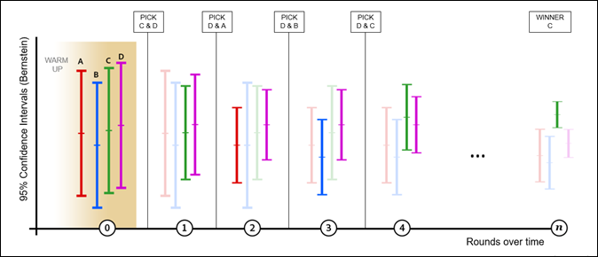

# Aperçu de l’[!UICONTROL affectation automatique]

Un [!UICONTROL Affectation automatique] activité dans [!DNL Adobe Target] identifie un gagnant parmi plusieurs expériences et réaffecte automatiquement du trafic supplémentaire vers le gagnant afin d’augmenter les conversions pendant que le test se poursuit et apprend.

Lors de la création d’une activité A/B à l’aide du processus assisté en trois étapes, vous pouvez choisir la [!UICONTROL Affectation automatique à la meilleure expérience] .

## Le défi {#section_85D5A03637204BACA75E19646162ACFF}

Les tests A/B standard ont un coût. Vous devez générer du trafic pour mesurer les performances de chaque expérience et déterminer l’expérience gagnante grâce à une analyse. L’affectation du trafic reste fixe même après que vous avez admis que certaines expériences sont plus performantes que d’autres. En outre, il est difficile de déterminer la taille de l’échantillon. L’activité doit également s’exécuter en entier avant que vous ne puissiez agir sur un gagnant. Et il est encore possible que le gagnant identifié ne soit pas un vrai gagnant.

## La solution : [!UICONTROL Affectation automatique] {#section_98388996F0584E15BF3A99C57EEB7629}

[!UICONTROL L’affectation automatique réduit les frais inhérents à la détermination d’une expérience gagnante. ] [!UICONTROL Elle contrôle les performances de la mesure d’objectif de toutes les expériences et envoie davantage de nouveaux participants vers les expériences hautement performantes de manière proportionnelle. ] Suffisamment de trafic est réservé à l’exploration des autres expériences. Vous pouvez constater les avantages du test sur vos résultats, même si l’activité est toujours en cours d’exécution : l’optimisation se produit en parallèle de l’apprentissage.

[!UICONTROL L’affectation automatique dirige progressivement les visiteurs vers des expériences gagnantes, sans que vous ayez besoin d’attendre la fin d’une activité pour déterminer un gagnant. ] Vous bénéficiez de l’effet élévateur plus rapidement, car les participants à l’activité qui auraient été envoyés vers des expériences moins performantes sont dirigés vers des expériences potentiellement gagnantes.

Un test A/B standard dans [!DNL Target] n’affiche que les comparaisons par paires des concurrents avec le contrôle. Par exemple, si une activité comporte des expériences : A, B, C et D où A est le contrôle, une valeur normale [!DNL Target] Le test A/B compare A à B, A à C et A à D.

Lors de ces tests, la plupart des produits, y compris [!DNL Target], utilisez un test en t de Student pour générer une confiance basée sur la valeur p. Cette valeur de confiance sert ensuite à déterminer si l’expérience concurrente est suffisamment différente de l’expérience de contrôle. Cependant, [!DNL Target] n’effectue pas automatiquement les comparaisons implicites (B par rapport à C, B par rapport à D et C par rapport à D) requises pour trouver la &quot;meilleure&quot; expérience. Le marketeur doit dès lors analyser les résultats manuellement pour déterminer la « meilleure » expérience.

[!UICONTROL L’affectation automatique effectue toutes les comparaisons implicites entre les expériences et produit un « vrai » gagnant. ] La notion d’expérience de « contrôle » disparaît donc totalement du test.

[!UICONTROL Affectation automatique] alloue intelligemment de nouveaux visiteurs aux expériences jusqu’à ce que l’intervalle de confiance de la meilleure expérience ne chevauche pas l’intervalle de confiance d’une autre expérience. Normalement, ce processus peut produire des faux positifs, mais [!UICONTROL Affectation automatique] utilise des intervalles de confiance en fonction de la variable [L&#39;inégalité de Bernstein](https://en.wikipedia.org/wiki/Bernstein_inequalities_%28probability_theory%29) qui compense les évaluations répétées. À ce stade, il y a un vrai gagnant. When [!UICONTROL Affectation automatique] s’arrête, à condition qu’il n’y ait pas de dépendance temporelle importante pour les visiteurs qui arrivent sur la page, il y a au moins 95 % de chances que [!UICONTROL Affectation automatique] renvoie une expérience dont la réponse réelle n’est pas inférieure à 1 % (relatif) par rapport à la réponse réelle de l’expérience gagnante.

## Quand utiliser [!UICONTROL Affectation automatique] versus A/B ou [!UICONTROL Automated Personalization] {#section_3F73B0818A634E4AAAA60A37B502BFF9}

* Utilisez l’**[!UICONTROL affectation automatique]** quand vous souhaitez optimiser votre activité dès le début et identifier les expériences gagnantes aussi vite que possible. En dirigeant plus souvent les visiteurs vers des expériences hautement performantes, les performances globales de l’activité augmentent.
* Utilisez un **[test A/B](/help/main/c-activities/t-test-ab/test-ab.md#task_05E33EB15C4D4459B5EAFF90A94A7977)** standard quand vous voulez caractériser les performances de toutes les expériences avant d’optimiser votre site. Un test A/B vous aide à classer toutes vos expériences, tandis que [!UICONTROL Affectation automatique] trouve les plus performants, mais ne garantit pas la différenciation entre les moins performants.
* Utilisation [Automated Personalization](/help/main/c-activities/t-automated-personalization/automated-personalization.md#task_8AAF837796D74CF893CA2F88BA1491C9) lorsque vous souhaitez des algorithmes d’optimisation de la plus haute complexité, tels que des modèles d’apprentissage automatique qui réalisent des prédictions en fonction d’attributs de profil individuels. [!UICONTROL Affectation automatique] examine le comportement global des expériences (tout comme les tests A/B standard) et ne fait pas de distinction entre les visiteurs.

## Avantages clés {#section_0913BF06F73C4794862561388BBDDFF0}

* Préserve la rigueur d’un test A/B
* Identifie un gagnant statistiquement significatif plus rapidement qu’un test A/B manuel
* Fournit un effet élévateur de campagne moyen plus élevé qu’un test A/B manuel

## Terminologie  {#section_670F8785BA894745B43B6D4BFF953188}

Les termes suivants sont utiles pour aborder [!UICONTROL Affectation automatique]:

**Bandit à plusieurs bras :** une approche du type [bandit à plusieurs bras](https://en.wikipedia.org/wiki/Multi-armed_bandit) de l’optimisation équilibre l’apprentissage exploratoire et l’exploitation de cet apprentissage.

## Fonctionnement de l’algorithme {#section_ADB69A1C7352462D98849F2918D4FF7B}

La logique globale derrière [!UICONTROL Affectation automatique] incorpore à la fois les performances mesurées (telles que le taux de conversion) et les intervalles de confiance des données cumulées. Contrairement à un test A/B standard où le trafic est réparti uniformément entre les expériences, [!UICONTROL Affectation automatique] modifie l’affectation du trafic entre les expériences.

* 80 % des visiteurs sont affectés à l’aide de la logique intelligente décrite ci-dessous.
* 20 % des visiteurs sont affectés de façon aléatoire aux différentes expériences afin de tenir compte des variations de comportement des visiteurs.

L’approche du bandit à plusieurs bras permet à certaines expériences d’être explorées tandis que les expériences performantes sont exploitées. Davantage de nouveaux visiteurs sont dirigés vers des expériences aux meilleures performances tout en préservant la possibilité de réagir aux conditions changeantes. Ces modèles sont mis à jour au moins une fois par heure pour garantir que le modèle réagit aux dernières données.

Alors que davantage de visiteurs participent à l’activité, certaines expériences commencent à augmenter leurs performances et plus de trafic est envoyé vers les expériences performantes. 20 % du trafic reste réparti de manière aléatoire pour explorer toutes les expériences. Si l’une des expériences moins performantes commence à augmenter ses performances, plus de trafic est affecté à cette expérience. Si une activité hautement performante diminue ses performances, moins de trafic est affecté à cette expérience. Par exemple, si un événement pousse les visiteurs à rechercher d’autres informations sur votre site multimédia ou des ventes de week-end sur votre site de vente au détail, vous obtiendrez des résultats différents.

L’illustration suivante représente la façon dont l’algorithme pourrait s’exécuter lors d’un test avec quatre expériences :

L’illustration montre l’évolution du trafic affecté à chaque expérience sur plusieurs tours pendant la durée de vie de l’activité, jusqu’à ce que l’expérience gagnante puisse être déterminée.

| Tour | Description |
|--- |--- |
|  | **Tour de chauffe (0)** : au cours du tour de chauffe, chaque expérience reçoit une affectation égale du trafic jusqu’à ce que chaque expérience de l’activité atteigne un minimum de 1 000 visiteurs et 50 conversions.<ul><li>Expérience A = 25 %</li><li>Expérience B = 25 %</li><li>Expérience C = 25 %</li><li>Expérience D = 25 %</li></ul>Lorsque chaque expérience de l’activité atteint 1 000 visiteurs et 50 conversions, Target commence l’affectation automatisée du trafic. Toutes les affectations se produisent par tour ; deux expériences sont sélectionnées pour chaque tour. Seules deux expériences passent au tour suivant : D et C. Le passage à l’expérience implique que les deux expériences reçoivent 80 % du trafic de manière égale. Les deux autres expériences continuent de participer, mais ne sont diffusées que dans le cadre de l’affectation aléatoire de 20 % du trafic au fur et à mesure que de nouveaux visiteurs entrent dans l’activité. Toutes les affectations sont mises à jour toutes les heures (indiqué par les tours sur l’axe X ci-dessus). Après chaque tour, les données cumulées sont comparées. |
|  | **1er tour** : durant ce tour, 80 % du trafic est affecté aux expériences C et D (40 % chacune). 20 % du trafic est affecté de manière aléatoire aux expériences A, B, C et D (5 % à chaque expérience). Au cours de ce tour, l’expérience A enregistre de bonnes performances.<ul><li>L’algorithme sélectionne l’expérience D pour passer au tour suivant parce qu’elle enregistre le taux de conversion le plus élevé (comme indiqué par sur l’échelle verticale de chaque activité).</li><li>L’algorithme sélectionne également l’expérience A pour progresser, puisqu’elle présente la limite supérieure la plus élevée de l’intervalle de confiance de 95 % de Bernstein pour les expériences restantes.</li></ul>Les expériences D et A passent au tour suivant. |
|  | **2e tour** : durant ce tour, 80 % du trafic est affecté aux expériences A et D (40 % chacune). 20 % du trafic est affecté de manière aléatoire, ce qui signifie que les expériences A, B, C et D récupèrent chacune 5 % du trafic. Au cours de ce tour, l’expérience B enregistre de bonnes performances.<ul><li>L’algorithme sélectionne l’expérience D pour passer au tour suivant parce qu’elle enregistre le taux de conversion le plus élevé (comme indiqué par sur l’échelle verticale de chaque activité).</li><li>L’algorithme sélectionne également l’expérience B pour progresser, puisqu’elle présente la limite supérieure la plus élevée de l’intervalle de confiance de 95 % de Bernstein pour les expériences restantes.</li></ul>Les expériences D et B passent au tour suivant. |
|  | **3e tour** : durant ce tour, 80 % du trafic est affecté aux expériences B et D (40 % chacune). 20 % du trafic est affecté de manière aléatoire, ce qui signifie que les expériences A, B, C et D récupèrent chacune 5 % du trafic. Au cours de ce tour, l’expérience D continue d’enregistrer de bonnes performances, de même que l’expérience C.<ul><li>L’algorithme sélectionne l’expérience D pour passer au tour suivant parce qu’elle enregistre le taux de conversion le plus élevé (comme indiqué par sur l’échelle verticale de chaque activité).</li><li>L’algorithme sélectionne également l’expérience C pour progresser, puisqu’elle présente la limite supérieure la plus élevée de l’intervalle de confiance de 95 % de Bernstein pour les expériences restantes.</li></ul>Les expériences D et C passent au tour suivant. |
|  | **4e tour** : durant ce tour, 80 % du trafic est affecté aux expériences C et D (40 % chacune). 20 % du trafic est affecté de manière aléatoire, ce qui signifie que les expériences A, B, C et D récupèrent chacune 5 % du trafic. Au cours de ce tour, l’expérience C enregistre de bonnes performances.<ul><li>L’algorithme sélectionne l’expérience C pour passer au tour suivant parce qu’elle enregistre le taux de conversion le plus élevé (comme indiqué par sur l’échelle verticale de chaque activité).</li><li>L’algorithme sélectionne également l’expérience D pour progresser, puisqu’elle présente la limite supérieure la plus élevée de l’intervalle de confiance de 95 % de Bernstein pour les expériences restantes.</li></ul>Les expériences C et D passent au tour suivant. |
|  | **Tour n** : au cours de l’évolution de l’activité, une expérience hautement performante commence à se distinguer et le processus continue jusqu’à ce qu’une expérience gagnante puisse être déterminée. Lorsque l’intervalle de confiance de l’expérience avec le taux de conversion le plus élevé ne chevauche aucun autre intervalle de confiance d’expérience, elle est désignée comme gagnante. A [badge s’affiche sur la page de l’activité gagnante.](/help/main/c-activities/automated-traffic-allocation/determine-winner.md) et dans le [!UICONTROL Activité] liste.<ul><li>L’algorithme désigne l’expérience C comme gagnante définitive</li></ul>À ce stade, l’algorithme distribue 80 % du trafic à l’expérience C, tandis que 20 % du trafic continue à être distribué de manière aléatoire à toutes les expériences (A, B, C et D). Au total, l’expérience C récupère 85 % du trafic. Dans le cas improbable où l’intervalle de confiance du gagnant recommence à chevaucher un autre intervalle, l’algorithme restaure le comportement du tour 4 ci-dessus. **Important :** Si vous aviez choisi un gagnant manuellement à un stade antérieur du processus, il aurait été très facile de choisir la mauvaise expérience. C’est pourquoi il est recommandé d’attendre que l’algorithme détermine l’expérience gagnante. |

>[!NOTE]
>
>Si une activité ne comporte que deux expériences, les deux expériences reçoivent un trafic égal jusqu’à ce que [!DNL Target] trouve une expérience gagnante avec un degré de confiance de 75 %. À ce stade, les deux tiers du trafic sont attribués au gagnant et un tiers au perdant. Ensuite, lorsqu’une expérience atteint un degré de confiance de 95 %, 90 % du trafic est affecté au gagnant et 10 % à celui-ci. [!DNL Target] conserve toujours une partie du trafic envoyée à l’expérience &quot;perdante&quot; afin d’éviter les faux positifs à la fin (c’est-à-dire de conserver une certaine exploration).

Après une [!UICONTROL Affectation automatique] est activée, les opérations suivantes de l’interface utilisateur ne sont pas autorisées :

* Basculer le mode d’« Affectation du trafic » en « Manuel »
* Modifier le type de mesure d’objectif
* Modifier des options dans le panneau Paramètres avancés

## Fonctionnement de l’affectation automatique

Pour plus d’informations, voir [L’affectation automatique peut vous donner des résultats de test plus rapides et des recettes plus élevées qu’un test manuel.](/help/main/c-activities/automated-traffic-allocation/faster-results-higher-revenue.md)

## Avertissements {#section_5C83F89F85C14FD181930AA420435E1D}

**Le [!UICONTROL Affectation automatique] fonctionne avec un seul paramètre de mesure avancé : [!UICONTROL Incrémenter le décompte et laisser l’utilisateur dans l’activité]**

Les paramètres de mesure avancés suivants ne sont pas pris en charge : [!UICONTROL Incrémenter le décompte], [!UICONTROL Utilisateur de version], [!UICONTROL Autoriser le retour et incrémenter le décompte], et [!UICONTROL Publication de l’utilisateur et interdiction du retour].

**Les visiteurs fréquents peuvent exagérer les taux de conversion de l’expérience.**

Si un visiteur qui visualise l’expérience A revient fréquemment et effectue plusieurs conversions, le taux de conversion de l’expérience A augmente artificiellement. Comparez ce résultat à l’expérience B, où les visiteurs convertissent mais ne reviennent pas souvent. Par conséquent, le taux de conversion de l’expérience A semble meilleur que celui de l’expérience B, de sorte que les nouveaux visiteurs sont plus susceptibles d’être affectés à A qu’à B. Si vous choisissez de compter une fois par participant, le taux de conversion de A et celui de B peuvent être identiques.

Si les visiteurs récurrents sont distribués de manière aléatoire, leur effet sur les taux de conversion sera a priori nivelé. Pour atténuer cet effet, vous pouvez changer la méthode de comptabilisation de la mesure d’objectif pour ne compter qu’une fois par participant.

**Différenciation entre les activités les plus performantes, et non entre celles les moins performantes.**

[!UICONTROL L’affectation automatique permet de différencier les expériences hautement performantes (et de trouver un gagnant). ] Il peut arriver que la différenciation des expériences les moins performantes soit insuffisante.

Si vous souhaitez produire une différenciation statistiquement significative entre toutes les expériences, vous pouvez envisager d’utiliser le mode d’affectation manuelle du trafic.

**Les taux de conversion liés au temps (ou variant selon le contexte) peuvent fausser l’affectation.**

Certains facteurs qui peuvent être ignorés au cours d’un test A/B standard, car ils affectent toutes les expériences de manière égale, ne peuvent pas être ignorés dans une [!UICONTROL Affectation automatique] test. L’algorithme est sensible aux taux de conversion observés. Vous trouverez ci-dessous des exemples de facteurs qui peuvent affecter les performances des expériences de manière inégale :

* Expériences présentant une pertinence contextuelle variable (heure, lieu, sexe, etc.).

   Par exemple :

   * « Dieu merci, on est vendredi » produit des conversions plus élevées le vendredi
   * « Attaquez votre lundi » engendre une conversion plus élevée le lundi
   * &quot;Préparez-vous à un hiver sur la côte Est&quot; offre une conversion plus élevée sur la côte Est ou dans les endroits touchés par l’hiver.

L’utilisation d’expériences avec une pertinence contextuelle variable peut fausser les résultats dans une [!UICONTROL Affectation automatique] test plus que dans un test A/B, car le test A/B analyse les résultats sur une plus longue période.

* Expériences avec des délais variables de conversion (probablement à cause de l’urgence du message).

   Par exemple, « Derniers jours des soldes à -30 % » signale au visiteur d’effectuer une conversion aujourd’hui, tandis que « 50 % sur votre premier achat » n’engendre pas le même sentiment d’urgence.

## Questions fréquentes  {#section_0E72C1D72DE74F589F965D4B1763E5C3}

Consultez les questions fréquentes et réponses suivantes lorsque vous utilisez [!UICONTROL Affectation automatique] activités :

### Does [!UICONTROL Analytics pour Target] Prise en charge de (A4T) [!UICONTROL Affectation automatique] activités ?

Oui. Pour plus d’informations, consultez [Prise en charge d’A4T pour les activités d’affectation automatique et de ciblage automatique](/help/main/c-integrating-target-with-mac/a4t/a4t-at-aa.md).

###  Les visiteurs récurrents sont-ils automatiquement redirigés vers des expériences hautement performantes ?

Non. Seuls les nouveaux visiteurs sont affectés automatiquement. Les visiteurs récurrents continuent de voir leur expérience d’origine pour protéger la validité du test A/B.

###  Comment l’algorithme traite-t-il les faux positifs ?

L’algorithme garantit un degré de confiance de 95 % ou un taux de faux positifs de 5 % si vous patientez jusqu’à l’apparition du badge Gagnant.

### Lorsque [!UICONTROL Affectation automatique] commencer à affecter le trafic ?

L’algorithme commence à fonctionner quand toutes les expériences de l’activité atteignent un minimum de 1 000 visiteurs et 50 conversions.

### Quel est le niveau d’exploitation de l’algorithme ?

80 % du trafic est traité à l’aide de [!UICONTROL Affectation automatique] et 20 % du trafic est diffusé de manière aléatoire. Une fois l’expérience gagnante identifiée, elle reçoit la totalité des 80 % du trafic mentionnés, tandis que toutes les expériences continuent de recevoir une partie des 20 % de trafic restant, y compris l’expérience gagnante.

###  Les expériences perdantes sont-elles affichées ?

Oui. Le bandit à plusieurs bras s’assure qu’au moins 20 % du trafic est réservé à l’exploration des taux de conversion ou des modèles changeants sur l’ensemble des expériences.

### Que se passe-t-il pour les activités avec de longs délais de conversion ?

Tant que les expériences optimisées sont confrontées à des délais similaires, le comportement est le même que pour une activité avec un cycle de conversion plus rapide. Toutefois, il faut plus de temps pour atteindre le seuil de 50 conversions avant que le processus d’affectation du trafic ne commence.

### Mode [!UICONTROL Affectation automatique] différent de [!UICONTROL Automated Personalization]?

[!UICONTROL Automated Personalization détermine la meilleure expérience en utilisant les attributs du profil de chaque visiteur. ] Ce faisant, l’activité est optimisée, mais également personnalisée en fonction de cet utilisateur.

[!UICONTROL Affectation automatique], en revanche, est un test A/B qui produit un gagnant agrégé (l’expérience la plus populaire, mais pas nécessairement l’expérience la plus efficace pour chaque visiteur).

###  Les visiteurs récurrents gonflent-ils le taux de conversion de ma mesure de succès ?

Actuellement, la logique favorise les visiteurs qui convertissent rapidement ou visitent plus souvent, car ces visiteurs gonflent temporairement le taux de conversion global de l’expérience à laquelle ils appartiennent. L’algorithme s’ajuste fréquemment, de sorte que l’augmentation du taux de conversion est amplifiée à chaque instantané. Si le site reçoit de nombreux visiteurs récurrents, leurs conversions peuvent potentiellement gonfler le taux de conversion global de l’expérience à laquelle ils appartiennent. Il y a de bonnes chances que les visiteurs récurrents soient distribués de manière aléatoire, auquel cas l’effet global (effet élévateur augmenté) est équilibré. Pour atténuer cet effet, vous pouvez changer la méthode de comptabilisation de la mesure de succès pour ne compter qu’une fois par participant.

### Puis-je utiliser le calculateur de taille d’échantillon lors de l’utilisation de [!UICONTROL Affectation automatique] pour estimer combien de temps il faut à l’activité pour identifier le gagnant ?

Vous pouvez utiliser la variable [calculateur de taille d’échantillon](https://experienceleague.adobe.com/tools/calculator/testcalculator.html?lang=fr) pour obtenir une estimation de la durée d’exécution du test. (Comme pour les tests A/B traditionnels, appliquez la correction Bonferroni si vous testez plus de deux offres ou plusieurs mesures/hypothèses de conversion.) Ce calculateur est conçu pour les tests A/B à horizon fixe classiques et ne fournit qu’une estimation. Utilisation du calculateur pour une [!UICONTROL Affectation automatique] l’activité est facultative, car [!UICONTROL Affectation automatique] déclare un gagnant pour vous. Il n’est pas nécessaire de choisir un moment précis pour consulter les résultats du test. Les valeurs fournies sont toujours statistiquement valides. Dans nos expériences, nous avons trouvé ce qui suit :
* Lors du test de deux expériences exactement, [!UICONTROL Affectation automatique] trouve un gagnant plus rapidement que les tests à horizon fixe (c’est-à-dire la période suggérée par le calculateur de taille d’échantillon) lorsque la différence de performance entre les expériences est importante. Cependant, [!UICONTROL Affectation automatique] peut nécessiter un temps supplémentaire pour identifier un gagnant lorsque la différence de performances entre les expériences est faible. Dans ce cas, les tests à horizon fixe se seraient généralement terminés sans résultat statistiquement significatif.
* Lors du test de plus de deux expériences, [!UICONTROL Affectation automatique] trouve un gagnant plus rapidement que les tests à horizon fixe (c’est-à-dire la période suggérée par le calculateur de taille d’échantillon) lorsqu’une seule expérience surpasse fortement toutes les autres expériences. Lorsque deux expériences ou plus sont &quot;gagnantes&quot; par rapport à d’autres expériences, mais sont étroitement liées les unes aux autres, [!UICONTROL Affectation automatique] peut nécessiter un temps supplémentaire pour déterminer lequel est supérieur. Dans ce cas, les tests à horizon fixe se seraient généralement terminés en concluant que les expériences &quot;gagnantes&quot; étaient meilleures que les expériences moins performantes, mais sans avoir identifié celle qui était supérieure.

### Dois-je supprimer une expérience peu performante d’une [!UICONTROL Affectation automatique] activité pour accélérer le processus de détermination d’un gagnant ?

Il n’y a vraiment aucune raison de supprimer une expérience peu performante. [!UICONTROL Affectation automatique] propose automatiquement des expériences hautement performantes et diffuse moins souvent des expériences peu performantes. Le fait de laisser une expérience peu performante dans l’activité n’a pas d’incidence significative sur la vitesse de détermination d’un gagnant.

20 % des visiteurs sont affectés de manière aléatoire à toutes les expériences. Le volume de trafic affecté à une expérience peu performante est minimal (20 % divisé par le nombre d’expériences).

### Puis-je modifier la mesure d’objectif au milieu d’une [!UICONTROL Affectation automatique] activité ? {#change-metric}

[!DNL Adobe] ne recommande pas de modifier la mesure d’objectif à mi-chemin d’une activité. Bien qu’il soit possible de modifier la mesure d’objectif au cours d’une activité à l’aide de l’interface utilisateur de [!DNL Target], vous devez toujours démarrer une nouvelle activité. [!DNL Adobe] ne garantit pas ce qui se passe si vous modifiez la mesure d’objectif dans une activité après son exécution.

Cette recommandation s’applique aux activités d’[!UICONTROL affectation automatique], de [!UICONTROL ciblage automatique] et d’[!UICONTROL Automated Personalization] qui utilisent [!DNL Target] ou [!DNL Analytics] (A4T) comme source de création de rapports.

### Puis-je modifier la source du compte rendu des performances à mi-chemin par le biais d’une activité d’[!UICONTROL Affectation automatique] ? {#change-reporting}

[!DNL Adobe] ne recommande pas de modifier la source de création de rapports à mi-chemin d’une activité. Bien qu’il soit possible de modifier la source de création de rapports (à partir de [!DNL Target] à A4T ou vice versa) au cours d’une activité utilisant la variable [!DNL Target] Dans l’interface utilisateur, vous devez toujours démarrer une nouvelle activité. [!DNL Adobe] ne garantit pas ce qui se passe si vous modifiez la source de création de rapports dans une activité après son exécution.

Cette recommandation s’applique aux activités d’[!UICONTROL affectation automatique], de [!UICONTROL ciblage automatique] et d’[!UICONTROL Automated Personalization] qui utilisent [!DNL Target] ou [!DNL Analytics] (A4T) comme source de création de rapports.

### Puis-je utiliser la variable [!UICONTROL Réinitialisation des données du rapport] lors de l’exécution d’une [!UICONTROL Affectation automatique] activité ?

En utilisant la variable [!UICONTROL Réinitialisation des données du rapport] option pour [!UICONTROL Affectation automatique] Les activités ne sont pas suggérées. Bien qu’elle supprime les données de création de rapports visibles, cette option ne supprime pas tous les enregistrements d’entraînement de l’événement [!UICONTROL Affectation automatique] modèle. Au lieu d’utiliser la variable [!UICONTROL Réinitialisation des données du rapport] option pour [!UICONTROL Affectation automatique] , créez une activité et désactivez l’activité d’origine. (Cette ligne directrice s’applique également à [!UICONTROL Ciblage automatique] et [!UICONTROL Automated Personalization] activités.)

### Comment [!UICONTROL Affectation automatique] créer des modèles en ce qui concerne les environnements ;

[!UICONTROL Affectation automatique] crée des modèles basés sur le comportement de trafic et de conversion enregistré dans l’environnement par défaut uniquement. Par défaut, [!UICONTROL Production] est l’environnement par défaut, mais l’environnement par défaut peut être modifié dans [!DNL Target] [Administration > Environnements](/help/main/administrating-target/environments.md).

Si un accès se produit dans un autre environnement (autre que celui par défaut), le trafic est réparti en fonction du comportement de conversion observé dans l’environnement par défaut. Le résultat de cet accès (conversion ou non-conversion) est enregistré à des fins de création de rapports, mais n’est pas pris en compte dans la variable [!UICONTROL Affectation automatique] modèle.

Lors de la sélection d’un autre environnement, le rapport affiche le trafic et les conversions pour cet environnement. L’environnement sélectionné par défaut pour un rapport correspond à la valeur par défaut sélectionnée pour l’ensemble du compte. L’environnement par défaut ne peut pas être défini par activité.

## Vidéos de formation {#section_893E5B36DC4A415C9B1D287F51FCCB83}

Les vidéos suivantes contiennent davantage d’informations sur les concepts abordés dans cet article.

### Workflow d’activité - Ciblage (2:14) 

Cette vidéo comprend des informations sur la configuration de l’affectation du trafic.

* Affecter une audience à votre activité
* Augmenter ou ralentir le trafic
* Sélectionner votre méthode d’affectation du trafic
* Affecter du trafic entre différentes expériences

>[!VIDEO](https://video.tv.adobe.com/v/17385)

### Création de tests A/B (8:36) 

Cette vidéo explique comment créer un test A/B à l’aide du processus assisté en trois étapes de Target. [!UICONTROL Affectation automatique] est abordé à partir de 4:45.

* Création d’une activité A/B dans [!DNL Adobe Target]
* Affecter du trafic à l’aide d’un fractionnement manuel ou de l’affectation automatique du trafic

>[!VIDEO](https://video.tv.adobe.com/v/17391)
