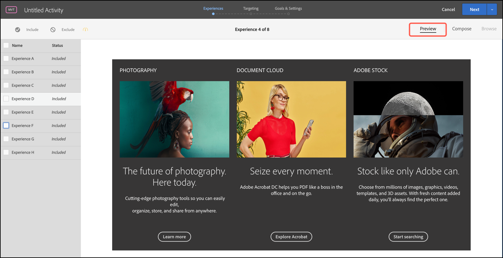

# Aperçu d’expériences pour un [!UICONTROL test multivarié]

Étant donné qu’un [!UICONTROL test multivarié] dans [!DNL Adobe Target] compare plusieurs expériences sur une page, il est utile de prévisualiser la page avec chaque expérience.

1. Dans le [!UICONTROL Compositeur d’expérience visuelle] (VEC), cliquez sur **[!UICONTROL Aperçu]**.

   Une liste de toutes les expériences s’affiche.

   

1. Cliquez sur une expérience dans la liste pour afficher cette expérience.

1. Pour exclure une ou plusieurs expériences du test multivarié, sélectionnez les expériences souhaitées, puis cliquez sur **[!UICONTROL Exclure]**.

   

   Vous pouvez exclure une expérience qui affiche des variations en conflit ou une expérience qui n’est pas équilibrée esthétiquement.

   >[!NOTE]
   >
   >Lors de la création de tests multivariés, vous pouvez exclure plus de 10 % des expériences du test, à condition que vous reconnaissiez l’avertissement selon lequel vous devez utiliser les rapports hors ligne pour l’analyse.

   Par défaut, toutes les expériences sont incluses dans le test multivarié. Pour inclure une expérience qui a été exclue, sélectionnez l’expérience exclue et cliquez sur **[!UICONTROL Inclure]**.

1. Cliquez sur **[!UICONTROL Quitter le mode Aperçu]** pour revenir au [!UICONTROL Compositeur d’expérience visuelle] afin de pouvoir apporter des modifications, ou cliquez sur **[!UICONTROL Continuer]** pour accéder au résumé du test.
