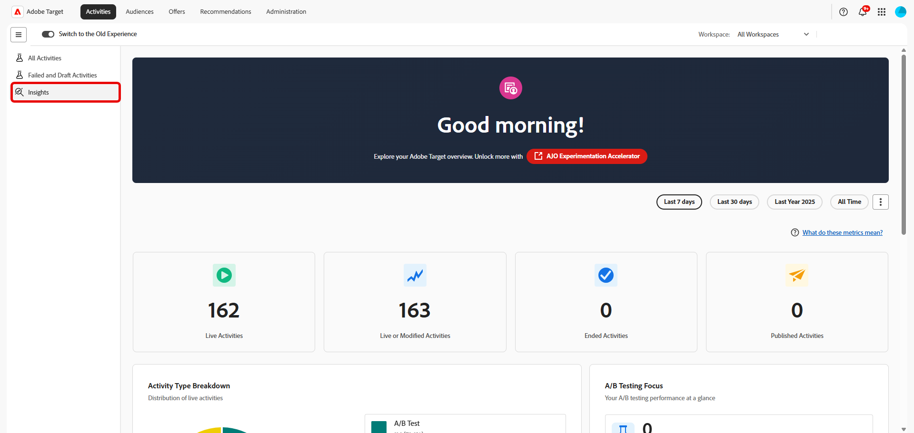
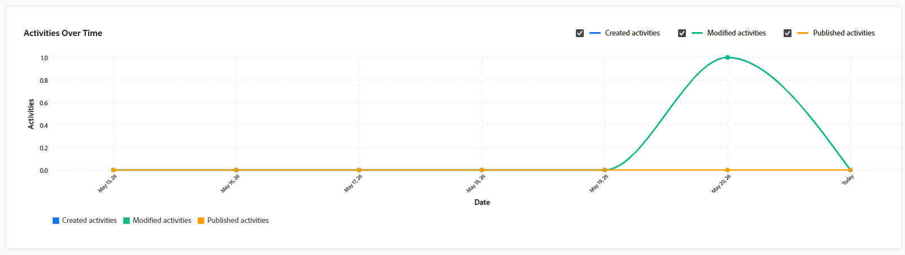

# Tableau de bord des informations Adobe Target

Le tableau de bord  donne une vue d’ensemble de la manière dont votre organisation utilise le [!DNL Adobe Target] au fil du temps. Cela permet aux équipes de comprendre en un coup d’œil l’adoption, le volume d’activités et l’utilisation des expériences.

Le tableau de bord est conçu à la fois pour les utilisateurs et les parties prenantes qui souhaitent une visibilité rapide sur l’utilisation des [!DNL Target] sans avoir à consulter les rapports d’activité individuels.

Lorsque vous consultez ce tableau de bord, tenez compte des points suivants :

* Les mesures peuvent inclure des activités ayant commencé avant ou se terminant après la période sélectionnée.
* Une activité peut être comptabilisée dans plusieurs mesures en fonction de son cycle de vie (par exemple, publiée et terminée).
* Le tableau de bord se concentre sur l’utilisation et l’adoption, et non sur les résultats de performances.

Pour des résultats détaillés, l’effet élévateur ou les performances statistiques, reportez-vous aux [rapports d’activité individuels](../c-reports/reports.md) dans [!DNL Adobe Target].

## 

La bannière de votre tableau de bord permet d’accéder directement à ****, un point d’entrée léger vers des outils qui rationalisent les workflows d’expérimentation et simplifient la configuration, l’analyse et la prise de décision des expériences.

## Sélection de la période

Pour définir la portée des données affichées sur le tableau de bord, sélectionnez une période, par exemple la semaine dernière, l’année dernière ou toute l’heure. La période sélectionnée s’applique de manière cohérente à toutes les mesures et à tous les graphiques du tableau de bord.

Gardez les points suivants à l’esprit lors de l’interprétation des mesures sur la période sélectionnée :

* Certaines mesures reflètent des activités qui étaient actives à tout moment au cours de la période.

* D’autres reflètent les activités qui ont été créées, publiées ou terminées au cours de la période.

* Par conséquent, les totaux des mesures peuvent ne pas s’additionner exactement. Par exemple, de nombreuses activités peuvent être démarrées et terminées dans la même période.

Vous pouvez également exporter un instantané du tableau de bord en sélectionnant **[!UICONTROL Télécharger au format PNG]** dans le menu avancé.

## Mesures

Le tableau de bord organise ses mesures en quatre vues complémentaires, chacune répondant à une question différente sur l’utilisation de vos [!DNL Target] : [KPI](#kpis) donnent un résumé d’un coup d’œil du nombre d’activités, la [répartition des types d’activités](#activity-type-breakdown) indique les fonctionnalités sur lesquelles vous vous appuyez le plus, [mesures de test A/B](#ab-testing-metrics) zoom sur l’utilisation de l’expérimentation et [Activités au fil du temps](#activities-over-time) révèle les tendances sur la période sélectionnée.

### KPI

Les cartes d’indicateurs de performance clés en haut de la page résument en un coup d’œil le nombre d’activités clés pour la période sélectionnée. Chaque carte est axée sur une étape différente du cycle de vie de l’activité : en ligne, modifiée, terminée ou publiée, afin que vous puissiez rapidement évaluer l’utilisation globale et l’impulsion.

La mesure **Total des activités actives** détaille le nombre d’activités qui étaient actives à tout moment au cours de la période sélectionnée. Une activité est considérée comme active si elle diffusait activement du trafic, même si elle a commencé avant ou s’est terminée après la période sélectionnée. Utilisez cette mesure pour :

* Comprenez à quel point [!DNL Target] a été utilisé de manière active au cours de la période.
* Évaluez l’échelle globale de vos efforts de personnalisation et de test.

La mesure **Activités actives ou modifiées** représente le nombre total d’activités de votre organisation qui ont été actives, créées ou modifiées au cours de la période sélectionnée. Utilisez cette mesure pour :

* Comprenez la taille globale de votre bibliothèque d’activités [!DNL Target] et le nombre d’activités utilisées.

* Suivez la croissance à long terme de vos programmes d’expérimentation et de personnalisation.

La mesure **Activités terminées** représente le nombre d’activités ayant atteint une date d’achèvement ou d’arrêt au cours de la période sélectionnée. Utilisez cette mesure pour :

* Comprenez le nombre d’activités terminées au cours de la période.
* Suivre le volume d’achèvement au fil du temps.

La mesure **Activités publiées** détaille le nombre d’activités qui ont été publiées au cours de la période sélectionnée. Une activité est considérée comme publiée lorsqu’elle est mise en ligne pour la première fois. Si une activité est activée, arrêtée, puis réactivée, seule la première occurrence est comptabilisée dans cette mesure. Utilisez cette mesure pour :

* Mesurez le nombre de nouvelles activités qui ont été lancées.
* Comprenez la vitesse de création et de publication des activités.

### Répartition du type d’activité

Le graphique [!UICONTROL Type d’activité] présente la répartition des activités actives par type au cours de la période sélectionnée, notamment :

* [!UICONTROL Test A/B]
* [!UICONTROL Ciblage d’expérience]
* [!UICONTROL Recommandations]
* [!UICONTROL Automated Personalization]
* [!UICONTROL Test multivarié]

Utilisez ce graphique pour identifier les fonctionnalités de [!DNL Target] sur lesquelles votre entreprise repose le plus et pour repérer les opportunités afin d’élargir la combinaison de types d’activités que vous exécutez.

### Mesures de test A/B

{align="center"}

Cette section décrit l’utilisation spécifique aux activités de test **[!UICONTROL A/B]**.

La mesure **[!UICONTROL Nombre total d’activités de test A/B actives]** indique le nombre d’activités de test **[!UICONTROL A/B]** qui étaient actives à tout moment au cours de la période sélectionnée.

Le **[!UICONTROL Nombre total de tests A/B publiés]** indique le nombre d’activités **[!UICONTROL Test A/B]** publiées pendant la période sélectionnée.

Utilisez ces mesures pour comprendre la fréquence d’utilisation des tests A/B et pour suivre le volume et l’adoption des expériences au fil du temps.

### Activités dans le temps

{align="center"}

Le graphique **[!UICONTROL Activités au fil du temps]** suit le nombre d’activités créées, modifiées et publiées sur la période sélectionnée, ce qui facilite la détection des tendances, des pics ou des périodes calmes dans votre programme d’expérimentation.

