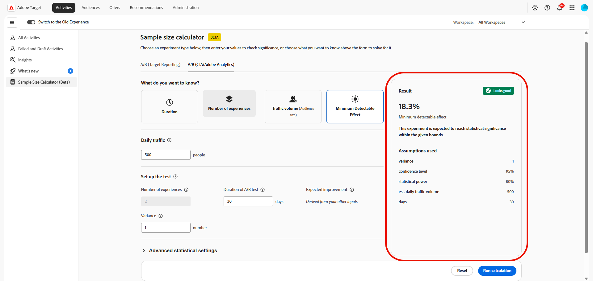

# Calculateur de taille d’échantillon

>[!CONTEXTUALHELP]
>id="target_sample_size_ab_daily_traffic"
>title="Trafic quotidien"
>abstract="Nombre d’utilisateurs et d’utilisatrices participant à l’expérience chaque jour. Si vous ne connaissez pas cette valeur, sélectionnez Volume du trafic ci-dessus. Le calculateur la résoudra à l’aide des autres entrées."

>[!CONTEXTUALHELP]
>id="target_sample_size_confidence_level"
>title="Degré de confiance"
>abstract="Vous devez avoir la certitude qu’un résultat n’est pas dû au hasard avant de le qualifier de significatif. Un degré de confiance de 95 % signifie qu’il y a au maximum 5 % de chances d’obtenir un faux positif. Des valeurs plus élevées réduisent le nombre de faux positifs, mais requièrent également davantage de données."

>[!CONTEXTUALHELP]
>id="target_sample_size_statistical_power"
>title="Puissance statistique"
>abstract="Probabilité de détecter un effet réel s’il existe. Un niveau de puissance de 80 % signifie qu’il y a 80 % de chances de détecter un effet réel. Une puissance plus élevée réduit les faux négatifs, mais nécessite plus de trafic ou une exécution plus longue."

>[!CONTEXTUALHELP]
>id="target_sample_size_setup_cja"
>title="Configurer le test"
>abstract="Ces champs définissent l’expérience, le résultat attendu et le seuil de confiance du résultat. Le champ lié à la valeur que vous avez sélectionnée ci-dessus est résolu automatiquement. Renseignez les champs restants avec les valeurs attendues."

>[!AVAILABILITY]
>
>En utilisant ce calculateur de taille d’échantillon (Beta), vous reconnaissez que le Beta est fourni « en l’état », sans garantie d’aucune sorte. Adobe n&#39;a aucune obligation d&#39;effectuer la maintenance, de corriger, de mettre à jour, de modifier ou d&#39;assurer le support de la version Beta. Il est conseillé de faire preuve de prudence et de ne pas se reposer, de quelque manière que ce soit, sur le bon fonctionnement ou les performances de cette version Beta et/ou des documents associés. La version Beta est considérée comme étant une information confidentielle d&#39;Adobe.  Tout « commentaire » (informations relatives au Beta, y compris, mais sans s’y limiter, les problèmes ou défauts rencontrés lors de l’utilisation du Beta, les suggestions, les améliorations et les recommandations) que vous fournissez à Adobe est par la présente cédé à Adobe. Cela inclut tous les droits, titres et intérêts relatifs à ces commentaires.

Le **[!UICONTROL Calculateur de taille d’échantillon]** vous permet d’estimer les entrées nécessaires pour planifier une expérience avant de la lancer. Le calculateur vous aide à déterminer le volume de trafic dont vous avez besoin, la durée d’exécution du test, le nombre d’expériences à inclure ou l’effet minimum que vous pouvez détecter de manière fiable en fonction des valeurs que vous fournissez.

Pour accéder au **[!UICONTROL Calculateur de taille d’échantillon]**, accédez au menu **[!UICONTROL Activités]**.

## A/B (rapports Target)

>[!CONTEXTUALHELP]
>id="target_sample_size_bonferroni"
>title="Correction de Bonferroni"
>abstract="Ajuste le degré de confiance pour tenir compte de la comparaison simultanée de plusieurs offres par rapport au contrôle. Cela n’a d’importance que lorsque le nombre d’offres est supérieur à deux. Elle correspond à la même correction que celle utilisée dans l’outil Calculateur de cible public d’Adobe."

>[!CONTEXTUALHELP]
>id="target_sample_size_metric_type"
>title="Type de mesure"
>abstract="Type de mesure que vous mesurez. Utilisez un pourcentage pour les résultats binaires, tels que les clics ou les conversions, où chaque utilisateur ou utilisatrice effectue ou non l’action. Utilisez Nombre pour des mesures telles que le chiffre d’affaires ou les pages vues, où la valeur peut varier considérablement d’une personne à l’autre."

>[!CONTEXTUALHELP]
>id="target_sample_size_number_offers"
>title="Nombre d’offres"
>abstract="Nombre d’expériences dans l’expérience, y compris le contrôle. Plus de deux offres appliquent automatiquement une correction de Bonferroni (lorsqu’elle est activée) pour maintenir le degré de confiance global précis à travers toutes les comparaisons."

>[!CONTEXTUALHELP]
>id="target_sample_size_lift"
>title="Effet élévateur"
>abstract="Amélioration relative par rapport à la valeur de référence que vous souhaitez détecter. Saisissez-le en tant que pourcentage de la valeur de référence. Par exemple, une augmentation de 5 % sur un taux de conversion de référence de 11,8 % vise un taux de conversion de 12,39 %."

>[!CONTEXTUALHELP]
>id="target_sample_size_baseline_conversion_rate"
>title="Taux de conversion de ligne de base"
>abstract="Votre taux de conversion actuel avant le début de l’expérience, soit la moyenne du groupe témoin. Cette valeur est toujours requise. Pour les mesures en pourcentage, saisissez un pourcentage tel que 5 pour 5 %. Pour les mesures de comptage, saisissez la valeur décimale brute."

Estimez les entrées requises pour planifier et exécuter un test A/B. Ces valeurs vous aident à décider du volume de trafic dont vous avez besoin, de la durée d’exécution du test et de la taille de l’effet que vous pouvez détecter de manière réaliste.

1. Accédez à l’onglet **[!UICONTROL A/B (Rapports Target)]** pour calculer les entrées de planification d’un test A/B.

1. Activez l’option **[!UICONTROL Appliquer la correction]** pour ajuster votre niveau de confiance afin de tenir compte de la comparaison simultanée de plusieurs offres par rapport au contrôle.

1. Choisissez votre **[!UICONTROL Type de mesure]** :

   * Taux de conversion : utilisez-le pour les résultats binaires tels que les clics ou les achats, où chaque visiteur effectue ou non l’action.
   * Chiffre d’affaires par visiteur : utilisez cette option pour les mesures de style chiffre d’affaires, où les valeurs peuvent varier considérablement d’un visiteur à l’autre.

     

1. Spécifiez le **[!UICONTROL Trafic quotidien]**, soit le nombre d’utilisateurs participant à l’expérience chaque jour.

1. Sous **[!UICONTROL Configurer le test]**, saisissez les valeurs restantes :

   * **[!UICONTROL Nombre d’offres]** : nombre d’expériences dans votre expérience, y compris le contrôle. Plus de deux offres appliquent une correction Bonferroni, lorsqu’elle est activée, pour maintenir le niveau de confiance global.

   * **[!UICONTROL Effet élévateur]** : amélioration relative par rapport à la ligne de base que vous souhaitez détecter. Saisissez-la en tant que pourcentage de la ligne de base, par exemple, une augmentation de 5 % sur un taux de conversion de ligne de base de 11,8 % cible un taux de conversion de 12,39 %.

     

1. Spécifiez le **[!UICONTROL taux de conversion de référence]** de votre expérience actuelle avant le début de l’expérience.

1. Vous pouvez développer **[!UICONTROL Paramètres statistiques avancés]** pour fournir des entrées statistiques supplémentaires lorsqu’elles sont disponibles pour le calcul sélectionné.

   * **[!UICONTROL Niveau de confiance]** : probabilité qu’un résultat ne soit pas dû au hasard. Un taux de 95% autorise une probabilité de 5% d&#39;un faux positif.

   * **[!UICONTROL Puissance statistique]** : probabilité de détecter un effet réel. Une puissance de 80 % réduit les faux négatifs, mais nécessite plus de trafic ou de temps.

1. Sélectionnez **[!UICONTROL Exécuter le calcul]** pour générer l’estimation. Sélectionnez **[!UICONTROL Réinitialiser]** pour effacer les entrées actuelles et recommencer.

Le panneau **[!UICONTROL Résultat]** affiche l’estimation une fois que vous avez renseigné les champs obligatoires et exécuté le calcul. Si les champs obligatoires sont incomplets, le panneau vous invite à saisir les valeurs manquantes.

Le calculateur fournit une estimation pour la planification d’une expérience. Utilisez le résultat avec votre conception d’expérience, le trafic attendu, les performances de base et les exigences statistiques pour décider de la durée d’exécution de l’activité.

## A/B (CJA/Adobe Analytics)

>[!CONTEXTUALHELP]
>id="target_sample_size_number_experiences"
>title="Nombre d’expériences"
>abstract="Nombre de variantes dans votre expérience, contrôle compris. Un test A/B comporte 2 variantes. Cinq variantes plus un contrôle égale 6. Plus de variantes nécessitent proportionnellement plus de trafic pour maintenir la puissance statistique."

>[!CONTEXTUALHELP]
>id="target_sample_size_duration"
>title="Durée du test A/B"
>abstract="Nombre de jours d’exécution de l’expérience. Des durées plus longues donnent à votre expérience plus de temps pour collecter des données, ce qui vous permet de détecter de manière fiable des effets plus petits. Des durées plus courtes nécessitent des effets plus importants ou davantage de trafic quotidien pour obtenir un résultat fiable."

>[!CONTEXTUALHELP]
>id="target_sample_size_expected_improvement"
>title="Amélioration attendue"
>abstract="La plus petite amélioration qui vaille la peine d’être détectée, c’est-à-dire la modification minimale de votre mesure sur laquelle vous agiriez. Il s’agit de la taille de l’effet élévateur en points de pourcentage, et non du changement en pourcentage par rapport à votre ligne de base. Par exemple, si votre ligne de base est de 5 % et qu’un effet élévateur de 1 point de pourcentage est important, saisissez 1."

>[!CONTEXTUALHELP]
>id="target_sample_size_variance"
>title="Variance"
>abstract="Répartition des valeurs de votre mesure, et non la valeur moyenne. Une mesure telle qu’un CTR (principalement des 0 et des 1) présente généralement une faible variance, tandis qu’une mesure telle que le chiffre d’affaires par utilisateur ou utilisatrice peut présenter une variance beaucoup plus élevée. Si vous ne savez pas, laissez la valeur par défaut de 1."

Estimez les entrées de planification pour une activité A/B qui repose sur des données Adobe Analytics ou Customer Journey Analytics. Il vous permet de définir la taille de l’expérience, l’effet élévateur attendu et la durée du test avant de lancer l’activité.

1. Accédez à l’onglet **[!UICONTROL A/B (CJA/Adobe Analytics)]** pour calculer les entrées de planification d’un test A/B.

1. Sous **[!UICONTROL Que voulez-vous savoir ?]**, sélectionnez la valeur que le calculateur doit déterminer :

   * **[!UICONTROL Durée]** : vous avez une expérience en tête et vous souhaitez savoir combien de temps il faudrait pour l’exécuter et si elle vaut la peine d’être exécutée.
   * **[!UICONTROL Nombre d’expériences]** : vous disposez d’un emplacement pour exécuter une expérience et souhaitez déterminer le nombre de traitements que votre trafic peut prendre en charge.
   * **[!UICONTROL Volume de trafic]** : vous avez une expérience en tête et vous souhaitez savoir combien de visiteurs vous devez atteindre la signification statistique.
   * **[!UICONTROL Effet minimal détectable]** : vous avez une expérience que vous souhaitez exécuter, mais vous souhaitez savoir dans quelle mesure vous avez besoin d’un effet élévateur pour atteindre une signification statistique. Cela vous permet d’évaluer si l’expérience vaut la peine d’être exécutée ou planifiée.

   Les champs du formulaire changent en fonction de la valeur sélectionnée. Le calculateur utilise les autres entrées pour déterminer le résultat sélectionné.

   

1. Spécifiez le **[!UICONTROL Trafic quotidien]**, soit le nombre d’utilisateurs participant à l’expérience chaque jour.

1. Sous **[!UICONTROL Configurer le test]**, saisissez les valeurs restantes :

   * **[!UICONTROL Nombre d’expériences]** : nombre de variantes, contrôle inclus. Plus de variantes nécessitent plus de trafic.

   * **[!UICONTROL Durée du test A/B]** : nombre de jours pendant lesquels l’expérience s’exécute. Des tests plus longs peuvent détecter des effets plus petits.

   * **[!UICONTROL Amélioration attendue]** : amélioration attendue de l’expérience.

   * **[!UICONTROL Variance]** : répartition des valeurs de mesure. Un taux de clic publicitaire présente généralement un faible écart, le chiffre d’affaires par utilisateur peut être beaucoup plus élevé. Si vous ne savez pas, laissez la valeur par défaut de 1.

     Découvrez comment calculer une **[!UICONTROL Variance]** dans la documentation [Analytics](https://experienceleague.adobe.com/en/docs/analytics/components/calculated-metrics/calcmetrics-reference/cm-functions#variance)

     

1. Vous pouvez développer **[!UICONTROL Paramètres statistiques avancés]** pour fournir des entrées statistiques supplémentaires lorsqu’elles sont disponibles pour le calcul sélectionné.

   * **[!UICONTROL Niveau de confiance]** : probabilité qu’un résultat ne soit pas dû au hasard. Un taux de 95% autorise une probabilité de 5% d&#39;un faux positif. Des niveaux de confiance plus faibles signifient qu’une diminution du trafic est nécessaire, mais ils augmentent également le risque d’un faux positif.

   * **[!UICONTROL Puissance statistique]** : probabilité de détecter un effet réel. Une puissance de 80 % réduit les faux négatifs, mais nécessite plus de trafic ou de temps.

1. Sélectionnez **[!UICONTROL Exécuter le calcul]** pour générer l’estimation. Sélectionnez **[!UICONTROL Réinitialiser]** pour effacer les entrées actuelles et recommencer.

Le panneau **[!UICONTROL Résultat]** affiche l’estimation une fois que vous avez renseigné les champs obligatoires et exécuté le calcul. Si les champs obligatoires sont incomplets, le panneau vous invite à saisir les valeurs manquantes.

Le calculateur fournit une estimation pour la planification d’une expérience. Utilisez le résultat avec votre conception d’expérience, le trafic attendu, les performances de base et les exigences statistiques pour décider de la durée d’exécution de l’activité.
