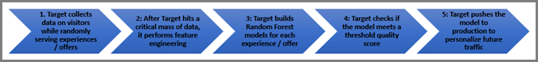

#  Algorithme Forêt aléatoire

Le principal algorithme de personnalisation de Target utilisé à la fois pour Automated Personalization et le ciblage automatique est l’algorithme Forêt aléatoire. Les méthodes d’ensemble telles que la forêt aléatoire utilisent plusieurs algorithmes d’apprentissage pour obtenir de meilleures performances prédictives que celles qui peuvent être obtenues à partir des algorithmes d’apprentissage qui les constituent. L’algorithme Forêt aléatoire du système d’Automated Personalization est une méthode de classification ou de régression qui fonctionne en générant une multitude d’arbres de décision lors de l’apprentissage.

Lorsqu’on pense aux statistiques, on imagine généralement un modèle de régression unique utilisé pour prédire un résultat. Cependant, les dernières recherches en science des données suggèrent que les « méthodes d’ensemble », où plusieurs modèles sont créés à partir du même ensemble de données avant d’être combinés suivant une logique intelligente, offrent de meilleurs résultats qu’une méthode basée sur un modèle unique.

L’algorithme Forêt aléatoire est le principal algorithme de personnalisation sous-jacent utilisé pour les activités d’Automated Personalization et de ciblage automatique. Il combine des centaines d’arbres de décision pour arriver à une meilleure prédiction qu’un seul arbre ne pourrait le faire.

## Qu’est-ce qu’un arbre de décision ? {#section_7F5865D8064447F4856FED426243FDAC}

Un arbre de décision sert à décomposer toutes les données de visite disponibles à partir desquelles un système peut apprendre, puis à regrouper ces données de sorte que les visites incluses dans chaque groupe soient aussi similaires que possible eu égard à la mesure d’objectif. Cependant, entre les groupes, les visites sont aussi différentes que possible eu égard à la mesure d’objectif (par exemple, le taux de conversion). L’arbre de décision examine les différentes variables dont il dispose dans l’ensemble de données d’apprentissage pour déterminer comment répartir les données dans ces groupes (ou « feuilles ») d’une manière mutuellement exclusive et collectivement exhaustive (principe MECE) afin de maximiser cet objectif.

Pour prendre un exemple simple, supposons que nous n’ayons que deux variables d’entrée :

* Sexe (avec deux valeurs possibles, homme ou femme)
* Code postal (avec cinq valeurs possibles dans notre petit ensemble de données : 11111, 22222, 33333, 44444 ou 55555)

Si la mesure d’objectif porte sur la conversion, l’arbre détermine d’abord laquelle de nos deux variables explique la plus grande variation du taux de conversion dans les données de visite.

Disons que le code postal représente le meilleur indicateur de prédiction. Cette variable forme ainsi la première « branche » de l’arbre. L’arbre de décision détermine alors comment répartir les données de visite, de sorte que les taux de conversion des enregistrements de chaque division soient aussi similaires que possible et que les taux de conversion entre les divisions soient aussi différents que possible. Dans notre exemple, nous supposerons que 11111, 22222 et 33333 forment une première division et que 44444 et 55555 constituent une deuxième division.

Cette action génère le premier niveau de notre arbre de décision :

L’arbre de décision pose la question « Quelle est la variable la plus prédictive ? ». Dans notre exemple, nous n’avons que deux variables, donc la réponse dans ce cas est clairement le sexe. L’arbre procède à présent à un exercice similaire pour répartir les données *de chaque branche*. Commençons par examiner la branche 11111, 22222 et 33333. Dans ces codes postaux, si le taux de conversion est différent entre les hommes et les femmes, deux feuilles (hommes et femmes) viennent s’ajouter pour compléter cette branche. Dans l’autre branche, 44444 et 55555, supposons qu’il n’y ait aucune différence statistique entre le taux de conversion des hommes et des femmes. Le cas échéant, la première branche représente la dernière division.

Notre exemple se traduit par l’arbre ci-dessous :

## Comment les arbres de décision sont-ils utilisés par l’algorithme Forêt aléatoire ? {#section_536C105EF9F540C096D60450CAC6F627}

Les arbres de décision peuvent offrir un outil statistique extrêmement puissant. Ils présentent néanmoins certains inconvénients. Ils peuvent notamment « surapprendre » des données, avec pour résultat qu’un arbre individuel prédit incorrectement les données futures qui n’ont pas été utilisées pour générer l’arbre initial. Ce problème est connu sous le nom de [compromis biais-variance](https://en.wikipedia.org/wiki/Bias%E2%80%93variance_tradeoff) en apprentissage statistique. Les forêts aléatoires permettent d’éliminer ce problème de surapprentissage. Au plus haut niveau, une forêt aléatoire est une collection d’arbres de décision générés de manière légèrement différente à partir du même ensemble de données, qui « votent » collectivement pour offrir un meilleur modèle qu’un arbre individuel. Les arbres sont générés en sélectionnant aléatoirement un sous-ensemble d’enregistrements de visites avec remplacement (technique appelée « bagging ») et en sélectionnant aléatoirement un sous-ensemble des attributs, afin que la forêt soit composée d’arbres de décision légèrement différents. Cette méthode introduit de petites variations dans les arbres qui sont créés dans la forêt aléatoire. L’ajout de cette dose de variance contrôlée permet d’améliorer la valeur prédictive de l’algorithme.

## Comment les algorithmes de personnalisation de Target utilisent-ils l’algorithme Forêt aléatoire ? {#section_32FB53CAD8DF40FB9C0F1217FBDBB691}

**Création des modèles**

Le diagramme suivant décrit la création des modèles pour les activités de ciblage automatique et d’Automated Personalization :

1. Target collecte des données sur les visiteurs tandis qu’il diffuse des expériences/offres de façon aléatoire.
1. Après avoir atteint une masse de données critique, Target procède à l’extraction des caractéristiques.
1. Target génère un modèle de forêt aléatoire pour chaque expérience/offre.
1. Target vérifie si le modèle atteint un score de qualité minimal.
1. Target envoie le modèle en production pour personnaliser le trafic à venir.

Target utilise les données qu’il collecte automatiquement et les données personnalisées que vous lui fournissez pour créer ses algorithmes de personnalisation. Ces modèles identifient la meilleure expérience ou offre à présenter aux visiteurs. En général, un modèle est créé pour chaque expérience (s’il s’agit d’une activité de ciblage automatique) ou offre (s’il s’agit d’une activité d’Automated Personalization). Target choisit ensuite d’afficher l’expérience ou l’offre qui produit la mesure de succès attendue la plus élevée (par exemple, le taux de conversion). Ces modèles doivent être optimisés au moyen de visites aléatoires avant de pouvoir être utilisés pour la prédiction. C’est pourquoi lorsqu’une activité démarre, même les visiteurs appartenant au groupe personnalisé sont dirigés aléatoirement vers des expériences ou des offres différentes jusqu’à ce que les algorithmes de personnalisation soient prêts.

Chaque modèle doit être validé pour s’assurer qu’il est capable de prédire correctement le comportement des visiteurs avant d’être utilisé dans votre activité. Les modèles sont validés sur la base de leur ASC (aire sous la courbe). Comme les modèles doivent être validés, le moment exact où un modèle commencera à diffuser des expériences personnalisées dépend du niveau de détail des données. En pratique, et en raison des impératifs de planification du trafic, le nombre minimal de conversions n’est généralement pas suffisant pour valider chaque modèle.

Lorsqu’un modèle est validé pour une expérience ou une offre, l’icône d’horloge située à gauche du nom de l’expérience/offre se transforme en case à cocher verte. Lorsqu’un modèle valide est disponible pour au moins deux expériences/offres, certaines visites commencent à être personnalisées.

**Transformation des caractéristiques **

Avant d’être traitées par l’algorithme de personnalisation, les données font l’objet d’une transformation des caractéristiques, qui peut s’apparenter à une préparation des données collectées dans les enregistrements d’apprentissage en vue de leur utilisation par les modèles de personnalisation.

Les transformations des caractéristiques dépendent du type d’attribut. Il existe principalement deux types d’attributs (ou « caractéristiques », comme ils sont parfois appelés par les analystes en données) :

* **Catégorielle :** les caractéristiques catégorielles ne peuvent pas être dénombrées mais peuvent être triées en différents groupes. Il peut s’agir de caractéristiques telles que le pays, le sexe ou le code postal.
* **Numérique :** les caractéristiques numériques peuvent être mesurées ou dénombrées, par exemple l’âge, le revenu, etc.

Pour les caractéristiques catégorielles, un jeu de toutes les caractéristiques possibles est conservé et la transformation de probabilité est utilisée pour réduire la taille des données. Pour les caractéristiques numériques, la remise à l’échelle garantit que les caractéristiques sont comparables dans leur ensemble.

**Équilibrage de l’apprentissage et de la personnalisation grâce au bandit à plusieurs bras**

Une fois que Target dispose de modèles de personnalisation pour personnaliser votre trafic, vous êtes confronté à un dilemme pour les futurs visiteurs de votre activité : vaut-il mieux personnaliser tout le trafic sur la base du modèle actuel ou continuer d’apprendre des nouveaux visiteurs en leur présentant aléatoirement des offres aléatoires ? Vous devez vous assurer que l’algorithme de personnalisation assimile sans cesse les nouvelles tendances qui se dégagent du comportement de vos visiteurs, tout en personnalisant l’essentiel du trafic.

Target s’appuie sur le concept du bandit à plusieurs bras pour vous aider à atteindre cet objectif. Le bandit à plusieurs bras garantit que le modèle utilise toujours une petite partie du trafic pour continuer d’apprendre tout au long de la vie de l’activité et prévenir la surexploitation des tendances apprises précédemment.

En science des données, le problème du bandit à plusieurs bras est un exemple classique du dilemme exploration-exploitation, où un joueur fait face à une série de bandits manchots dont la probabilité de récompense est inconnue. L’idée clé est de développer une stratégie qui résulte en ce que le bras doté de la plus haute probabilité de succès soit joué afin que la récompense totale soit maximisée. Le bandit à plusieurs bras est utilisé dans le système pour la notation en ligne une fois que les modèles en ligne sont créés, aidant ainsi l’apprentissage en ligne au cours de l’exploration. L’algorithme à plusieurs bras actuel est l’algorithme gourmand epsilon (ε). Dans cet algorithme, avec la probabilité 1- ε, le meilleur bras est choisi. Et avec la probabilité ε, n’importe quel autre bras est choisi de manière aléatoire.
