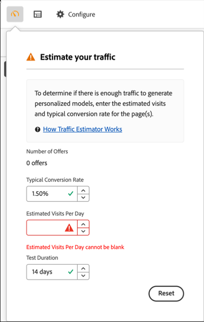

# Estimation du trafic requis pour réussir un test

Le [!UICONTROL Traffic Estimator] [!DNL Adobe Target] fournit des commentaires qui vous permettent de savoir si vous disposez d’un trafic suffisant pour que votre activité [!UICONTROL Automated Personalization] (AP) réussisse.

Comme les activités [!UICONTROL Automated Personalization] utilisent plusieurs combinaisons d’offres, il est important de connaître la quantité de trafic requise pour fournir des résultats significatifs. Le [!UICONTROL Traffic Estimator] utilise des statistiques sur votre page et le nombre d’expériences testées pour estimer la quantité de trafic et la durée de test nécessaires pour que l’activité réussisse.

Le [!UICONTROL Traffic Estimator] détermine s’il y a suffisamment de trafic pour générer des modèles personnalisés en comparant les impressions de page estimées et le taux de conversion type des pages. Idéalement, pour une activité réussie, la taille d’échantillon appropriée garantit que le contenu personnalisé est prêt au bout de 50 % de la durée de l’activité ou 14 jours, selon la durée la plus courte. Ce processus laisse suffisamment de temps pour obtenir du contenu personnalisé et apprendre quel contenu diffuser.

N’oubliez pas que [!DNL Target] diffuse les expériences de manière aléatoire jusqu’à ce que les algorithmes de personnalisation soient créés. L’icône en forme de coche en regard de chaque offre s’affiche lorsque le modèle de cette offre est prêt et que [!DNL Target] peut commencer à diffuser du contenu personnalisé. Comme l’effet élévateur n’est attendu qu’une fois les modèles prêts, l’indication visuelle vous permet de définir l’attente appropriée. Utilisez l’[!UICONTROL Traffic Estimator] dans le [!UICONTROL Visual Experience Composer] (VEC) pour obtenir des instructions sur le moment où les modèles sont prêts.

## Utilisation de l’estimateur de trafic

1. Dans la page [!UICONTROL Experiences] de l’[!UICONTROL Visual Experience Composer] dans une activité [!UICONTROL Automated Personalization], cliquez sur l’icône **[!UICONTROL Traffic]** (  ) dans le coin supérieur gauche de la page [!UICONTROL Experiences].

   La [!UICONTROL Traffic Estimator] s’ouvre.

   

   Vous pouvez de nouveau cliquer sur l’icône pour masquer le [!UICONTROL Traffic Estimator].

1. Spécifiez le taux de conversion type (ou le taux de conversion attendu de cette activité), les impressions d’activité estimées par jour et la durée du test.

   | Mesure | Description |
   | --- | --- |
   | **[!UICONTROL Number of Offers]** | Cette mesure est calculée automatiquement en fonction du nombre d’expériences créées dans le cadre de votre activité, après les exclusions. |
   | **[!UICONTROL Typical Conversion Rate]** | Cette mesure est exprimée en pourcentage, en fonction de votre estimation ou des données antérieures de votre système d’analyse. |
   | **[!UICONTROL Estimated Visits Per Day]** | Cette mesure correspond au nombre de visites par jour des visiteurs et visiteuses qui peuvent visualiser l’activité, en fonction des critères de ciblage. Cette mesure peut être basée sur vos données d’analyse. Ce nombre doit être celui des visites, et non des visiteurs uniques. |
   | **[!UICONTROL Test Duration]** | Nombre de jours pendant lesquels vous souhaitez que l’activité s’exécute. |

   Le [!UICONTROL Traffic Estimator] utilise ces mesures pour déterminer les ajustements nécessaires à l’exécution d’un test réussi.

   Près de la partie supérieure du [!UICONTROL Traffic Estimator], les valeurs que vous avez saisies sont calculées et les résultats sont affichés.

   

   Lorsque vous modifiez les valeurs, l’estimation change. Par exemple, si vous testez de nombreuses combinaisons et que votre taux de conversion et vos impressions sont trop faibles, la [!UICONTROL Traffic Estimator] indique combien de temps l’exécution du test doit durer pour réussir. Ou, si votre trafic est faible, le [!UICONTROL Traffic Estimator] peut suggérer un nombre inférieur de combinaisons d’offres afin que vous puissiez exécuter le test pendant le nombre de jours souhaité.

   Si le trafic est insuffisant, tenez compte des points suivants :

   * Envisagez d’utiliser une activité [[!UICONTROL Auto-Target]](/help/main/c-activities/auto-target/auto-target-to-optimize.md) au lieu de [!UICONTROL Automated Personalization] pour créer des expériences avec plusieurs changements d’offre dans une variation d’expérience.
   * Réduisez le nombre de combinaisons d’offres dans votre activité [!UICONTROL Automated Personalization].
   * Augmentez la durée de l’activité.

   Ajustez les nombres jusqu’à ce que le [!UICONTROL Traffic Estimator] indique que vous disposez d’un trafic suffisant, puis concevez votre test en conséquence.

   

   Si le trafic est suffisant, l’icône [!UICONTROL Traffic] affiche une vérification verte. S’il est insuffisant, l’icône affiche une étiquette d’avertissement rouge.

## Questions fréquentes sur l’estimateur de trafic

Tenez compte des questions fréquentes suivantes lorsque vous utilisez le [!UICONTROL Traffic Estimator] :

### Pourquoi les modèles personnalisés ne sont-ils pas créés même si mon activité AP a suffisamment de trafic ?

Dans certains cas, votre trafic est suffisamment important pour qu’un modèle personnalisé soit créé, mais ce trafic peut [!DNL Target] informer qu’il n’existe aucune différence significative entre le modèle personnalisé et le aléatoire. Bien que le modèle soit créé et testé en [!DNL Target], il n’est pas déployé, car il n’est pas meilleur que aléatoire.

Une raison possible pour laquelle le modèle n’est pas meilleur que aléatoire peut être que les offres ne sont pas suffisamment différentes les unes des autres. Si tel est le cas, vous pouvez essayer de rendre les offres plus visuellement différentes si le message est similaire, ou vous pouvez essayer de modifier le message lui-même.
