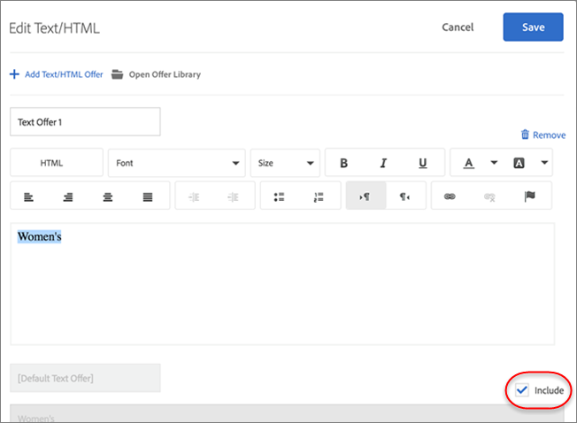

# Gestion des exclusions

Contrôlez votre stratégie  (AP) en maîtrisant les exclusions. Que vous préviez les offres en double, affiniez les combinaisons d’expériences ou supprimiez le contenu par défaut, les exclusions vous permettent de proposer des expériences plus propres et plus pertinentes, conformes à vos objectifs et aux attentes de votre audience.

## Autoriser ou interdire les offres en double {#concept_4EF78013F80E48EFA024AE0274C9F037}

Empêcher la duplication des offres de la bibliothèque des offres lorsqu&#39;elles sont utilisées à différents emplacements dans des activités AP.

Vous pouvez par exemple avoir une activité avec six emplacements sur une page comportant 12 offres. Il existe un risque que la même offre soit placée dans un ou plusieurs emplacements de cette activité. Cette fonctionnalité permet d’empêcher l’affichage simultané d’offres en double à différents emplacements d’une même activité.

1. Lors de la [création ou modification d’une activité AP](/help/main/c-activities/t-automated-personalization/create-ap-activity.md), cliquez sur l’icône **[!UICONTROL Configurer]** (  ) > cliquez sur l’icône **[!UICONTROL Autoriser les offres en double]** pour activer ou désactiver cette fonctionnalité, selon vos besoins.

## Exclure des expériences spécifiques {#task_C17D36EF58AF4908B17A3D84CA6DE85A}

Excluez des expériences spécifiques si vous souhaitez exclure certaines combinaisons d’offres de votre activité AP.

Certaines combinaisons peuvent ne pas fonctionner ensemble, ou vous pouvez limiter le nombre d’expériences testées afin de réduire les exigences de trafic pour votre activité.

1. Lors de la [création ou modification d’une activité AP](/help/main/c-activities/t-automated-personalization/create-ap-activity.md), cliquez sur l’icône **Gérer le contenu** (  ).

   La liste [!UICONTROL Expériences] indique chaque expérience générée à partir des permutations de toutes les options de contenu et de lieu.

1. Excluez d’autres expériences, selon les besoins.

   Vous pouvez exclure des expériences spécifiques en cliquant sur l’icône [!UICONTROL **Plus d’actions**] (  ), puis sur [!UICONTROL **Exclure**].

   Vous pouvez également exclure des expériences par lots en cochant les cases correspondant aux expériences pertinentes, puis en cliquant sur **[!UICONTROL Exclure]**. L’icône [!UICONTROL Exclure] s’affiche lorsqu’une ou plusieurs expériences sont cochées.

   

   Les expériences sont désormais exclues de l’activité et leur [!UICONTROL Statut] s’affiche comme [!UICONTROL Exclus].

## Exclure le contenu par défaut {#task_DCB4528989DF4C05A3A4729E5891D18F}

Parfois, vous pouvez ne pas vouloir inclure votre contenu par défaut dans votre activité AP. Vous pouvez utiliser cette méthode pour n’avoir qu’une seule offre (différente de votre contenu par défaut) à un emplacement dans le cadre de votre activité.

L’exclusion de contenu par défaut est un excellent moyen de modifier l’aspect du reste de la page pour l’adapter aux offres que vous testez avec votre activité AP. Supposons par exemple que vous souhaitiez faire correspondre la palette de couleurs des offres que vous testez ; dans ce cas, vous pouvez modifier la couleur d’arrière-plan de votre page et exclure la couleur d’arrière-plan par défaut.

**Pour exclure le contenu par défaut à l’aide du [!UICONTROL compositeur d’expérience visuelle] (VEC) :**

1. Lors de la [création ou modification d’une activité AP](/help/main/c-activities/t-automated-personalization/create-ap-activity.md), sélectionnez le contenu à remplacer et cliquez pour accéder à **[!UICONTROL Modifier le texte/l’HTML]**, **[!UICONTROL Modifier l’offre d’image]** ou **[!UICONTROL Modifier la couleur d’arrière-plan]**. Les options disponibles varient en fonction du type de contenu.

   
1. Créez votre nouveau contenu.

1. Cliquez sur l’icône **[!UICONTROL Plus d’actions]** (  ), puis sur le bouton (bascule) **Exclure l’offre par défaut/Inclure l’offre par défaut**/ pour exclure ou inclure l’offre par défaut.

   <!--
   Depending on the content or offer type, the [!UICONTROL Include] checkbox is in a slightly different place. 

   For Text/HTML content: 

   

   For Image/Video content: 

   

   For background color: 

   
   -->

<!--
1. Click **[!UICONTROL Save]**.

   You can see the experiences created from the offers you specified under [!UICONTROL Manage Content]. You notice that no experiences are created in [!UICONTROL Manage Content] using the default offer you excluded. 

   

**To exclude default content using the [!UICONTROL Form-Based Experience Composer]:** 

1. While creating or editing an AP activity, click **[!UICONTROL Change Text/HTML]** or **[!UICONTROL Change Image Offer]** under **[!UICONTROL Content]**. 
1. In the dialog box, create your new content and uncheck **[!UICONTROL Include]** to the right of the default content (or uncheck the Default Image/Video in the [!UICONTROL Select Content] screen). 

   Depending on the content or offer type, the [!UICONTROL Include] checkbox is in a slightly different place. 

   For Text/HTML content: 

   

   For Image/Video content: 

   

1. Click **[!UICONTROL Save]**. 

   You can see the experiences created from the offers you specified under [!UICONTROL Manage Content]. You notice that no experiences are created in [!UICONTROL Manage Content] using the default offer you excluded. 

   
-->
