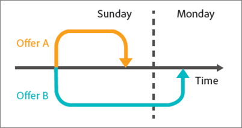

# Dix écueils courants des tests A/B et comment les éviter

Les tests A/B dans [!DNL Adobe Target] constituent la colonne dorsale de la plupart des programmes d’optimisation de marketing digital. Ils permettent aux spécialistes marketing de proposer à leur clientèle et aux visiteurs et visiteuses des contenus optimisés et ciblés. Cet article décrit dix des écueils les plus significatifs auxquels les entreprises sont confrontées lorsqu’elles effectuent des tests A/B. Elle décrit également des moyens de les éviter, de sorte que votre entreprise puisse accroître son retour sur investissement au moyen de tests et optimiser le degré de confiance des résultats des tests A/B.

## Écueil 1 : ignorer les effets du niveau de pertinence {#section_55F5577A13C6470BA1417C2B735C6B1D}

Quelle est la probabilité que votre test signale une différence significative du taux de conversion entre deux offres alors qu’il n’y a en réalité aucune différence ? C’est ce que permet de déterminer le *niveau de pertinence* d’un test. De telles découvertes trompeuses sont souvent qualifiées de faux positifs, et dans le monde des statistiques, sont appelées une erreur de type I (si vous rejetez incorrectement l&#39;hypothèse nulle vraie).

Lorsque vous spécifiez le niveau de pertinence d’un test A/B, vous devez faire un compromis entre accepter qu’une expérience est meilleure que l’autre alors qu’elle ne l’est pas vraiment (erreur de type I ou « faux positif ») et ne voir aucune différence statistique entre les expériences alors qu’il existe une vraie différence (erreur de type II ou « faux négatif »). Le *degré de confiance* est déterminé avant l’exécution du test.

La variable *intervalle de confiance*, qui est déterminé une fois le test terminé, est affecté par trois facteurs clés :

* Taille de l’échantillon du test
* Niveau de pertinence
* Écart type sur la population

Dans la mesure où le marketeur a sélectionné le niveau de pertinence avant la conception du test et où l’écart type de population ne peut pas être influencé, le seul facteur « contrôlable » est la taille de l’échantillon. La taille d’échantillon requise pour un intervalle de confiance qui vous convient, ainsi que le temps nécessaire pour l’atteindre, sont des éléments clés qui doivent être déterminés pendant la conception du test.

L’approche du *degré de confiance*, un autre terme directement lié, est plus positive. Plutôt que d’indiquer la probabilité que vous obteniez un faux positif, comme le fait le niveau de pertinence, le degré de confiance représente la probabilité que votre test ne commette pas cette erreur.

Les niveaux de confiance et de signification sont directement liés car :

100 % - degré de confiance = niveau de pertinence

Dans les tests A/B, les marketeurs appliquent souvent des niveaux de confiance de 95 %. D’après l’équation ci-dessus, cela correspond visiblement à un niveau de pertinence de 5 %. Un test présentant un degré de confiance de 95 % signifie que vous avez 5 % de chance de détecter un effet élévateur statistiquement significatif, même si, en réalité, il n’y a aucune différence entre les offres.

Comme le montre le graphique ci-dessous, plus vous exécutez de tests, plus l’un de ces tests est susceptible d’engendrer un faux positif. Par exemple, si vous exécutez 10 tests à l’aide d’un degré de confiance de 95 %, il y a environ 40 % de chances que vous détectiez un ou plusieurs faux positifs (étant donné qu’il n’y a aucun effet élévateur réel : Pr(au moins un faux positif) = 1 - Pr(pas de faux positifs) = 1 - 0,95^10 = 40 %).

Dans une organisation marketing, 95 % constitue généralement un compromis raisonnable entre le risque d’un faux positif et d’un faux négatif.

Toutefois, deux situations exigent de s’intéresser de près au niveau de pertinence et à ses implications dans les résultats du test : la segmentation post-test et le test de plusieurs offres.

* **Segmentation post-test :** les marketeurs décortiquent souvent les résultats d’un test A/B terminé en fonction des segments de visiteurs.  Les segments courants comprennent le type de navigateur, le type d’appareil, les zones géographiques, l’heure de la journée et les nouveaux visiteurs par rapport aux visiteurs récurrents. Cette pratique, appelée segmentation post-test, permet d’obtenir d’excellentes informations sur les segments de visiteurs. En retour, les marketeurs peuvent utiliser ces informations pour créer du contenu mieux ciblé, plus pertinent et différencié.

  Si le taux de conversion ne présente aucune réelle différence, la probabilité d’un faux positif équivaut au niveau de pertinence chaque fois que vous testez un segment. Et, comme mentionné, plus vous exécutez de tests, plus vous avez de chances d’avoir au moins un faux positif parmi ces tests. Par essence, chaque segment post-test représente un test distinct. Avec un niveau de pertinence de 5 %, vous tombez en moyenne sur un faux positif chaque fois que vous examinez 20 segments post-test. Le tableau ci-dessus illustre de quelle façon cette probabilité augmente.

  Plus vous exécutez de tests, plus il est probable que vous rencontriez au moins un faux positif parmi ces tests. Par essence, chaque segment post-test représente un test distinct, ce qui augmente la probabilité d’un faux positif. Cette augmentation peut être encore plus importante si les segments sont corrélés.

  Ne devriez-vous pas effectuer de segmentation post-test ? Non. Les segments post-test sont utiles. Pour éviter ce problème de multiplication des faux positifs liés à la segmentation post-test, envisagez de tester le segment post-test identifié dans un nouveau test. Vous pouvez également appliquer la correction Bonferroni, présentée ci-dessous.

* **Test de plusieurs offres :** les marketeurs comparent fréquemment plus de deux offres (ou expériences) les unes aux autres. C’est pourquoi certaines solutions de test A/B, appelées A/B/n, sont parfois utilisées, où n correspond au nombre d’offres que vous testez simultanément.

  Il convient de noter que *chaque* offre testée présente un taux de faux positifs égal au niveau de pertinence, comme décrit ci-dessus. Là encore, vous exécutez en fait plusieurs tests quand plusieurs offres sont comparées les unes aux autres au sein d’un seul environnement de test. Si, par exemple, vous comparez cinq offres dans un test A/B/C/D/E, vous composez quatre comparaisons : contrôle à B, contrôle à C, contrôle à D et contrôle à E. Avec un degré de confiance de 95 %, vous obtenez en fait un résultat de 18,5 %, plutôt que la probabilité de 5 % d’un faux positif. 

  Pour que votre degré de confiance global reste à 95 % et afin d’éviter ce problème, vous appliquez ce qu’on appelle la correction Bonferroni. En appliquant cette correction, vous divisez simplement le niveau de pertinence par le nombre de comparaisons afin d’obtenir le niveau de pertinence qui doit être de 95 %.

  Pour appliquer la correction Bonferroni à l’exemple ci-dessus, vous utiliseriez un niveau de pertinence de 5 %/4 = 1,25 %, ce qui revient à un degré de confiance de 98,75 % pour un test individuel (100 % - 1,25 % = 98,75 %). Cette correction permet de maintenir le degré de confiance réel à 95 % avec quatre tests, comme dans l’exemple décrit.

## Écueil 2 : déclarer les gagnants de plusieurs tests d’offre sans aucune différence statistiquement significative {#section_FA83977C71DB4F69B3D438AF850EF3B6}

En cas de test de plusieurs offres, les marketeurs désignent généralement l’offre ayant l’effet élévateur le plus élevé comme gagnante du test, même s’il n’existe aucune différence statistiquement significative entre le gagnant et l’expérience venant juste après. Cette situation se produit quand la différence entre les alternatives est inférieure à la différence entre les alternatives et l’expérience de contrôle. La figure ci-dessous illustre ce concept ; les marges d’erreur (traits noirs) représentent des intervalles de confiance d’effet élévateur de 95 %. L’effet élévateur réel pour chaque offre par rapport à l’offre de contrôle est 95 % susceptible d’être inclus dans l’intervalle de confiance (la marge représentée par les traits d’erreur).

Les offres A et B ont l’effet élévateur le plus élevé observé au cours du test et il est peu probable que l’offre C surpasse ces offres dans un test ultérieur, car l’intervalle de confiance de C ne chevauche pas les intervalles de confiance de A ou B. Cependant, même si l’offre A présente l’effet élévateur observé le plus élevé au cours du test, il est possible que l’offre B puisse être plus performante lors d’un prochain test, car les intervalles de confiance se chevauchent.

On peut conclure ici que les offres A et B doivent être toutes deux considérées comme des gagnantes du test.

Il n’est généralement pas possible d’exécuter le test suffisamment longtemps pour déterminer la performance relative réelle des alternatives. Souvent, la différence de performance entre les alternatives est trop infime pour avoir un réel impact sur le taux de conversion. Dans de tels cas, vous pouvez interpréter les résultats comme un match nul et faire intervenir d’autres critères, tels que la stratégie ou l’alignement avec d’autres éléments de la page, afin de déterminer quelle offre mettre en œuvre. Avec plusieurs tests, vous devez être ouvert à plus d’un gagnant, ce qui ouvre parfois considérablement les possibilités d’orientation pour le développement de votre site web.

Si vous souhaitez identifier l’offre présentant le taux de conversion le plus élevé, vous comparez toutes les offres à toutes les autres offres. Dans l’exemple ci-dessus, vous avez n = 5 offres - vous devez effectuer n(n-1)/2 comparaisons, soit 5 &#42; (5-1)/2 = 10 comparaisons. Dans ce cas, la correction de Bonferroni exige que le niveau de pertinence du test soit de 5 %/10 = 0,5 %, ce qui correspond à un degré de confiance de 99,5 %. Cependant, un tel degré de confiance peut nécessiter d’exécuter le test sur une période déraisonnable.

## Écueil 3 : ignorer les effets de l’efficacité statistique {#section_0D517079B7D547CCAA75F80981CBE12A}

La puissance statistique est la probabilité qu’un test détecte une différence réelle de taux de conversion entre les offres. En raison de la nature aléatoire ou &quot;stochastique&quot; des événements de conversion, un test peut ne pas montrer de différence statistiquement significative, même lorsqu’une différence réelle existe dans le taux de conversion entre deux offres au final. Hasard ou coïncidence ? On appelle faux négatif ou erreur de type II l’incapacité à détecter une différence réelle du taux de conversion.

Deux facteurs principaux déterminent la robustesse d’un test. Le premier est la taille de l’échantillon, c’est-à-dire le nombre de visiteurs inclus dans le test. Le second est l’ampleur de la différence de taux de conversion que vous souhaitez que le test détecte. C’est peut-être intuitif, mais si vous souhaitez ne détecter que les différences de taux de conversion importantes, il y a une probabilité plus élevée que le test détecte réellement de telles différences. De même, plus la différence que vous souhaitez détecter est faible, plus la taille de l’échantillon dont vous aurez besoin est importante et plus il faudra de temps pour l’atteindre.

Aujourd’hui, les marketeurs tendent à sous-estimer un nombre non négligeable de tests. En d’autres termes, ils utilisent une taille d’échantillon trop petite, ce qui signifie qu’ils risquent de ne pas détecter de vrais positifs, même si les taux de conversion présentent une différence substantielle. En fait, si vous sous-estimez continuellement la taille d’échantillon des tests que vous exécutez, le nombre de faux positifs peut être comparable au nombre de vrais positifs, voire le dominer. Il en résulte bien souvent la mise en œuvre de changements neutres sur un site (une perte de temps), voire de changements qui réduisent les taux de conversion.

Afin d’éviter cela, partez du principe qu’un test bien conçu comprend généralement un degré de confiance de 95 % et une efficacité statistique de 80 %. Un tel test offre une probabilité de 95 % d’éviter un faux positif et une probabilité de 80 % d’éviter un faux négatif.

## Écueil 4 : utiliser des tests unilatéraux {#section_8BB136D1DD6341FA9772F4C31E9AA37C}

Avec les tests unilatéraux, la différence observée des taux de conversion des offres n’a pas à être très importante pour pouvoir désigner un gagnant à un certain niveau de pertinence. Ce type de test semble plaire, car les gagnants peuvent être appelés plus tôt et plus souvent que lors de l’utilisation de tests bilatéraux. Ces tests ne sont toutefois pas sans inconvénient.

Lors d’un test unilatéral, vous évaluez si l’offre B est plus performante que l’offre A. L’orientation du test doit être déterminée au préalable – ou « a priori » dans le jargon statistique. En d’autres termes, vous devez choisir d’évaluer si l’offre B est plus performante que l’offre A ou vice versa *avant* de lancer le test. Si toutefois, en observant les résultats du test A/B, vous constatez que l’offre B est plus performante que l’offre A *puis* décidez d’exécuter un test unilatéral afin de déterminer si cette différence est significative sur le plan statistique, vous dérogez aux hypothèses sous-jacentes du test statistique. Cela signifie que vos intervalles de confiance ne sont pas fiables et que le test présente un taux de faux positifs plus élevé que prévu.

Un test unilatéral reviendrait à faire le procès d’une offre devant un juge qui a déjà pris sa décision : Dans un test unilatéral, vous avez déjà décidé ce qu’est l’offre gagnante et vous voulez la prouver, plutôt que de donner à chaque expérience une chance égale de se prouver comme gagnante. Utilisez des tests unilatéraux seulement dans les rares cas où vous cherchez seulement à déterminer si une offre est plus performante que l’autre et non l’inverse. Afin d’éviter les inconvénients d’un test unilatéral, exécutez plutôt une solution de tests A/B (tests bilatéraux), telle qu’[!DNL Adobe Target].

## Écueil 5 : surveiller les tests {#section_EA42F8D5967B439284D863C46706A1BA}

Les marketeurs surveillent fréquemment les tests A/B jusqu’à ce qu’ils en obtiennent un résultat significatif. Après tout, pourquoi exécuter un test après avoir obtenu un résultat statistiquement significatif ?

Ce n’est malheureusement pas aussi simple. Il s’avère en fait que le fait de surveiller les résultats impacte négativement la signification statistique efficace du test, Cela augmente considérablement la probabilité de faux positifs et rend vos intervalles de confiance peu fiables.

Cela peut sembler déroutant. Nous avons l’air d’affirmer que le simple fait d’observer les résultats d’un test à mi-parcours pourrait leur faire perdre leur signification statistique. Ce n’est pas exactement le cas. La raison est illustrée dans l’exemple suivant.

Supposons que vous simuliez 10 000 événements de conversion de deux offres, les deux offres présentant un taux de conversion de 10 %. Les taux de conversion étant identiques, l’effet élévateur des deux offres testées l’une par rapport à l’autre ne devrait présenter aucune différence. Avec un intervalle de confiance de 95 %, le test produit un taux prévu de 5 % de faux positifs au moment de son évaluation après avoir récupéré 10 000 observations. Ainsi, si nous exécutons 100 de ces tests, nous obtenons en moyenne cinq faux positifs (en réalité, tous les positifs sont faux dans cet exemple, car il n’y a aucune différence de taux de conversion entre les deux offres). Cependant, si nous évaluons le test dix fois pendant le test (toutes les 1 000 observations), il s&#39;avère que le taux de faux positifs grimpe jusqu&#39;à 16 %. Ainsi, l’observation du test a plus que triplé le risque de faux positifs. Comment cela s’explique-t-il ?

Pour comprendre pourquoi cela se produit, vous devez tenir compte des différentes actions entreprises lorsqu’un résultat significatif est détecté et lorsqu’il n’est pas détecté. Si un test statistiquement significatif est détecté, il est interrompu et un gagnant est déclaré. Si, en revanche, le résultat n’est pas statistiquement significatif, nous le laissons se poursuivre. Cette situation favorise considérablement les résultats positifs et fausse donc le niveau de pertinence réel du test.

Pour éviter ce problème, vous devez déterminer la durée appropriée d’exécution du test avant de lancer le test. Bien qu’il soit correct d’examiner les résultats du test pendant ce dernier pour vous assurer que vous avez correctement mis en oeuvre le test, ne tirez pas de conclusions ou n’arrêtez pas le test avant que le nombre requis de visiteurs ne soit atteint. Autrement dit, patience !

## Écueil 6 : interrompre les tests de manière prématurée {#section_DF01A97275E44CA5859D825E0DE2F49F}

Il est tentant d’arrêter un test si l’une des offres est plus ou moins performante que les autres dans les premiers jours du test. Toutefois, si le nombre d’observations est faible, il existe une forte probabilité que vous observiez par hasard un effet élévateur positif ou négatif, puisque le taux de conversion est calculé d’après un petit nombre de visiteurs. Les taux de conversion convergent vers leurs valeurs réelles sur le long terme au fur et à mesure que le test collecte davantage de points de données.

L’illustration ci-dessous présente cinq offres ayant le même taux de conversion sur le long terme. Le taux de conversion de l’offre B était médiocre pour les 2 000 premiers visiteurs et est revenu à sa valeur réelle après une longue période.

Ce phénomène est connu sous le nom de &quot;régression vers la moyenne&quot; et peut entraîner une déception lorsqu’une offre qui s’est bien comportée pendant les premiers jours d’un test ne parvient pas à maintenir ce niveau de performance en fin de compte. Cela peut également entraîner la perte de recettes lorsqu’une bonne offre n’est pas mise en oeuvre, car elle s’est avérée être sous-performante dans les premiers jours d’un test par hasard.

De même que pour l’observation des tests, il convient pour éviter ces problèmes de déterminer un nombre adéquat de visiteurs avant d’exécuter le test, puis de laisser le test s’exécuter jusqu’à ce que ce nombre de visiteurs ait été exposé aux offres.

## Écueil 7 : modifier l’affectation du trafic au cours de la période de test {#allocation}

Nous vous recommandons de ne pas modifier les pourcentages d’affectation du trafic au cours de la période de test, car cela peut biaiser les résultats de test avant la normalisation des données.

Supposons, par exemple, que vous ayez un test A/B dans lequel 80 % du trafic est affecté à l’expérience A (contrôle) et 20 % du trafic à l’expérience B. Au cours de la période de test, vous définissez l’allocation sur 50 % pour chaque expérience. Quelques jours plus tard, vous définissez l’affectation du trafic sur 100 % pour l’expérience B.

Dans ce scénario, comment les utilisateurs sont-ils affectés à des expériences ?

Si vous modifiez manuellement la répartition de l’affectation à 100 % pour l’expérience B, les visiteurs ayant été affectés, à l’origine, à l’expérience A (le contrôle) restent dans l’expérience initialement affectée (expérience A). Le changement de l’affectation du trafic n’affecte que les nouveaux entrants.

Si vous souhaitez modifier des pourcentages ou affecter considérablement le flux des visiteurs dans chaque expérience, nous vous recommandons de créer une activité ou de copier l’activité, puis de modifier les pourcentages d’affectation du trafic.

Si vous modifiez les pourcentages pour différentes expériences au cours de la période de test, la normalisation des données prendra quelques jours, en particulier si de nombreux acheteurs sont des visiteurs récurrents.

Autre exemple : si l’affectation du trafic de votre test A/B est fractionnée 50/50, puis que vous définissez la répartition sur 80/20, les résultats peuvent être biaisés pendant les premiers jours suivant cette modification. Si le temps de conversion moyen est élevé, autrement dit si un visiteur met plusieurs heures, voire plusieurs jours à concrétiser son achat, ces conversions différées peuvent affecter vos rapports. Ainsi, dans cette première expérience où la répartition était comprise entre 50 % et 80 % et où le temps moyen de conversion était de deux jours, 50 % seulement de la population s’est convertie le premier jour du test, même si aujourd’hui, 80 % de la population a participé à l’expérience. On a l’impression que le taux de conversion a chuté, mais celui-ci sera normalisé dès lors que 80 % des visiteurs auront converti à l’issue du deuxième jour.

## Écueil 8 : ne pas tenir compte des effets de nouveauté {#section_90F0D24C40294A8F801B1A6D6DEF9003}

D’autres résultats inattendus peuvent se produire si nous ne laissons pas le test s’exécuter suffisamment longtemps. Il ne s’agit pas cette fois d’un problème statistique, mais d’une réaction des visiteurs au changement. Si vous modifiez une section bien établie de votre site web, les visiteurs récurrents peuvent au départ moins interagir avec la nouvelle offre car leurs habitudes sont bousculées. Cela peut temporairement rendre une nouvelle offre supérieure moins performante jusqu’à ce que les visiteurs récurrents s’y habituent - un faible prix à payer compte tenu des gains à long terme que l’offre supérieure apporte.

Pour déterminer si la nouvelle offre ne fonctionne pas correctement en raison d’un effet de nouveauté ou parce qu’elle est réellement inférieure, vous pouvez segmenter vos visiteurs en visiteurs nouveaux ou réguliers, puis comparer les taux de conversion. Si ce n’est que l’effet de nouveauté, la nouvelle offre gagne avec de nouveaux visiteurs. Finalement, à mesure que les visiteurs récurrents s’habituent aux nouvelles modifications, l’offre gagne avec eux.

L’effet de nouveauté peut aussi avoir l’effet inverse : les visiteurs peuvent réagir positivement à un changement simplement parce qu’elle comprend quelque chose de nouveau. Après un certain temps toutefois, le taux de conversion chute, une fois que l’effet de nouveauté s’estompe ou que le contenu devient moins enthousiasmant. Cet effet est plus difficile à identifier, mais peut être détecté en surveillant attentivement les changements du taux de conversion.

## Écueil 9 : ne pas tenir compte des différences pendant le délai de réflexion {#section_B166731B5BEE4E578816E351ECDEA992}

Le délai de réflexion correspond à la période commençant au moment où la solution de test A/B présente une offre à un visiteur et se terminant quand le visiteur convertit l’offre. Cela peut s’avérer important dans le cas d’offres qui affectent considérablement la période de considération, par exemple, une offre qui implique une échéance, telle que &quot;Offre limitée dans le temps&quot;. Achetez pour ce dimanche.&quot;

De telles offres, qui incitent les visiteurs à les convertir plus rapidement, sembleront plus performantes si le test est interrompu immédiatement une fois l’offre expirée, puisque l’offre alternative a une échéance plus longue ou n’a pas d’échéance – le délai de réflexion est donc plus long. L’offre alternative, d’un autre côté, engendrerait des conversions après la fin du test. Ainsi, si vous interrompez le test à la fin de l’échéance, les conversions ultérieures ne sont pas prises en compte dans le calcul du taux de conversion du test.

L’illustration ci-dessous montre deux offres que deux visiteurs distincts voient en même temps un dimanche après-midi. Le délai de réflexion pour l’offre A est court et le visiteur la convertit un peu plus tard dans la journée. Le délai de réflexion de l’offre B, en revanche, est plus long. Le visiteur qui a vu cette offre réfléchit un certain temps, puis la convertit le lundi matin. Si vous interrompez le test le dimanche soir, la conversion associée à l’offre A est prise en compte dans la mesure de conversion de l’offre A, tandis que la conversion associée à l’offre B n’est pas prise en compte dans la mesure de conversion de l’offre B. L’offre B est alors considérablement désavantagée.

Afin d’éviter cet écueil, laissez aux visiteurs exposés aux offres du test le temps de passer à la conversion après qu’une nouvelle entrée du test a été arrêtée. Ceci vous permet d’obtenir une comparaison équitable des offres.

## Écueil 10 : utiliser des mesures qui ne reflètent pas les objectifs de l’entreprise {#section_F0CD6DC7993B4A6F9BEEBB31CD1D9BEE}

Les marketeurs peuvent être tentés d’appliquer des mesures de conversion à fort trafic et à faible variance dans l’entonnoir supérieur (le taux de clics, par exemple) afin d’obtenir plus rapidement le nombre de conversions du test. Vous devez toutefois soigneusement déterminer si le taux de clics généré constitue un indicateur adéquat par rapport à l’objectif que vous cherchez à atteindre. Les offres bénéficiant d’un taux de clics élevé peuvent facilement réduire les recettes, Cela peut se produire lorsque les offres attirent des visiteurs ayant une faible propension à acheter, ou lorsque l’offre elle-même, par exemple, une offre de réduction, conduit simplement à une baisse de chiffre d’affaires.

Observez l’offre de sports d’hiver ci-dessous. Elle génère un taux de clics plus élevé que l’offre cyclable, mais comme les visiteurs dépensent en moyenne plus d’argent lorsqu’ils suivent l’offre cyclable, le chiffre d’affaires attendu pour placer l’offre cycliste devant un visiteur donné est plus élevé. Par conséquent, un test A/B avec le taux de clics comme mesure sélectionnerait une offre qui ne optimise pas les recettes, ce qui pourrait être l’objectif fondamental de l’entreprise.

Afin d’éviter ce problème, surveillez soigneusement les mesures de votre entreprise afin d’identifier l’impact des offres pour l’entreprise ou, mieux encore, utilisez si possible une mesure mieux adaptée à l’objectif de l’entreprise.

## Conclusion : succès grâce aux tests A/B en reconnaissant et en évitant les écueils {#section_54D33248163A481EBD4421A786FE2B15}

Vous connaissez maintenant les écueils courants liés à l’utilisation des tests A/B. Nous espérons que vous saurez déterminer quand et où vous les avez rencontrés. Nous espérons également que vous comprenez mieux certaines des statistiques et certains des concepts de probabilité impliqués dans les tests A/B, qui semblent souvent être du seul ressort des diplômés de Polytechnique.

Suivez les étapes ci-dessous afin d’éviter ces écueils et d’obtenir de meilleurs résultats des tests A/B :

* Choisissez soigneusement la mesure du test en fonction des objectifs de l’entreprise.
* Décidez du degré de confiance avant le début du test et respectez-le lorsque vous évaluez les résultats une fois le test terminé.
* Calculez la taille de l’échantillon (nombre de visiteurs) avant le début du test.
* N’interrompez pas le test tant que la taille calculée de l’échantillon n’est pas atteinte.
* Ajustez le degré de confiance lors de la segmentation post-test ou de l’évaluation de plusieurs alternatives, par exemple à l’aide de la correction Bonferroni.
