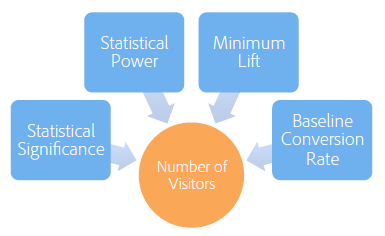
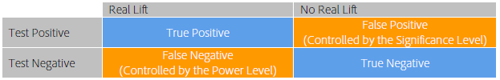
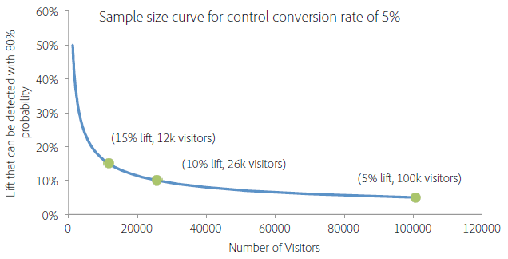

# Quelle doit être la durée d’exécution d’un test A/B ?

Une réussite [!UICONTROL Test A/B] activité dans [!DNL Adobe Target] nécessite suffisamment de visiteurs (taille de l’échantillon) pour améliorer votre taux de conversion. Comment savez-vous combien de temps exécuter un test A/B ? Cet article contient des informations sur [!UICONTROL Affectation automatique] les activités et la [!UICONTROL Adobe Target] Calculateur de taille d’échantillon pour vous aider à vous assurer que votre activité a suffisamment de visiteurs pour atteindre vos objectifs.

Si une offre est beaucoup plus ou moins performante que les autres dès les premiers jours de l’activité, il est tentant d’interrompre cette dernière. Toutefois, si le nombre d’observations est faible, il existe une forte probabilité que vous observiez par hasard un effet élévateur positif ou négatif, puisque le taux de conversion est calculé d’après un petit nombre de visiteurs. Les taux de conversion convergent vers leurs valeurs réelles sur le long terme au fur et à mesure que l’activité collecte davantage de points de données.

>[!IMPORTANT]
>
>L’arrêt prématuré d’une activité est l’un des dix pièges significatifs auxquels vous risquez de faire face lors de l’exécution de tests A/B. Pour plus d’informations, voir [Dix écueils courants des tests A/B et comment les éviter](/help/main/c-activities/t-test-ab/common-ab-testing-pitfalls.md#concept_578A7947C9554868B30F12DFF9E3F8E3).

[!DNL Adobe Target] fournit des outils pour vous assurer que votre activité dispose d’une taille d’échantillon suffisante pour atteindre vos objectifs de conversion : Affectation automatique.

## Affectation automatique {#auto-allocate}

Un [Affectation automatique](/help/main/c-activities/automated-traffic-allocation/automated-traffic-allocation.md) activité est un type de test A/B qui identifie un gagnant parmi plusieurs expériences. Un test d’affectation automatique réaffecte automatiquement du trafic supplémentaire vers le gagnant afin d’augmenter les conversions pendant que le test se poursuit et apprend.

Les tests A/B standard ont un coût. Vous devez générer du trafic pour mesurer les performances de chaque expérience et déterminer l’expérience gagnante grâce à une analyse. L’affectation du trafic reste fixe même après que vous avez admis que certaines expériences sont plus performantes que d’autres. En outre, il est difficile de déterminer la taille de l’échantillon. L’activité doit également s’exécuter en entier avant que vous ne puissiez agir sur un gagnant. Et il y a encore une chance que le gagnant identifié ne soit pas un vrai gagnant.

La solution est la suivante : [!UICONTROL Affectation automatique]. [!UICONTROL L’affectation automatique réduit les frais inhérents à la détermination d’une expérience gagnante. ] [!UICONTROL Elle contrôle les performances de la mesure d’objectif de toutes les expériences et envoie davantage de nouveaux participants vers les expériences hautement performantes de manière proportionnelle. ] Suffisamment de trafic est réservé à l’exploration des autres expériences. Vous pouvez voir les avantages de l’activité sur vos résultats, même si l’activité est toujours en cours d’exécution : l’optimisation se produit en parallèle de l’apprentissage.

[!UICONTROL L’affectation automatique dirige progressivement les visiteurs vers des expériences gagnantes, sans que vous ayez besoin d’attendre la fin d’une activité pour déterminer un gagnant. ] Vous bénéficiez de l’effet élévateur plus rapidement, car les participants à l’activité qui auraient été envoyés vers des expériences moins performantes sont dirigés vers des expériences potentiellement gagnantes.

Lors de l’utilisation de la fonctionnalité [!UICONTROL Affectation automatique], [!DNL Adobe Target] affiche en haut de la page de l’activité un badge indiquant « Pas encore de gagnant » jusqu’à ce que l’activité atteigne le nombre de conversions minimal avec un degré de confiance suffisant. [!DNL Target] désigne alors l’expérience gagnante, en affichant un badge en haut de la page de l’activité.

Pour plus d’informations, voir [Présentation de l’affectation automatique](/help/main/c-activities/automated-traffic-allocation/automated-traffic-allocation.md).

## Adobe [!DNL Target] Calculateur de taille d’échantillon {#section_6B8725BD704C4AFE939EF2A6B6E834E6}

Si vous choisissez d’utiliser un manuel [!UICONTROL Test A/B] activité plutôt que [!UICONTROL Affectation automatique], la variable [!DNL Target] Le calculateur de taille d’échantillon vous permet de déterminer la taille d’échantillon requise pour un test réussi. Un test A/B manuel est un test d’horizon fixe, le calculateur est donc utile. Utilisation du calculateur pour une [!UICONTROL Affectation automatique] l’activité est facultative, car [!UICONTROL Affectation automatique] déclare un gagnant pour vous. Le calculateur vous donne une estimation approximative de la taille d’échantillon nécessaire. Continuez votre lecture pour en apprendre davantage sur l’utilisation du calculateur.

Avant de configurer votre test A/B, accédez à la [!DNL Adobe Target] [Calculateur de taille d’échantillon](/help/main/c-activities/t-test-ab/sample-size-determination.md#section_6B8725BD704C4AFE939EF2A6B6E834E6).

Il est important de déterminer une taille d’échantillon adéquate (nombre de visiteurs) avant d’effectuer un test A/B afin de déterminer la durée d’exécution de l’activité avant d’évaluer les résultats. La simple surveillance de l’activité jusqu’à ce que la signification statistique soit atteinte entraîne une sous-estimation considérable de l’intervalle de confiance, ce qui rend le test non fiable. L’intuition sous-jacente à ce résultat est que, dans le cas où un résultat statistiquement significatif est détecté, le test est arrêté et un gagnant est déclaré. Néanmoins, si le résultat n’est pas statistiquement significatif, le test est autorisé à continuer. Cette procédure favorise nettement le résultat positif, ce qui augmente le taux de faux positifs et déforme le niveau de pertinence effectif du test.

Cela peut entraîner de nombreux faux positifs, ce qui entraîne la mise en oeuvre d’offres qui ne produisent pas l’effet élévateur prévu à la fin. Un faible effet élévateur en lui-même est un résultat insatisfaisant, mais une conséquence encore plus grave est que, au fil du temps, l&#39;incapacité à prédire précisément l&#39;effet élévateur érode la confiance de l&#39;organisation dans les tests comme pratique.

Cet article décrit les facteurs qui doivent être équilibrés lorsqu’une taille d’échantillon est déterminée et présente un calculateur pour estimer une taille d’échantillon adéquate. Le calcul de la taille d’échantillon à l’aide du calculateur de taille d’échantillon (lien fourni ci-dessus) avant le début d’un test A/B garantit que vous exécutez toujours des tests A/B de haute qualité conformes aux normes statistiques.

Il existe cinq paramètres définis par l’utilisateur qui définissent un test A/B. Ces paramètres sont conjugués. De ce fait, lorsque quatre d’entre eux sont définis, le cinquième peut être calculé :

* Signification statistique
* Puissance statistique
* Effet élévateur minimal détectable de manière fiable
* Taux de conversion de ligne de base
* Nombre de visiteurs

>[!IMPORTANT]
>
>Pour obtenir des résultats précis, vous devez recharger la page avant de modifier les numéros des paramètres. Répétez cette procédure chaque fois que vous modifiez un nombre de paramètres.

Pour un test A/B, la signification statistique, la puissance statistique, l’effet élévateur minimal détectable de manière fiable et le taux de conversion de ligne de base sont définis par l’analyste, puis le nombre requis de visiteurs est calculé à partir de ces chiffres. Cet article décrit ces éléments et fournit des instructions sur la manière de déterminer ces mesures pour un test spécifique.

La figure ci-dessous illustre les quatre résultats possibles d’un test A/B :

Il est souhaitable de n’obtenir aucun faux positif ou faux négatif. Cependant, l’obtention de zéro faux positifs ne peut jamais être garanti par un test statistique. Il est toujours possible que les tendances observées ne soient pas représentatives des taux de conversion sous-jacents. Par exemple, lors d’un test pour voir si les faces ou les piles d’une pièce de monnaie étaient plus susceptibles, même avec une pièce de monnaie équitable, vous pouviez obtenir dix faces sur dix lancers par hasard. La signification et la puissance statistiques aident à quantifier les taux de faux positifs et faux négatifs et permettent de les maintenir à des niveaux raisonnables pour un test donné.

### Signification statistique {#section_8230FB9C6D1241D8B1786B72B379C3CD}

Le niveau de pertinence d’un test détermine la probabilité que le test signale une différence significative de taux de conversion entre deux offres différentes alors qu’en fait, il n’y a aucune différence réelle. Cette situation est connue sous le nom de faux positif ou d’erreur de type I. Le niveau de pertinence est un seuil spécifié par l’utilisateur. Il s’agit d’un compromis entre la tolérance envers les faux positifs et le nombre de visiteurs qui doivent être inclus dans le test.

Dans un test A/B, il est initialement supposé que les deux offres ont le même taux de conversion. Ensuite, la probabilité du résultat observé est calculée en fonction de cette supposition. Si cette probabilité (la valeur p) est inférieure à un seuil prédéfini (le niveau de pertinence), [!DNL Target] conclut que l’hypothèse initiale, à savoir que les deux offres ont le même taux de conversion, est incorrecte. Par conséquent, les taux de conversion de A et B sont statistiquement différents au niveau de pertinence donné.

Le niveau de pertinence généralement utilisé dans un test A/B est de 5 %, ce qui correspond à un degré de confiance de 95 % (degré de confiance = 100 % - niveau de pertinence). Un degré de confiance de 95 % signifie que chaque fois que vous effectuez un test, il existe une probabilité de 5 % de détecter un effet élévateur statistiquement significatif, même en cas d’absence de différence entre les offres.

Les interprétations classiques du degré de confiance sont résumées dans le tableau ci-dessous :

| Degré de confiance | Interprétation |
|--- |--- |
| &lt; 90 % | Aucune preuve qu’il y ait une différence entre les taux de conversion |
| 90-95 % | Faible preuve qu’il y ait une différence entre les taux de conversion |
| 95-99 % | Preuve modérée qu’il y ait une différence entre les taux de conversion |
| 99-99,9 % | Forte preuve qu’il y ait une différence entre les taux de conversion |
| +99,9% | Très forte preuve qu’il y ait une différence entre les taux de conversion |

Il est recommandé d’utiliser systématiquement un degré de confiance de 95 % ou plus.

Il est souhaitable d’utiliser le degré de confiance le plus élevé possible, de sorte que le test produise peu de faux positifs. Néanmoins, un degré de confiance plus élevé requiert un plus grand nombre de visiteurs, ce qui augmente le temps requis pour effectuer le test. En outre, une augmentation du degré de confiance provoque une diminution de la puissance statistique.

### Puissance statistique {#section_1169C27F8E4643719D38FB9D6EBEB535}

La puissance statistique d’un test A/B est la probabilité de détecter une différence réelle dans un taux de conversion d’une certaine magnitude. En raison de la nature aléatoire (stochastique) des événements de conversion, il est possible qu’une différence statistiquement significative ne soit pas observée (par chance) même s’il existe une différence réelle de taux de conversion entre deux offres. Ce scénario est appelé faux négatif ou erreur de type II.

La puissance statistique est souvent ignorée car sa détermination, à la différence de la signification statistique, n’est pas requise pour effectuer un test A/B. Néanmoins, en ignorant la puissance statistique, il existe une probabilité que de réelles différences entre les taux de conversion des différentes offres ne soient pas détectées par le test car la taille de l’échantillon est trop faible. Les tests peuvent, de ce fait, être dominés par des faux positifs.

Il est souhaitable d’avoir une puissance statistique élevée afin que le test ait une probabilité élevée d’identifier une différence réelle dans les taux de conversion et produise moins de faux négatifs. Toutefois, un plus grand nombre de visiteurs est nécessaire pour augmenter la puissance statistique de détection d’un effet élévateur donné, ce qui augmente le temps requis pour effectuer le test.

La valeur courante utilisée pour la puissance statistique est de 80 %, ce qui signifie que le test a une probabilité de 80 % de détecter une différence égale à l’effet élévateur minimal détectable de manière fiable. Le test a une probabilité plus faible de détecter de petits effets élévateurs et une probabilité plus grande de détecter des effets élévateurs importants.

### Effet élévateur minimal détectable de manière fiable {#section_6101367EE9634C298410BBC2148E33A9}

La plupart des entreprises souhaitent mesurer la plus petite différence possible de taux de conversion car même un petit effet élévateur est intéressant à implémenter. Cependant, si vous souhaitez que le test A/B ait une forte probabilité de détecter un petit effet élévateur, le nombre de visiteurs qui doit être inclus dans le test est prohibitif. Cela s’explique par le fait que, si la différence de taux de conversion est faible, les deux taux de conversion doivent être estimés avec une grande précision pour identifier la différence, ce qui nécessite de nombreux visiteurs. En conséquence, l’effet élévateur minimal détectable de manière fiable doit être déterminé par les besoins de l’entreprise en tenant compte des compromis entre la détection de petits effets élévateurs et l’exécution du test pendant de plus longues durées.

Par exemple, supposons que deux offres (A et B) comportent de véritables taux de conversion de 10 et 15 %, respectivement. Si ces offres sont présentées à 100 visiteurs chacune, la probabilité est de 95 % d’observer des taux de conversion dans la plage 4 à 16 % pour l’offre A et 8 à 22 % pour l’offre B en raison de la nature stochastique des conversions. En statistiques, ces plages sont connues en tant qu’intervalles de confiance. Elles représentent la confiance dans la précision des taux de conversion estimés. Plus la taille de l’échantillon est grande (plus de visiteurs), plus vous pouvez être confiant que les estimations des taux de conversion sont exactes.

La figure ci-dessous illustre ces lois de probabilités.

En raison du chevauchement important entre les deux plages, le test ne peut pas déterminer si les taux de conversion sont différents. De ce fait, ce test avec 100 visiteurs ne peut pas faire la distinction entre les deux offres. Cependant, si Target expose les offres à 5 000 visiteurs chacun, il y a 95 % de chances que les taux de conversion observés baissent respectivement dans les plages de 9 % à 11 % et de 14 % à 16 %.

Dans ce cas, il est peu probable que le test aboutisse à une conclusion incorrecte. Par conséquent, le test avec 5 000 visiteurs peut faire la distinction entre les deux offres. Le test avec 5 000 visiteurs a un intervalle de confiance d’environ +/-1 %. Cela signifie que le test peut détecter des différences d’environ 1 %. De ce fait, encore plus de visiteurs seraient requis si les véritables taux de conversion des offres étaient, par exemple, 10 et 10,5 % au lieu de 10 et 15 %.

### Taux de conversion de ligne de base {#section_39380C9CA3C649B6BE6E1F8A06178B05}

Le taux de conversion de ligne de base est le taux de conversion de l’offre de contrôle (offre A). Souvent, vous connaissez le niveau de conversion correspondant à l’offre grâce à une expérience antérieure. Si ce n’est pas le cas, par exemple car il s’agit d’un nouveau type d’offre ou de création, le test peut être autorisé à s’exécuter pendant approximativement une journée afin d’obtenir une estimation du taux de conversion de ligne de base qui peut être utilisé dans le calcul de la taille de l’échantillon.

### Nombre de visiteurs {#section_19009F165505429E95291E6976E498DD}

Il peut être difficile d’équilibrer le coût d’exécution d’un test sur une longue période avec le risque de faux positifs ou de faux négatifs. Évidemment, vous ne souhaitez pas prendre de mauvaises décisions, mais être paralysé par des normes de test trop strictes ou trop rigides n’est pas souhaitable non plus.

En règle générale, un degré de confiance de 95 % et une puissance statistique de 80 % sont recommandés.

Le calculateur de taille d’échantillon (lien fourni ci-dessus) vous demande de choisir la signification statistique (recommandation : 95 %) et la puissance statistique (recommandation : 80 %). Après avoir saisi le taux de conversion de ligne de base et le trafic quotidien sur toutes les offres, la feuille de calcul fournit le nombre de visiteurs requis pour détecter un effet élévateur de 1 %, 2 %, 5 %, 10 %, 15 % et 20 % avec une probabilité égale à la puissance spécifiée du test. La feuille de calcul permet également à l’utilisateur d’entrer un effet élévateur minimal détectable de manière fiable personnalisé. En outre, la feuille de calcul donne le nombre requis de semaines pour le test selon le niveau de trafic saisi par l’utilisateur. Le nombre requis de semaines est arrondi à la semaine entière la plus proche afin d’éviter que les effets « jour de la semaine » influencent les résultats.

Il existe un compromis entre l’effet élévateur minimal qui peut être identifié de manière fiable par le test et le nombre requis de visiteurs. La figure ci-dessous, qui est valide pour un taux de conversion de ligne de base (contrôle) de 5 %, illustre des retours fortement en baisse alors que le nombre de visiteurs a augmenté. L’effet élévateur minimal qui peut être détecté de manière fiable s’améliore fortement lors de l’ajout des premiers visiteurs au test mais il faut un nombre toujours plus grand de visiteurs pour améliorer le test. Cette figure permet de trouver le compromis approprié entre le temps requis pour exécuter le test (tel que déterminé par le nombre requis de visiteurs et le trafic du site) et l’effet élévateur minimal qui peut être détecté de manière fiable par le test.

Dans cet exemple, vous pouvez décider de détecter un effet élévateur de 5 % (correspondant à un taux de conversion de l’offre alternative de (100 %+5 %).&#42;5 % = 5,25 %) dans 80 tests sur 100 est approprié. Vous avez donc besoin d’une taille d’échantillon de 100 000 visiteurs pour chaque offre. Si le site compte 20 000 visiteurs par jour et que vous testez deux offres, le test doit être autorisé à s’exécuter pendant 2 heures.&#42;100,000/20,000 = 10 jours avant de pouvoir déterminer si l’offre alternative est statistiquement significativement supérieure à l’offre de contrôle.

A nouveau, il est recommandé que la durée requise soit systématiquement arrondie à la semaine entière la plus proche afin que les effets « jour de la semaine » soient évités. Ainsi, dans cet exemple, le test serait exécuté pendant deux semaines avant d’évaluer les résultats.

### Mesure Recettes par visiteur {#section_C704C0861C9B4641AB02E911648D2DC2}

Lors de l’utilisation de la mesure Recettes par visite (RPV) , une autre source de variance est ajoutée, car le RPV est le produit des recettes par commande et du taux de conversion (RPV = Recettes / #visitors = (Recettes par commande). &#42; #orders) / # visiteurs = Recettes par commande &#42; (#visitors &#42; CTR) / #visitors = Recettes par commande &#42; CTR), chacune avec sa propre variance. La variance du taux de conversion peut être estimée directement à l’aide d’un modèle mathématique, mais la variance du revenu par commande est spécifique à l’activité. Par conséquent, utilisez les connaissances de cette variance provenant des activités antérieures ou exécutez le test A/B pendant quelques jours pour estimer la variance du chiffre d’affaires. La variance est calculée à partir des valeurs de Somme des ventes, Somme des ventes au carré et Nombre de visiteurs trouvées dans le fichier de téléchargement CSV. Une fois ce délai établi, utilisez la feuille de calcul pour calculer la durée requise pour terminer le test.

Le calculateur de taille d’échantillon (voir le lien ci-dessous) peut vous aider à configurer la mesure Recettes par visiteur (RPV). Lorsque vous ouvrez le calculateur, un onglet s’affiche intitulé [!UICONTROL Mesure RPV]. Vous aurez besoin des informations suivantes lors de l’utilisation de la version Recettes par visiteur (RPV) du calculateur :

* Nombre de visiteurs de l’offre de contrôle
* Recettes totales pour l’offre de contrôle

   Assurez-vous que le filtre d’ordre extrême est sélectionné.

* La somme des recettes au carré pour l’offre de contrôle

   Assurez-vous que le filtre de tri extrême est coché.

En règle générale, l’utilisation des recettes par visiteur (RPV) comme mesure nécessite 20 à 30 % de plus pour atteindre le même niveau de confiance statistique pour le même niveau d’effet élévateur mesuré. Cela est dû au fait que le RPV présente la variance ajoutée de différentes tailles de commande par conversion. Cela doit être pris en compte lors du choix entre le taux de conversion direct et les recettes par visiteur (RPV) comme mesure sur laquelle baser votre décision commerciale finale.

## Correction de la comparaison de plusieurs offres {#section_1474113764224D0B85472D8B023CCA15}

Chaque fois que vous comparez deux offres, la probabilité d’obtenir un faux positif (observation d’une différence statistiquement significative même en l’absence de différence de taux de conversion) est égale au niveau de pertinence. Par exemple, en présence de cinq offres, A/B/C/D/E, A étant l’offre de contrôle, quatre comparaisons sont effectuées (contrôle avec B, contrôle avec C, contrôle avec D et contrôle avec E) et la probabilité d’un faux positif est de 18,5 % même si le degré de confiance est de 95 % car Pr(au moins au faux positif) = 1 - Pr(aucun faux positif) = 1 - 0,95 = 18,5 %. Un faux positif est, dans ce contexte, défini comme l’offre de contrôle rapportée comme étant meilleure que l’offre alternative ou l’inverse, alors, qu’en fait, il n’y aucune différence entre elles.

## Conclusion {#section_AEA2427B90AE4E9395C7FF4F9C5CA066}

En utilisant une [!UICONTROL Affectation automatique] activité, [!DNL Target] identifie un gagnant parmi plusieurs expériences et réaffecte automatiquement du trafic supplémentaire vers le gagnant afin d’augmenter les conversions pendant que le test se poursuit et apprend. [!UICONTROL L’affectation automatique vous permet d’atteindre facilement vos objectifs de conversion, tout en vous évitant de devoir faire des estimations.]

En utilisant le calculateur de taille d’échantillon (lien fourni ci-dessus) introduit dans cet article et en permettant au test de s’exécuter pendant la durée suggérée par le calculateur, vous pouvez vous assurer que vous effectuez toujours des tests A/B de haute qualité qui respectent les taux de faux positifs et de faux négatifs que vous avez déterminés comme étant adéquats au test spécifique. Vous garantissez ainsi que vos tests sont cohérents et en mesure de détecter de manière fiable l’effet élévateur que vous recherchez.
