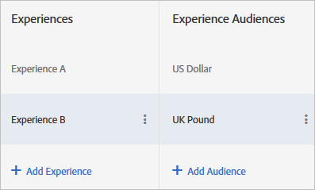

# Audiences d’expériences multiples dans un test A/B

Vous pouvez cibler des versions d’une même expérience sur différentes audiences dans [!DNL Adobe Target] Activités A/B. Vous pouvez définir des audiences multiples pour une même expérience dans le compositeur d’expérience visuelle ou dans le compositeur d’expérience d’après les formulaires.

Les utilisateurs peuvent changer d’audience d’expérience au fur et à mesure que leur profil évolue. Ils ne sont pas cantonnés à une même expérience pendant toute la durée de vie de l’activité.

Par exemple, si votre site utilise un design cohérent pour différentes pages ou produits, et que vous souhaitez utiliser la même expérience pour des audiences multiples (comme des visiteurs utilisant des navigateurs dans des langues différentes), vous pouvez définir plusieurs versions de cette expérience. Vous pourriez présenter la même expérience aux utilisateurs de langue anglaise ou japonaise, avec la langue du texte pour seule différence. Les données sont collectées pour l’expérience, indépendamment de la langue, et le rapport relate donc les performances de l’expérience, sans prendre en compte la version.

Ne pouvant pas définir de versions d’expérience, vous devriez définir différents tests pour chaque langue (dans le cadre de cet exemple), puis rassembler manuellement les résultats afin d’obtenir une idée sur la manière dont une expérience unique en deux langues pourrait s’exécuter. Cette option conduit à des résultats moins précis. Dans le cadre de certains tests, ces calculs pourraient même s’avérer être inutiles en raison de la manière dont les visiteurs sont sélectionnés de manière aléatoire.

En créant différentes versions d’une expérience, vous recevez des informations plus précises, en évitant d’avoir à effectuer des calculs ou des suppositions manuelles.

## Scénario

Vous testez deux expériences, une bannière géociblée et une bannière générique. La bannière doit être différente pour chaque région, mais le test général doit déterminer si le géociblage donne des résultats plus intéressants qu’un affichage du contenu générique. En configurant une expérience spécifique pour chaque position géographique, vous compareriez l’exécution des géociblages les uns par rapport aux autres plutôt que le niveau d’utilité du géociblage dans la réalisation des objectifs en comparaison avec la bannière générique.

Dans ce cas précis, vous auriez besoin de versions géospécifiques de l’expérience afin de comparer l’expérience géociblée avec une commande qui ne l’est pas.

1. [Créez une activité A/B](/help/main/c-activities/t-test-ab/t-test-create-ab/test-create-ab.md) comme vous le feriez normalement.

   Lors de la configuration de l’expérience aux multiples versions, sélectionnez l’audience de chaque version tel que décrit dans la procédure suivante.

1. Sélectionnez l’expérience, puis cliquez sur **[!UICONTROL Configurer]** > **[!UICONTROL Audience]** > **[!UICONTROL Audiences multiples]**.

   

1. Cliquez sur **[!UICONTROL Ajouter une audience]**, puis sélectionnez la première audience dont vous souhaitez effectuer le ciblage. Reproduisez cette procédure pour chaque audience.

   

   Si l’audience n’existe pas encore, cliquez sur [Créer une audience](/help/main/c-target/c-audiences/create-audience.md#task_E18BD77A9A8F4ED0AC50569F94556558) et configurez-la.

   Lorsqu’un visiteur répond aux critères de plusieurs audiences, le contenu de l’ensemble de ces audiences est transmis, mais seul le dernier de la liste apparaît véritablement sur la page.

1. Poursuivre la configuration de l’activité.

## Bonnes pratiques

* Sélectionnez des audiences mutuellement exclusives. Lorsque l’activité a été créée dans le compositeur d’expérience visuelle, si un visiteur correspond à plus d’une audience, le contenu de chacune d’entre elles est transmis, mais seul le contenu de l’audience qui se trouve en fin de liste s’affiche sur la page.
* Les audiences d’entrée d’activité définies dans le diagramme sont combinées aux audiences d’expérience en utilisant la condition ET. Pour accéder à une activité, le visiteur doit répondre aux critères d’audience de l’activité et à ceux de l’une des audiences d’expérience.
* Ajout des mêmes audiences en tant que segment pour la création de rapports. Ceci vous permet de consulter les résultats de test pour le plus haut niveau d’expérience A par rapport à B et pour le niveau le plus faible A par rapport à B pour « langue du navigateur ja_JP » uniquement. Cela fonctionne uniquement pour les rapports Target. Les rapports Analytics ne sont pas pris en charge.
