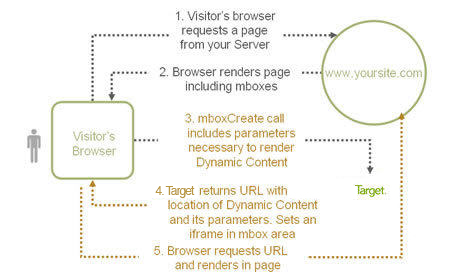

# Créer des offres distantes

Utilisez des offres distantes pour héberger du contenu en dehors de [!DNL Adobe Target], ce qui [!DNL Target] permet de référencer et de diffuser ce contenu sur les sites web des utilisateurs et utilisatrices. Ce contenu peut se trouver dans un système de gestion de contenu (CMS) ou un autre système pour des raisons de facilité d’utilisation ou de sécurité.

Les offres distantes peuvent être créées sur la page [!UICONTROL Offres] > [!UICONTROL Offres de code] ou dans le compositeur d’expérience Forms . Vous ne pouvez pas créer ni appliquer d’offres distantes dans le [!UICONTROL compositeur d’expérience visuelle] (VEC). Le contenu est injecté dans les emplacements de requête [!DNL Target]. Ces emplacements ne sont donc probablement pas appropriés pour une requête de [!DNL Target] globale.

Voici quelques exemples d’offres distantes :

* les différentes versions de ventes croisées ;
* les messages des paniers dynamiques ;
* les formulaires ;
* les calculateurs ;
* les mises à jour de taux d’intérêt.
* Emails
* Les kiosques
* Assistants téléphoniques

## Bonnes pratiques relatives à l’utilisation des offres distantes {#section_7718512D08E14121B6F6B8C38134F4BC}

Bonnes pratiques pour l’utilisation d’offres distantes dans vos activités :

* Les offres distantes sont prises en charge dans :

   * Activités A/B
   * Activités de ciblage d’expérience (XT)
   * Workflows basés sur des formulaires

* Les offres distantes ne sont pas prises en charge dans :

   * [Fonctionnalités Premium](/help/main/c-intro/intro.md#premium) (Automated Personalization (AP), ciblage automatique et Recommendations)
   * Multivariate Testing (MVT), en raison de la dépendance au VEC (compositeur d’expérience visuelle), qui ne prend pas en charge les offres distantes.

* Si votre offre réside dans le même domaine que les requêtes [!DNL Target], l’utilisation de l’option [!UICONTROL Mis en cache] vous permet d’utiliser des URL relatives pour décrire l’emplacement de votre offre.

  Cela signifie que lorsque vous déplacez votre activité de vos serveurs d’évaluation vers la production, le contenu est automatiquement accessible sans avoir à modifier l’URL manuellement.

* Si votre test implique des données générées dynamiquement par votre serveur, l’option [!UICONTROL Dynamique] peut être un bon choix.
* Si vous planifiez de tester uniquement l’apparence du contenu de votre offre distante existante, utilisez le [!UICONTROL compositeur d’expérience visuelle] pour modifier l’apparence du contenu renvoyé à partir du système de gestion du contenu.
* Utilisez la [Matrice de sélection des offres à distance](#reference_B23BEDD29DDD47709A7651AFD27E776B) (ci-dessous) pour vous aider à choisir l’offre la mieux adaptée à votre cas spécifique. Si vous avez des questions, contactez le représentant du compte.

## Créez une offre distante à partir de la page [!UICONTROL Offres de code]

1. Cliquez sur **[!UICONTROL Offres]**, puis sélectionnez l’onglet **[!UICONTROL Offres (code)]**.

1. Cliquez sur **[!UICONTROL Créer une offre]** > **[!UICONTROL Offre distante]**.

1. Dans la boîte de dialogue [!UICONTROL Créer une offre distante], attribuez un nom explicite à l’offre.

   Un nom explicite permet, à vous et aux autres personnes, de trouver rapidement l’offre dans la bibliothèque [!UICONTROL Offres].

1. (Conditionnel) Si vous disposez d’un compte , sélectionnez l’espace de travail [ souhaité](/help/main/administrating-target/c-user-management/property-channel/properties-overview.md##section_B82EB409B67C4D9D9D20CE30E48DB1DC).

1. Spécifiez le type d’URL de redirection.

   Pour plus d’informations, consultez [Type d’URL de redirection : [!UICONTROL Mise en cache sur site] ou [!UICONTROL Dynamique sur site]](#url-type) ci-dessous.

1. Spécifiez l’URL distante absolue de l’offre distante.

1. Cliquez sur **[!UICONTROL Créer]**.

## Créer une offre distante à l’aide du [!UICONTROL compositeur d’expérience d’après les formulaires]

1. Lors de la création d’une activité à l’aide du [Compositeur d’expérience d’après les formulaires](/help/main/c-experiences/form-experience-composer.md), sélectionnez l’emplacement d’affichage de la section **[!UICONTROL Contenu]**.
1. Cliquez sur la liste déroulante **[!UICONTROL Contenu]**, sur l&#39;icône **[!UICONTROL Liste]** (  ), puis sur **[!UICONTROL Modifier l&#39;offre distante]**.

1. Cliquez sur **[!UICONTROL Créer une offre]** > **[!UICONTROL Offre distante]**.

1. Attribuez un nom explicite à l’offre.

   Un nom explicite aide les utilisateurs et vous-même à trouver rapidement l’offre dans la bibliothèque [!UICONTROL Ressources].

1. (Conditionnel) Si vous disposez d’un compte , sélectionnez l’espace de travail [ souhaité](/help/main/administrating-target/c-user-management/property-channel/properties-overview.md##section_B82EB409B67C4D9D9D20CE30E48DB1DC).

1. Spécifiez le type d’URL de redirection.

   Pour plus d’informations, consultez [Type d’URL de redirection : [!UICONTROL Mise en cache sur site] ou [!UICONTROL Dynamique sur site]](#url-type) ci-dessous.

1. Spécifiez l’URL distante de l’offre distante.

1. Cliquez sur **[!UICONTROL Créer]**.

## Type d’URL de redirection : [!UICONTROL Mise en cache sur site] ou [!UICONTROL Dynamique sur site] {#url-type}

Les informations suivantes vous aident à comprendre les différences entre les deux options :

### [!UICONTROL Mise en cache sur site] URL

Le contenu d’une offre distante mise en cache est diffusé à partir de [!DNL Target].

Toutes les deux heures, [!DNL Target] récupère le contenu dans l’URL distante, puis le stocke dans [!DNL Target]. Lorsque des visiteurs chargent un site avec une expérience qui comprend une offre à distance, [!DNL Target] diffuse l’offre.

Les offres distantes mises en cache offrent une sécurité renforcée, car une personne connectée à [!DNL Target] ne peut pas modifier le contenu. Pour modifier le contenu, une personne doit se connecter à la gestion de contenu ou à un autre système et y modifier le contenu.

Vous pouvez spécifier une URL absolue ou relative pour une offre distante en mémoire cache.

### URL [!UICONTROL dynamique sur site]

Une offre distante dynamique est diffusée à partir du système de gestion de contenu ou d’un autre système plutôt qu’à partir de [!DNL Target].

Il est possible que vous ne souhaitiez pas que le contenu soit périodiquement mis en cache, puis diffusé par [!DNL Target] chaque fois que des visiteurs chargent un site avec une expérience qui inclut une offre distante. Au lieu de cela, vous devez appeler le système qui héberge le contenu, et éventuellement transmettre des informations spécifiques afin que l’offre renvoyée puisse être dynamique (ou différente) pour chaque utilisateur. Par exemple, si un utilisateur se connecte à un site web pour une carte de crédit incluant une expérience avec une offre distante dynamique, vous pouvez transférer des paramètres dans l’URL pour les informations de compte de l’utilisateur. Le site web peut ensuite fournir des informations spécifiques à l’utilisateur, telles que son solde.

Vous pouvez cliquer sur **[!UICONTROL Ajouter un paramètre]** pour ajouter une ou plusieurs requêtes [!DNL Target] ou des paramètres de requête.

## Utilisation des offres distantes dans les activités

Appliquez des offres distantes à l’aide du [!UICONTROL Compositeur d’expérience d’après les formulaires]. Actuellement, vous ne pouvez pas appliquer d’offres distantes à l’aide du [!UICONTROL compositeur d’expérience visuelle] (VEC).

Le [!DNL Adobe Target] [!UICONTROL compositeur d’expérience d’après les formulaires] est une interface de création d’offres et d’expériences non visuelles qui est utile pour créer des expériences à utiliser dans les activités [!UICONTROL Tests A/B], [!UICONTROL Ciblage d’expérience] (XT), [!UICONTROL Automated Personalization] (AP) et [!UICONTROL Recommandations] lorsque le [!UICONTROL compositeur d’expérience visuelle] n’est pas disponible ou pratique à utiliser. Par exemple, vous pouvez utiliser le [!UICONTROL compositeur d’expérience d’après les formulaires] pour créer des expériences qui utilisent des offres distantes.

1. Créez ou modifiez une activité dans le [!UICONTROL Compositeur d’expérience d’après les formulaires].

   Consultez [Compositeur d’expérience d’après les formulaires](/help/main/c-experiences/form-experience-composer.md) pour obtenir des instructions détaillées.

1. Spécifiez l’emplacement souhaité et ajoutez des améliorations d’audience si nécessaire.

1. Cliquez sur la liste déroulante **[!UICONTROL Contenu]**, sur l&#39;icône **[!UICONTROL Liste]** (  ), puis sur **[!UICONTROL Modifier l&#39;offre distante]**.

1. Sélectionnez l’offre distante souhaitée dans la boîte de dialogue [!UICONTROL Modifier l’offre distante], puis cliquez sur **[!UICONTROL Créer une offre]** > **[!UICONTROL Offre distante]**.

1. Terminez la configuration de l’activité.

## Fonctionnement des offres distantes dynamiques {#concept_CC2A969420B34364A9FA78C1CE251818}

Une offre distante dynamique applique la technologie de page dynamique pour transmettre des valeurs à l’offre.

L’offre est exécutée une fois la page affichée. Un iFrame invisible rassemble les données, les copie hors du cadre et les insère dans la page, chargeant les valeurs transmises.

1. Le navigateur du visiteur demande une page à votre serveur.

2. Le navigateur effectue le rendu de la page, y compris des mbox.

3. `mboxCreate` appel comprend les paramètres nécessaires pour effectuer le rendu du contenu dynamique.

4. [!DNL Target] renvoie une URL avec l’emplacement du contenu dynamique et ses paramètres. Définit un iFrame dans la zone de mbox.

5. Le navigateur demande l’URL et effectue le rendu dans la page.

## Matrice de sélection des offres distantes {#reference_B23BEDD29DDD47709A7651AFD27E776B}

La matrice de sélection des offres à distance vous permet de choisir le type d’offre à distance à choisir : [!UICONTROL Mise en cache sur site] ou [!UICONTROL Dynamique sur site].

| Fonctionnalité | Mise en cache sur site | Dynamique sur site |
|--- |--- |--- |
| Mises à jour chaque fois qu’un visiteur émet une requête | Non | Oui |
| Mises à jour du contenu | Mis en cache toutes les deux heures | Mise à jour immédiate à chaque requête |
| Durée de chargement | Plus rapide | Plus lent en raison du traitement des requêtes |
| JavaScript visible dans la page | Oui | Non, mais peut transmettre par URL |
| Les offres peuvent inclure du code JavaScript | Oui | Oui |
| URL de l’offre | Absolue ou relative | Relatif |
| Ordinateur émettant la requête | Serveurs Adobe | Ordinateur du visiteur qui stocke les cookies de celui-ci |
