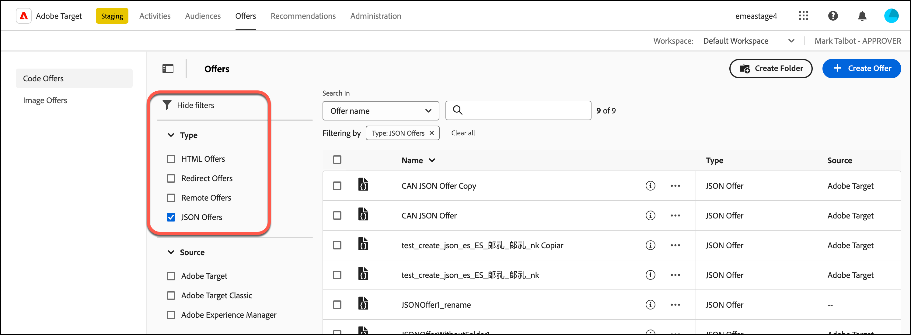

# Création d’offres JSON

Créez des offres JSON dans le [!UICONTROL Offer Library] de [!DNL Adobe Target] à utiliser dans le [!UICONTROL Form-Based Experience Composer].

Les offres JSON peuvent être utilisées dans des activités basées sur des formulaires pour activer des cas d’utilisation où la prise de décision [!DNL Target] est requise pour envoyer une offre au format JSON à des fins de consommation dans SPA framework ou des intégrations côté serveur.

## Considérations relatives à JSON

Tenez compte des informations suivantes lorsque vous utilisez les offres JSON :

* Les offres JSON sont actuellement disponibles uniquement pour les activités [!UICONTROL A/B Test], [!UICONTROL Automated Personalization] (AP) et [!UICONTROL Experience Targeting] (XT).
* Les offres JSON peuvent uniquement être utilisées dans les [activités d’après les formulaires](/help/main/c-experiences/form-experience-composer.md).
* Les offres JSON peuvent être récupérées directement lorsque vous utilisez les [ API côté serveur et les SDK Mobile Node.js, Java, .NET et Python](https://experienceleague.adobe.com/docs/target-dev/developer/server-side/server-side-overview.html?lang=fr){target=_blank}.
* Dans le navigateur, les offres JSON peuvent uniquement être récupérées via at.js 1.2.3 (ou version ultérieure) et à l’aide de [getOffer()](https://experienceleague.adobe.com/docs/target-dev/developer/client-side/at-js-implementation/functions-overview/adobe-target-getoffer.html){target=_blank} en filtrant les actions à l’aide de l’action `setJson`.
* Les offres JSON sont diffusées sous forme d’objets JSON natifs plutôt que de chaînes. Les consommateurs de ces objets ne doivent plus traiter ces objets en tant que chaînes et les convertir en objets JSON.
* Contrairement aux autres offres (par exemple, les offres HTML), les offres JSON ne sont pas appliquées automatiquement parce qu’il s’agit d’offres non visuelles. Les développeurs doivent écrire du code pour obtenir explicitement l’offre à l’aide de [getOffer()](https://experienceleague.adobe.com/docs/target-dev/developer/client-side/at-js-implementation/functions-overview/adobe-target-getoffer.html){target=_blank}.

## Création d’une offre JSON {#section_BB9C72D59DEA4EFB97A906AE7569AD7A}

1. Cliquez sur **[!UICONTROL Offers]** > **[!UICONTROL Code Offers]**.

   

1. Cliquez sur **[!UICONTROL Create Offer]** > **[!UICONTROL JSON Offer]**.

   

1. Saisissez le nom de l’offre.
1. (Conditionnel) Si vous disposez d’un [[!DNL Target] compte Premium](/help/main/c-intro/intro.md#premium), sélectionnez l’ [espace de travail](/help/main/administrating-target/c-user-management/property-channel/property-channel.md#workspace) de votre choix.
1. (Conditionnel) Sélectionnez les attributs de profil souhaités.
1. Saisissez ou collez votre code JSON dans la zone **[!UICONTROL Code]**.
1. Cliquez sur **[!UICONTROL Create]**.

## Exemple JSON {#section_A54F7BB2B55D4B7ABCD5002E0C72D8C9}

Les offres JSON sont prises en charge uniquement dans les activités créées à l’aide du [compositeur d’expérience d’après les formulaires](/help/main/c-experiences/form-experience-composer.md). Actuellement, le seul moyen d’utiliser les offres JSON est d’utiliser des appels API/SDK directs.

Voici un exemple :

```json
adobe.target.getOffer({ 
  mbox: "some-mbox", 
  success: function(actions) { 
    console.log('Success', actions); 
  }, 
  error: function(status, error) { 
    console.log('Error', status, error); 
  } 
});
```

Les actions transmises au rappel de succès constituent un tableau d’objets. En supposant que vous disposiez d’une seule offre JSON, qui présente le contenu suivant :

```json
{ 
  "demo": {"a": 1, "b": 2} 
}
```

Le tableau d’actions possède la structure suivante :

```json
[ 
 { 
   action: "setJson", 
   content: [{ 
     "demo": {"a": 1, "b": 2} 
   }] 
 }  
]
```

Pour extraire l’offre JSON, vous devez effectuer une itération sur les actions et rechercher l’action avec l’action `setJson`, puis effectuer une itération sur le tableau de contenu.

## Cas pratique {#section_85B07907B51A43239C8E3498EF58B1E5}

Supposons que l’offre JSON suivante soit diffusée sur votre page web :

```json
{ 
    "_id": "5a65d24d8fafc966921e9169", 
    "index": 0, 
    "guid": "7c006504-c6f7-468d-a46f-f72531ea454c", 
    "isActive": true, 
    "balance": "$2,075.06", 
    "picture": "https://placehold.it/32x32", 
    "tags": [ 
      "esse", 
      "commodo", 
      "excepteur"
    ], 
    "friends": [ 
      { 
        "id": 0, 
        "name": "Carla Lyons" 
      }, 
      { 
        "id": 1, 
        "name": "Ollie Mooney" 
      } 
    ], 
    "greeting": "Hello, Stephenson Fernandez! You have 4 unread messages.", 
    "favoriteFruit": "strawberry" 
} 
  
```

Le code suivant indique comment accéder à l’attribut « greeting » :

```json
adobe.target.getOffer({   
  "mbox": "name_of_mbox", 
  "params": {}, 
  "success": function(offer) {           
        console.log(offer[0].content[0].greeting); 
  },   
  "error": function(status, error) {           
      console.log('Error', status, error); 
  } 
});
```

## Exemple d’offre JSON utilisant des attributs de profil CDP en temps réel

Les attributs de profil de la plateforme de données clients en temps réel peuvent être partagés avec [!DNL Target] pour être utilisés dans les offres HTML et JSON.

Pour plus d’informations, voir [Partage des attributs de profil de la plateforme de données clients en temps réel avec [!DNL Target]](/help/main/c-integrating-target-with-mac/integrating-with-rtcdp.md#rtcdp-profile-attributes).

## Filtrage des offres par type d’offre JSON {#section_52533555BCE6420C8A95EB4EB8907BDE}

Vous pouvez filtrer la bibliothèque [!UICONTROL Offers] par type d’offre JSON en cliquant sur l’icône **[!UICONTROL Show filters]**, puis en cochant la case **[!UICONTROL JSON]** .


