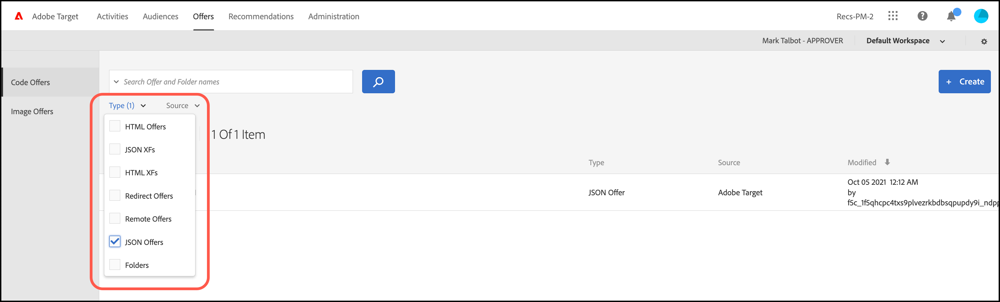

# Création d’offres JSON

Création d’offres JSON dans le [!UICONTROL Bibliothèque d’offres] in [!DNL Adobe Target] à utiliser dans le [!UICONTROL Compositeur d’expérience d’après les formulaires].

Les offres JSON peuvent être utilisées dans des activités basées sur des formulaires, dans lesquelles l’activation de cas d’utilisation où [!DNL Target]La prise de décision de est requise pour envoyer une offre au format JSON à des fins de consommation dans SPA framework ou des intégrations côté serveur.

## Considérations JSON

Tenez compte des informations suivantes lorsque vous utilisez les offres JSON :

* Les offres JSON sont actuellement disponibles uniquement pour [!UICONTROL Test A/B] et [!UICONTROL Ciblage d’expérience] (XT).
* Les offres JSON peuvent être utilisées dans [activités d’après les formulaires](/help/main/c-experiences/form-experience-composer.md) uniquement.
* L’offre JSON peut être extraite directement via l’API côté serveur, le kit SDK mobile ou le kit SDK NodeJS.
* Dans le navigateur, les offres JSON peuvent désormais être extraites UNIQUEMENT via at.js 1.2.3 (ou version supérieure) et [getOffer()](https://developer.adobe.com/target/implement/client-side/atjs/atjs-functions/adobe-target-getoffer/) en filtrant les actions via l’action `setJson`.
* Les offres JSON sont diffusées sous forme d’objets JSON natifs plutôt que de chaînes. Les consommateurs de ces objets ne doivent plus traiter ces objets en tant que chaînes et les convertir en objets JSON.
* Contrairement aux autres offres (par exemple, les offres HTML), les offres JSON ne sont pas appliquées automatiquement parce qu’il s’agit d’offres non visuelles. Les développeurs doivent écrire du code pour obtenir explicitement l’offre au moyen de la fonction [getOffer()](https://developer.adobe.com/target/implement/client-side/atjs/atjs-functions/adobe-target-getoffer/).

## Création d’une offre JSON {#section_BB9C72D59DEA4EFB97A906AE7569AD7A}

1. Cliquez sur **[!UICONTROL Offres]** > **[!UICONTROL Offres de code]**.

   

1. Cliquez sur **[!UICONTROL Créer]** > **[!UICONTROL Offre JSON]**.

   

1. Saisissez le nom de l’offre.
1. Saisissez ou copiez votre code JSON dans la zone **[!UICONTROL Code]**.
1. Cliquez sur **[!UICONTROL Enregistrer]**.

## Exemple JSON {#section_A54F7BB2B55D4B7ABCD5002E0C72D8C9}

Les offres JSON sont prises en charge uniquement dans les activités créées à l’aide de la variable [Compositeur d’expérience d’après les formulaires](/help/main/c-experiences/form-experience-composer.md). À l’heure actuelle, les offres JSON peuvent uniquement être utilisées par le biais d’appels d’API directs.

Voici un exemple :

```json
adobe.target.getOffer({ 
  mbox: "some-mbox", 
  success: function(actions) { 
    console.log('Success', actions); 
  }, 
  error: function(status, error) { 
    console.log('Error', status, error); 
  } 
});
```

Les actions transmises au rappel de succès constituent un tableau d’objets. En supposant que nous ayons une seule offre JSON, ce tableau contient les éléments suivants :

```json
{ 
  "demo": {"a": 1, "b": 2} 
}
```

Le tableau des actions aura la structure suivante :

```json
[ 
 { 
   action: "setJson", 
   content: [{ 
     "demo": {"a": 1, "b": 2} 
   }] 
 }  
]
```

Pour extraire l’offre JSON, vous devez effectuer une itération sur les actions et rechercher l’action avec la variable `setJson` puis effectuez une itération sur le tableau de contenu.

## Cas pratique {#section_85B07907B51A43239C8E3498EF58B1E5}

Supposons que l’offre JSON suivante soit diffusée sur votre page web :

```json
{ 
    "_id": "5a65d24d8fafc966921e9169", 
    "index": 0, 
    "guid": "7c006504-c6f7-468d-a46f-f72531ea454c", 
    "isActive": true, 
    "balance": "$2,075.06", 
    "picture": "https://placehold.it/32x32", 
    "tags": [ 
      "esse", 
      "commodo", 
      "excepteur", 
    ], 
    "friends": [ 
      { 
        "id": 0, 
        "name": "Carla Lyons" 
      }, 
      { 
        "id": 1, 
        "name": "Ollie Mooney" 
      }, 
    ], 
    "greeting": "Hello, Stephenson Fernandez! You have 4 unread messages.", 
    "favoriteFruit": "strawberry" 
} 
  
```

Le code suivant indique comment accéder à l’attribut « greeting » :

```json
adobe.target.getOffer({   
  "mbox": "name_of_mbox", 
  "params": {}, 
  "success": function(offer) {           
        console.log(offer[0].content[0].greeting); 
  },   
  "error": function(status, error) {           
      console.log('Error', status, error); 
  } 
});
```

## Filtrage des offres par type d’offre JSON {#section_52533555BCE6420C8A95EB4EB8907BDE}

Vous pouvez filtrer la variable [!UICONTROL Offres] bibliothèque par type d’offre JSON en cliquant sur le **[!UICONTROL Type]** en sélectionnant **[!UICONTROL JSON]** .


