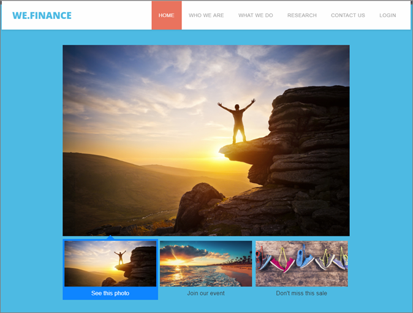
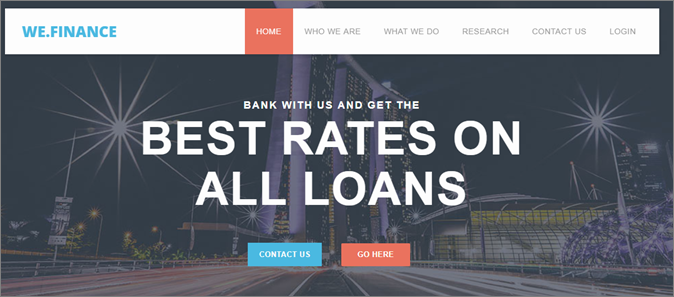

# Modèles d’expérience

Informations sur [!DNL Adobe Target] Modèles d’expérience à utiliser dans du code personnalisé. [!DNL Target]Les modèles d’expérience sont des exemples précodés avec des entrées configurables à utiliser pour exécuter des cas d’utilisation de spécialiste du marketing courants.

Ces modèles d’expérience sont fournis gratuitement aux développeurs et aux spécialistes du marketing comme point de départ pour exécuter certains cas d’utilisation courants, via le VEC ou le compositeur d’expérience d’après les formulaires.

Les modèles ci-dessous sont actuellement disponibles sur la page GitHub Adobe Marketing Cloud : [Target-Experience-Templates](https://github.com/Adobe-Marketing-Cloud/target-experience-templates).

## Bannière de carrousel avec miniatures {#section_BEEE51D47CC44A478264BBF3FEC70DAE}

Le [modèle d’expérience de bannière de carrousel avec miniatures](https://github.com/Adobe-Marketing-Cloud/target-experience-templates/tree/master/banner-carousel-thumbnails) est un carrousel tournant, généralement utilisé sur les pages d’accueil, les pages d’entrée ou les pages d’accès à volume élevé. Ce carrousel n’alterne pas automatiquement entre les images. Il est possible d’interagir directement avec celui-ci en cliquant sur les images miniatures sous l’image principale.

## Bannière de carrousel {#section_725D4C0C4FCD41FA92BCFC910A216E2A}

Le [modèle d’expérience de bannière de carrousel](https://github.com/Adobe-Marketing-Cloud/target-experience-templates/tree/master/banner-carousel) est un carrousel tournant, généralement utilisé sur les pages d’accueil, les pages d’entrée ou les pages d’accès à volume élevé. Ce carrousel n’alterne pas automatiquement entre les images. Il est possible d’interagir directement avec celui-ci en cliquant sur les flèches droite et gauche.

## Bannière avec compte à rebours {#section_ED9501FE096C4CD7B6D9933E0322B4AD}

Le [modèle d’expérience de bannière avec compte à rebours](https://github.com/Adobe-Marketing-Cloud/target-experience-templates/tree/master/banner-countdown) est une bannière large avec un compte à rebours au centre, généralement utilisée sur les pages d’accueil, les pages d’entrée ou les pages d’accès à volume élevé.

## Créateur de boutons {#section_DBDD1C9A9F294FB6BABBC04B4454E59B}

Le [modèle d’expérience Créateur de boutons](https://github.com/Adobe-Marketing-Cloud/target-experience-templates/tree/master/button) est un petit bouton accompagné d’un texte d’incitation à l’action. Ce bouton peut être configuré et placé n’importe où sur la page, afin d’ajouter une nouvelle incitation à l’action ou remplacer un bouton existant par une alternative plus configurable.

## Cadre lumineux avec compte à rebours {#section_E1177C52F1294EA5AC48312727CD3DF4}

Le [modèle d’expérience de cadre lumineux avec compte à rebours](https://github.com/Adobe-Marketing-Cloud/target-experience-templates/tree/master/lightbox-countdown) est une fenêtre contextuelle sous forme de cadre lumineux, qui recouvre la bannière, avec un compte à rebours au centre, généralement utilisée sur les pages d’accueil, les pages d’entrée ou les pages d’accès à volume élevé.

## Cadre lumineux avec intention de quitter {#section_E624C867E4CD4F2294CFC7917EFAEBD7}

Le [modèle d’expérience Lightbox with Exit Intent](https://github.com/Adobe-Marketing-Cloud/target-experience-templates/tree/master/lightbox-exit-intent) est une fenêtre contextuelle sous forme de cadre lumineux, qui apparaît lorsque le visiteur a l’intention de quitter l’écran (quand il dirige la souris vers le coin supérieur droit de l’écran). Ce modèle peut être déployé sur n’importe quelle propriété Web, quand vous voulez attirer l’attention du client une dernière fois.

## Cadre lumineux {#section_EF4FBA08CE55407CAFB334340C6C1577}

Le [modèle d’expérience Lightbox](https://github.com/Adobe-Marketing-Cloud/target-experience-templates) est une fenêtre contextuelle sous forme de cadre lumineux, avec un délai intégré, généralement utilisée sur les pages d’accueil, les pages d’entrée ou les pages d’accès à volume élevé.

## Ruban {#section_CCBB656265F140AEA1B200409D719000}

Le [modèle d’expérience Ribbon](https://github.com/Adobe-Marketing-Cloud/target-experience-templates/tree/master/ribbon) est un ruban de largeur de 100 % qui s’insère tout en haut d’une page Web. Il est généralement utilisé pour signaler une vente flash, la livraison gratuite des articles, des informations de sécurité ou météorologiques ou pour faire d’autres annonces importantes.

