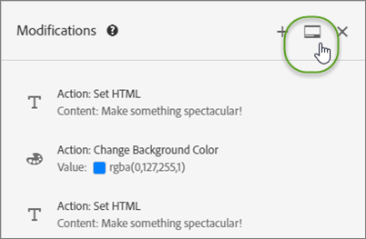
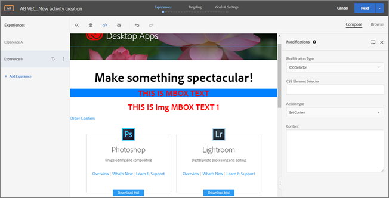

# Modifications

Informations sur la variable [!UICONTROL Modifications] page [!DNL Adobe Target] qui vous permet d’afficher les modifications apportées à votre page et d’ajouter d’autres modifications (sélecteur CSS, mbox et code personnalisé).

Le [!UICONTROL Modifications] La page affiche toutes les modifications apportées à votre page dans le compositeur d’expérience visuelle (VEC) et vous permet d’apporter des modifications supplémentaires en cliquant sur chaque élément de la page et [sélection d’une action](/help/main/c-experiences/c-visual-experience-composer/viztarget-options.md#reference_3BD1BEEAFA584A749ED2D08F14732E81). Chaque modification que vous effectuez apparaît en tant qu’action ou élément séparé dans la liste [!UICONTROL Modifications]. Vous pouvez également ajouter des modifications, y compris les types de modification suivants : sélecteur CSS, Mbox et code personnalisé.

## Présentation des modifications {#section_EE27E7572AA74397BBDED563B2B3D509}

La page [!UICONTROL Modifications] affiche toutes les modifications apportées à votre page dans le VEC. Chaque modification que vous effectuez apparaît en tant qu’action ou élément séparé dans la liste [!UICONTROL Modifications].


Utilisez la page Modifications pour apporter des modifications mineures au sélecteur choisi par Target lorsque vous utilisez le VEC pour configurer le mode de diffusion du contenu. Vous pouvez modifier le contenu ou un attribut HTML. Vous pouvez également modifier le code pour créer l’équivalent d’une offre HTML dans une mbox.

Utilisez la page Modifications pour :

* Afficher une action effectuée dans le compositeur visuel.

   

* Modifier une action existante. Passez le curseur de la souris sur la modification souhaitée, puis cliquez sur l’icône **[!UICONTROL Modifier]**.

   

   Effectuez vos modifications.

   

* Supprimer une action existante. Passez le curseur de la souris sur la modification souhaitée, puis cliquez sur l’icône **[!UICONTROL Supprimer]**.

   

* Ajouter une nouvelle modification. Cliquez sur **[!UICONTROL Ajouter une modification]** ou sur l’icône +, puis spécifiez vos modifications comme décrit ci-dessous.

   

   Notez qu’après la création d’une modification, Target affiche une icône + en haut du panneau Modifications au lieu du bouton Ajouter une modification au bas du panneau.

* Ancrez le panneau Modifications verticalement le long du côté de l’interface utilisateur Target ou horizontalement en bas. Cliquez sur l’icône d’[!UICONTROL ancrage] pour passer d’un paramètre à l’autre.

   

   L’illustration suivante montre le panneau Modifications ancré en bas de l’écran :

   

## Ajouter des modifications {#section_C7ABCD5731A048CB8F90EDC31A32EDF9}

1. Pour afficher la page [!UICONTROL Modifications] d’une expérience sélectionnée, dans le VEC, cliquez sur l’icône &lt;/> dans **[!UICONTROL Modifications]**.

   

   >[!NOTE]
   >
   >Pour ouvrir le panneau Modifications dans le Compositeur d’expérience basé sur les formulaires, créez ou modifiez une offre HTML. Pour plus d’informations, voir [Compositeur d’expérience basé sur un formulaire](/help/main/c-experiences/form-experience-composer.md#task_FAC842A6535045B68B4C1AD3E657E56E).

   La page [!UICONTROL Modifications] s’ouvre, divisant l’écran entre le mode visuel à gauche et le panneau Modifications à droite. Cliquez sur l’icône d’[!UICONTROL ancrage] pour ancrer le panneau Modifications verticalement le long du côté de l’interface utilisateur Target ou horizontalement en bas. Notez que l’expérience A dans l’illustration suivante ne comporte aucune modification précédente.

   

   L’expérience B affiche les modifications précédentes dans le panneau [!UICONTROL Modifications] sur la droite.

   

1. Pour ajouter une modification :

   * Si aucune modification précédente de l’expérience n’a été effectuée, cliquez sur le bouton **[!UICONTROL Ajouter une modification]** au bas du panneau [!UICONTROL Modifications] sur le côté droit.
   * S’il existe des modifications précédentes pour l’expérience, cliquez sur l’icône + en haut du panneau [!UICONTROL Modifications] sur le côté droit.

   Le panneau Modifications s’affiche :

   

1. Dans la liste déroulante **[!UICONTROL Type de modification]**, sélectionnez le type souhaité :

   | Type de modification | Détails |
   |--- |--- |
   | Sélecteur CSS | Dans la zone Sélecteur d’élément CSS, spécifiez l’élément CSS souhaité que vous souhaitez modifier, sélectionnez un type d’action (Définir contenu ou Définit attribut), puis renseignez les informations requises et le contenu souhaité. |
   | Mbox | Indiquez le nom de la mbox et le contenu souhaité.<p>**Remarque**: Les mbox ne sont plus prises en charge dans le VEC dans les pages qui utilisent at.js 2.*x*.<p>Pour contourner le problème :<ul><li>Si vous utilisez at.js 2.*x*, ajoutez une modification du sélecteur CSS au lieu d’une modification de mbox et ajoutez le contenu sur le sélecteur que votre mbox utilisait. </li><li>Utilisez les activités d’après les formulaires (fonctionne avec les mbox et at.js 1.*x* et at.js 2.*x*).</li><li>Utilisez at.js 1.*x* dans le compositeur d’expérience visuelle.</li></ul> |
   | Code personnalisé | Spécifiez un nom facultatif, cochez ou décochez la case [!UICONTROL Ajouter le code dans la `<HEAD>` Section ], selon votre souhait, puis ajoutez votre code personnalisé.<p>Si vous sélectionnez [!UICONTROL Ajouter le code dans la `<HEAD>` Section], le code personnalisé est ajouté à la section `<head>`, et son exécution n’attend pas les actions de chargement de corps ou de page. Ajoutez uniquement les éléments `<script>` et `<style>`. L’ajout de balises `<div>` et d’autres éléments risque d’entraîner l’apparition des éléments `<head>` restants dans la section `<body>`. Si vous utilisez at.js, toutes les offres seront diffusées de manière asynchrone.<p> Si vous désactivez la case à cocher [!UICONTROL Ajouter le code dans la `<HEAD>` Section], le code personnalisé s’exécute immédiatement après la balise `<body>`. Entourez tout le code dans une seule balise `<div>` pour préserver la structure DOM. Si vous utilisez at.js, toutes les offres seront diffusées de manière asynchrone.<p>Si HTML pour `<BODY>` contains `<SCRIPT>` et `<DIV>`, puis `<DIV>` est ajouté à `<BODY>` et `<SCRIPT>` est exécuté dans `<HEAD>`. En outre, `<SCRIPT>` qui charge un fichier externe est ajouté à `<HEAD>`.<p>**Remarque** : les scripts sont exécutés de manière asynchrone. Cela signifie que vous ne pouvez pas, par exemple, utiliser `document.write` ou des méthodes de script similaires.<p>Le code personnalisé offre une interface non visuelle pour afficher, modifier ou ajouter de nouvelles actions dans le VEC, le compositeur d’expérience d’après les formulaires et l’éditeur d’offres HTML. Le panneau fournit une vue de code d’une expérience pour vous aider à créer des expériences plus complexes, à optimiser les expériences existantes et à résoudre les problèmes.<p>Le code personnalisé est destiné aux utilisateurs avancés à l’aise avec HTML, JavaScript et CSS. L’affichage du code peut vous aider à ajuster les modifications ou à corriger les problèmes de sélecteur. Vous pouvez également l’utiliser pour ajouter un nouveau code personnalisé et des actions. Vous pouvez ajouter plusieurs codes personnalisés et si vous le souhaitez nommer chaque code personnalisé.<p>**Remarque** : le code personnalisé n’est actuellement disponible que pour les activités A/B et de ciblage d’expérience (XT). Le code personnalisé est désactivé pour les superpositions et si une offre de redirection est appliquée.<p>Le code personnalisé prend en charge les cas d’utilisation suivants :<ul><li>Ajout de code JavaScript, HTML ou CSS personnalisé à exécuter dans la partie supérieure de la page</li><li>Affichage ou modification du code généré par VEC après l’apport de modifications</li><li>Définition du contenu HTML pour un sélecteur (sélecteurs CSS uniquement)</li><li>Définition d’un attribut sur un élément HTML</li><li>Ajout du contenu d’offre à diffuser dans une mbox régionale</li><li>Permutation sur DOM-ready, à l’aide de jQuery</li><li>Permutation sur DOM-ready, sans jQuery (ne prend pas en charge Internet Explorer 8)</li><li>Permutation avec DOM-polling via le module externe « elementOnLoad »</li><li>Redirection personnalisée</li></ul>Le code personnalisé fournit :<ul><li>Des numéros de ligne pour une utilisation plus conviviale.</li><li>Un surlignage de la syntaxe pour vous aider à éviter une syntaxe incorrecte pour les offres HTML.</li><li>La possibilité de créer plusieurs codes personnalisés et de fournir un nom facultatif pour chacun d’eux. La création de plusieurs codes personnalisés facilite le débogage futur. Par exemple, au lieu de créer un seul code personnalisé pour accomplir plusieurs modifications, vous pouvez créer un code personnalisé distinct pour chaque modification avec un nom explicite. Si vous disposez de codes personnalisés distincts, vos modifications sont plus modulaires et faciles à gérer. Notez que l’exécution de plusieurs codes personnalisés dans une activité n’est pas garantie dans la séquence dans laquelle ils ont été créés.</li></ul>Le panneau Modifications divise l’écran entre le mode visuel et le mode de code. Les deux modes restent synchronisés. Chaque modification apportée visuellement comporte une ligne correspondante dans l’affichage du code. De même, chaque modification validée dans l’affichage du code apparaît dans l’expérience visuelle. Le fait de cliquer sur une ligne dans l’affichage du code sélectionne l’élément correspondant sur la page visuelle.<p>Le code personnalisé prend en charge HTML, les scripts et les styles. Vous pouvez ajouter ou modifier tout code HTML ou script valide. |

1. Ajoutez d’autres modifications si nécessaire.

## Cas d’utilisation du code personnalisé {#section_26CB3360097D400FB02E20AE5FDBA352}

Le panneau **[!UICONTROL Code personnalisé]** contient du code exécuté au début du chargement de la page.

Vous pouvez exécuter le code JavaScript dans la balise `<head>`. L’exécution du code n’attend pas que la balise `<body>` soit présente dans le DOM.

Les sélecteurs pour les actions visuelles suivantes dépendent des éléments HTML ajoutés dans cet onglet.

Le panneau Code personnalisé est généralement utilisé pour ajouter JavaScript ou CSS en haut de la page.


Utilisez l’onglet **[!UICONTROL Code personnalisé]** pour :

* Utiliser l’inline ou le lien JavaScript vers un fichier JavaScript

   Par exemple, pour modifier la couleur d’un élément :

   ```javascript
   <script type="text/javascript"> 
   document.getElementById("element_id").style.color = "blue"; 
   </script> 
   ```

* Configurer un inline ou un lien de style vers une feuille de style externe

   Par exemple, pour définir une classe pour un élément de superposition :

   ```html
   <style> 
   .overlay 
   { position: absolute; top:0; left: 0; right: 0; bottom: 0; background: red; } 
   </style> 
   ```

* Ajouter des extraits de code HTML pour définir de nouveaux éléments

   Par exemple, utilisez l’extrait de code HTML suivant pour créer une superposition `<div>` à l’aide de la classe CSS définie ci-dessus :

   ```html
   <div class="overlay"></div>
   ```

* Permutation sur DOM-ready, à l’aide de jQuery

   L’exemple suivant utilisant JQuery suppose que jQuery est disponible sur la page du site web du client lors de la [!DNL Target] exécute les offres.

   ```javascript
   <style>#default_content {visibility:hidden;}</style> 
   <script> 
   jQuery( document ).ready(function() { 
       jQuery("#default_content").html( "<span style='color:red'>Hello <strong>Again</strong></span>" ); 
       jQuery("#default_content").css("visibility","visible"); 
   }); 
   </script> 
   ```

* Permutation sur DOM-ready, sans jQuery (ne prend pas en charge Internet Explorer 8)

   ```javascript
   <style>#default_content {visibility:hidden;}</style> 
   <script> 
   document.addEventListener("DOMContentLoaded", function(event) {  
       document.getElementById("default_content").innerHTML = "<span style='color:red'>Hello <strong>Again</strong></span>"; 
       document.getElementById("default_content").style.visibility="visible"; 
   }); 
   </script> 
   ```

* Redirection personnalisée transférant des paramètres existants, paramètre `s_tnt` (pour une intégration héritée à Analytics), paramètre référent et session mbox.

   ```javascript
   <style type="text/css">body{display:none!important;}</style> 
   <script type="text/javascript"> 
    var qs='';window.location.search?qs=window.location.search+'&':qs='?'; 
    window.location.replace('//www.mywebsite.com/'+qs+'s_tnt=${campaign.id}:${campaign.recipe.id}:${campaign.recipe.trafficType}&s_tntref='+encodeURIComponent(document.referrer)+'&mboxSession='+mboxFactoryDefault.getSessionId().getId()+''+window.location.hash+''); 
   </script> 
   ```

* Ajoutez des modèles d’expérience Adobe Target à utiliser dans un code personnalisé. Les modèles d’expérience Target sont des exemples précodés avec des entrées configurables à utiliser pour exécuter des cas d’utilisation de spécialiste du marketing courants. Ces modèles d’expérience sont fournis gratuitement aux développeurs et aux spécialistes du marketing comme point de départ pour exécuter certains cas d’utilisation courants, via le VEC ou le compositeur d’expérience d’après les formulaires. Les cas d’utilisation incluent les caissons lumineux, les carrousels, les décomptes, et plus encore.

   Pour plus d’informations, consultez les [Modèles d’expérience](/help/main/c-experiences/c-visual-experience-composer/c-vec-code-editor/experience-templates.md#concept_109BBD7EABC04DD39E6B7B1687786652).

## Bonnes pratiques relatives au code personnalisé {#section_10DFFD9FB92A43C1BB444A45E0272B28}

**Enveloppez systématiquement le code personnalisé dans un élément.**

Par exemple :

```html
<div id="custom-code"> 
// My Code goes here 
</div>
```

Au cas où des modifications sont requises, apportez les modifications dans ce conteneur.

Si vous n’avez plus besoin du code personnalisé, laissez ce conteneur vide mais ne le supprimez pas. Cela garantit que d’autres modifications d’expérience ne sont pas affectées.

**N’utilisez pas l’ID d’élément CDQID pour des modifications apportées à la page effectuées dans l’éditeur de code.**

Target applique un nouvel ID d’élément avec la valeur CDQID à tout élément de la page qui est modifié par Target. Cet ID étant appliqué par Target, il ne doit pas être utilisé pour d’autres modifications ou ajustements dans l’éditeur de code.

**N’effectuez pas d’actions document.write dans les scripts de code personnalisé.**

Les scripts sont exécutés de manière asynchrone. De ce fait, les actions `document.write` apparaissent souvent au mauvais endroit sur votre page. Utiliser `document.write` dans des scripts créés avec du code personnalisé n’est pas recommandé.

**Si vous créez un élément, puis le modifiez, ne supprimez pas l’élément d’origine.**

Chaque modification crée un nouvel élément dans le panneau Modifications. La deuxième action modifiant d’élément 1, si vous supprimez l’élément 1, cette action n’a plus rien à modifier, la modification ne fonctionne donc plus. Pour plus d’informations, voir « Résolution des problèmes » ci-dessous.

**Soyez prudent si vous utilisez la fonction de code personnalisé pour deux activités qui ciblent la même URL.**

Si vous utilisez la fonction de code personnalisé pour deux activités qui ciblent la même URL, le code JavaScript est injecté dans la page depuis les deux activités. Target détermine automatiquement l’ordre du contenu diffusé. Assurez-vous que le code ne dépend pas du placement. C’est à vous de vous assurer qu’il n’existe aucun conflit dans le code.

## Résolution des problèmes    Code personnalisé {#section_6C965CBC31C348D7AA5B57B63DAB9E7F}

**Le code personnalisé n’est pas exécuté lors de l’utilisation de `triggerView`.**

Les offres de code personnalisé dans le VEC ne sont pas rendues de nouveau lorsque `triggerView()` est appelé avec `{page: false}` comme option.

**J’ai reçu un avertissement indiquant qu’une action ne peut pas être appliquée en raison de changements structurels sur une page. Qu’est-ce que cela signifie ?**

Ce message indique que la structure de votre page a changé depuis le dernier enregistrement de l’activité.

Les sélecteurs manquants peuvent être obtenus en utilisant le mode de navigation. Il est recommandé de supprimer, puis de recréer chaque expérience afin de vous assurer que votre contenu est conforme à vos attentes, comme indiqué dans le message d’avertissement.


***Lorsque je supprime un élément, un avertissement s’affiche indiquant « La suppression de cette action risque de se répercuter sur les actions suivantes. » Qu’est-ce que cela signifie ?***

Par exemple, si vous avez entrepris deux actions :

* Ajout d’une classe à l’élément 1
* Modification du code HTML pour l’élément 1

Chaque modification crée un nouvel élément dans le panneau Modifications. La deuxième action modifiant l’élément 1, si vous supprimez l’élément 1, la deuxième action n’a plus rien à modifier, la modification ne fonctionne donc plus.

En d’autres termes, si vous ajoutez un élément comportant du texte, puis dans une action distincte modifiez cet élément avec un texte différent, le panneau Modification affiche les deux actions comme des éléments distincts. Lorsque vous avez modifié l’élément, vous avez créé un nouvel élément qui modifie l’élément d’origine que vous avez créé, contenant le texte modifié. Si vous supprimez alors l’élément d’origine, le texte modifié ne sera pas en mesure de trouver l’élément qui a été modifié et ne s’affichera pas. Le deuxième élément reste dans la liste des éléments mais il n’affecte pas la page car l’élément qu’il modifie n’existe plus.

***Un élément que j’ai créé en utilisant `document.write` dans un script n’apparaît pas comme prévu.***

Les scripts sont exécutés de manière asynchrone. De ce fait, les actions `document.write` apparaissent souvent au mauvais endroit sur votre page. Adobe ne recommande pas d’utiliser `document.write` dans des scripts créés avec du code personnalisé.

***Mon script JavaScript affiche des erreurs dans du code personnalisé.***

Chaque script JavaScript inséré qui n’est pas un script JavaScript valide affiche des erreurs dans le code personnalisé.

***Je ne parviens pas à annuler une modification dans mon code personnalisé.***

L’annulation n’est actuellement pas prise en charge pour les actions de modification et de suppression effectuées via le panneau Modifications et dans le code personnalisé. Annuler l’une de ces opérations pourrait rendre l’expérience dans le VEC incohérente par rapport aux actions visibles dans le code personnalisé. Toutefois, les actions dans le code personnalisé sont dans l’état correct et il n’y a pas d’impact sur la diffusion. Il s’agit d’un problème de l’interface utilisateur. Pour actualiser l’expérience, enregistrez-la et ouvrez-la à nouveau, ou passez à l’étape suivante et revenez. L’une ou l’autre de ces actions recharge l’expérience et celle-ci apparaît donc selon les attentes et correspond aux actions figurant dans le panneau Modifications.

**Le code personnalisé ne donne pas les résultats escomptés dans Internet Explorer 8.**

Target ne prend plus en charge Internet Explorer 8.
