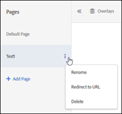

# Activité multi-page

Une activité multi-page dans [!DNL Adobe Target] permet de créer un article sur plusieurs pages, avec une conception spécifique à chaque page.

Par exemple, imaginons que vous souhaitiez tester une offre d’expédition gratuite pour les achats au-dessus d’un certain montant. Vous souhaitez peut-être que cette offre apparaisse sur votre page d’entrée, une page de catégorie et certaines pages de produit mais vous souhaitez qu’elle soit d’une taille différente et dans un emplacement différent sur chaque type de page. Vous pourriez afficher une offre proéminente sur votre page d’accueil, puis renforcer cette offre par de plus petites offres sur des pages appropriées.

Vous pouvez également utiliser une activité multi-page pour définir différentes mises en page pour votre bureau et les sites mobiles non réactifs. Si le site comporte un site mobile distinct comme [!DNL m.mysite.com] au lieu de [!DNL `www.mysite.com`], vous devez créer une [ activité multi-page](/help/main/c-experiences/c-visual-experience-composer/multipage-activity.md#concept_277E096063E14813AC5D8EDFA1D2ED48), ajouter [!DNL m.mysite.com] comme pages distinctes, puis appliquer la modification mobile pour apporter les modifications appropriées à la version de bureau et à la version mobile dans la même expérience. Pour les sites mobiles réactifs, utilisez [la modification de l’expérience mobile](/help/main/c-experiences/c-visual-experience-composer/mobile-viewports.md#concept_8E45527C4ABC41D59AA3553BEDC76FA5).

>[!NOTE]
>
>Les activités multi-page sont conçues pour des activités pour lesquelles la même offre a une apparence différente sur plusieurs pages. Si l’offre apparaît de la même manière sur toutes les pages, un [test de modèle](/help/main/c-experiences/c-visual-experience-composer/temtest.md#task_2539D51A18044F82B0D9895636546781) est plus efficace.

Vous pouvez spécifier les règles de modèle pour chaque page dans un test multi-page. Par exemple, vous pouvez exécuter un test multi-page sur la page d’accueil et toutes les pages de catégorie en appliquant des règles de modèle à la page de catégorie dans le test multi-page. Voir [Inclure la même expérience sur des pages similaires](/help/main/c-experiences/c-visual-experience-composer/temtest.md#task_2539D51A18044F82B0D9895636546781).

Pour ajouter des pages à un test :

1. Cliquez sur l’icône d’engrenage **[!UICONTROL Configure]**.
1. Cliquez sur **[!UICONTROL Add Additional Pages]**.

   Une barre de navigation s’affiche à gauche de l’écran.

   

1. Utilisez la barre de navigation pour indiquer vos pages et définir la page par défaut.

   Cliquez sur **[!UICONTROL Add Page]** pour ajouter une page supplémentaire.

   Cliquez sur l’icône représentant trois points alignés verticalement pour afficher le menu Action :

   

   Utilisez ce menu pour renommer les pages, effectuer un test de redirection depuis l’activité multi-page ou supprimer la page.

1. Utilisez le compositeur d’expérience visuelle pour concevoir l’aspect de l’offre sur chaque page.
