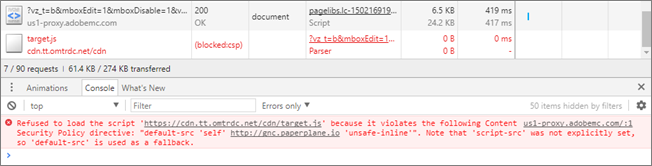
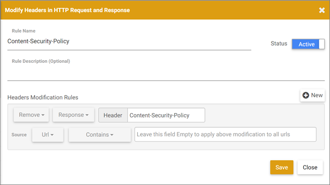

# Résolution des problèmes liés au [!DNL Adobe Target] [!UICONTROL compositeur d’expérience visuelle] et au [!UICONTROL compositeur d’expérience amélioré]

Des problèmes d’affichage et d’autres problèmes surviennent parfois dans le [!DNL Target] [!UICONTROL Compositeur d’expérience visuelle] (VEC) et le [!UICONTROL Compositeur d’expérience avancé] (EEC) sous certaines conditions.

## Comment les politiques dʼapplication des cookies SameSite de Google Chrome influencent-elles le VEC et l’EEC ? {#samesite}

+++Détails
Tenez compte des modifications ayant un impact sur le compositeur d’expérience visuelle et le compositeur d’expérience visuelle lors de l’utilisation des versions [!DNL Chrome] suivantes :

>[!NOTE]
>
>La modification suivante affecte les trois mises à jour décrites ci-dessous :
>
> * Le compositeur d’expérience visuelle ne pourra *pas* utiliser le compositeur d’expérience visuelle sans que l’extension [assistant du compositeur d’expérience visuelle](/help/main/c-experiences/c-visual-experience-composer/r-troubleshoot-composer/visual-editing-helper-extension.md) ne soit installée et activée pour les pages protégées par mot de passe de vos sites. Les cookies de connexion à votre site sont considérés comme des cookies tiers et ne sont pas envoyés avec des demandes de connexion dans l’éditeur du compositeur d’expérience visuelle en mode [!UICONTROL Parcourir]. La seule exception est lorsque les attributs `SameSite=None` et `Secure` sont déjà définis pour les cookies de connexion de votre site.

**Chrome 94 (21 septembre 2021)** : avec les modifications imminentes prévues pour la version Chrome 94 (21 septembre 2021), la modification suivante a un impact sur tous les utilisateurs disposant de versions de navigateur Chrome 94+ :

* L’indicateur de ligne de commande `--disable-features=SameSiteByDefaultCookies,CookiesWithoutSameSiteMustBeSecure` sera supprimé.

**Chrome 91 (25 mai 2021)** : avec les modifications implémentées pour la version Chrome 91 (25 mai 2021), la modification suivante a un impact sur tous les utilisateurs disposant de versions de navigateur Chrome 91+ :

* Les indicateurs `#same-site-by-default-cookies` et `#cookies-without-same-site-must-be-secure` ont été supprimés de `chrome://flags`. Ce comportement est désormais activé par défaut.

**Chrome 80 (août 2020)** : avec les modifications implémentées en août 2020, tous les utilisateurs disposant de versions de navigateur Chrome 80+ :

* *pas* pourra télécharger [!DNL Target] bibliothèques lors de la modification d’une activité (si elles ne sont pas déjà sur le site). En effet, l’appel de téléchargement est effectué du domaine client vers un domaine [!DNL Adobe] sécurisé et est rejeté comme non authentifié.

* L’EEC ne fonctionnera *pas* pour tous les utilisateurs, car il ne peut pas définir l’attribut SameSite pour les cookies sur `adobemc.com domain`. Sans cet attribut, le navigateur rejette ces cookies, ce qui entraîne l’échec de l’EEC.

+++

### Détermination des cookies bloqués

+++Détails
Pour déterminer les cookies bloqués en raison des politiques d’application des cookies SameSite, utilisez le [!DNL Developer Tools] dans [!DNL Chrome].

1. Pour accéder au [!DNL Developer Tools], lors de l’affichage du compositeur d’expérience visuelle dans [!DNL Chrome], cliquez sur l’icône **[!UICONTROL points de suspension]** dans le coin supérieur droit de Chrome > **[!UICONTROL Plus d’outils]** > **[!UICONTROL Outils de développement]**.
1. Cliquez sur l’onglet **[!UICONTROL Réseau]** > puis recherchez les cookies bloqués.

   >[!NOTE]
   >
   >Utilisez la case à cocher **[!UICONTROL A bloqué les cookies]** pour faciliter la recherche des cookies bloqués.

+++

## Prend-[!DNL Target] en charge les iFrames à plusieurs niveaux ?

+++Détails
[!DNL Target] ne prend pas en charge les iframes à plusieurs niveaux. Si votre site web charge un iframe qui a un iframe enfant, at.js interagit uniquement avec l’iframe parent. Les bibliothèques [!DNL Target] n’interagissent pas avec l’iframe enfant.

Pour pallier ce problème, vous pouvez ajouter une page dans l’expérience avec l’URL de l’iFrame enfant.

+++

## Lorsque je tente de modifier une page, tout ce que je vois est un compteur au lieu de ma page. (Compositeur d’expérience visuelle et compositeur d’expérience avancé) {#section_313001039F79446DB28C70D932AF5F58}

+++Détails
Cette situation peut se produire si l’URL contient un caractère #. Pour résoudre le problème, basculez en mode [!UICONTROL Parcourir] dans le compositeur d’expérience visuelle ou l’EEC, puis revenez au mode [!UICONTROL Composer]. Le compteur doit disparaître et la page doit se charger.

+++

## Les en-têtes de politique de sécurité du contenu (CSP) bloquent les bibliothèques [!DNL Target] sur mon site web. (Compositeur d’expérience visuelle et compositeur d’expérience avancé) {#section_89A30C7A213D43BFA0822E66B482B803}

+++Détails
Si les en-têtes CSP de votre site web bloquent les bibliothèques [!DNL Target], puis charge le site web mais empêche la modification, assurez-vous que les bibliothèques [!DNL Target] ne sont pas bloquées.

>[!NOTE]
>
>En plus des informations suivantes, vous pouvez utiliser l’extension de navigateur Assistant du compositeur d’expérience visuelle [&#128279;](/help/main/c-experiences/c-visual-experience-composer/r-troubleshoot-composer/vec-helper-browser-extension.md) par [!DNL Google Chrome].

Pour pallier ce problème, vous pouvez configurer une règle de [!DNL Requestly] pour supprimer les en-têtes CSP, comme illustré ci-dessous :

Vous pouvez configurer une règle de [!DNL Requestly] similaire pour tout en-tête qui entraîne le non chargement d’une ressource dans le VEC.

Par [!DNL Requestly], lorsqu’il est nécessaire de supprimer des en-têtes, vous devez effectuer l’une des opérations suivantes :

* Ajoutez des règles d’URL pour les URL que vous souhaitez ouvrir avec le compositeur d’expérience visuelle. Les en-têtes sont alors supprimés uniquement pour ces URL.
* Activez la règle lorsque vous effectuez une modification dans le compositeur d’expérience visuelle et désactivez la règle lorsque vous ne l’utilisez pas.

+++

## Le compositeur d’expérience visuelle et le compositeur d’expérience avancé semblent rompus et ne s’initialisent pas lors de la réédition d’une activité enregistrée. (Compositeur d’expérience visuelle et compositeur d’expérience avancé) {#section_5AC3BA8F8FBB451EA814F298D0645E54}

+++Détails
Si le site web a été modifié en dehors du compositeur d’expérience visuelle après la définition de l’expérience, les sélecteurs sur lesquels des actions ont été entreprises précédemment sont introuvables lorsque l’activité est ouverte pour modification. La page apparaît rompue et aucun avertissement ne s’affiche.

+++

## Le compositeur d’expérience visuelle ou le compositeur d’expérience avancé n’affiche pas mes bannières tournantes ni le contenu comportant du code JavaScript. (Compositeur d’expérience visuelle et compositeur d’expérience avancé) {#section_8B5BE6EB050B42D6A14A054724C41330}

+++Détails
Par défaut, le compositeur d’expérience visuelle bloque les éléments JavaScript. Vous pouvez utiliser ces éléments si vous désactivez JavaScript. Selon la configuration du site, il est possible que certains éléments continuent à s’afficher incorrectement ou ne soient pas disponibles.

+++

## Lorsque je modifie un élément sur la page, plusieurs éléments changent également. (Compositeur d’expérience visuelle et compositeur d’expérience avancé) {#section_309188ACF34942989BE473F63C5710AF}

+++Détails
Si un même ID d’élément DOM est utilisé pour plusieurs éléments de la page, la modification d’un de ces éléments entraîne celle de tous les éléments dotés de cet ID. Pour éviter ce problème, un seul ID doit être utilisé sur chaque page. Il s’agit d’une bonne pratique HTML standard. Pour plus d’informations, consultez les [Scénarios de modification de page](/help/main/c-experiences/c-visual-experience-composer/r-troubleshoot-composer/vec-scenarios.md#concept_A458A95F65B4401588016683FB1694DB).

+++

## Je ne peux pas modifier des expériences sur un site avec des iFrames. (Compositeur d’expérience visuelle et compositeur d’expérience avancé) {#section_9FE266B964314F2EB75604B4D7047200}

+++Détails
Ce problème peut être résolu en activant le [!UICONTROL Enhanced Experience Composer] (EEC). Cliquez sur **[!UICONTROL Administration]** > **[!UICONTROL Compositeur d’expérience visuelle]**, puis cochez la case qui active le [!UICONTROL Compositeur d’expérience améliorée]. L’EEC utilise un proxy géré par [!DNL Adobe] pour charger votre page à modifier. Ce proxy permet la modification sur les sites qui démolissent un iFrame ainsi que sur les sites et les pages où vous n’avez pas encore ajouté de code [!DNL Adobe Target]. Les activités ne sont pas diffusées sur le site tant que le code n’a pas été ajouté. Certains sites peuvent ne pas charger via l&#39;EEC, auquel cas vous pouvez décocher cette option pour charger l&#39;EEC via un iFrame.

>[!NOTE]
>
>Vos pages hébergées localement ou celles qui ne sont pas accessibles en dehors de votre réseau ne sont pas accessibles au serveur proxy [!DNL Adobe] et ne peuvent pas être ouvertes dans le CEE. Ces pages peuvent inclure des URL d’évaluation, des URL d’essais d’acceptation par l’utilisateur (EAU) ou des pages hébergées localement.

+++

## Je souhaite configurer des tests sur des pages dont l’implémentation de la mbox/[!DNL Target] n’est pas encore terminée. (Compositeur d’expérience visuelle et compositeur d’expérience avancé) {#section_DE63BCCB5B124E10A71FA579B582A80A}

+++Détails
Voir « Je ne peux pas modifier des expériences sur un site avec des iFrames » ci-dessus.

+++

## Les styles de texte gras et italique avec [!UICONTROL Modifier le texte]/[!UICONTROL Modifier HTML] ou [!UICONTROL Modifier le texte]/[!DNL Change HTML] ne s’affichent pas sur ma page. Il arrive que le texte disparaisse après l’application de ces changements de style. (Compositeur d’expérience visuelle et compositeur d’expérience avancé) {#section_7A71D6DF41084C58B34C18701E8774E5}

+++Détails
Si vous utilisez **[!UICONTROL Modifier le texte]/[!UICONTROL Modifier HTML]** dans le VEC pour les activités [!UICONTROL Test A/B] ou [!UICONTROL Ciblage d’expérience] ou **[!UICONTROL Modifier le texte]/[!UICONTROL Modifier HTML]** pour les activités [!UICONTROL Automated Personalization] ou [!UICONTROL Test multivarié] pour rendre le texte en gras ou en italique, ces styles peuvent ne pas être appliqués à la page ou le texte disparaît de la page dans le VEC. Cela se produit en raison de la manière dont l’éditeur de texte enrichi applique ces styles qui peuvent interférer avec le balisage du site web.

Si vous rencontrez ce problème :

1. Cliquez sur le bouton **[!UICONTROL HTML]** dans l’éditeur de texte enrichi pour entrer dans le mode de modification du code source.
1. Identifiez les éléments de texte auxquels vous avez appliqué un style.

   * Pour le texte en gras, remplacez les éléments `<strong>`&lt; > par `<b>`.

   * Pour le texte en italique, remplacez les éléments `<em>` par `<i>`.

+++

## La permutation d’image apparaît rompue dans le compositeur d’expérience visuelle ou le compositeur d’expérience avancé pour les activités d’Automated Personalization. (Compositeur d’expérience visuelle et compositeur d’expérience avancé) {#section_88AABFDFE6A3420299B0D508B12A3994}

+++Détails
L’ajout d’une offre d’image à un emplacement occupe l’ensemble de l’espace de l’image d’origine dans le compositeur d’expérience visuelle ou le compositeur d’expérience avancé. Lors de la diffusion, l’image n’est pas développée et est affichée en l’état, ce qui n’a aucun impact sur la diffusion.

+++
