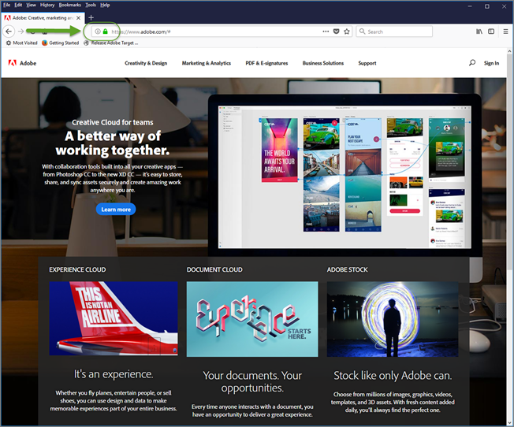
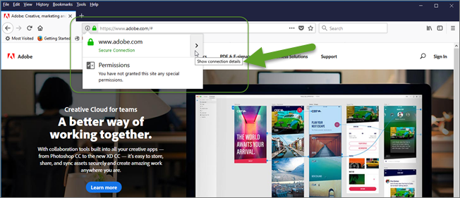
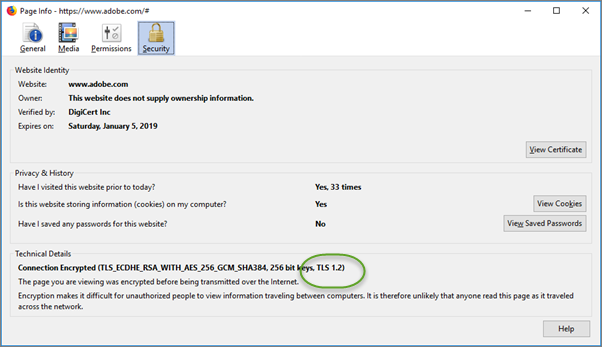

# Résolution des problèmes liés au [!UICONTROL Enhanced Experience Composer]

Des problèmes d’affichage peuvent parfois se produire dans le [!DNL Adobe Target] [!UICONTROL Enhanced Experience Composer] (EEC) sous certaines conditions.

## Le compositeur d’expérience avancé ne charge pas une URL AQ interne non accessible sur une adresse IP publique. {#section_D29E96911D5C401889B5EACE267F13CF}

+++Détails
Ce problème peut être résolu en plaçant sur la liste autorisée les adresses IP suivantes. Ces adresses IP sont pour le serveur [!DNL Adobe] utilisé pour le proxy EEC. Ces adresses IP ne sont nécessaires que pour la modification d’activités. Les visiteurs et visiteuses de votre site n’ont pas besoin de ces adresses IP.

Demandez à votre équipe informatique de placer sur la liste autorisée les adresses IP suivantes :

### États-Unis (va7)

40.70.154.136/29
52.254.106.240/28
52.254.106.160/28
52.254.107.16/28
20.186.185.181
20.22.83.112
20.186.185.227
52.254.106.192/28
52.254.106.0/28
52.254.107.128/28
52.254.107.80/28
52.254.106.176/28
52.254.107.32/28
52.254.105.192/28
52.254.107.64/28
52.254.106.208/28
52.254.107.0/28
52.254.106.224/28
20.14.241.153
20.186.185.239
4.152.211.251
52.254.107.144/28
52.254.106.144/28

### EMEA (nld2)

51.138.17.16/28
51.138.17.48/28
51.138.16.128/28
51.138.17.32/28
51.138.16.240/28
51.138.17.112/28
51.138.16.160/28
51.138.16.208/28
51.138.17.80/28
51.138.17.0/28
51.138.17.96/28
51.138.16.144/28
20.31.145.248
20.126.189.248
51.138.16.224/28
51.138.16.192/28
51.138.12.94
51.138.12.11
51.138.16.176/28
51.138.12.100
51.138.17.64/28
51.138.12.160/28

### APAC (aus)

20.43.104.160/28
20.227.35.177
20.40.188.227
20.43.104.112/28
20.43.104.128/28
20.43.104.144/28
20.40.188.166
20.53.206.128
20.43.104.80/28
20.43.104.16/28
20.43.105.48/28
20.43.104.96/28
20.43.104.48/28
20.40.188.194
20.43.104.32/28
20.40.191.224/28
20.43.105.16/28
20.40.191.96/28
20.43.104.176/28
20.40.191.240/28
20.43.104.64/28
20.43.105.32/28
20.43.104.192/28
20.43.105.0/28
20.43.104.0/28

### Adresses IP héritées

Les adresses IP héritées suivantes doivent continuer à être conservées jusqu&#39;à nouvel ordre.

34.254.77.200
54.73.207.147
54.229.152.123
3.224.194.242
54.90.51.39
34.228.136.112
54.150.116.11
18.178.142.8
54.199.107.77
99.80.139.221
54.78.56.224
54.247.179.246
54.80.219.243
34.201.235.54
54.196.224.236
35.75.212.45
52.199.184.130
18.180.161.176

Il se peut que le message d’erreur suivant s’affiche dans [!DNL Target] :

`Error: Your website domain (ISP) is blocking the [!UICONTROL Enhanced Experience Composer]. You can allowlist the [!UICONTROL Enhanced Experience Composer]'s IP addresses or turn off [!UICONTROL Enhanced Experience Composer] in [!UICONTROL Configure] > [!UICONTROL Page Delivery] menu.`

Voici les raisons pour lesquelles ce message d’erreur s’affiche et les solutions pour corriger la situation :

* **Problème :** votre domaine de site web (FAI) bloque le [!UICONTROL Enhanced Experience Composer].

  **Remedy:** Placez sur la liste autorisée les adresses IP répertoriées ci-dessus.

* **Problème :** les adresses IP sont placées sur la liste autorisée, mais votre site web ne prend pas en charge TLS version 1.2. [!DNL Target] utilise actuellement la configuration par défaut de la version 1.2. Avant la version 18.4.1 de [!DNL Target] (25 avril 2018), la configuration par défaut prenait en charge TLS 1.0. Pour plus d’informations, voir [Modifications du chiffrement TLS (Transport Layer Security)](https://experienceleague.adobe.com/docs/target-dev/developer/implementation/tls-transport-layer-security-encryption.html){target=_blank}.

  **Solution :** consultez la question suivante (Le [!UICONTROL compositeur d’expérience visuelle amélioré] ne se charge pas sur les pages sécurisées de mon site qui utilisent TLS 1.2).

+++

## Le compositeur d’expérience avancé ne se charge pas sur les pages sécurisées de mon site qui utilisent TLS 1.0. (Compositeur d’expérience avancé uniquement) {#section_C5B31E3D32A844F68E5A8153BD17551F}

+++Détails
Il se peut que le message d’erreur décrit ci-dessus dans « Le [!UICONTROL compositeur d’expérience visuelle amélioré] ne se charge pas sur les pages sécurisées de mon site » s’affiche. si les adresses IP ci-dessus sont placées sur la liste autorisée mais que votre site web ne prend pas en charge TLS version 1.2. [!DNL Target] utilise actuellement la configuration par défaut de la version 1.2. Avant la version 18.4.1 de [!DNL Target] (25 avril 2018), la configuration par défaut prenait en charge TLS 1.0. Pour plus d’informations, voir [Modifications du chiffrement TLS (Transport Layer Security)](https://experienceleague.adobe.com/docs/target-dev/developer/implementation/tls-transport-layer-security-encryption.html){target=_blank}.

Pour vérifier la version TLS de votre site web en utilisant Firefox (les autres navigateurs suivent des étapes similaires) :

1. Ouvrez le site web concerné dans Firefox.
1. Cliquez sur l’icône **[!UICONTROL Afficher les informations du site]** dans la barre d’adresse du navigateur.

   

1. Cliquez sur **[!UICONTROL Afficher les détails de la connexion]** > **[!UICONTROL Plus d’informations]**.

   

1. Examinez les informations de version TLS dans l’option Détails techniques :

   

1. Si vous constatez que votre site web affiche TLS 1.0, consultez [Modifications du chiffrement TLS (Transport Layer Security)](https://experienceleague.adobe.com/docs/target-dev/developer/implementation/tls-transport-layer-security-encryption.html){target=_blank} pour plus d’informations sur la politique de prise en charge de TLS par Target. Pour remédier à la situation pour l’instant (valable jusqu’au 12 septembre 2018){target=_blank} contactez l’[Assistance clientèle](/help/main/cmp-resources-and-contact-information.md#reference_ACA3391A00EF467B87930A450050077C) pour obtenir une configuration avec votre version de TLS et le domaine.

+++

## Je reçois des messages de délai d’expiration ou des erreurs « accès refusé » lors du chargement de sites où un serveur proxy est activé. (Compositeur d’expérience avancé uniquement) {#section_60CBB9022DC449F593606C0E6252302D}

+++Détails
Assurez-vous que les adresses IP du serveur proxy ne sont pas bloquées dans votre environnement.

+++
